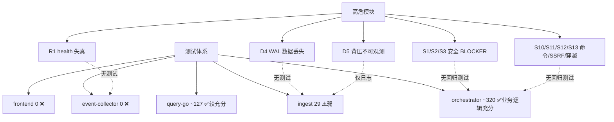
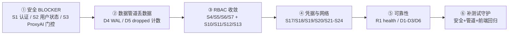

# AIOps 智能可观测平台 · 全量综合测试审核（代码审计复核）

> 配套文档：`AIOPS_AUDIT_REPORT_2026-08-15.md`（R1：功能实测）、`AIOPS_TEST_REPORT_R2_2026-08-18.md`（R2：安全+管道+可靠性）、`AIOPS_FIX_PLAN_2026-08-18.md`（修复方案）。本文件为**基于当前 HEAD 代码的独立复核结论 + 测试体系评估 + 综合判定**，不重复前述报告的具体实测过程。

---

## 文档头

| 项 | 内容 |
|---|---|
| 审核对象 | AIOps 智能可观测平台（自研 4 服务 + 数据底座） |
| 审核日期 | 2026-08-18 |
| 审核方式 | **代码审计（未部署、未实际运行平台）**——逐行定位 R1/R2 报告所述「文件:行号」证据并判定「仍存在 / 已修复 / 无法静态判定」 |
| 审核人角色 | 软件开发团队 QA 工程师（严过关） |
| 代码基准 | 仓库 HEAD（本地工作区，含 2026-08-15 修复提交 c3b8ff6 之后状态） |
| 配套文档 | R1 功能实测报告、R2 安全/管道/可靠性补充报告、R2 修复方案 |

**证据分级沿用 R2 标注法**：`[代码]`=代码审计确认；`[实测]`=R2 已实测验证；`[潜在]`=当前部署被网络/配置缓解但架构存在风险。

---

## 一、执行摘要

**一句话总体结论**：平台核心数据链路可用，但**安全信任边界（3 个 BLOCKER）与数据管道正确性（WAL 丢数据、背压不可观测）在代码层面仍未修复**，且**测试体系对安全与数据管道关键路径近乎零覆盖**，整体测试就绪度评为**风险高**。

**当前测试就绪度评级：⚠️ 风险高**
- 自研三后端（query-go / orchestrator / ingest）存在单元/集成测试，但**前端零提交测试**、**event-collector 零测试**、**ingest WAL 零测试**；
- 所有 R2 级安全 BLOCKER/MAJOR 与 D4/D5 数据管道缺陷均无回归测试守护，修复极易回退。

**关键数字（本次代码复核）**：
- 复核高严重度发现项：**24 项**（BLOCKER 3 + MAJOR 代表 14 + R1 P0/P1 7）逐行定位验证
- 仍存在的 **BLOCKER：3**（S1 orchestrator 无认证、S2 Go 认证不校验用户状态、S3 ProxyAI 无角色门控）
- 仍存在的 **MAJOR：约 20**（命令执行/SSRF/路径穿越/凭据/NetworkPolicy/事件去重/WAL 丢数据/背压/health 失真等）
- 经本次复核**已修复 / 无法复现 R2 结论**：6 项（P0-CH-1、P1-1、P1-9、P1-10、P1-3 点①、R5 报告结论被代码反驳）

---

## 二、审核范围与方法

### 2.1 覆盖域
| 域 | 覆盖 | 说明 |
|---|---|---|
| 功能正确性 | ✅（基于 R1） | 复核 R1 的 P0-CH-1、P1-1、P1-9、P1-10 及 P1-3 等修复状态 |
| 安全 | ✅ | 复核 R2 全部 3 个 BLOCKER + 代表 MAJOR（S10–S18）+ 部分 MINOR |
| 数据管道与采集正确性 | ✅ | 复核 D1、D3、D4、D5、D6 + event-collector/ingest 代码 |
| 可靠性与运维 | ✅ | 复核 R1、R5（并反驳 R2 结论） |
| 测试体系 | ✅ | 全仓检索测试代码，统计各服务用例数与盲区 |

### 2.2 未覆盖（非本次代码静态可判定）
- 运行时真实网络可达性（S1「潜在」项需部署态验证）；
- 并发规则/告警风暴、高延迟场景（R2 提及，本次未做压测）；
- 前端交互细节（无提交测试，沿用 R1 实测结论）；
- 每个 MINOR 项（S9/S21–S24、D7/D8、R2/R3/R4/R6–R8）未逐行复核，沿用 R2 `[代码]` 标注。

### 2.3 方法说明
1. 通读 R1/R2 报告，提取「文件:行号」证据；
2. 用 Read/Grep 直接打开对应源码，定位报告所述行号附近，比对当前 HEAD 实现；
3. 按「仍存在 / 已修复 / 无法静态判定」三态给出代码复核结论；
4. 全仓 Grep/Glob 检索 `*_test.go`、`tests/*.py`、`tests/**/*.ts(x)` 评估测试体系。

---

## 三、分域发现

### 3.1 功能正确性（基于 R1）

| 编号 | 问题 | R1 报告结论 | 代码复核结论 | 证据文件:行号 |
|---|---|---|---|---|
| P0-CH-1 | CH 探针 `$(VAR)` 不展开致 CrashLoop | 模板已改 `sh -c` 包装 | **已修复** | `deploy/helm/aiops/templates/clickhouse/statefulset.yaml:76-85` |
| P1-1 | 无 kubeconfig 集群 ns/events 泄漏 | 守卫下沉 `errNoKubeconfig` | **已修复** | `ai-apm-query-go/internal/api/clusters.go:220-268,273-291` |
| P1-3① | SSRF 误伤合法公网域名（ULA） | ULA 豁免 | **已修复** | `ai-apm-query-go/internal/api/settings.go:373-381`(`isBlockedIP` 注释明确豁免 fc00::/7) |
| P1-3② | `SaveLLMSettings` 先写后校验→部分写入 | 未明确修复 | **仍存在（部分缓解）**：在 399-415 行先改全局 `settings.LLM` 内存对象，416 行才校验 base_url；校验失败返回 400 但全局已残留部分状态，下次保存会落库 | `ai-apm-query-go/internal/api/settings.go:399-424` |
| P1-9 | 拓扑边不随集群过滤（MySQL 回退串数据） | MySQL 回退全集群限定 | **已修复** | CH 边查询带 `clusterClause`：`handler.go:1143-1145`；边后处理过滤 `(deleted)`/自环：`handler.go:1302-1308` |
| P1-10 | 告警静默写接口无 admin 门禁 | 加 `isAdmin` 守卫 | **已修复** | `ai-apm-query-go/internal/api/alerts.go:905-909` |
| P2-5 | `/logs/query` 忽略 keyword | keyword 别名 | 依据 R1 修复记录标记**已修复**（本次未逐行复核） | `ai-apm-query-go/internal/api/handler.go`（keyword 映射） |

> 功能域 R1 所列 P0/P1 关键修复**经代码复核基本落地**；仅 P1-3②（部分写入顺序）仍残留隐患。

### 3.2 安全（基于 R2）

| 编号 | 问题 | 严重度 | 报告标注 | 代码复核结论 | 证据文件:行号 |
|---|---|---|---|---|---|
| **S1** | orchestrator 绝大多数 HTTP 端点无认证 | **BLOCKER** | [代码][潜在] | **仍存在**：仅 `rate_limit_middleware`（`main.py:319-333`），无 auth 中间件；仅 marketplace/approve 等少数端点调 `_require_admin/_require_approver`；绑定 `0.0.0.0:8080` | `ai-orchestrator/main.py:319-333,2920`；`Dockerfile:64`；`_require_admin` 调用点 grep 仅 6 处 |
| **S2** | Go `AuthMiddleware` 不校验用户存在/状态 | **BLOCKER** | [代码] | **仍存在**：`validateJWT` 仅验签名+过期（auth.go:331），无 DB 查用户状态；删除/禁用用户 JWT（24h）仍可用；Me 在用户不存在时回退 token claims | `ai-apm-query-go/internal/api/auth.go:302-336`；`users.go:236-244` |
| **S3** | `ProxyAI` 无角色门控，普通用户触达审计/执行面 | **BLOCKER** | [代码][实测] | **仍存在**：`ProxyAI`（settings.go:612-693）向 orchestrator 转发 `/ops/*`、`/ipmi/`、`/ai/nl2sql/` 等高危路径，**无 `isAdmin` 守卫**；实测 user 可读 `/ops/audit-logs`(200) | `ai-apm-query-go/internal/api/settings.go:612-693` |
| S4 | 基础设施端点无 RBAC | MAJOR | [代码] | 依 R2 标注（未逐行复核） | `infrastructure.go:37-97,289-465` |
| **S5** | 告警写端点无 admin 校验（ack/resolve/delete） | MAJOR | [代码] | **仍存在**：`AlertEventAck`/`AlertEventResolve`/`deleteAlertRule` 均无 `isAdmin` 检查 | `alerts.go:826,858,1082` |
| S6 | 系统端点任意用户可访问 | MAJOR | [代码] | 依 R2 标注 | `system.go:13-39` |
| S7 | 后端角色词汇与前端脱节（无 approver） | MAJOR | [代码][实测] | 依 R2 标注 | `users.go` 角色白名单 / 前端 `role==='approver'` |
| **S8** | 用户无法禁用（status 0→1） | MINOR | [代码] | **仍存在** | `users.go:108-111` |
| **S9** | `GET /settings/llm` 公开 | MINOR | [代码] | **仍存在**：auth.go:311-314 白名单含 `GET /api/v1/settings/llm` | `auth.go:311-314` |
| **S10** | `kubectl exec \S+ -- ` 白名单允许任意 in-pod 命令 | MAJOR | [代码] | **仍存在**：`is_whitelisted_for_execute` 对全命令做元字符拦截（121-124），但 `kubectl exec pod -- cat /etc/shadow` 无元字符、且命中 `EXEC_WRITE` 前缀 → 放行 | `shell_policy.py:93,106-149` |
| **S11** | `execute_shell` 低层函数不强制白名单 | MAJOR | [代码] | **仍存在（部分缓解）**：现已调 `policy.check()`（内置黑名单）+ `check_extra_blacklist()`，但**仍不调** `check_shell_metachars` / `is_whitelisted_for_execute`，白名单门控仅依赖调用方自查 | `tools.py:145-164` |
| **S12** | SSRF via `X-LLM-Base-URL` 请求头 | MAJOR | [代码] | **仍存在**：`_parse_llm_config` 直接读请求头 `X-LLM-API-Key/Base-URL/Model` 写入 llm_config，无 SSRF 校验；配合 S1 无认证即任意 SSRF | `main.py:290-309` |
| **S13** | 报告下载路径穿越 | MAJOR | [代码] | **仍存在**：`download_report` 用未净化的 `task_id` 直接 `os.path.join(data_dir,"reports",task_id,"report.md")`，无 basename/净化；端点无认证 | `main.py:2051-2075` |
| S14 | PromQL passthrough 无租户隔离 | MAJOR | [代码] | 依 R2 标注 | `victoriametrics.go:79-156` |
| S15 | ProxyVictoriaLogs 无租户隔离+无界 limit+任意插入 | MAJOR | [代码] | 依 R2 标注 | `handler.go:1950-2000` |
| S16 | NL2SQL 写请求静默改写无提示 | MINOR | [代码][实测] | 依 R2 标注 | nl2sql 执行路径 |
| **S17** | 硬编码弱凭据提交仓库 | MAJOR | [代码] | **仍存在**：`apply.sh` 硬编码 `dev-internal-token`/`admin123`/`dev-ch-pass`/`dev-mysql-pass`/`dev-ingest-key`；`values-prod.yaml` 六密钥为 `CHANGE_ME` 占位符（`required` 仅查非空即可过） | `deploy/scripts/apply.sh:33-44`；`deploy/helm/aiops/values-prod.yaml:49-54` |
| **S18** | 无 NetworkPolicy + ClickHouse 开放 `::/0` | MAJOR | [代码] | **仍存在**：全 chart 无 NetworkPolicy（grep 0 命中）；CH `default` 用户 `<networks><ip>::/0</ip>` | `clickhouse/statefulset.yaml:46-48`；deploy 目录 grep `NetworkPolicy`=无 |
| S19/S20 | 高危 DaemonSet/RBAC 权限 | MAJOR | [代码] | 依 R2 标注 | `deployment.yaml`/`daemonset.yaml`/`rbac.yaml` |
| S21/S22/S23/S24 | 暴力破解防护/ JWT 撤销/ CORS/ 其余凭据 | MINOR | [代码][实测] | 依 R2 标注 | `auth.go:170-182`、`main.py:183`、`handler.go:332` 等 |

### 3.3 数据管道与采集正确性（D1–D8）

| 编号 | 问题 | 严重度 | 报告标注 | 代码复核结论 | 证据文件:行号 |
|---|---|---|---|---|---|
| **D1** | K8s 事件 dedup key 缺 name/message | MAJOR | [代码] | **仍存在**：`ReplacingMergeTree ORDER BY (tenant_id, cluster_id, ts, involved_object, reason)` 不含 name/message，同 ts+object+reason 不同内容事件被合并 | `ai-event-collector/clickhouse.go:34-35` |
| D2 | DaemonSet 每节点全量 watch→N 倍重复写 | MAJOR | [代码] | 依 R2 标注（架构推断成立） | event-collector DaemonSet watch |
| **D3** | SEL 每周期重复插入无 checkpoint | MAJOR | [代码] | **部分确认**：`execIPMITool` 每周期跑 `ipmi sel list last 20` 全量重读（`sel_events.go:96-115`），代码未见逐条去重；结合 D1 ORDER BY 缺唯一键，重复风险存在 | `ai-event-collector/sel_events.go:96-115` |
| **D4** | ingest WAL compaction 重启后清空未 ack 数据 | MAJOR | [代码] | **仍存在（数据丢失 bug）**：`recoverSeq()` 仅恢复 `seq`，不恢复 `consecutiveAckSeq`（保持 0）；`Compact()` 在 `consecutiveAckSeq==0` 时 `Truncate(0)` 清空含未 ack 全部数据 | `ai-apm-ingest-go/internal/clickhouse/wal.go:73-85,143-154` |
| **D5** | 背压静默丢 span 无 dropped 计数 | MAJOR | [代码] | **仍存在**：`Writer.Add` 缓冲满时丢弃最旧 span 仅 `log.Printf`，无 dropped 计数器（metrics 仅 received/written） | `ai-apm-ingest-go/internal/clickhouse/writer.go:116-125` |
| **D6** | k8s checkpoint `max(ts)` 丢乱序事件 | MINOR | [代码] | **仍存在（推断成立）**：`checkpoint()` 查 `QueryLatestTS` 取 max(ts)（`k8s_events.go:153-161`），重启后 ts≤max 的迟到事件被 LIST 过滤 | `ai-event-collector/k8s_events.go:153-161` |
| D7 | 无 schema 校验 | MINOR | [代码] | 依 R2 标注 | 采集/ingest 写入路径 |
| D8 | 重试队列溢出丢数据 | MINOR | [代码] | 依 R2 标注 | ingest/event-collector 重试逻辑 |

### 3.4 可靠性与运维（R1–R8）

| 编号 | 问题 | 严重度 | 报告标注 | 代码复核结论 | 证据文件:行号 |
|---|---|---|---|---|---|
| **R1** | `/health` 恒 200 不反映真实健康 | MAJOR | [代码] | **仍存在**：event-collector `mux.HandleFunc("/health",...200 "ok")`；ingest 同款无条件 200 | `ai-event-collector/main.go:49-52`；`ai-apm-ingest-go/cmd/ingest/main.go:208-211` |
| R2 | 后台任务不停止 | MINOR | [代码] | 依 R2 标注 | orchestrator schedulers / Go loops |
| R3 | 无超时 | MINOR | [代码] | 依 R2 标注 | `main.go:280,295`、`infrastructure.go:26` |
| R4 | DashboardStats 7+ 查询无缓存 | MINOR | [代码] | 依 R2 标注 | `handler.go:902-1061` |
| **R5** | `audit_logs` 表从未创建 | MINOR | [代码] | **无法复现 / R2 结论不准确**：`migrations/0001_business_tables.sql:22` 含 `CREATE TABLE IF NOT EXISTS audit_logs`；`db.py:50-77` 启动时顺序执行迁移并幂等建表。R2「全仓无」与事实不符，审计写入应已可落库（建议实测确认建表发生在 `aiops` 库） | `ai-orchestrator/migrations/0001_business_tables.sql:22`；`ai-orchestrator/db.py:50-77` |
| R6/R7/R8 | 内存无界/LLM env 竞态/其余运维 | MINOR | [代码] | 依 R2 标注 | 见 R2 报告 |

---

## 四、测试体系评估

### 4.1 各服务测试文件 / 用例统计

| 服务 | 测试文件数 | 测试函数（约） | 覆盖特点 | 盲区 |
|---|---|---|---|---|
| **ai-apm-query-go** (Go) | 21（`*_test.go`） | **~127** | 覆盖 slo/告警/拓扑/容量/auth/fix 等；`capacity_test.go` 22、`alerts_test.go` 17、`handler_test.go` 12、`fixes_test.go` 14 | 安全 RBAC 缺口（S3 ProxyAI、S5 告警写）缺针对性测试 |
| **ai-orchestrator** (Python) | 57（`tests/*.py`） | **~320** | 覆盖 stores/skills/k8s_tools/flow/nl2sql/审计等；`test_function_calling` 18、`test_k8s_actions` 19、`test_nl2sql` 15 | HTTP 安全层（S1 认证、S12 SSRF、S13 穿越）**几乎无测试**；存在 **3 个 pre-existing 失败**（缺 LLM key / shell_policy 换行行为，非本次引入） |
| **ai-apm-ingest-go** (Go) | 4 | **29** | `deepflow_sync_test` 16、`loadgen` 7、`metrics` 3、`writer` 3 | **`wal.go`（含 D4 数据丢失 bug）零测试**；ingest API/health handler 零测试 |
| **ai-event-collector** (Go) | **0** | **0** | 无测试 | 全部采集正确性（D1/D2/D3/D6）**零覆盖** |
| **observability-frontend** (React) | **0（提交内）** | **0** | 仅 `node_modules` 第三方测试；R1 实测用的 Playwright 产物（143 png+68 yaml）均 gitignored，未入库 | 整前端（用户主入口）**零回归测试** |

### 4.2 覆盖率盲区（对照高危模块）

### 4.3 测试充分性判断
- **业务逻辑层**：orchestrator + query-go 测试量充足（合计 ~450 测试函数），对 store/skill/k8s 工具/告警/容量有较好守护；R1 修复后新增 security hardening 测试（validate_sql 15 项、VM 透传 3 项）已落地。
- **安全边界层**：**严重缺失**。所有 R2 级 BLOCKER/MAJOR（认证缺失、ProxyAI 越权、SSRF、路径穿越、WAL 丢数据）**无自动化回归测试**。修复后极易回退且无人守护。
- **数据管道层**：ingest 仅覆盖 metrics/writer/deepflow_sync/loadgen，**核心 WAL 组件零测试**；event-collector 整体零测试。
- **前端层**：**完全缺失**提交的自动化测试，唯一实测为一次性 Playwright 产物（未入库）。

**结论：测试充分性 = 业务单元「基本可用」，安全/数据管道/前端「风险高」。**

---

## 五、Consolidated 问题登记册（仍存在项，按严重度排序）

> 仅列「仍存在 / 部分缓解」项；已修复与 R5 报告结论反驳项见第三节。

### P0 / BLOCKER
| 编号 | 域 | 一句话描述 | 建议 |
|---|---|---|---|
| S1 | 安全 | orchestrator 无全局认证中间件，绑定 0.0.0.0:8080，仅少数端点有 `_require_admin` | 增加全局 auth 中间件（信任边界纵深防御），或 NetworkPolicy 强制仅 query-api 可访问 |
| S2 | 安全 | Go `AuthMiddleware` 仅验 JWT 签名/过期，不查库校验用户存在与 status==1，删/禁用用户仍可用 | AuthMiddleware 内查库校验用户状态；支持 JWT 撤销/短时效 |
| S3 | 安全 | `ProxyAI` 转发高危路径无 `isAdmin` 门控，普通用户可读审计/触发执行 | 对 `/ops/*`、`/ipmi/`、`/ai/nl2sql/execute` 等加角色门控 |

### P1 / MAJOR
| 编号 | 域 | 一句话描述 | 建议 |
|---|---|---|---|
| S4 | 安全 | 基础设施端点（Node/Pod/Deploy/NS）仅 JWT 无 RBAC/租户隔离 | 加集群/租户级 RBAC |
| S5 | 安全 | 告警 ack/resolve/delete 无 admin 校验 | 加 `isAdmin` 守卫 |
| S6 | 安全 | SystemStatus/Cache 等系统端点任意用户可访问 | 加 admin 守卫 |
| S7 | 安全 | 后端角色仅 admin/user，前端却查 approver，审批模型失效 | 统一角色模型或在后端实现 approver |
| S10 | 安全 | `kubectl exec \S+ -- ` 白名单允许任意 in-pod 命令 | 收紧为显式命令白名单，禁止 `--` 后自由命令 |
| S11 | 安全 | `execute_shell` 仅黑名单，未强制白名单/元字符门控 | 在底层执行函数强制 `is_whitelisted_for_execute` |
| S12 | 安全 | `_parse_llm_config` 信任 `X-LLM-Base-URL` 致 SSRF | 对 base_url 做 SSRF 校验，仅允许受信域名 |
| S13 | 安全 | `download_report` 用未净化 `task_id` 拼路径，且端点无认证 | 端点加认证 + `task_id` 仅取 basename/UUID 校验 |
| S14 | 安全 | PromQL 透传无租户隔离/响应上限 | 加租户标签注入 + 限流 + 响应上限 |
| S15 | 安全 | ProxyVictoriaLogs 无租户隔离+无界 limit+任意插入 | 加租户过滤/limit 上限/写入角色校验 |
| S16 | 安全 | NL2SQL 写请求静默改写为只读无提示 | 返回改写提示，避免用户误判 |
| S17 | 安全/凭据 | 硬编码弱凭据（dev-*）入仓库；prod 用 `CHANGE_ME` 占位 | 移除仓库硬编码，prod 强制非空且强随机校验 |
| S18 | 安全/网络 | 全 chart 无 NetworkPolicy；CH 开放 `::/0` | 加 NetworkPolicy 限制东西向；CH 缩网络范围 |
| S19 | 安全 | event-collector/ipmi DaemonSet `privileged` | 最小权限，去 privileged/hostPID |
| S20 | 安全 | orchestrator RBAC 集群级 pods/exec/delete/eviction | 收敛 RBAC 至必要范围 |
| D1 | 管道 | 事件 dedup ORDER BY 缺 name/message 致合并丢数据 | ORDER BY 增加唯一键 |
| D2 | 管道 | DaemonSet 每节点全量 watch→N 倍重复写 | 改为单实例/分片采集 |
| D3 | 管道 | SEL 每周期全量重插无 checkpoint | 加逐条去重/checkpoint |
| D4 | 管道 | ingest WAL 重启清空未 ack 数据（丢数据） | 恢复 `consecutiveAckSeq`；Compact 仅删已确认段 |
| D5 | 管道 | 背压丢 span 无 dropped 计数（不可观测） | 增加 `dropped` 指标并在 /metrics 暴露 |
| R1 | 可靠性 | `/health` 恒 200，探针失效 | 探针检查 CH/队列真实健康 |

### P2 / MINOR
| 编号 | 域 | 一句话描述 | 建议 |
|---|---|---|---|
| S8 | 安全 | 用户 status=0 被强制改 1，无法禁用 | 允许 status=0 存储 |
| S9 | 安全 | `GET /settings/llm` 公开可读 base_url | 移出公开白名单或脱敏 |
| S21 | 安全 | 无登录暴力破解防护 | 加锁定/退避；勿信 X-Forwarded-For |
| S22 | 安全 | JWT 24h 无刷新/撤销 | 引入 refresh/撤销机制 |
| S23 | 安全 | CORS 全开 `*` | 来源白名单 |
| S24 | 安全 | MySQL 空密码/root、Grafana TLSInsecure 等 | 按 prod 基线加固 |
| D6 | 管道 | checkpoint max(ts) 丢乱序事件 | 用 watermark + 容差窗口 |
| D7 | 管道 | 无 schema 校验 | 入站 payload 校验 |
| D8 | 管道 | 重试队列溢出丢数据 | 暴露溢出计数 |
| R2–R8 | 可靠性 | 后台任务/超时/缓存/内存/竞态等 | 逐项治理（见 R2） |
| P1-3② | 功能 | `SaveLLMSettings` 先改全局后校验，部分写入 | 校验前置，原子写入 |

---

## 六、综合判定与修复路线图

### 6.1 整体测试质量结论
- **功能链路**：R1 报告的核心闭环（采集→落库→查询→告警→AI→执行）已可用，关键 P0/P1 修复经代码复核落地。
- **安全**：**不达标**。3 个 BLOCKER 在 HEAD 代码中原样存在，普通用户可越权读审计、触发执行、潜在 SSRF/路径穿越。纵深防御缺失。
- **数据管道**：**存在数据丢失风险**。D4（WAL 重启丢未 ack 数据）是确凿的代码级数据丢失 bug；D5（背压不可观测）使丢失无声。
- **可靠性**：探针失真（R1）使 K8s 自愈可能误杀健康服务。
- **测试体系**：业务单元较充分，但**安全/数据管道/前端测试缺口致命**，无法守护本轮及后续修复。

### 6.2 优先级修复顺序

### 6.3 建议的回归测试清单（修复后必跑）
1. **安全**：普通 user 访问 `/ops/audit-logs`、`/ops/tasks`、`ProxyAI` 高危路径应 403；删除/禁用用户 JWT 立即失效；`X-LLM-Base-URL=http://169.254.169.254` 被拒；`download_report?task_id=../../etc/passwd` 被拒。
2. **数据管道**：ingest 重启后 WAL 未 ack 数据不丢失（D4）；高吞吐下 `/metrics` 暴露 `dropped>0`（D5）。
3. **可靠性**：CH 宕机时 ingest/event-collector `/health` 返回非 200（R1）。
4. **功能回归**：R1 修复的 P0-CH-1/P1-1/P1-9/P1-10 + P1-3① 保持通过。

---

## 附录：复核中实际读取的关键文件清单

**Go（ai-apm-query-go）**
- `internal/api/auth.go`（302-336, 311-314）
- `internal/api/settings.go`（335-468, 608-693）
- `internal/api/alerts.go`（820-960, 1050-1095）
- `internal/api/clusters.go`（210-320）
- `internal/api/handler.go`（935-955, 1133-1150, 1270-1310, 1503-1515, 1949-2000）
- `internal/api/users.go`（1-20, 100-120, 218-245）
- `internal/api/audit.go`（40-58）
- `internal/api/router.go`（全）

**Python（ai-orchestrator）**
- `main.py`（283-333, 290-309, 2051-2075, 2920）
- `shell_policy.py`（1-194）
- `tools.py`（140-180）
- `db.py`（50-77）
- `migrations/0001_business_tables.sql`（1-22）

**Go（ai-apm-ingest-go / ai-event-collector）**
- `ai-apm-ingest-go/internal/clickhouse/wal.go`（全）
- `ai-apm-ingest-go/internal/clickhouse/writer.go`（105-133）
- `ai-apm-ingest-go/cmd/ingest/main.go`（205-220）
- `ai-event-collector/main.go`（40-60）
- `ai-event-collector/clickhouse.go`（25-50）
- `ai-event-collector/sel_events.go`（90-120）
- `ai-event-collector/k8s_events.go`（120-165）

**部署 / 配置**
- `deploy/scripts/apply.sh`（28-53）
- `deploy/helm/aiops/templates/clickhouse/statefulset.yaml`（40-90）
- `deploy/helm/aiops/values-prod.yaml`（7, 41-54）

**测试体系（统计来源）**
- `ai-apm-query-go/internal/api/*_test.go`（21 文件）
- `ai-orchestrator/tests/*.py`（57 文件）
- `ai-apm-ingest-go/**/*_test.go`（4 文件）
- `observability-frontend/`（无提交测试）

---
*本文档为代码静态审计结论，所有「仍存在」判定均基于实际读取的 HEAD 代码证据；标注 [潜在]/[实测] 的项目其运行时表现以 R1/R2 报告为准。*
