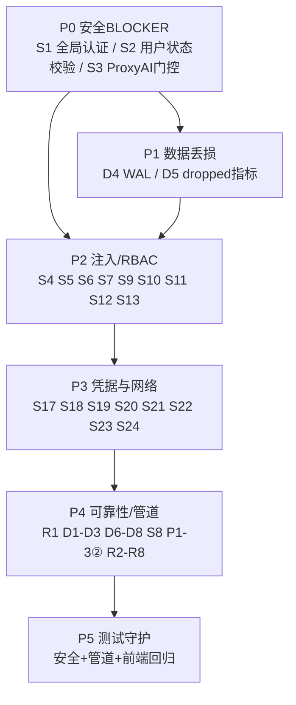

# AIOps 智能可观测平台 · 可落地修复方案（代码级精确修改）

> 配套文档：`1.md`（代码审计复核：问题登记册 + 证据 file:line）、`AIOPS_FIX_PLAN_2026-08-18.md`（既有 R2 修复方案 v2，G/H 系列高层设计）、`README.md`（整体认识）、`AIOPS_TEST_REPORT_R2_2026-08-18.md`（安全/管道/可靠性实测）。
> **对象**：AIOps 智能可观测平台（4 自研服务 + 数据底座 + DeepFlow），核心功能闭环（采集→落库→查询→告警→AI→执行）已可用，本次修复**不破坏该闭环**。
> **日期**：2026-08-18
> **作者角色**：软件开发团队架构师（高见远）

## 文档头 · 与既有方案的关系

`AIOPS_FIX_PLAN_2026-08-18.md`（v2）已将 1.md 的全部问题纳入 **G 系列（安全，批次 4，最高优先）** 与 **H 系列（数据管道/可靠性，批次 5）** 的高层设计。本方案在其之上做两件事：

1. **补充精确修改点**：对 1.md 登记册每一项，给出**真实代码级修改方案**（文件:函数:行号 + 改法/伪代码），使工程师可直接 build，而非「应加强鉴权」之类空话。
2. **补齐既有方案未覆盖项**：`P1-3②`（SaveLLMSettings 先改后校验）、`S8`（用户无法禁用）、`S9`（GET /settings/llm 公开）在既有 G 系列中未单列，本方案单独成条；并对需用户/运维决策的边界明确标为「待明确」。

**标注约定**：每条「既有方案」列标注 `Gx`/`Hx` 表示既有方案已给出高层覆盖；未标注者为本次新增补充。所有「精确修改点」均基于 2026-08-18 HEAD 实际读取源码（见附录「复核读取清单」）。

---

## 一、修复总策略

### 1.1 原则
- **安全第一、纵深防御、最小权限**：BLOCKER 是生产化前提，最先修。
- **不破坏现有功能闭环**：所有改动走「加门控/加校验/改默认值」，不删减正常业务路径；AI 诊断→审批→执行 happy path 必须回归通过。
- **可灰度、可回滚**：BLOCKER 类（S1 全局中间件、S2 状态校验）影响面大，需先在 staging 用真实前端+ProxyAI 验证后再上生产。
- **可观测**：凡涉及「丢数据/丢请求」的修复（D4/D5/R1）必须伴随指标与告警，避免静默回退。

### 1.2 分期（与 1.md §6.2 一致）
| 期 | 内容 | 对应项 | 既有方案 |
|---|---|---|---|
| **P0** | 安全 BLOCKER：认证/授权信任边界 | S1, S2, S3 | G1 |
| **P1** | 数据管道丢数据 | D4, D5 | H2, H3 |
| **P2** | 注入/RBAC 收敛 | S4, S5, S6, S7, S9, S10, S11, S12, S13 | G2, G3, G4 |
| **P3** | 凭据与网络加固 | S17, S18, S19, S20, S21, S22, S23, S24 | G5, G6 |
| **P4** | 可靠性 + 采集/管道正确性 | R1, D1, D2, D3, D6, D7, D8, S8, P1-3②, R2–R8 | H1, H4, H5 |
| **P5** | 测试守护（防回退） | 安全/管道/前端回归用例 | —（既有方案测试章节） |

---

## 二、任务分解与依赖

### 2.1 依赖图（Mermaid）



### 2.2 有序任务列表

**T01 · P0 安全 BLOCKER（最高优先，影响面最大）**
- 涉及文件：
  - `ai-orchestrator/main.py`（新增全局 `AuthMiddleware`；`app` 挂载；收紧 `0.0.0.0` 暴露由 S18 NetworkPolicy 兜底）
  - `ai-apm-query-go/internal/api/auth.go`（`AuthMiddleware` 内增加用户存在+status==1 查库校验；移除 `GET /settings/llm` 公开白名单 S9）
  - `ai-apm-query-go/internal/api/settings.go`（`ProxyAI` 增加 `/ops/*`、`/ipmi/*`、`/ai/nl2sql/execute`、`/ai/shell/*` 的 `isAdmin` 门控 S3）
- 依赖：无（前置）
- 实现顺序：先 S2（Go 侧查库，改动小）→ S3（ProxyAI 门控）→ S1（orchestrator 全局中间件，最后做、需 staging 验证）

**T02 · P1 数据管道丢数据**
- 涉及文件：
  - `ai-apm-ingest-go/internal/clickhouse/wal.go`（`recoverSeq` 恢复 `consecutiveAckSeq`；`Compact` 修正清空逻辑 D4）
  - `ai-apm-ingest-go/internal/clickhouse/writer.go`（`Add` 丢 span 处增加 dropped 计数 D5）
  - `ai-apm-ingest-go/internal/metrics/metrics.go`（新增 `spansDropped` 指标字段与方法）
  - `ai-apm-ingest-go/cmd/ingest/main.go`（接线 `writer.OnDropped` 回调）
- 依赖：T01 可并行（独立服务）
- 实现顺序：先 D4（核心数据丢失 bug）→ D5（可观测）

**T03 · P2 注入 / RBAC 收敛**
- 涉及文件：
  - `ai-orchestrator/shell_policy.py`（`EXEC_WRITE` 收紧 `kubectl exec \S+ -- ` S10）
  - `ai-orchestrator/tools.py`（`execute_shell` 强制 `is_whitelisted_for_execute` S11）
  - `ai-orchestrator/main.py`（`_parse_llm_config` SSRF 校验 S12；`download_report` 认证+路径净化 S13）
  - `ai-apm-query-go/internal/api/infrastructure.go`（基础设施端点 RBAC S4）
  - `ai-apm-query-go/internal/api/alerts.go`（`AlertEventAck/Resolve/deleteAlertRule` 加 admin S5）
  - `ai-apm-query-go/internal/api/system.go`（`SystemStatus/CacheStats/InvalidateCache` 加 admin S6）
  - `ai-apm-query-go/internal/api/users.go`（角色白名单含 `approver` S7）
- 依赖：T01（S3/S12 门控依赖 T01 的认证基础；S10/S11 独立可早做）

**T04 · P3 凭据与网络加固**
- 涉及文件：
  - `deploy/scripts/apply.sh`（移除硬编码弱凭据 S17）
  - `deploy/helm/aiops/values-prod.yaml` + 新增 `templates/_secrets_validation.tpl`（拒绝 `CHANGE_ME` 占位 S17）
  - `deploy/helm/aiops/templates/clickhouse/statefulset.yaml`（CH `<ip>::/0</ip>` 收敛 S18）
  - `deploy/helm/aiops/templates/`（新增 NetworkPolicy 清单 S18）
  - `deploy/helm/aiops/templates/`（event-collector/ipmi DaemonSet 去 privileged/hostPID S19；orchestrator RBAC 收敛 S20）
  - `ai-orchestrator/main.py`（`CORS allow_origins` 白名单 S23）
  - `ai-apm-query-go/internal/api/auth.go`（登录防护真实 IP + JWT 撤销/短时 S21/S22）
  - 部署基线（`values-prod.yaml` / MySQL/Redis/Grafana 配置 S24）
- 依赖：T01–T03

**T05 · P4 可靠性 + 采集/管道正确性**
- 涉及文件：
  - `ai-event-collector/main.go`（/health 反映 CH 真实健康 R1）
  - `ai-apm-ingest-go/cmd/ingest/main.go`（/health 反映 CH/队列 R1）
  - `ai-event-collector/clickhouse.go`（ReplacingMergeTree ORDER BY 增 name/message D1）
  - `ai-event-collector/`（DaemonSet→单实例/leader 选举 D2；SEL checkpoint D3；k8s checkpoint watermark D6）
  - 采集/ingest 写入路径（schema 校验 D7；重试队列溢出暴露 D8）
  - `ai-apm-query-go/internal/api/users.go`（允许 status=0 禁用 S8）
  - `ai-apm-query-go/internal/api/settings.go`（`SaveLLMSettings` 校验前置 P1-3②）
  - orchestrator 后台任务/超时/缓存/竞态（R2–R8）
- 依赖：T01–T04

**T06 · P5 测试守护（防回退）**
- 涉及文件：
  - `ai-apm-ingest-go/internal/clickhouse/wal_test.go`（新增 D4 重启不丢未 ack 用例）
  - `ai-apm-query-go/internal/api/*_test.go`（S3 ProxyAI、S5 告警写、S2 状态失效新增用例）
  - `ai-orchestrator/tests/test_security.py`（S1 认证、S12 SSRF、S13 穿越新增用例）
  - `ai-event-collector`（补齐采集正确性测试 D1/D2/D3）
  - `observability-frontend`（补冒烟测试，覆盖核心闭环）
- 依赖：T01–T05 完成后补对应回归用例

---

## 三、逐条修复方案

> 每条格式：**编号 / 域 / 严重度 / 根因 / 精确修改点(file:line + 改法) / 依赖 / 验证**
> 「既有方案」标注于编号后：`[Gx|Hx]` 表示既有方案已高层覆盖。

---

### P0 · 安全 BLOCKER

#### S1 · 安全 · BLOCKER · orchestrator 无全局认证中间件 `[G1]`
- **根因**：`ai-orchestrator/main.py` 仅挂载 `rate_limit_middleware`（`main.py:319-333`），无 auth 中间件；除 `marketplace/install`、`ops/tasks/.../approve` 等少数端点手动调 `_require_admin/_require_approver`（仅 6 类调用点）外，绝大多数端点（如 `/ops/audit-logs`、`/ops/tasks`、`/ipmi/*`、`/ai/nl2sql/*`）直连即全开；服务 `uvicorn.run(host="0.0.0.0", port=8080)`（`main.py:2920`）。
- **精确修改点**：在 `app = FastAPI(...)`（`main.py:182`）之后新增全局认证中间件并挂载：
  ```python
  # main.py 新增（建议放在 CORS 之后、router include 之前）
  from starlette.middleware.base import BaseHTTPMiddleware
  from fastapi.responses import JSONResponse

  PUBLIC = {"/health", "/api/v1/health", "/metrics", "/docs", "/openapi.json", "/redoc"}

  class AuthMiddleware(BaseHTTPMiddleware):
      async def dispatch(self, request, call_next):
          p = request.url.path
          if p in PUBLIC or p.startswith("/docs") or p.startswith("/openapi.json"):
              return await call_next(request)
          # 内部服务间调用（query-api 代理已注入 X-Internal-Token + 角色）
          it = os.environ.get("INTERNAL_TOKEN", "")
          if it and request.headers.get("X-Internal-Token") == it:
              return await call_next(request)
          # 否则必须携带合法 JWT（复用 query-api 同款 HMAC 校验逻辑，抽到 shared verify）
          if not verify_orchestrator_jwt(request.headers.get("Authorization", "")):
              return JSONResponse({"error": "unauthorized"}, status_code=401)
          return await call_next(request)

  app.add_middleware(AuthMiddleware)
  ```
  并新增 `verify_orchestrator_jwt(token)`（与 `ai-apm-query-go` 共用 `JWT_SECRET` 环境变量，算法 HS256）。**不破坏**既有 `_require_admin/_require_approver`（纵深防御，二者并存）。
- **依赖**：需 `JWT_SECRET` 在 orchestrator 环境可用（与 query-api 同源）；建议先 staging 验证前端（带 JWT）与 ProxyAI（带 X-Internal-Token）正常。
- **验证**：`curl http://orch:8080/ops/audit-logs`（无 token）→ 401；带前端 JWT 的普通 user → 200（只读）；直接带伪造 X-Internal-Role 但无 X-Internal-Token → 401。

#### S2 · 安全 · BLOCKER · Go AuthMiddleware 不校验用户存在/status `[G1]`
- **根因**：`ai-apm-query-go/internal/api/auth.go:117-139` `validateJWT` 仅验签名+过期，不查库；`AuthMiddleware`（`auth.go:302-337`）放行后不校验用户状态；删除/禁用（status=0）用户 JWT 在 24h 内仍可用。`Me`（`users.go:236-244`）用户不存在时回退 token claims 返回 200。
- **精确修改点**：
  - `auth.go` `AuthMiddleware` 在 `validateJWT` 通过后（`auth.go:331` 之后）增加查库校验：
    ```go
    username, _, _, ok := validateJWT(token)
    if !ok { respondJSON(w,401,...); return }
    u, _ := (&store.UserDAO{}).GetByUsername(username)
    if u == nil || u.Status != 1 {
        respondJSON(w, 401, map[string]interface{}{"error":"user disabled or not found"})
        return
    }
    ```
    > 性能：建议对 `username→(status,exists)` 加 10s TTL 内存缓存（避免每条请求打 MySQL）；删除/禁用用户时清缓存（或配合 S22 token 版本号）。
  - `Me`（`users.go:236-244`）：用户不存在（`u == nil`）时返回 401，不再回退 token claims。
- **依赖**：T01（与 S1 同批）。
- **验证**：创建用户→删除（或 `status=0`）→ 用其旧 JWT 访问任意受保护端点 → 401 立即失效；普通有效用户 → 200。

#### S3 · 安全 · BLOCKER · ProxyAI 转发高危路径无角色门控 `[G1]`
- **根因**：`ai-apm-query-go/internal/api/settings.go:612-693` `ProxyAI` 向 orchestrator 透明转发 `/ops/*`、`/ipmi/`、`/ai/nl2sql/` 等高危路径，仅注入角色头，**无 `isAdmin` 守卫**；实测普通 user 可 `GET /ops/audit-logs` 返回 200。
- **精确修改点**：在 `ProxyAI` 转发前（建议在 `quota` 检查之后、`aiClient.Do(req)` 之前，`settings.go:679` 之前）插入门控：
  ```go
  // 高危路径仅 admin 可触达（审计/执行/写类）
  if isHighRiskProxyPath(r.URL.Path) && !isAdminRequest(r) {
      respondJSON(w, http.StatusForbidden, map[string]interface{}{
          "error": "forbidden: admin only for " + r.URL.Path,
      })
      return
  }
  ```
  其中：
  ```go
  func isHighRiskProxyPath(p string) bool {
      for _, pre := range []string{"/ops/", "/ipmi/", "/ai/nl2sql/execute", "/ai/shell/", "/ai/final_report"} {
          if strings.HasPrefix(p, pre) { return true }
      }
      return false
  }
  func isAdminRequest(r *http.Request) bool {
      role, _, _ := requesterApprover(r) // 已在同文件定义(696+)，从 JWT 取角色
      return role == "admin"
  }
  ```
- **依赖**：T01（S1 认证基础）；`requesterApprover` 已存在（`settings.go:696`）。
- **验证**：普通 user `POST /api/v1/ai/proxy/ops/audit-logs`（经前端 ProxyAI）→ 403；admin → 200。

---

### P1 · 数据管道丢数据

#### D4 · 管道 · MAJOR · ingest WAL 重启清空未 ack 数据 `[H2]`
- **根因**：`ai-apm-ingest-go/internal/clickhouse/wal.go`：`recoverSeq()`（`wal.go:73-85`）仅恢复 `seq`，不恢复 `consecutiveAckSeq`（保持 0）；`Compact()`（`wal.go:143-154`）在 `consecutiveAckSeq == 0` 时执行 `Truncate(0)`，将含未 ack 的全部数据清空 → **重启即丢未落库数据**。
- **精确修改点**：
  1. `WAL` 结构体（`wal.go:23-34`）新增字段 `metaPath string`；`NewWALFile`（`wal.go:50-70`）设 `metaPath = path + ".meta"`，启动末调 `w.recoverMeta()`。
  2. 新增 `saveMeta()`：原子写 `{seq, consecutiveAckSeq}` 到 `metaPath`（写 tmp+rename）；在 `Append`（`wal.go:88` 后）、`Ack`（`wal.go:109` 推进水位后）、`Compact` 末调用。
  3. 新增 `recoverMeta()`：读 `metaPath` 恢复 `seq` 与 `consecutiveAckSeq`；缺失时回退 `scanLastSeq`（`wal.go:81`）仅恢复 seq。
  4. 修正 `Compact()`（`wal.go:146`）逻辑：
     ```go
     if w.seq <= w.consecutiveAckSeq {
         // 全部已确认 → 清空
         w.file.Truncate(0); w.file.Seek(0,0); w.file.Sync(); return
     }
     if w.consecutiveAckSeq == 0 {
         // 没有任何已确认段，无需压缩（避免清空未 ack 数据）
         return
     }
     // 仅重写 > consecutiveAckSeq 的未确认记录
     remaining, err := w.readRemainingLocked(w.consecutiveAckSeq)
     ...
     ```
- **依赖**：T02（独立服务，可并行 P0）。
- **验证**：写入 N 条 span 但仅 ack 前 k 条 → 杀进程重启 → 未 ack 的 N-k 条仍在 WAL 并被重放；触发 Compact（`consecutiveAckSeq==0`）后数据不丢。新增 `wal_test.go` 覆盖该场景（见 T06）。

#### D5 · 管道 · MAJOR · 背压静默丢 span 无 dropped 计数 `[H3]`
- **根因**：`ai-apm-ingest-go/internal/clickhouse/writer.go:116-125` `Add` 缓冲满时丢弃最旧 span 仅 `log.Printf`，无计数器；`/metrics` 仅 `received/written`，运维不可见。
- **精确修改点**：
  1. `ai-apm-ingest-go/internal/metrics/metrics.go`：`Metrics` 结构体（`metrics.go:16-31`）新增 `spansDropped atomic.Int64`；新增方法：
     ```go
     func (m *Metrics) AddSpansDropped(n int64) { m.spansDropped.Add(n) }
     ```
     并在 `Snapshot()`（`metrics.go:103`）输出 `spans_dropped_total`（与 `spans_received_total` 等并列）。
  2. `writer.go:116-125` 丢 span 分支改为：
     ```go
     w.buffer = w.buffer[:len(w.buffer)-1]
     w.dropped++               // 新增字段 int64
     log.Printf("WRITER: buffer full, dropping oldest span (backpressure)")
     if w.OnDropped != nil { w.OnDropped(1) }
     return
     ```
     `Writer` 结构体新增 `OnDropped func(int)`（与既有 `OnWritten` 同模式）。
  3. `cmd/ingest/main.go`（`main.go:46` 附近 `writer.OnWritten=...` 处）新增：
     ```go
     writer.OnDropped = func(n int) { met.AddSpansDropped(int64(n)) }
     ```
- **依赖**：T02。
- **验证**：压测超过 `maxBufferSpans` → `/metrics` 中 `spans_dropped_total > 0`；vmalert 可对 `rate(spans_dropped_total[5m])>0` 告警。

---

### P2 · 注入 / RBAC 收敛

#### S4 · 安全 · MAJOR · 基础设施端点无 RBAC/租户隔离 `[G4]`
- **根因**：`ai-apm-query-go/internal/api/infrastructure.go` 的 `Nodes`(`37-49`)、`Pods`(`51-66`)、`Deployments`(`68-83`)、`Namespaces`(`85-97`)、`NodesMetrics`(`289-308`)、`PodDetail`(`313+`) 均无角色/租户门控，任意登录用户可读全部集群资源。
- **精确修改点**：在路由注册处用现有 `RequireRoleForWrite`（只读开放、写需 admin，`auth.go:286`）或新增 `RequireRole("admin")` 包装只读端点。推荐：只读端点（Nodes/Pods/Deployments/Namespaces/NodesMetrics/PodDetail）加 `h.RequireRoleForWrite`（读开放，符合最小可用），写端点（如 cordon/drain 类）加 `h.RequireRole("admin")`。
- **依赖**：T01（JWT 已可解析角色）。
- **验证**：普通 user 可 `GET /api/v1/infrastructure/pods`；非 admin 调写类端点 → 403；admin 正常。

#### S5 · 安全 · MAJOR · 告警写端点无 admin 校验 `[G4]`
- **根因**：`ai-apm-query-go/internal/api/alerts.go` `AlertEventAck`(`826`)、`AlertEventResolve`(`858`)、`deleteAlertRule`(`1082`) 直接操作，无 `hasRole(r,"admin")` 检查，任意登录用户可 ack/resolve/删除告警。
- **精确修改点**：在各 handler 函数体**最前**插入（以 `AlertEventAck` 为例，`alerts.go:826` 之后）：
  ```go
  if !hasRole(r, "admin") {
      respondError(w, http.StatusForbidden, "forbidden: admin required")
      return
  }
  ```
  同样加于 `AlertEventResolve`(`858`)、`deleteAlertRule`(`1082`)。
- **依赖**：T03。
- **验证**：普通 user `POST /api/v1/alerts/events/{id}/ack` → 403；admin → 200。

#### S6 · 安全 · MAJOR · 系统端点任意用户可访问 `[G4]`
- **根因**：`ai-apm-query-go/internal/api/system.go` `SystemStatus`(`13-21`)、`CacheStats`(`23-27`)、`InvalidateCache`(`29-39`) 无角色门控；`InvalidateCache` 接受任意 `pattern` 可清空全缓存。
- **精确修改点**：三函数体首行加 `if !hasRole(r,"admin"){respondJSON(w,403,...);return}`；`InvalidateCache` 移除任意 pattern 能力——改为仅允许 `pattern=cache:`（或固定枚举），删除 `r.URL.Query().Get("pattern")` 自由输入。
- **依赖**：T03。
- **验证**：普通 user `GET /api/v1/system/status` → 403；admin → 200；`InvalidateCache?pattern=*` → 被拒绝/忽略。

#### S7 · 安全 · MAJOR · 后端角色词汇与前端脱节（无 approver）`[G1/G4]`
- **根因**：`ai-apm-query-go/internal/api/users.go:53-60` 角色白名单仅 `admin|user`，`req.Role != "admin" && req.Role != "user"` 直接 400；前端审批中心按 `role==='approver'` 判断，导致审批人角色无法落地（审批模型失效）。后端已有 `IsApprover` 布尔（`SetApprover`）与 `_require_approver`（main.py:1243）。
- **精确修改点（推荐方案，待用户拍板见 §五）**：扩展角色白名单含 `approver`，并在创建/更新时同步 `IsApprover`：
  ```go
  // users.go:57
  if req.Role != "admin" && req.Role != "user" && req.Role != "approver" {
      respondJSON(w, 400, map[string]interface{}{"error":"role must be admin/user/approver"})
      return
  }
  // 创建/更新：若 role==approver 则 SetApprover(id, true)
  ```
  备选方案：前端改判 `isApprover` 布尔而非 `role`。**两种方案二选一**，详见 §五待明确。
- **依赖**：T03。
- **验证**：创建 `role=approver` 用户成功；该用户调 `_require_approver` 保护的审批端点 → 200；`role=foo` → 400。

#### S9 · 安全 · MINOR（本次新增补充）· GET /settings/llm 公开可读
- **根因**：`ai-apm-query-go/internal/api/auth.go:311-314` 将 `GET /api/v1/settings/llm` 列入公开白名单；`GetLLMConfig`（`settings.go:604-610`）返回**解密后的 APIKey** 与 `base_url`，未脱敏，任意未登录者可读取凭据配置。
- **精确修改点**：
  1. 从 `AuthMiddleware` 白名单（`auth.go:314`）移除该豁免 → 需 JWT。
  2. `GetLLMConfig`（`settings.go:604-610`）返回前脱敏：`cfg.APIKey = maskSecret(cfg.APIKey)`，`cfg.BaseURL` 仅返回域名（`*` 遮蔽路径/key）。
- **依赖**：T03（与 S1 同认证基础）。
- **验证**：未登录 `GET /api/v1/settings/llm` → 401；登录后返回脱敏（`api_key: "sk-***"`）。

#### S10 · 安全 · MAJOR · kubectl exec 白名单允许任意 in-pod 命令 `[G2]`
- **根因**：`ai-orchestrator/shell_policy.py:93` `EXEC_WRITE` 含 `r"kubectl exec \S+ -- "`，对 `kubectl exec pod -- cat /etc/shadow` 无元字符、且整段命中该前缀 → 放行任意 in-pod 命令。
- **精确修改点**：删除 `shell_policy.py:93` 的泛化 `kubectl exec \S+ -- `，改为**显式命令白名单**（仅只读诊断）：
  ```python
  # shell_policy.py EXEC_WRITE 中替换第 93 行
  r"kubectl exec \S+ -- (cat|head|tail|less|echo|ls|ps|top|grep|awk|sed|wc|sort|uniq|env|printenv) [\w./\-]+",
  ```
  并禁止敏感路径：在 `EXTRA_BLACKLIST`（`shell_policy.py:172+`）追加 `(/etc/shadow|/etc/passwd|id_rsa|/\.ssh)` 命中即拒。禁止 `--` 后接管道/重定向由 `check_shell_metachars`（已修复）兜底。
- **依赖**：T03（独立，可最早做）。
- **验证**：`kubectl exec mypod -- cat /etc/shadow` → 拒；`kubectl exec mypod -- cat /var/log/app.log` → 放行。

#### S11 · 安全 · MAJOR · execute_shell 低层不强制白名单 `[G2]`
- **根因**：`ai-orchestrator/tools.py:145-164` `execute_shell` 仅调 `policy.check()`（内置黑名单）+ `policy.check_extra_blacklist()`，**未调** `is_whitelisted_for_execute`，白名单门控依赖调用方自觉，低层可绕过。
- **精确修改点**：在 `execute_shell`（`tools.py:151` 之后）强制白名单：
  ```python
  allowed, cat = policy.is_whitelisted_for_execute(command)
  if not allowed:
      return f"命令被安全策略拒绝(未命中执行白名单): {cat}"
  ```
  置于 `check_extra_blacklist` 之后、实际 `subprocess.run` 之前（`tools.py:156` 前）。
- **依赖**：T03（依赖 S10 白名单收紧才有效）。
- **验证**：`kubectl exec x -- rm -rf /` → 拒（白名单不命中）；`kubectl get pods` → 放行。

#### S12 · 安全 · MAJOR · X-LLM-Base-URL 致 SSRF `[G3]`
- **根因**：`ai-orchestrator/main.py:290-309` `_parse_llm_config` 直接读请求头 `X-LLM-Base-URL`（及 API-Key/Model）写入 `llm_config`，无 SSRF 校验；配合 S1 无认证即任意 SSRF（如指向 `http://169.254.169.254` 云元数据）。
- **精确修改点**：
  1. `_parse_llm_config`（`main.py:293-302`）对 `X-LLM-Base-URL` 增加 SSRF 校验：
     ```python
     base_url = h.get("X-LLM-Base-URL", "https://api.openai.com/v1")
     if not is_safe_url(base_url):
         base_url = "https://api.openai.com/v1"  # 落回默认，拒绝内网/链路本地
     ```
     新增 `is_safe_url(u)`：解析 host→IP，拒绝 `127.0.0.0/8`、`10/172.16/192.168`、`169.254.0.0/16`（含 169.254.169.254 元数据）、`::1`、`fc00::/7`、以及非 `https/http` scheme。
  2. 彻底方案（推荐）：LLM `base_url` 仅从**服务端配置/数据库**读取，前端经 ProxyAI 由 query-api 注入，禁止请求头覆盖（S1 认证落地后风险大降，但仍应校验）。
- **依赖**：T03（S1 认证）；SSRF 校验函数独立可先加。
- **验证**：`X-LLM-Base-URL: http://169.254.169.254/` → 被拒/落默认；`https://api.openai.com/v1` → 正常。

#### S13 · 安全 · MAJOR · 报告下载路径穿越 `[G3]`
- **根因**：`ai-orchestrator/main.py:2051-2075` `download_report` 用未净化 `task_id` 直接 `os.path.join(data_dir,"reports",task_id,"report.md")`；端点无认证，可 `task_id=../../etc/passwd` 穿越。
- **精确修改点**：
  1. 端点加认证依赖（复用 S1 的 `verify_orchestrator_jwt` 或 `_require_approver` 级别的 guard）。
  2. `task_id` 净化（`main.py:2068` 之前）：
     ```python
     import re
     if not re.fullmatch(r"[A-Za-z0-9_\-]{1,64}", task_id):
         raise HTTPException(400, "invalid task_id")
     # 仍用安全 join 兜底
     local_path = os.path.join(data_dir, "reports", task_id, "report.md")
     if not os.path.abspath(local_path).startswith(os.path.abspath(data_dir)):
         raise HTTPException(400, "invalid path")
     ```
- **依赖**：T03（S1 认证）。
- **验证**：`/api/v1/ops/reports/../../etc/passwd/download` → 400；无 token → 401。

---

### P3 · 凭据与网络加固

#### S17 · 安全/凭据 · MAJOR · 硬编码弱凭据 + CHANGE_ME 占位 `[G5]`
- **根因**：`deploy/scripts/apply.sh:33-44` 硬编码 `dev-internal-token`/`admin123`/`dev-ch-pass`/`dev-mysql-pass`/`dev-ingest-key`/`dev-jwt-/dev-llm-` 前缀弱随机；`deploy/helm/aiops/values-prod.yaml:49-54` 六密钥为 `CHANGE_ME`，`required` 仅查非空即可过。
- **精确修改点**：
  1. `apply.sh`：本机 dev 部署仍可用弱值，但**生产部署改用环境变量注入**（`${AIOPS_INTERNAL_TOKEN}` 等），缺失即报错退出，不回退硬编码（`apply.sh:40-44` 改为读环境变量）。
  2. 新增 `deploy/helm/aiops/templates/_secrets_validation.tpl`：
     ```yaml
     {{- define "aiops.validateSecrets" -}}
     {{- range $k, $v := .Values.secrets -}}
     {{- if (or (eq $v "CHANGE_ME") (eq $v "")) -}}
     {{- fail (printf "secrets.%s 必须为强随机值，禁止使用 CHANGE_ME 或空" $k) -}}
     {{- end -}}
     {{- end -}}
     {{- end -}}
     ```
     并在 `values-prod.yaml` 对应 release 的 NOTES/预检中引用；或在 `apply.sh` 部署前 `helm template` 阶段 `grep CHANGE_ME` 失败退出。
- **依赖**：T04。
- **验证**：`helm upgrade ... -f values-prod.yaml`（含 CHANGE_ME）→ 渲染失败；替换为强随机 → 通过。

#### S18 · 安全/网络 · MAJOR · 无 NetworkPolicy + CH 开放 ::/0 `[G5]`
- **根因**：全 chart `grep NetworkPolicy` = 0 命中（无清单）；`deploy/helm/aiops/templates/clickhouse/statefulset.yaml:46-48` `<networks><ip>::/0</ip>` 全开放；跨服务东西向无隔离。
- **精确修改点**：
  1. `clickhouse/statefulset.yaml:46-48`：`<ip>::/0</ip>` 改为集群 Pod CIDR / 仅允许 query-api、ingest、orchestrator 命名空间来源（如 `<ip>10.0.0.0/16</ip>` 或按实际 Pod 网段）。
  2. 新增 `deploy/helm/aiops/templates/networkpolicy.yaml`：default-deny `NetworkPolicy` + 逐服务 allow（ingest→CH:8123/9000；query-api→CH/VM/VL/MySQL/Redis；frontend→query-api；orchestrator→query-api/MySQL/ChromaDB 等）。**注：DeepFlow/Redis 跨服务通信可能受影响，详见 §五待明确。**
- **依赖**：T04。
- **验证**：从非白名单 Pod `kubectl exec` 内 `curl clickhouse:8123` → 不通；白名单 Pod → 通。

#### S19 · 安全 · MAJOR · event-collector/ipmi DaemonSet privileged `[G5]`
- **根因**：event-collector / ipmi-exporter DaemonSet 使用 `privileged: true` / `hostPID`（1.md 依 R2 标注；`deploy/helm/.../daemonset.yaml`）。
- **精确修改点**：改为 `securityContext: { runAsNonRoot:true, allowPrivilegeEscalation:false, capabilities:{ drop:["ALL"], add:["SYS_ADMIN","NET_ADMIN"] } }`，用 `hostPath` 挂设备替代全量 privileged；评估 `hostPID` 是否必需（IPMI 取硬件信息通常不需）。
- **依赖**：T04（需确认采集是否依赖，见 §五）。
- **验证**：Pod 以非 root 启动、无 privileged；采集数据正常。

#### S20 · 安全 · MAJOR · orchestrator RBAC 集群级 pods/exec/delete `[G5]`
- **根因**：orchestrator ServiceAccount 绑定过宽 RBAC（`pods/exec`、`delete`、`eviction` 等，依 R2 标注）。
- **精确修改点**：收敛 RBAC 至必要范围（仅 `pods/get/list/watch`、`pods/exec` 限命名空间、去除 `nodes/patch`、`pods/delete`、`eviction` 或加审批门控），独立 `Role` 绑定到 orchestrator 命名空间。
- **依赖**：T04。
- **验证**：orchestrator SA 不再具备跨命名空间写/删权限（RBAC 自检）。

#### S21 · 安全 · MINOR · 无登录暴力破解防护 `[G6]`
- **根因**：`ai-apm-query-go/internal/api/auth.go:154-167` 已有 `loginAttempts`（60s/10 次），但 `clientIP`（`auth.go:170-177`）**信任 `X-Forwarded-For` 首 IP**，可被伪造绕过；无锁定/指数退避。
- **精确修改点**：`clientIP`（`auth.go:170`）改为优先 `r.RemoteAddr`（仅当确信前置是可信代理时才取 XFF 末跳）；超限后返回 429 并引入指数退避（首次 429 后 2s→4s→8s，封顶 60s）+ 该 username+IP 临时锁定。
- **依赖**：T04。
- **验证**：同一真实 IP 连续 11 次错误登录 → 第 11 次 429；伪造 XFF 不生效。

#### S22 · 安全 · MINOR · JWT 24h 无刷新/撤销 `[G6]`
- **根因**：`validateJWT`（`auth.go:117`）无 `jti`/版本/`exp` 短时效；删除用户靠 S2 查库缓解，但无主动撤销。
- **精确修改点**：登录签发时写入 `jti` 与 `tv`（token_version，取自 `users` 表）；`validateJWT` 校验 `tv` 与库内一致；用户改密/禁用时 `tv+1` 使旧 token 失效；引入 refresh token（7d）+ access token 短时效（15min）。S2 的 status 校验继续保留。
- **依赖**：T04（与 S2 配套）。
- **验证**：用户改密后旧 access token 立即 401；refresh 轮换正常。

#### S23 · 安全 · MINOR · CORS 全开 `[G5]`
- **根因**：`ai-orchestrator/main.py:183` `CORSMiddleware(allow_origins=["*"], allow_methods=["*"], allow_headers=["*"])`。
- **精确修改点**：改为 `allow_origins=os.environ.get("FRONTEND_ORIGINS","").split(",")`（如 `https://console.example.com`），`allow_methods=["GET","POST","PUT","DELETE","OPTIONS"]`，`allow_headers=["Authorization","Content-Type","X-Internal-Token"]`，`allow_credentials=True`。query-api 侧同理（如存在）。
- **依赖**：T04。
- **验证**：非白名单 Origin 请求 → CORS 拒绝；白名单 → 通过。

#### S24 · 安全 · MINOR · MySQL 空密码/root、Grafana TLSInsecure 等 `[G5]`
- **根因**：部署基线（依 R2 标注）MySQL root 空密码、Grafana `tls_insecure_skip_verify` 等弱化配置。
- **精确修改点**：`values-prod.yaml`/MySQL/Redis/Grafana 模板强制 `root` 强密码（复用 S17 密钥）、Redis 启用 `requirepass`、Grafana 关匿名+启用 TLS；接入 S17 的 `CHANGE_ME` 校验。
- **依赖**：T04。
- **验证**：MySQL 非空密码登录；Grafana 非 insecure。

---

### P4 · 可靠性 + 采集/管道正确性

#### R1 · 可靠性 · MAJOR · /health 恒 200 探针失效 `[H4]`
- **根因**：`ai-event-collector/main.go:49-52` 与 `ai-apm-ingest-go/cmd/ingest/main.go:208-211` 的 `/health` 无条件 `WriteHeader(200)` + "ok"，不反映 CH 连通/队列水位，CH 宕机时探针仍 200 → K8s 不自愈。
- **精确修改点**：
  - event-collector `main.go:49-52`：handler 内 `PingClickHouse()`（用现有 CH 客户端 `SELECT 1`），失败 `WriteHeader(503)`。
  - ingest `main.go:208-211`：检查 `met.lastWriteOk` 时间戳与 CH 连接；>阈值（如 30s 无成功写入或 CH 不可达）→ 503。
- **依赖**：T05。
- **验证**：关停 CH → 两服务 `/health` 返回非 200 → 触发重启/告警。

#### D1 · 管道 · MAJOR · 事件 dedup ORDER BY 缺 name/message `[H1]`
- **根因**：`ai-event-collector/clickhouse.go:34-35` `ReplacingMergeTree ORDER BY (tenant_id, cluster_id, ts, involved_object, reason)` 不含 name/message，同 ts+object+reason 不同内容事件被合并丢数据。
- **精确修改点**：ORDER BY 增加 `name`、`message`（或改用事件唯一 id 列 `event_id` 作为去重键）；相应建表 DDL 与写入列对齐。
- **依赖**：T05。
- **验证**：同一秒同对象同 reason 但不同 message 的两条事件均落库不丢。

#### D2 · 管道 · MAJOR · DaemonSet 每节点全量 watch→N 倍重复写 `[H1]`
- **根因**：event-collector 以 DaemonSet 部署，每节点全量 watch K8s 事件 → N 节点 N 倍重复写（依 R2 架构推断）。
- **精确修改点**：改为 Deployment 单实例（或 leader 选举），避免重复采集；如确需多副本则按集群/命名空间分片。
- **依赖**：T05（需确认采集覆盖，见 §五）。
- **验证**：N 节点部署仅 1 份事件写入。

#### D3 · 管道 · MAJOR · SEL 每周期全量重插无 checkpoint `[H1]`
- **根因**：`ai-event-collector/sel_events.go:96-115` `execIPMITool` 每周期全量 `ipmi sel list last 20` 重读，无逐条去重/checkpoint。
- **精确修改点**：写入前按 `(record_id/timestamp+sensor)` 去重（参考 D1 唯一键）；维护已处理记录水位，仅插新增。
- **依赖**：T05（依赖 D1 唯一键）。
- **验证**：连续两周期 SEL 无重复记录。

#### D6 · 管道 · MINOR · checkpoint max(ts) 丢乱序事件 `[H5]`
- **根因**：`ai-event-collector/k8s_events.go:153-161` `QueryLatestTS` 取 `max(ts)`，重启后 `ts ≤ max` 的迟到事件被 LIST 过滤。
- **精确修改点**：checkpoint 改用 watermark + 容差窗口（如保留 `max(ts)-5min` 前的事件，容差内不丢）。
- **依赖**：T05。
- **验证**：注入早于 checkpoint 的迟到事件仍被采集。

#### D7 / D8 · 管道 · MINOR · 无 schema 校验 / 重试队列溢出丢数据 `[H5]`
- **精确修改点**：采集/ingest 写入路径增加 payload schema 校验（拒绝畸形，记 rejected 计数）；重试队列增加容量上限 + 溢出 `retries_overflow_total` 指标（复用 D5 的 metrics 模式）。
- **依赖**：T05。

#### S8 · 安全 · MINOR（本次新增补充）· 用户无法禁用（status 0→1）
- **根因**：`ai-apm-query-go/internal/api/users.go:108-111` `UserUpdate` 中 `if status == 0 { status = 1 }`，强制启用，管理员无法禁用账号（与 S2 的 status 校验配套，禁用能力缺失）。
- **精确修改点**：`users.go:108-111` 删除 `if status == 0 { status = 1 }`，允许 `status=0` 持久化（S2 已使 status=0 用户 JWT 失效）。
- **依赖**：T05（与 S2 配套）。
- **验证**：管理员将用户 `status` 置 0 → 该用户登录/旧 JWT 被拒。

#### P1-3② · 功能 · 部分写入（本次新增补充）· SaveLLMSettings 先改全局后校验
- **根因**：`ai-apm-query-go/internal/api/settings.go:399-424` `SaveLLMSettings` 先改全局 `settings.LLM` 内存对象（399-415），416 行才校验 `base_url`；校验失败返回 400 但全局已残留部分状态，下次保存会落库。
- **精确修改点**：将校验（含 `base_url` SSRF/格式）**前置**到修改 `settings.LLM` 之前；校验通过后再赋值；建议整段更新用临时变量，成功后原子替换（避免并发半写）。
- **依赖**：T05（与 S12 SSRF 校验复用 `is_safe_url`）。
- **验证**：保存非法 `base_url` → 返回 400 且全局配置不被污染；保存合法 → 成功。

#### R2–R8 · 可靠性 · MINOR · 后台任务/超时/缓存/内存/竞态 `[H5]`
- **精确修改点**（方案级，不逐行展开）：
  - R2 后台任务不停止：`orchestrator` `scheduler.shutdown(wait=False)`（已有 `main.py:168`）扩展为等待在途任务优雅退出；Go 后台循环（alert_engine/data_sync）支持 `context` 停止 + 清理 logCursors。
  - R3 无超时：`http.Server` 加 `ReadTimeout/WriteTimeout` + `Shutdown`；k8sClient 加 `Timeout`；TraceContext 复用 client。
  - R4 无缓存：`DashboardStats` 启用短 TTL 缓存（复用/新增 cache.go）。
  - R5 `audit_logs` 表：1.md 复核已发现 `migrations/0001_business_tables.sql:22` 含建表且 `db.py:50-77` 幂等执行，**建议实测确认建表发生在 `aiops` 库**（非本次必改项，标注为待确认）。
  - R6/R7/R8：限流器/Nl2SqlStore 加 TTL；会话保留策略；LLM env 改 per-call 配置消除竞态；报告时区统一、分页 off-by-one 修复、错误码规范化（200+error→4xx/5xx）。
- **依赖**：T05。

---

## 四、回归测试与验证清单

### 4.1 安全（修复后必跑）
- [ ] 普通 user 访问 `/ops/audit-logs`、`/ops/tasks`、`/ipmi/*`、ProxyAI 高危路径 → **403**（S3）
- [ ] 删除/禁用用户（status=0）后其 JWT **立即失效**（S2/S8）
- [ ] `X-LLM-Base-URL=http://169.254.169.254/` 被拒/落默认（S12）
- [ ] `download_report?task_id=../../etc/passwd` → 400/401（S13）
- [ ] 未登录 `GET /api/v1/settings/llm` → 401；登录返回脱敏（S9）
- [ ] `kubectl exec x -- cat /etc/shadow` → 拒；`kubectl get pods` → 放（S10/S11）
- [ ] 普通 user `ack/resolve/delete` 告警 → 403（S5）
- [ ] 普通 user `GET /system/status` → 403（S6）
- [ ] CORS 非白名单 Origin 被拒（S23）

### 4.2 数据管道
- [ ] ingest 重启后 WAL **未 ack 数据不丢**（D4，新增 `wal_test.go`）
- [ ] 高吞吐下 `/metrics` 暴露 `spans_dropped_total > 0` 且可告警（D5）
- [ ] 同秒同对象不同 message 事件均落库（D1）
- [ ] SEL 连续周期无重复（D3）

### 4.3 可靠性
- [ ] CH 宕机时 ingest / event-collector `/health` 返回 **非 200**（R1）

### 4.4 功能回归（不破坏现有闭环）
- [ ] R1 已修复项保持通过：**P0-CH-1**（CH 探针）、**P1-1**（kubeconfig 隔离）、**P1-9**（拓扑集群过滤）、**P1-10**（告警静默写 admin 门禁）、**P1-3①**（SSRF ULA 豁免）
- [ ] AI 诊断→审批→执行 happy path 行为不变（A3 类回归，既有方案 B 系列）
- [ ] `SaveLLMSettings` 非法 base_url 不污染全局（P1-3②）

### 4.5 新增测试（T06）
- [ ] `ai-apm-ingest-go/internal/clickhouse/wal_test.go`：重启+Compact 不丢未 ack（D4）
- [ ] `ai-apm-query-go` 新增：`ProxyAI` 高危路径门控（S3）、`AlertEventAck` admin（S5）、`AuthMiddleware` 禁用用户失效（S2）
- [ ] `ai-orchestrator/tests/test_security.py`：S1 认证、S12 SSRF、S13 穿越
- [ ] `ai-event-collector` 补齐：D1/D2/D3 采集正确性
- [ ] `observability-frontend` 补冒烟测试：核心闭环（登录→看板→告警→AI 诊断→审批→执行）

---

## 五、风险与待明确事项

### 5.1 改动可能影响的现有功能
- **S1 全局认证中间件**：是本次影响面最大的改动。当前前端应已通过 `client.ts` 拦截器带 JWT、ProxyAI 带 `X-Internal-Token`，理论上不影响正常链路，但**务必 staging 全链路验证**，尤其 WebShell WebSocket（`/api/v1/shell/ws` 已在 Go 侧 `AuthMiddleware` 白名单 `auth.go:317`，orchestrator 侧也需放行）、SSE 流式端点、/docs。
- **S3 ProxyAI 门控**：若前端某些「普通用户可读」的能力误走了 `/ops/*` 路径，会被误拦。需前端确认审批/审计等只读页的权限模型。
- **S18 NetworkPolicy**：default-deny 可能影响 **DeepFlow 采集回传、Redis/CH 跨服务、Grafana→数据源** 等既有连通，需结合现网网络拓扑灰度。
- **D2 DaemonSet→Deployment**：单实例可能降低某些多集群/多节点采集覆盖，需确认 event-collector 是否依赖节点本地资源。

### 5.2 需用户/运维决策的待明确项
1. **S7 角色模型（决策）**：后端 `approver` 角色白名单扩展 vs 前端改判 `isApprover` 布尔？影响用户管理 API 与前端审批中心。**建议：后端加 `approver` 角色并同步 `IsApprover`，与既有 `_require_approver` 一致。**
2. **S17 prod 密钥注入机制**：`apply.sh` 读环境变量 vs 接入外部密钥管理（Vault/云 KMS）？影响 CI/CD 与密钥轮换流程。
3. **S18 NetworkPolicy 范围**：是否影响 DeepFlow/Redis/CH 跨服务通信？需现网网络拓扑与端口清单确认白名单。
4. **S19/S20 权限收敛边界**：IPMI 硬件采集是否必须 `hostPID`/privileged？orchestrator RBAC 去 `pods/delete` 后审批执行链路（kubectl delete pod 类恢复命令）是否受限？
5. **S22 JWT 刷新**：是否引入 refresh token（影响前端登录态管理 UX）？还是仅做 token_version 主动失效（最小改动）？**建议先上 token_version，刷新机制后续迭代。**
6. **R5 audit_logs 建表实测**：1.md 复核认为建表语句与迁移已存在，建议实测确认表落在 `aiops` 库、审计写入可落库（非代码必改，但需验证）。

---

## 附录 · 修改文件清单汇总（按服务分组）

### ai-orchestrator（Python）
| 文件 | 涉及项 | 改动 |
|---|---|---|
| `main.py` | S1, S12, S13, S23, R2 | 新增全局 `AuthMiddleware`；`_parse_llm_config` SSRF 校验；`download_report` 认证+路径净化；CORS 白名单；后台任务优雅退出 |
| `shell_policy.py` | S10 | `EXEC_WRITE` 收紧 `kubectl exec`；敏感路径黑名单 |
| `tools.py` | S11 | `execute_shell` 强制 `is_whitelisted_for_execute` |
| `tests/test_security.py`（新增/扩） | S1/S12/S13 | 安全回归用例 |

### ai-apm-query-go（Go）
| 文件 | 涉及项 | 改动 |
|---|---|---|
| `internal/api/auth.go` | S2, S9, S21, S22 | `AuthMiddleware` 查库校验 status；移除 `/settings/llm` 公开；登录防护真实 IP；JWT 版本/撤销 |
| `internal/api/settings.go` | S3, S9, P1-3② | `ProxyAI` admin 门控；`GetLLMConfig` 脱敏；`SaveLLMSettings` 校验前置 |
| `internal/api/alerts.go` | S5 | `AlertEventAck/Resolve/deleteAlertRule` 加 admin |
| `internal/api/system.go` | S6 | 系统端点加 admin；`InvalidateCache` 去自由 pattern |
| `internal/api/infrastructure.go` | S4 | 端点 RBAC 包装 |
| `internal/api/users.go` | S7, S8 | 角色白名单含 `approver`；允许 `status=0` |

### ai-apm-ingest-go（Go）
| 文件 | 涉及项 | 改动 |
|---|---|---|
| `internal/clickhouse/wal.go` | D4 | 持久化/恢复 `consecutiveAckSeq`；`Compact` 修正清空逻辑 |
| `internal/clickhouse/writer.go` | D5 | 丢 span 计数 + `OnDropped` 回调 |
| `internal/metrics/metrics.go` | D5 | 新增 `spansDropped` 指标 |
| `cmd/ingest/main.go` | D5, R1 | 接线 `OnDropped`；`/health` 反映 CH 健康 |
| `internal/clickhouse/wal_test.go`（新增） | D4 | 重启不丢未 ack 用例 |

### ai-event-collector（Go）
| 文件 | 涉及项 | 改动 |
|---|---|---|
| `main.go` | R1 | `/health` 反映 CH 健康 |
| `clickhouse.go` | D1 | `ORDER BY` 增加 name/message |
| `sel_events.go` | D3 | SEL 逐条去重/checkpoint |
| `k8s_events.go` | D6 | watermark + 容差窗口 |

### deploy / helm
| 文件 | 涉及项 | 改动 |
|---|---|---|
| `deploy/scripts/apply.sh` | S17 | 移除硬编码弱凭据，改环境变量 |
| `deploy/helm/aiops/values-prod.yaml` | S17, S24 | 拒绝 `CHANGE_ME`；MySQL/Redis/Grafana 加固 |
| `deploy/helm/aiops/templates/_secrets_validation.tpl`（新增） | S17 | `CHANGE_ME`/空值渲染失败 |
| `deploy/helm/aiops/templates/clickhouse/statefulset.yaml` | S18 | `<ip>::/0</ip>` 收敛 |
| `deploy/helm/aiops/templates/networkpolicy.yaml`（新增） | S18 | default-deny + 逐服务 allow |
| event-collector/ipmi DaemonSet / orchestrator RBAC 模板 | S19, S20 | 去 privileged/hostPID；RBAC 收敛 |

### observability-frontend（React）
| 文件 | 涉及项 | 改动 |
|---|---|---|
| 冒烟测试（新增） | T06 | 核心闭环回归 |

---

## 附录 · 复核读取的关键源码清单（本次精确修改点依据）

- **Go（query-go）**：`internal/api/auth.go:117-139,170-177,290-337`；`internal/api/settings.go:399-424,604-693`；`internal/api/alerts.go:826,858,1082`；`internal/api/system.go:13-39`；`internal/api/infrastructure.go:37-97,289-308`；`internal/api/users.go:40-95,95-161,223-245`
- **Go（ingest）**：`internal/clickhouse/wal.go:1-70,73-170`；`internal/clickhouse/writer.go:100-133`；`internal/metrics/metrics.go:1-60`；`cmd/ingest/main.go:46,134,208-217`
- **Go（event-collector）**：`main.go:40-70`；`clickhouse.go`（D1 ORDER BY）；`sel_events.go`；`k8s_events.go`
- **Python（orchestrator）**：`main.py:150-288,290-333,520-575,1220-1270,182-186,2051-2075,2895-2924`；`shell_policy.py:1-167`；`tools.py:130-164`
- **部署**：`deploy/scripts/apply.sh:28-57`；`deploy/helm/aiops/values-prod.yaml`；`deploy/helm/aiops/templates/clickhouse/statefulset.yaml:38-92`

---

*本文档为**可落地修复方案**，仅产出设计，未修改任何仓库源码。所有精确修改点均基于 2026-08-18 HEAD 实际读取的源码证据（file:line）。与 `AIOPS_FIX_PLAN_2026-08-18.md`（G/H 系列）配套：既有方案给出分批高层设计，本方案补齐代码级精确修改点与新增补充项（S8/S9/P1-3②）。*
