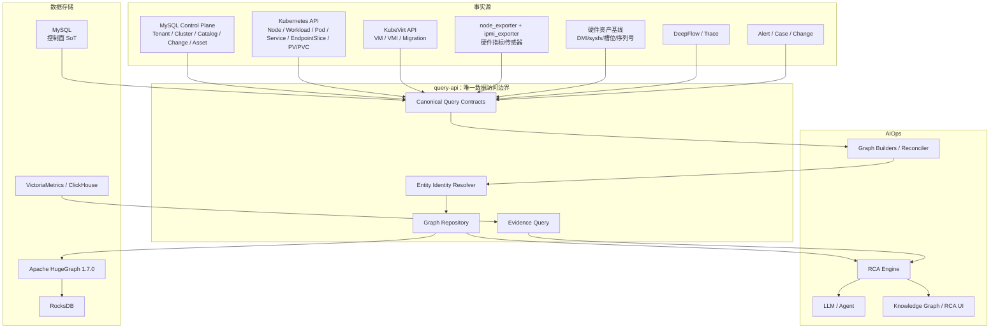

# AIOps 平台 MySQL + Apache HugeGraph（RocksDB）双存储生产化改造方案

> 适用仓库：`Jw-Jm/aiops-edge`  
> 代码基线：`main`  
> 审查基线提交：`05c1fe3296cf5aa1a0b910c30eb58407f802fb6a`  
> HugeGraph 基线：Apache HugeGraph `1.7.0` + RocksDB + Java 11  
> 前端关系可视化基线：`@antv/g6=5.1.1`（精确锁定版本）+ 现有 ECharts 5.5  
> 文档目标：在保留现有控制面、查询边界和 RCA 能力的基础上，将当前轻量属性图改造为可支撑“物理服务器部件 → 物理服务器 → Kubernetes → KubeVirt/VM → Pod/Container → Service/Middleware → Application → Business”全链路的生产级运维知识图谱。

---

## 1. 结论

本项目不应把 MySQL 中现有的 `topology_nodes/topology_relations` 继续扩展为最终生产图数据库，也不应让 Apache HugeGraph 替代 MySQL 的控制面职责。

最终采用以下职责边界：

- **MySQL：控制面权威数据源（SoT）**
  - Tenant、Cluster Registry、User/RBAC；
  - 业务系统、应用、服务目录；
  - 配置、变更、审批、审计、运行状态；
  - 硬件资产基线；
  - Graph Outbox、Graph Sync State、Entity Alias；
  - 不承担生产环境的多跳图遍历。
- **Apache HugeGraph + RocksDB：全栈关系图投影**
  - 保存实体及其关系；
  - 承担邻接、多跳、最短路径、影响面、故障传播候选等图查询；
  - 图数据必须可从 MySQL 权威数据、Kubernetes/KubeVirt API、硬件事实和 Trace/DeepFlow 重新构建；
  - HugeGraph **不是配置、权限、资产原始事实的唯一权威源**。
- **VictoriaMetrics/Prometheus、ClickHouse、DeepFlow：观测事实存储**
  - Metrics、Logs、Traces、Flows、Events 等大规模时序/明细数据继续保留在现有观测存储；
  - 不把每条 Metric、Log、Span 写成图节点；
  - HugeGraph 只保存资源身份、拓扑关系、状态摘要、事件引用和证据引用。
- **query-api：唯一持久化/图存储访问边界**
  - orchestrator 不直接连接 HugeGraph；
  - 前端不直接访问 HugeGraph；
  - LLM/Agent 不允许执行任意 Gremlin/Cypher；
  - 所有图访问继续通过 query-api 的授权、tenant/cluster scope、审计和超时控制。

本次改造不是简单“把 MySQL 换成 HugeGraph”，而是完成以下八项生产化重构：

1. 重建统一的全栈实体/关系模型；
2. 用稳定 `entity_uid`/`edge_uid` 取代 `(type, name)` 和数据库自增 ID 身份模型；
3. 把当前 60 秒全量重建改造成“权威数据 Outbox 增量投影 + 外部事实周期 Reconcile + generation 清理”；
4. 把图查询从“全量 snapshot + Python BFS”迁到 query-api Graph Repository + HugeGraph Traverser；
5. 将知识图谱正式接入 AI 故障分析/RCA 主链，使图谱用于候选根因、传播路径和影响分析，而不是仅用于前端展示；
6. 将 RCA 结构化图上下文按 Run 持久化，保证 Pod 重建、VM 迁移后历史结论仍可复现、可审计；
7. 将前端从自由力导向节点图改为“摘要 → 聚合 → 主链/树/矩阵 → 钻取 → 专家关系探索”；
8. 把接口、数据模型、错误码、配置、状态机、文件级改造、测试和切换门禁固定为可直接编码的实施契约。

### 1.1 RocksDB 生产使用的硬性前提

本方案中的 `HugeGraph Server + RocksDB` 是**单节点图存储模式**，因此只有同时满足以下条件时，才能作为本项目第一阶段生产方案：

1. HugeGraph 明确定位为“可重建关系投影”，不是任何不可恢复业务事实的唯一权威源；
2. HugeGraph 不可用时，平台登录、控制面、普通 Metrics/Logs/Traces 查询必须继续可用；
3. HugeGraph 不可用时，KG 增强 RCA、跨层影响分析和自动处置必须 fail-closed 或降级，不允许基于不完整关系继续自动执行；
4. MySQL、Kubernetes/KubeVirt API、硬件资产基线及观测事实足以重新构建当前图；
5. 生产验收允许“图能力短时降级后恢复”。

若生产门禁要求“任一 HugeGraph 单节点故障时，知识图谱/RCA 本身也必须无中断继续服务”，则 **RocksDB 单节点方案不能通过该门禁**；必须在上线前切换为 HugeGraph 分布式 HStore/PD/Store。该切换不改变本方案的 Repository、Ontology、Entity UID、Builder 和 RCA 上层设计。

---

## 2. 当前代码基线与主要问题

### 2.1 当前知识图谱实现

当前核心文件：

| 文件 | 当前职责 | 本次处理 |
|---|---|---|
| `ai-orchestrator/kg_graph.py` | Trace/K8s/变更/中间件图构建；Python BFS 图查询 | 拆分 Builder；移除生产查询 BFS |
| `ai-orchestrator/kg_api.py` | `/api/v1/ai/kg/*` 对外 API | 保留 API 兼容层，底层改走 query-api 图查询 |
| `ai-orchestrator/kg_tools.py` | LLM 知识图谱证据工具 | 保留，改为结构化 evidence context |
| `ai-orchestrator/main.py` | 默认每 60 秒调用 `build_all()` | 改为 Graph Sync/Reconcile 调度 |
| `ai-orchestrator/rca.py` | 当前 RCA：宿主机/服务拓扑 + 简化 Granger + 变更 | 改为 KG 驱动候选传播 + 证据评分 |
| `ai-orchestrator/node_health.py` | node_exporter/VictoriaMetrics + `ipmi_sensors` 聚合 | 作为硬件健康事实输入；移除直接 DB 依赖 |
| `ai-apm-query-go/internal/api/control_plane_knowledge_graph.go` | 图读写内部边界 | 保留接口边界，后端替换为 Graph Repository |
| `ai-apm-query-go/internal/store/topology.go` | MySQL topology DAO + 类型目录 | 进入 legacy，仅用于迁移/兼容期 |
| MySQL `topology_nodes/topology_relations` | 当前轻量属性图 | 不再作为最终图存储 |

### 2.2 当前实体模型不统一

`kg_graph.py` 当前实体类型包含：

```text
service / instance / middleware / node / pod / cluster /
server / switch / sensor / sel_event / change / alert / case
```

而 `internal/store/topology.go` 内置类型又是：

```text
app / service / cluster / device / rack
```

关系同样存在两套语义：

```text
kg_graph.py:
DEPENDS_ON / RUNS_ON / CONNECTS_TO / HAS_CHANGE /
RAISES / CAUSED_BY / MENTIONED_IN

topology.go:
member_of / depends_on / deployed_on / replicates_to /
monitors / routes_to / connected_to
```

并且 `build_from_k8s()` 已实际写入 `CONTAINS`，但 `REL_TYPES` 没有定义该关系。

**整改要求：本次只能保留一套统一 Ontology，Python、Go、MySQL 目录、HugeGraph Schema、前端和 RCA 必须引用同一份版本化定义。**

### 2.3 当前节点身份模型存在生产阻断

当前 MySQL：

```sql
UNIQUE KEY uq_nodes_type_name (type, name)
```

而 `kg_graph.py` 逻辑认为节点按：

```text
(type, name, cluster_id)
```

去重。

`cluster_id` 实际只存在 `props_json`。

因此：

```text
cluster-A / pod / mysql-0
cluster-B / pod / mysql-0
```

无法可靠共存。

本次必须彻底废弃“name 是身份”的设计。

### 2.4 当前图查询不可扩展

当前调用链：

```text
kg_graph.py
  -> _load_graph()
  -> knowledgeGraphSnapshot()
  -> MySQL List nodes limit=100000
  -> MySQL List edges limit=100000
  -> Go 按 props_json 中 cluster_id 过滤
  -> Python 内存 BFS
```

`find_node()` 也建立在全图 snapshot 上。

在引入：

- CPU/DIMM/NIC/Disk/主板/PSU/Fan；
- K8s Workload/Service/EndpointSlice；
- VM/VMI；
- Network/PVC/PV；
- Business/Application；

后，十万节点只是正常规模，不应成为硬上限。

### 2.5 当前 60 秒全量构建不适合作为生产机制

`main.py` 当前默认：

```text
KG_BUILD_INTERVAL_SECONDS=60
```

每 60 秒执行：

```python
build_all(cluster_id)
```

而 `build_all()` 依次执行：

```text
traces
k8s
middleware
changes
```

这不是生产级增量同步机制。

本次改为：

```text
实时/准实时事件同步
+
按源 watermark 增量拉取
+
周期 reconcile
+
按 generation 清理失效实体/关系
```

### 2.6 当前中间件构建存在明确代码缺口

当前 `_QUERY_TOOLS` 只有：

```python
{
    "topology": "query_topology.v1",
    "kubernetes": "query_k8s.v1",
    "changes": "query_changes.v1",
}
```

但 `attach_middleware()` 调用：

```python
_query_source("middleware", ...)
```

因此当前代码存在合同缺失，应在本次重构中消除，不允许 Builder 使用未注册 canonical query。

### 2.7 当前 Service → Pod 关系依赖名称推断

现有代码通过：

```text
query-api-7966f8dbb8-sjswt
-> query-api
```

这种 pod-name 裁剪推断 Service。

生产改为权威对象关系：

```text
Deployment -> ReplicaSet -> Pod
       ownerReferences

Service -> EndpointSlice -> Pod
       selector/targetRef
```

名称推断只能作为低置信度辅助 alias，不允许生成 `confidence=1.0` 的生产关系。

### 2.8 当前硬件能力可复用，但还不是硬件知识图谱

`node_health.py` 已具备：

```text
VictoriaMetrics/node_exporter
+
MySQL ipmi_sensors
        ↓
CPU / memory / disk / network
        ↓
healthy / degraded / fault
        ↓
node_component_health
```

这条链路应保留。

但它目前存在三个限制：

1. `cpu/memory/disk/network` 是逻辑类别，不是实际 CPU0、DIMM_A1、NIC_1、Disk_Slot_3；
2. `network` 当前没有独立真实采集，代码默认 `net_ok=True`；
3. orchestrator 直接读写 MySQL，与已经建立的 query-api 控制面边界不一致。

本次增加**硬件资产基线 + 实体化**，而不是重复造一套指标采集系统。

### 2.9 当前 RCA 尚未使用知识图谱作为主链

`rca.py` 当前：

```text
Layer 0：宿主机 → VM
Layer 1：服务拓扑
Layer 2：简化 Granger/延迟错误率排序
Layer 3：变更关联
```

宿主机 → VM 当前仍是通过：

```text
/infrastructure/pods?labelSelector=kubevirt.io/vm
```

读取 Pod 近似 VMI/VM。

本次要替换为：

```text
Alert/Anomaly
 -> Entity Resolve
 -> HugeGraph propagation candidates
 -> Metrics/Logs/Trace/Change/Hardware Evidence
 -> deterministic scoring
 -> LLM explanation
```

---

## 3. 目标总体架构



### 3.1 双存储不是“双权威”

必须明确：

```text
MySQL = Authority / Source of Truth
HugeGraph = Derived Graph Projection
```

禁止形成：

```text
MySQL topology_nodes
         +
HugeGraph
         =
两边都可以任意人工修改
```

否则最终一定出现关系漂移。

在切换期允许 `shadow` 模式做结果对比，但切换完成后：

- 控制面事实改 MySQL；
- K8s/KubeVirt 事实来自 API；
- 硬件事实来自资产基线 + exporter；
- Trace 依赖来自 DeepFlow/Trace；
- Graph Builder 生成 HugeGraph 投影。

---

## 4. 存储职责划分

### 4.1 MySQL 保留的权威数据

继续保留：

```text
users
auth_sessions
tenants
clusters
service_catalog
service_metadata
change_events
approval_tasks
audit / platform_audit / ai_audit
AI Run / Lease / State
LLM config
alert config
```

新增：

```text
business_systems
applications
application_services
hardware_assets
hardware_components
graph_entity_alias
graph_projection_outbox
graph_sync_state
graph_schema_state
```

说明：

- `business_systems/applications/application_services` 用于建立 Business/Application/Service 权威归属；
- `hardware_assets/hardware_components` 保存实体身份和静态基线，不保存高频指标；
- `graph_entity_alias` 处理多源身份映射；
- `graph_projection_outbox` 负责 MySQL 权威对象向图的可靠增量投影；
- `graph_sync_state` 保存各事实源 watermark/generation；
- `graph_schema_state` 保存 HugeGraph Schema 版本。

### 4.2 HugeGraph 保存的内容

只保存：

- Vertex；
- Edge；
- 当前/近实时关系属性；
- 与图遍历相关的少量状态属性；
- evidence reference。

不保存：

- 完整 Prometheus 时序；
- 完整 Log；
- 完整 Span；
- 大段 Case 报告；
- LLM prompt/response 全量正文。

### 4.3 VictoriaMetrics / ClickHouse 保持原职责

```text
Metric -> VictoriaMetrics/Prometheus
Trace  -> ClickHouse/DeepFlow
Log    -> ClickHouse/日志后端
Flow   -> DeepFlow/ClickHouse
```

HugeGraph 中只保存：

```json
{
  "evidence_type": "metric_alert",
  "source": "victoriametrics",
  "ref": "alert:123",
  "observed_at": "...",
  "severity": "critical"
}
```

或 RCA 查询时动态关联，原则上**不把高频证据复制进图**。

---

## 5. Entity UID / Edge UID：唯一身份算法

### 5.1 原则

所有图实体必须有：

```text
entity_uid
```

所有图关系必须有：

```text
edge_uid
```

以下字段只用于展示/检索，不能当身份：

```text
name
hostname
namespace + name
pod name
VM name
service.name
IP address
```

### 5.2 `name_key_v1`

跨 Go/Python 固定算法：

```text
1. Unicode TrimSpace
2. 转小写
3. 按 Unicode whitespace 分词
4. 用单个 ASCII space 重新连接
```

Python：

```python
def name_key_v1(value: str) -> str:
    return " ".join((value or "").strip().lower().split())
```

Go：

```go
func NameKeyV1(v string) string {
    return strings.Join(strings.Fields(strings.ToLower(strings.TrimSpace(v))), " ")
}
```

### 5.3 Hash 算法

固定：

```text
SHA-256
UTF-8
字段分隔符 = 0x1F (Unit Separator)
输出 = lowercase 64-char hex
```

Python：

```python
def sha256_parts(*parts: str) -> str:
    raw = "\x1f".join(parts).encode("utf-8")
    return hashlib.sha256(raw).hexdigest()
```

Go 使用完全相同字节序列。

禁止换：

```text
MD5
Python hash()
Go map hash
UUIDv4
```

来生成稳定身份。

### 5.4 Kubernetes UID

```text
k8s-cluster:v1:{cluster_id}
k8s-node:v1:{cluster_id}:{metadata.uid}
k8s-namespace:v1:{cluster_id}:{metadata.uid}
k8s-deployment:v1:{cluster_id}:{metadata.uid}
k8s-replicaset:v1:{cluster_id}:{metadata.uid}
k8s-statefulset:v1:{cluster_id}:{metadata.uid}
k8s-daemonset:v1:{cluster_id}:{metadata.uid}
k8s-pod:v1:{cluster_id}:{metadata.uid}
k8s-container:v1:{cluster_id}:{pod_uid}:{container_name_hash}
k8s-service:v1:{cluster_id}:{metadata.uid}
k8s-endpointslice:v1:{cluster_id}:{metadata.uid}
k8s-pvc:v1:{cluster_id}:{metadata.uid}
k8s-pv:v1:{cluster_id}:{metadata.uid}
k8s-storageclass:v1:{cluster_id}:{metadata.uid}
k8s-nad:v1:{cluster_id}:{metadata.uid}
```

`container_name_hash`：

```text
sha256_parts(container_name)
```

因为 Container 没有独立 Kubernetes metadata.uid。

### 5.5 KubeVirt

```text
kubevirt-vm:v1:{cluster_id}:{vm.metadata.uid}
kubevirt-vmi:v1:{cluster_id}:{vmi.metadata.uid}
kubevirt-migration:v1:{cluster_id}:{migration.metadata.uid}
```

virt-launcher Pod 仍是标准：

```text
k8s-pod:v1:...
```

不创建第二个“virt-launcher”身份体系。

### 5.6 Physical Server

固定 UUID namespace：

```text
AIOPS_ASSET_NS = 0b8607dd-6b92-5e95-b007-d32874ffefab
```

该常量必须同时存在于 Go/Python contract fixture 中，不允许从环境变量覆盖。

`hardware_assets.asset_uuid` 是平台资产主键。

首次登记时确定：

```text
1. 已存在 asset_uuid -> 复用
2. system_uuid 非空 -> UUIDv5(AIOPS_ASSET_NS, tenant_id + US + system_uuid)
3. vendor+serial_number 均非空 -> UUIDv5(AIOPS_ASSET_NS, tenant_id + US + vendor + US + serial)
4. 以上都没有 -> inventory status=unresolved_identity，不创建 PhysicalServer graph vertex
```

最终：

```text
physical-server:v1:{asset_uuid}
```

禁止 hostname fallback 自动生成“确定资产”。

### 5.7 Hardware Component

先得到 `stable_locator`：

```text
CPU       socket id
DIMM      SMBIOS locator/slot
NIC       PCI BDF + permanent MAC
Disk      WWN；无 WWN 时 serial
Mainboard board serial
BMC       BMC stable id/FRU
PSU       IPMI FRU locator
Fan       IPMI sensor/FRU locator
```

如果拿不到物理 locator，但只能识别逻辑子系统：

```text
resolution=logical
stable_locator=logical:{normalized sensor class/name}
```

UID：

```text
component:v1:{asset_uuid}:{component_type}:{sha256_parts(stable_locator)}
```

不能捏造 `DIMM_A1`、`Disk0` 等不存在的物理槽位。

### 5.8 Switch / SwitchPort

Switch 必须先获得稳定设备身份，优先顺序：

```text
1. 设备 serial number
2. chassis/base MAC
3. SNMP engineID
4. 以上都没有 -> unresolved_identity，不创建确定 Switch vertex
```

UID：

```text
switch:v1:{tenant_id}:{sha256_parts(stable_device_identity)}
```

SwitchPort 稳定 locator：

```text
优先 ifName
其次 ifIndex（仅在同一 stable switch identity 内）
```

UID：

```text
switch-port:v1:{switch_entity_uid}:{sha256_parts(stable_port_locator)}
```

IP 地址只作为属性/alias，不作为 Switch/SwitchPort 主身份。

### 5.9 Business / Application / Service

```text
business:v1:{tenant_id}:{business_uuid}
application:v1:{tenant_id}:{application_uuid}
service:v1:{tenant_id}:{service_uuid}
```

其中 `service_uuid` 来自 `application_services.service_uuid`。

K8s Service 是另一实体类型：

```text
k8s-service:v1:...
```

通过：

```text
REPRESENTS
```

映射到逻辑 Service，不把两者混成一个 vertex。

### 5.10 Trace-only provisional Service

只有 telemetry `service.name`、尚未解析 catalog 时：

```text
service-provisional:v1:
{tenant_id}:
{cluster_id}:
{sha256_parts(name_key_v1(service_name))}
```

属性：

```text
resolution=provisional
confidence<=0.7
```

一旦 alias resolver 找到 canonical `service:v1:*`：

```text
1. 新 DEPENDS_ON 写 canonical UID
2. provisional vertex 标 stale
3. 旧边 reconcile
```

不得把 provisional UID 改写成另一个 UID。

### 5.11 Middleware

有 endpoint/instance identity：

```text
middleware:v1:{tenant_id}:{cluster_id}:{sha256_parts(middleware_type, endpoint_identity)}
resolution=physical
```

只有 `db.system=mysql`：

```text
middleware-logical:v1:{tenant_id}:{cluster_id}:{sha256_parts("mysql", scope_hint)}
resolution=logical
confidence<=0.6
```

### 5.12 Edge UID

由于每个逻辑 EdgeLabel 对同一 source/target 使用 `frequency=SINGLE`：

```text
edge_uid =
edge:v1:
sha256_parts(
  tenant_id,
  relation_type,
  source_entity_uid,
  target_entity_uid
)
```

关系来源变化不改变 edge_uid；多个观测来源合并到 `attrs_json.sources`。

### 5.13 `attrs_version`

固定来源：

```text
MySQL catalog/asset/outbox -> aggregate_version
Kubernetes reconcile       -> graph generation
KubeVirt reconcile         -> graph generation
Hardware reconcile         -> graph generation
Network reconcile          -> graph generation
Trace/Middleware           -> window_end epoch milliseconds
confirmed RCA/Case         -> authoritative MySQL version
```

旧版本不得覆盖新版本。

### 5.14 编码位置

Go：

```text
ai-apm-query-go/internal/graph/identity.go
```

Python：

```text
ai-orchestrator/kg/identity.py
```

Python 只用于 Builder 生成 UID；query-api 对每个 mutation 再独立校验，不能信任调用方。

### 5.15 必须一致的测试向量

两端都固定测试：

```text
sha256_parts("a","b")
= SHA256(bytes("a\x1fb"))
```

测试文件运行时计算期望并互相对照 fixture：

```text
docs/testdata/graph_identity_v1.json
```

fixture 至少包含：

```text
K8s Pod
VM
VMI
PhysicalServer
DIMM
logical middleware
provisional service
canonical service
edge_uid
```

Go/Python 任一结果不同，CI 失败。

---

## 6. Entity 类型与数据覆盖矩阵

HugeGraph **只有一个 VertexLabel：`Entity`**。本节的名称是 `entity_type` 枚举，不是 HugeGraph VertexLabel。

### 6.1 业务层

```text
business
application
service
middleware
```

### 6.2 Kubernetes

```text
k8s_cluster
namespace
k8s_node
deployment
replicaset
statefulset
daemonset
pod
container
k8s_service
endpoint_slice
pvc
pv
storage_class
nad
network
```

### 6.3 KubeVirt

```text
vm
vmi
migration
```

### 6.4 物理基础设施

```text
physical_server
cpu
dimm
nic
disk
mainboard
bmc
psu
fan
switch
switch_port
```

### 6.5 运维对象

```text
alert
change
case
sel_event
```

### 6.6 不进入常驻 Vertex 的对象

```text
Metric sample
Log line
Span
Flow record
Prometheus series
```

这些数据留在现有观测存储，图中只保存：

```text
实体关系
状态摘要
evidence/source reference
```

### 6.7 覆盖验收

“全栈覆盖”必须至少存在以下可查询路径：

```text
Physical Component
 -> PhysicalServer
 -> K8sNode
 -> Pod 或 VMI/VM
 -> K8sService/Service
 -> Application
 -> Business
```

以及：

```text
Service -> Middleware
VM/Pod -> Storage
VM/Pod -> Network/NAD
Entity -> Alert/Change/Case
```

任一路径只有名称文本、没有 canonical UID/Edge，不算完成。

---

## 7. Relation Ontology 与传播策略

### 7.1 唯一关系名

固定：

```text
HAS_COMPONENT
HOSTS
CONTAINS
OWNS
INSTANCE_OF
RUNS_ON
TARGETS
BACKED_BY
REPRESENTS
USES_VOLUME
BOUND_TO
ATTACHED_TO
CONNECTS_TO
DEPENDS_ON
BELONGS_TO
HAS_CHANGE
RAISES
CAUSED_BY
MENTIONED_IN
```

禁止新增同义关系：

```text
CONNECTED_TO
ROUTES_TO
RELATED_TO_CASE
IMPACTS
```

影响是查询结果，不持久化 `IMPACTS` 边。

### 7.2 允许的核心类型组合

| Relation | Source | Target |
|---|---|---|
| `HAS_COMPONENT` | `physical_server` | `cpu/dimm/nic/disk/mainboard/bmc/psu/fan` |
| `HOSTS` | `physical_server` | `k8s_node` |
| `CONTAINS` | `k8s_cluster` | `namespace/k8s_node` |
| `OWNS` | `deployment` | `replicaset` |
| `OWNS` | `replicaset/statefulset/daemonset` | `pod` |
| `INSTANCE_OF` | `vmi` | `vm` |
| `RUNS_ON` | `pod/vmi` | `k8s_node` |
| `TARGETS` | `k8s_service` | `endpoint_slice` |
| `BACKED_BY` | `endpoint_slice` | `pod` |
| `REPRESENTS` | `k8s_service` | `service` |
| `REPRESENTS` | `deployment/statefulset/daemonset` | `service` |
| `USES_VOLUME` | `pod/vm` | `pvc` |
| `BOUND_TO` | `pvc` | `pv` |
| `ATTACHED_TO` | `pod/vm` | `nad/network` |
| `CONNECTS_TO` | `nic/switch_port/switch` | `switch_port/switch` |
| `DEPENDS_ON` | `service` | `service/middleware` |
| `BELONGS_TO` | `service` | `application` |
| `BELONGS_TO` | `application` | `business` |
| `HAS_CHANGE` | 任意资源 Entity | `change` |
| `RAISES` | 任意资源 Entity | `alert` |
| `CAUSED_BY` | `alert/case` | 任意资源 Entity |
| `MENTIONED_IN` | 任意资源 Entity | `case` |

`ontology.go` 必须对 source/target entity_type 做校验，表外组合返回：

```text
422 GRAPH_ONTOLOGY_VIOLATION
```

### 7.3 Edge 公共属性

```text
edge_uid
tenant_id
cluster_id
status
source
confidence
generation
first_seen_ms
last_seen_ms
valid_from_ms
valid_to_ms
propagates_failure
candidate_direction
impact_direction
attrs_version
attrs_json
```

### 7.4 关系可信度

固定默认：

```text
Kubernetes metadata.uid / ownerReference         1.00
EndpointSlice targetRef.uid                      1.00
KubeVirt VM/VMI/Migration UID                    1.00
控制面 Catalog 明确绑定                          1.00
Hardware inventory stable identity               1.00
Service selector + Pod label 且 Endpoint 对齐     0.95
DeepFlow/Trace 连续观测依赖                       0.90
只有 label 推断                                   0.70
名称启发式                                        <=0.50
```

生产自动 RCA：

```text
confidence < 0.8
```

的关系只能进入辅助上下文，不能作为确认根因的唯一传播边。

### 7.5 `root_cause_candidate_v1`

从 symptom 向潜在原因：

```text
REPRESENTS    IN
BACKED_BY     OUT
TARGETS       OUT（只用于 K8sService -> EndpointSlice 链）
RUNS_ON       OUT
HOSTS         IN
HAS_COMPONENT OUT
DEPENDS_ON    OUT
USES_VOLUME   OUT
BOUND_TO      OUT
ATTACHED_TO   OUT
INSTANCE_OF   BOTH
```

### 7.6 `failure_impact_v1`

从 root cause 向受影响对象：

```text
HAS_COMPONENT IN
HOSTS         OUT
RUNS_ON       IN
BACKED_BY     IN
TARGETS       IN
REPRESENTS    OUT
DEPENDS_ON    IN
BELONGS_TO    OUT
USES_VOLUME   IN
BOUND_TO      IN
ATTACHED_TO   IN
```

`CONTAINS/OWNS` 仅用于上下文和 UI 层级，不默认传播业务故障。

### 7.7 `CAUSED_BY`

只保存已经验证的历史结论：

```text
root_cause_status=confirmed
case/run/evidence 已持久化
```

它不参与下一次自动根因候选遍历，避免历史结论形成自证循环。

---

## 8. HugeGraph Schema：直接编码规范

### 8.1 固定版本与存储模式

生产第一阶段固定：

```text
Apache HugeGraph = 1.7.0
Java = 11
graphspace = DEFAULT
graph = aiops
backend = rocksdb
serializer = binary
```

HugeGraph REST 基础路径固定：

```text
/graphspaces/DEFAULT/graphs/aiops
```

query-api 以 REST 调用 HugeGraph，不引入非官方 Go SDK。

### 8.2 Vertex ID 策略：改为 `CUSTOMIZE_STRING`

本项目不再使用 `PRIMARY_KEY` 作为 Vertex ID 策略。

原因是 HugeGraph `PRIMARY_KEY` 会按 `VertexLabel + PrimaryKeyValues` 生成内部字符串 ID；本项目已经拥有全局确定性的 `entity_uid`，因此直接使用：

```text
VertexLabel = Entity
id_strategy = CUSTOMIZE_STRING
HugeGraph vertex id = entity_uid
```

写入示例：

```json
{
  "label": "Entity",
  "id": "k8s-pod:v1:cluster-uuid:pod-uid",
  "properties": {
    "entity_uid": "k8s-pod:v1:cluster-uuid:pod-uid",
    "entity_type": "pod",
    "tenant_id": "...",
    "cluster_id": "...",
    "name": "order-7c9d..."
  }
}
```

因此：

```text
GET vertex by id
Traverser source/target id
Edge outV/inV
```

全部直接使用 `entity_uid`，不再做 HugeGraph ID 与业务 UID 的二次映射。

### 8.3 单一 `Entity` VertexLabel

为避免实体类型不断增加导致 Schema 和 EdgeLabel 源/目标组合爆炸，所有实体使用同一个：

```text
VertexLabel: Entity
```

实体类型由：

```text
entity_type
```

区分。

`entity_type` 固定允许值：

```text
business
application
service
middleware

k8s_cluster
namespace
k8s_node
deployment
replicaset
statefulset
daemonset
pod
container
k8s_service
endpoint_slice
pvc
pv
storage_class
nad
network

vm
vmi
migration

physical_server
cpu
dimm
nic
disk
mainboard
bmc
psu
fan

switch
switch_port

alert
change
case
sel_event
```

新增类型必须修改：

```text
ai-apm-query-go/internal/graph/ontology.go
ai-orchestrator/kg/schema.py
前端 graphContracts.ts
Schema/contract tests
```

不得仅在某个 Builder 里写任意字符串。

### 8.4 `Entity` PropertyKey

Schema migrator 固定创建：

```text
entity_uid       TEXT
entity_type      TEXT
tenant_id        TEXT
cluster_id       TEXT
namespace        TEXT
name             TEXT
name_key         TEXT
source           TEXT
source_uid       TEXT
status           TEXT
health           TEXT
resolution       TEXT
confidence       DOUBLE
first_seen_ms    LONG
last_seen_ms     LONG
generation       LONG
attrs_version    LONG
attrs_json       TEXT
```

时间统一存 UTC epoch milliseconds。

`attrs_json` 只保存非查询关键扩展属性；任何需要作为查询条件的字段必须升级成显式 PropertyKey，禁止在 HugeGraph 查询时扫描/解析 JSON。

### 8.5 `Entity` IndexLabel

固定创建：

```text
entityByType            Entity(entity_type) SECONDARY
entityByTenantCluster   Entity(tenant_id, cluster_id) SECONDARY
entityByClusterNs       Entity(cluster_id, namespace) SECONDARY
entityByStatus          Entity(status) SECONDARY
entityBySource          Entity(source) SECONDARY
entityByLastSeen        Entity(last_seen_ms) RANGE
```

`entity_uid` 不建额外索引，因为它就是 HugeGraph Vertex ID。

名称模糊搜索不由 HugeGraph 扫描完成，走 MySQL `graph_entity_alias`，解析 UID 后再批量取 Vertex。

### 8.6 EdgeLabel

所有关系的 source/target VertexLabel 都固定为：

```text
Entity -> Entity
```

EdgeLabel 按逻辑关系类型创建：

```text
HAS_COMPONENT
HOSTS
CONTAINS
OWNS
INSTANCE_OF
RUNS_ON
TARGETS
BACKED_BY
REPRESENTS
USES_VOLUME
BOUND_TO
ATTACHED_TO
CONNECTS_TO
DEPENDS_ON
BELONGS_TO
HAS_CHANGE
RAISES
CAUSED_BY
MENTIONED_IN
```

每个 EdgeLabel：

```text
frequency = SINGLE
source_label = Entity
target_label = Entity
```

同一对实体、同一 `relation_type` 只保留一条当前投影边；多来源证据合并到边属性 `attrs_json/sources`，不制造平行重复边。

### 8.7 Edge PropertyKey

固定：

```text
edge_uid               TEXT
tenant_id              TEXT
cluster_id             TEXT
status                 TEXT
source                 TEXT
confidence             DOUBLE
generation             LONG
first_seen_ms           LONG
last_seen_ms            LONG
valid_from_ms           LONG
valid_to_ms             LONG
propagates_failure      BOOLEAN
candidate_direction     TEXT
impact_direction        TEXT
attrs_version           LONG
attrs_json              TEXT
```

`candidate_direction`/`impact_direction` 只允许：

```text
OUT
IN
BOTH
NONE
```

### 8.8 Edge 索引

每个 EdgeLabel 创建：

```text
<edgeLabel>ByUID        edge_uid SECONDARY
<edgeLabel>ByStatus     status SECONDARY
<edgeLabel>ByLastSeen   last_seen_ms RANGE
```

`edge_uid` 用于幂等查找和删除；正常邻接/路径遍历使用 EdgeLabel，不依赖全图 edge_uid 扫描。

### 8.9 Schema 版本

HugeGraph Schema 版本固定：

```text
GRAPH_SCHEMA_NAME=aiops
GRAPH_SCHEMA_VERSION=2
```

Schema checksum 由 `graph-schema-migrator` 对规范化 schema manifest 做 SHA-256。

query-api 在：

```text
GRAPH_BACKEND=hugegraph
GRAPH_BACKEND=shadow
```

启动后只允许 Graph Repository 工作在：

```text
actual_schema_version == expected_schema_version
actual_checksum == expected_checksum
```

否则：

```text
graph_ready=false
所有 Graph API 返回 503 GRAPH_SCHEMA_MISMATCH
Outbox projector 暂停
Reconcile 暂停
```

普通 Metrics/Logs/Traces API 不因此退出进程。

---

## 9. MySQL `0011_graph_projection.sql`：完整迁移规范

### 9.1 文件位置

下一条迁移文件固定为：

```text
ai-apm-query-go/internal/store/migrations/versions/0011_graph_projection.sql
```

不得在 query-api runtime 中执行 DDL。继续由现有：

```text
cmd/schema-migrator
```

执行，并由 `migrations.RequireCurrent()` 负责运行时版本门禁。

同时更新：

```text
ai-apm-query-go/internal/store/migrations/schema_manifest_test.go
以及现有 migration coverage/checksum tests
```

### 9.2 作用域常量

MySQL 图同步内部表对“非单集群”同步使用固定哨兵：

```text
GLOBAL_CLUSTER_SCOPE_ID = 00000000-0000-0000-0000-000000000000
```

该值只用于 graph sync/alias 内部作用域，不得写入 `clusters`，不得当成真实集群向 Kubernetes 查询。

### 9.3 完整 DDL

`0011_graph_projection.sql` 固定包含以下表；编码时按当前 migrator 的 `-- statement-breakpoint` 规则拆分：

```sql
-- mysql/0011-graph-projection

CREATE TABLE IF NOT EXISTS graph_projection_outbox (
  id BIGINT AUTO_INCREMENT PRIMARY KEY,
  event_id CHAR(36) NOT NULL,
  tenant_id CHAR(36) NOT NULL,
  cluster_id CHAR(36) NULL,
  aggregate_type VARCHAR(64) NOT NULL,
  aggregate_id VARCHAR(512) NOT NULL,
  aggregate_key_sha256 CHAR(64) NOT NULL,
  mutation_kind VARCHAR(32) NOT NULL,
  entity_uid VARCHAR(512) NULL,
  edge_uid VARCHAR(96) NULL,
  payload_json JSON NOT NULL,
  aggregate_version BIGINT NOT NULL DEFAULT 0,
  status VARCHAR(16) NOT NULL DEFAULT 'pending',
  retry_count INT NOT NULL DEFAULT 0,
  available_at DATETIME(3) NOT NULL DEFAULT CURRENT_TIMESTAMP(3),
  locked_by VARCHAR(128) NULL,
  locked_until DATETIME(3) NULL,
  last_error VARCHAR(2048) NOT NULL DEFAULT '',
  created_at DATETIME(3) NOT NULL DEFAULT CURRENT_TIMESTAMP(3),
  processed_at DATETIME(3) NULL,
  UNIQUE KEY uq_graph_outbox_event (event_id),
  UNIQUE KEY uq_graph_outbox_version (
    aggregate_type, aggregate_key_sha256, aggregate_version
  ),
  KEY idx_graph_outbox_pending (status, available_at, id),
  KEY idx_graph_outbox_lock (status, locked_until),
  KEY idx_graph_outbox_scope (tenant_id, cluster_id, id),
  CONSTRAINT chk_graph_outbox_kind CHECK (
    mutation_kind IN ('upsert_vertex','delete_vertex','upsert_edge','delete_edge')
  ),
  CONSTRAINT chk_graph_outbox_status CHECK (
    status IN ('pending','processing','done','dead')
  )
) ENGINE=InnoDB DEFAULT CHARSET=utf8mb4;
-- statement-breakpoint

CREATE TABLE IF NOT EXISTS graph_sync_state (
  source VARCHAR(64) NOT NULL,
  tenant_id CHAR(36) NOT NULL,
  scope_cluster_id CHAR(36) NOT NULL,
  generation BIGINT NOT NULL DEFAULT 0,
  watermark VARCHAR(512) NOT NULL DEFAULT '',
  status VARCHAR(16) NOT NULL DEFAULT 'idle',
  last_started_at DATETIME(3) NULL,
  last_success_at DATETIME(3) NULL,
  last_error VARCHAR(2048) NOT NULL DEFAULT '',
  updated_at DATETIME(3) NOT NULL DEFAULT CURRENT_TIMESTAMP(3)
    ON UPDATE CURRENT_TIMESTAMP(3),
  PRIMARY KEY (source, tenant_id, scope_cluster_id),
  CONSTRAINT chk_graph_sync_status CHECK (
    status IN ('idle','running','success','failed')
  )
) ENGINE=InnoDB DEFAULT CHARSET=utf8mb4;
-- statement-breakpoint

CREATE TABLE IF NOT EXISTS graph_worker_leases (
  lease_key VARCHAR(255) PRIMARY KEY,
  owner_id VARCHAR(128) NOT NULL,
  lease_epoch BIGINT NOT NULL DEFAULT 0,
  token_hash CHAR(64) NOT NULL,
  expires_at DATETIME(3) NOT NULL,
  updated_at DATETIME(3) NOT NULL DEFAULT CURRENT_TIMESTAMP(3)
    ON UPDATE CURRENT_TIMESTAMP(3),
  KEY idx_graph_worker_lease_expiry (expires_at)
) ENGINE=InnoDB DEFAULT CHARSET=utf8mb4;
-- statement-breakpoint

CREATE TABLE IF NOT EXISTS graph_entity_alias (
  alias_id BIGINT AUTO_INCREMENT PRIMARY KEY,
  tenant_id CHAR(36) NOT NULL,
  scope_cluster_id CHAR(36) NOT NULL,
  source VARCHAR(64) NOT NULL,
  alias_type VARCHAR(32) NOT NULL,
  alias_value VARCHAR(512) NOT NULL,
  alias_value_sha256 CHAR(64) NOT NULL,
  canonical_entity_uid VARCHAR(512) NOT NULL,
  confidence DOUBLE NOT NULL DEFAULT 1,
  status VARCHAR(16) NOT NULL DEFAULT 'active',
  resolver VARCHAR(64) NOT NULL DEFAULT 'deterministic',
  first_seen_at DATETIME(3) NOT NULL DEFAULT CURRENT_TIMESTAMP(3),
  last_seen_at DATETIME(3) NOT NULL DEFAULT CURRENT_TIMESTAMP(3),
  UNIQUE KEY uq_graph_alias (
    tenant_id, scope_cluster_id, source, alias_type, alias_value_sha256
  ),
  KEY idx_graph_alias_entity (canonical_entity_uid(191)),
  KEY idx_graph_alias_search (
    tenant_id, scope_cluster_id, alias_type, alias_value(191)
  ),
  CONSTRAINT chk_graph_alias_status CHECK (
    status IN ('active','conflict','stale','rejected')
  )
) ENGINE=InnoDB DEFAULT CHARSET=utf8mb4;
-- statement-breakpoint

CREATE TABLE IF NOT EXISTS hardware_assets (
  asset_uuid CHAR(36) PRIMARY KEY,
  tenant_id CHAR(36) NOT NULL,
  cluster_id CHAR(36) NULL,
  system_uuid VARCHAR(128) NULL,
  vendor VARCHAR(128) NOT NULL DEFAULT '',
  product_name VARCHAR(255) NOT NULL DEFAULT '',
  serial_number VARCHAR(255) NOT NULL DEFAULT '',
  hostname VARCHAR(255) NOT NULL DEFAULT '',
  bmc_identifier VARCHAR(255) NOT NULL DEFAULT '',
  inventory_hash CHAR(64) NOT NULL DEFAULT '',
  status VARCHAR(16) NOT NULL DEFAULT 'active',
  last_inventory_at DATETIME(3) NULL,
  created_at DATETIME(3) NOT NULL DEFAULT CURRENT_TIMESTAMP(3),
  updated_at DATETIME(3) NOT NULL DEFAULT CURRENT_TIMESTAMP(3)
    ON UPDATE CURRENT_TIMESTAMP(3),
  UNIQUE KEY uq_hw_asset_system_uuid (tenant_id, system_uuid),
  KEY idx_hw_asset_cluster (tenant_id, cluster_id),
  KEY idx_hw_asset_serial (tenant_id, serial_number(191))
) ENGINE=InnoDB DEFAULT CHARSET=utf8mb4;
-- statement-breakpoint

CREATE TABLE IF NOT EXISTS hardware_components (
  component_uid VARCHAR(512) PRIMARY KEY,
  asset_uuid CHAR(36) NOT NULL,
  tenant_id CHAR(36) NOT NULL,
  component_type VARCHAR(32) NOT NULL,
  stable_locator VARCHAR(512) NOT NULL,
  stable_locator_sha256 CHAR(64) NOT NULL,
  vendor VARCHAR(128) NOT NULL DEFAULT '',
  model VARCHAR(255) NOT NULL DEFAULT '',
  serial_number VARCHAR(255) NOT NULL DEFAULT '',
  capacity_bytes BIGINT NULL,
  pci_bdf VARCHAR(32) NOT NULL DEFAULT '',
  permanent_mac VARCHAR(64) NOT NULL DEFAULT '',
  wwn VARCHAR(255) NOT NULL DEFAULT '',
  resolution VARCHAR(16) NOT NULL DEFAULT 'physical',
  inventory_json JSON NULL,
  status VARCHAR(16) NOT NULL DEFAULT 'active',
  last_inventory_at DATETIME(3) NULL,
  created_at DATETIME(3) NOT NULL DEFAULT CURRENT_TIMESTAMP(3),
  updated_at DATETIME(3) NOT NULL DEFAULT CURRENT_TIMESTAMP(3)
    ON UPDATE CURRENT_TIMESTAMP(3),
  UNIQUE KEY uq_hw_component_locator (
    asset_uuid, component_type, stable_locator_sha256
  ),
  KEY idx_hw_component_asset (asset_uuid, component_type)
) ENGINE=InnoDB DEFAULT CHARSET=utf8mb4;
-- statement-breakpoint

CREATE TABLE IF NOT EXISTS business_systems (
  business_uuid CHAR(36) PRIMARY KEY,
  tenant_id CHAR(36) NOT NULL,
  name VARCHAR(255) NOT NULL,
  name_key VARCHAR(255) NOT NULL,
  owner VARCHAR(255) NOT NULL DEFAULT '',
  criticality VARCHAR(16) NOT NULL DEFAULT 'normal',
  status VARCHAR(16) NOT NULL DEFAULT 'active',
  version BIGINT NOT NULL DEFAULT 1,
  created_at DATETIME(3) NOT NULL DEFAULT CURRENT_TIMESTAMP(3),
  updated_at DATETIME(3) NOT NULL DEFAULT CURRENT_TIMESTAMP(3)
    ON UPDATE CURRENT_TIMESTAMP(3),
  UNIQUE KEY uq_business_name (tenant_id, name_key)
) ENGINE=InnoDB DEFAULT CHARSET=utf8mb4;
-- statement-breakpoint

CREATE TABLE IF NOT EXISTS applications (
  application_uuid CHAR(36) PRIMARY KEY,
  tenant_id CHAR(36) NOT NULL,
  business_uuid CHAR(36) NOT NULL,
  name VARCHAR(255) NOT NULL,
  name_key VARCHAR(255) NOT NULL,
  owner VARCHAR(255) NOT NULL DEFAULT '',
  criticality VARCHAR(16) NOT NULL DEFAULT 'normal',
  status VARCHAR(16) NOT NULL DEFAULT 'active',
  version BIGINT NOT NULL DEFAULT 1,
  created_at DATETIME(3) NOT NULL DEFAULT CURRENT_TIMESTAMP(3),
  updated_at DATETIME(3) NOT NULL DEFAULT CURRENT_TIMESTAMP(3)
    ON UPDATE CURRENT_TIMESTAMP(3),
  UNIQUE KEY uq_application_name (tenant_id, business_uuid, name_key),
  KEY idx_application_business (tenant_id, business_uuid)
) ENGINE=InnoDB DEFAULT CHARSET=utf8mb4;
-- statement-breakpoint

CREATE TABLE IF NOT EXISTS application_services (
  service_uuid CHAR(36) PRIMARY KEY,
  tenant_id CHAR(36) NOT NULL,
  application_uuid CHAR(36) NOT NULL,
  name VARCHAR(255) NOT NULL,
  name_key VARCHAR(255) NOT NULL,
  cluster_id CHAR(36) NULL,
  namespace VARCHAR(255) NOT NULL DEFAULT '',
  k8s_service_uid VARCHAR(128) NOT NULL DEFAULT '',
  telemetry_service_name VARCHAR(255) NOT NULL DEFAULT '',
  status VARCHAR(16) NOT NULL DEFAULT 'active',
  version BIGINT NOT NULL DEFAULT 1,
  created_at DATETIME(3) NOT NULL DEFAULT CURRENT_TIMESTAMP(3),
  updated_at DATETIME(3) NOT NULL DEFAULT CURRENT_TIMESTAMP(3)
    ON UPDATE CURRENT_TIMESTAMP(3),
  UNIQUE KEY uq_app_service_name (tenant_id, application_uuid, name_key),
  KEY idx_app_service_app (tenant_id, application_uuid),
  KEY idx_app_service_k8s (cluster_id, k8s_service_uid),
  KEY idx_app_service_telemetry (
    tenant_id, cluster_id, telemetry_service_name(191)
  )
) ENGINE=InnoDB DEFAULT CHARSET=utf8mb4;
-- statement-breakpoint

CREATE TABLE IF NOT EXISTS graph_schema_state (
  schema_name VARCHAR(64) PRIMARY KEY,
  schema_version BIGINT NOT NULL,
  schema_checksum_sha256 CHAR(64) NOT NULL,
  graphspace VARCHAR(128) NOT NULL,
  graph_name VARCHAR(128) NOT NULL,
  applied_at DATETIME(3) NOT NULL DEFAULT CURRENT_TIMESTAMP(3),
  applied_by VARCHAR(128) NOT NULL DEFAULT ''
) ENGINE=InnoDB DEFAULT CHARSET=utf8mb4;
-- statement-breakpoint

CREATE TABLE IF NOT EXISTS graph_reconcile_runs (
  reconcile_run_id CHAR(36) PRIMARY KEY,
  source VARCHAR(64) NOT NULL,
  tenant_id CHAR(36) NOT NULL,
  scope_cluster_id CHAR(36) NOT NULL,
  generation BIGINT NOT NULL,
  status VARCHAR(16) NOT NULL DEFAULT 'running',
  vertices_seen BIGINT NOT NULL DEFAULT 0,
  edges_seen BIGINT NOT NULL DEFAULT 0,
  vertices_staled BIGINT NOT NULL DEFAULT 0,
  edges_staled BIGINT NOT NULL DEFAULT 0,
  error_message VARCHAR(2048) NOT NULL DEFAULT '',
  started_at DATETIME(3) NOT NULL DEFAULT CURRENT_TIMESTAMP(3),
  completed_at DATETIME(3) NULL,
  KEY idx_graph_reconcile_scope (
    source, tenant_id, scope_cluster_id, started_at
  )
) ENGINE=InnoDB DEFAULT CHARSET=utf8mb4;
-- statement-breakpoint

CREATE TABLE IF NOT EXISTS graph_shadow_diff_runs (
  diff_run_id CHAR(36) PRIMARY KEY,
  tenant_id CHAR(36) NOT NULL,
  scope_cluster_id CHAR(36) NOT NULL,
  sample_kind VARCHAR(32) NOT NULL,
  sample_count INT NOT NULL DEFAULT 0,
  mismatch_count INT NOT NULL DEFAULT 0,
  detail_json JSON NULL,
  created_at DATETIME(3) NOT NULL DEFAULT CURRENT_TIMESTAMP(3),
  KEY idx_graph_shadow_scope (
    tenant_id, scope_cluster_id, created_at
  )
) ENGINE=InnoDB DEFAULT CHARSET=utf8mb4;
-- statement-breakpoint

CREATE TABLE IF NOT EXISTS ai_run_graph_contexts (
  run_id CHAR(36) NOT NULL,
  context_version BIGINT NOT NULL,
  tenant_id CHAR(36) NOT NULL,
  scope_kind VARCHAR(16) NOT NULL,
  primary_cluster_id CHAR(36) NULL,
  graph_schema_version BIGINT NOT NULL,
  graph_generation BIGINT NOT NULL,
  evidence_cutoff_at DATETIME(3) NOT NULL,
  trigger_entity_uid VARCHAR(512) NOT NULL,
  root_cause_entity_uid VARCHAR(512) NULL,
  is_final TINYINT NOT NULL DEFAULT 0,
  context_json JSON NOT NULL,
  context_digest_sha256 CHAR(64) NOT NULL,
  created_at DATETIME(3) NOT NULL DEFAULT CURRENT_TIMESTAMP(3),
  PRIMARY KEY (run_id, context_version),
  KEY idx_run_graph_final (run_id, is_final, context_version),
  KEY idx_run_graph_scope (tenant_id, primary_cluster_id, created_at)
) ENGINE=InnoDB DEFAULT CHARSET=utf8mb4;
```

### 9.4 DAO 文件固定

新增：

```text
internal/store/graph_projection_outbox.go
internal/store/graph_sync_state.go
internal/store/graph_worker_lease.go
internal/store/graph_entity_alias.go
internal/store/hardware_inventory.go
internal/store/business_catalog.go
internal/store/graph_schema_state.go
internal/store/graph_reconcile_run.go
internal/store/graph_shadow_diff.go
internal/store/ai_run_graph_context.go
```

每个 DAO 只负责 MySQL persistence；HugeGraph HTTP 访问不得放入 `internal/store`。

### 9.5 `ai_run_graph_contexts` 上限

每个 context 固定上限：

```text
vertices <= 500
edges <= 1500
serialized JSON <= 1 MiB
```

超过限制时 RCA 只保留：

```text
root/symptom 相关最短传播路径
top 20 candidate root
business impact summary
所有引用到的 evidence_id
```

不得无限扩大 Run 持久化 JSON。

---

## 10. query-api Graph Repository：文件与接口固定

### 10.1 新增包

固定新增：

```text
ai-apm-query-go/internal/graph/
├── ontology.go
├── identity.go
├── models.go
├── repository.go
├── hugegraph_client.go
├── hugegraph_schema.go
├── hugegraph_repository.go
├── legacy_mysql_repository.go
├── shadow_repository.go
├── alias_resolver.go
├── traverser.go
├── propagation_policy.go
├── outbox_projector.go
├── reconcile.go
├── health.go
├── metrics.go
└── errors.go
```

### 10.2 核心模型

```go
type Scope struct {
    TenantID   string
    ClusterIDs []string
}

type Vertex struct {
    EntityUID    string
    EntityType   string
    TenantID     string
    ClusterID    string
    Namespace    string
    Name         string
    NameKey      string
    Source       string
    SourceUID    string
    Status       string
    Health       string
    Resolution   string
    Confidence   float64
    FirstSeenMS  int64
    LastSeenMS   int64
    Generation   int64
    AttrsVersion int64
    Attrs        map[string]any
}

type Edge struct {
    EdgeUID             string
    SourceUID           string
    TargetUID           string
    RelationType        string
    TenantID            string
    ClusterID           string
    Status              string
    Source              string
    Confidence          float64
    Generation          int64
    FirstSeenMS         int64
    LastSeenMS          int64
    ValidFromMS         int64
    ValidToMS           int64
    PropagatesFailure   bool
    CandidateDirection  string
    ImpactDirection     string
    AttrsVersion        int64
    Attrs               map[string]any
}
```

### 10.3 Repository 接口

```go
type Repository interface {
    Health(ctx context.Context) Health

    GetVertex(ctx context.Context, scope Scope, entityUID string) (*Vertex, error)
    GetVertices(ctx context.Context, scope Scope, entityUIDs []string) ([]Vertex, error)

    UpsertVertex(ctx context.Context, v Vertex) error
    DeleteVertex(ctx context.Context, scope Scope, entityUID string) error

    UpsertEdge(ctx context.Context, e Edge) error
    DeleteEdge(ctx context.Context, scope Scope, edgeUID string) error

    Neighbors(ctx context.Context, q NeighborQuery) (Subgraph, error)
    ShortestPath(ctx context.Context, q PathQuery) (PathResult, error)
    CandidateSubgraph(ctx context.Context, q CandidateQuery) (Subgraph, error)
    Impact(ctx context.Context, q ImpactQuery) (ImpactResult, error)

    BatchMutate(ctx context.Context, m BatchMutation) (BatchMutationResult, error)
    MarkStaleByGeneration(ctx context.Context, q StaleGenerationRequest) (StaleResult, error)
}
```

生产 Repository 不提供：

```text
RawGremlin()
RawCypher()
FullSnapshot()
```

### 10.4 `GRAPH_BACKEND`

固定：

```text
legacy_mysql
shadow
hugegraph
```

#### `legacy_mysql`

```text
public graph read = legacy MySQL topology
control-plane compatibility write = legacy MySQL topology
HugeGraph 不参与用户结果
```

仅用于切换前和回滚。

#### `shadow`

```text
用户读结果 = legacy MySQL
兼容主写 = legacy MySQL
同一规范化 mutation 同步写 HugeGraph shadow
HugeGraph 失败 = 记录 shadow mismatch/metric，不篡改主请求成功语义
```

不实施分布式事务。

#### `hugegraph`

```text
用户 Graph read = HugeGraph
Graph mutation = HugeGraph
legacy topology = 只读兼容，不再作为新图关系权威
```

### 10.5 HugeGraph Client

`hugegraph_client.go` 固定使用：

```go
http.Client
```

分别设置：

```text
read timeout = GRAPH_READ_TIMEOUT_MS
write timeout = GRAPH_WRITE_TIMEOUT_MS
```

禁止使用默认无超时 client。

认证：

```text
HUGEGRAPH_USERNAME
HUGEGRAPH_PASSWORD
```

从 Kubernetes Secret 注入。密码缺失且 `GRAPH_BACKEND != legacy_mysql` 时 graph repository 初始化失败并将 `graph_ready=false`。

### 10.6 Alias Resolver 固定语义

每次 canonical Vertex upsert 成功后，query-api 同步维护 MySQL `graph_entity_alias`。

必须写入的 alias：

```text
alias_type=name
alias_value=name_key_v1(vertex.name)
source=vertex.source
```

各来源额外 alias：

```text
Kubernetes   metadata.uid
KubeVirt     metadata.uid
Hardware     system_uuid / serial / stable_locator
Telemetry    telemetry_service_name 的 name_key_v1
Catalog      business/application/service UUID
Network      serial/base-mac/engineID/ifName
```

对于：

```text
alias_type=name
alias_type=telemetry_service_name
```

`alias_value` 存规范化后的 `name_key_v1`，不是原始展示字符串；展示名保留在 Vertex。

同一：

```text
tenant + scope_cluster + source + alias_type + alias_value
```

解析到两个不同 canonical UID 时：

```text
status=conflict
不得自动覆盖旧 canonical_entity_uid
resolve_entity 返回 409 ENTITY_AMBIGUOUS
```

管理员人工处理只能通过 Graph Ops 受审计 API。

### 10.7 Scope 强校验

Graph Repository 返回任何 Vertex/Edge 前都校验：

```text
vertex.tenant_id == authenticated tenant
cluster_id ∈ authorized clusters 或 vertex.cluster_id 为空
```

Edge 两端必须都在授权 scope 内，任一端越界则该边和越界顶点不返回。

不得依赖浏览器 `cluster_id` 参数作为唯一授权条件。

---

## 11. `control_plane_knowledge_graph.go`：目标接口固定

### 11.1 保留边界，替换实现

保留现有：

```text
POST /internal/v1/control-plane/knowledge-graph
control_plane.knowledge_graph.read
control_plane.knowledge_graph.write
TrustedRequestContext
scope enforcement
```

删除 handler 内对：

```text
TopologyNodeDAO
TopologyRelationDAO
100000 snapshot
props_json cluster 扫描
```

的直接依赖，改为注入：

```go
graphRepo graph.Repository
aliasDAO  *store.GraphEntityAliasDAO
```

`Handler` 增加字段：

```go
graphRepo       graph.Repository
graphAliasDAO   *store.GraphEntityAliasDAO
runGraphDAO     *store.AIRunGraphContextDAO
```

`NewHandler()` 按 `GRAPH_BACKEND` 构造 repository。

### 11.2 Control-plane operation

新代码只允许：

```text
get_vertex
batch_mutate
mark_stale_generation
reconcile_scope
health
```

读路径中的 neighbors/path/impact 不再走 control-plane mutation API，而走 `/internal/v1/query/graph`。

兼容期保留：

```text
find_node
upsert_node
upsert_edge
snapshot
```

但仅 `kg_graph.py` legacy facade 可调用，并打印 deprecated metric；新 Builder/RCA/Tool 不得调用。

### 11.3 `batch_mutate` 请求

```json
{
  "operation": "batch_mutate",
  "tenant_id": "...",
  "cluster_id": "...",
  "source": "kubernetes",
  "generation": 104,
  "mutations": [
    {
      "mutation_id": "uuid",
      "kind": "upsert_vertex",
      "vertex": {}
    },
    {
      "mutation_id": "uuid",
      "kind": "upsert_edge",
      "edge": {}
    }
  ]
}
```

约束：

```text
mutations <= 500
serialized body <= 2 MiB
同 batch 必须同 tenant/source/generation
vertex/edge UID 必须通过 identity validator
relation type 必须在 ontology 白名单
source/target entity_type pair 必须通过 ontology validator
```

任何一条 mutation 校验失败：

```text
整个 batch 返回 422
HugeGraph 不执行部分写
```

网络中断导致结果未知时，调用方用相同 deterministic mutation 内容重试；Upsert 必须幂等。

### 11.4 attrs_version

同一 Vertex/Edge：

```text
incoming.attrs_version < stored.attrs_version
```

返回：

```text
skipped_stale_version
```

不得让旧 reconcile 覆盖新事实。

相同版本、相同 payload：

```text
idempotent_success
```

相同版本、不同 payload：

```text
409 GRAPH_VERSION_CONFLICT
```

该冲突必须计数并进入 Graph Ops 页面。

---

## 12. Orchestrator Builder 与 Canonical Query Contract：文件固定

### 12.1 拆分目录

固定：

```text
ai-orchestrator/kg/
├── __init__.py
├── schema.py
├── identity.py
├── mutation.py
├── graph_client.py
├── sync.py
├── reconciler.py
└── builders/
    ├── kubernetes.py
    ├── kubevirt.py
    ├── hardware.py
    ├── trace.py
    ├── middleware.py
    ├── network.py
    ├── catalog.py
    └── change.py
```

原：

```text
kg_graph.py
```

只保留 legacy compatibility facade，禁止继续增加新实体或关系逻辑。

### 12.2 Builder 输出

```python
@dataclass(frozen=True)
class GraphMutation:
    mutation_id: str
    kind: Literal[
        "upsert_vertex", "delete_vertex",
        "upsert_edge", "delete_edge"
    ]
    vertex: dict | None
    edge: dict | None
    source: str
    generation: int
```

`mutation_id`：

固定 namespace：

```text
AIOPS_GRAPH_MUTATION_NAMESPACE = 7af0bc4b-dba0-56b1-ac7c-0fe13db2ef5b
```

生成：

```text
UUIDv5(
  namespace=AIOPS_GRAPH_MUTATION_NAMESPACE,
  name=f"{kind}|{object_uid}|{attrs_version}|{generation}"
)
```

该 namespace 是代码常量，不允许环境覆盖。

相同输入重跑得到相同 mutation_id。

### 12.3 Internal Query Tool Registry

在 `ai-orchestrator/tool_registry.py` 的 `KNOWN_CAPABILITIES` 增加：

```text
knowledge.graph.read
kubevirt.resources.read
hardware.inventory.read
hardware.health.read
catalog.read
network.topology.read
```

在 `_READONLY_TOOLS` 增加并精确注册：

```text
query_graph.v1
query_middleware.v1
query_kubevirt.v1
query_hardware_inventory.v1
query_hardware_health.v1
query_business_catalog.v1
query_network_topology.v1
```

其中：

```text
query_graph.v1             -> knowledge.graph.read
query_middleware.v1        -> observability.topology.read
query_kubevirt.v1          -> kubevirt.resources.read
query_hardware_inventory.v1-> hardware.inventory.read
query_hardware_health.v1   -> hardware.health.read
query_business_catalog.v1  -> catalog.read
query_network_topology.v1  -> network.topology.read
```

全部：

```text
read_only=true
planner_selectable=true
automatic=true
backend=query-api
execution_state=enabled
```

### 12.4 `InternalQueryClient`

`internal_query_client.py::OPERATION_ROUTES` 增加：

```python
"graph": (
    "/internal/v1/query/graph",
    "knowledge.graph.read",
),
"kubevirt": (
    "/internal/v1/query/kubevirt",
    "kubevirt.resources.read",
),
"hardware_inventory": (
    "/internal/v1/query/hardware/inventory",
    "hardware.inventory.read",
),
"hardware_health": (
    "/internal/v1/query/hardware/health",
    "hardware.health.read",
),
"catalog": (
    "/internal/v1/query/catalog",
    "catalog.read",
),
"network_topology": (
    "/internal/v1/query/network-topology",
    "network.topology.read",
),
```

`middleware` 使用现有：

```text
/internal/v1/query/topology/middleware
```

### 12.5 Graph 查询白名单参数

`_ALLOWED_PARAM_KEYS` 增加：

```text
graph_operation
entity_uid
target_entity_uid
entity_type
name
direction
relation_types
relation_policy
max_depth
max_vertices
max_edges
include_stale
cursor
```

禁止：

```text
gremlin
cypher
sql
promql
raw_filter
```

### 12.6 query-api 内部路由

`cmd/api/main.go` 增加：

```text
/internal/v1/query/graph
/internal/v1/query/kubevirt
/internal/v1/query/hardware/inventory
/internal/v1/query/hardware/health
/internal/v1/query/catalog
/internal/v1/query/network-topology
```

所有新端点必须复用现有：

```text
TrustedRequestContext
checkScopeMatch
WorkloadKind
ToolRun persistence
Idempotency
Lease fencing
ToolResultEnvelope
```

不得另写一套 `X-Internal-Token` 后直接查数据源的旁路。

---

## 13. Kubernetes 图构建

当前 `query_k8s.v1` 仅提供 Node/Pod 级数据不足。

扩展 canonical response：

```json
{
  "cluster": {},
  "nodes": [],
  "namespaces": [],
  "deployments": [],
  "replicasets": [],
  "statefulsets": [],
  "daemonsets": [],
  "pods": [],
  "containers": [],
  "services": [],
  "endpoint_slices": [],
  "pvcs": [],
  "pvs": [],
  "storage_classes": [],
  "nads": []
}
```

### 13.1 权威关系

```text
K8sCluster -> K8sNode
K8sCluster -> Namespace

Deployment -> ReplicaSet
ReplicaSet -> Pod

StatefulSet -> Pod
DaemonSet -> Pod

Container -> Pod
Pod -> K8sNode

K8sService -> EndpointSlice
EndpointSlice -> Pod

Pod -> PVC
PVC -> PV
PV -> StorageBackend

Pod/VM -> NAD/Network
```

### 13.2 Service → Pod

必须按以下优先顺序：

```text
1. EndpointSlice targetRef.uid
2. Service selector -> Pod labels
3. Endpoint addresses + pod UID resolution
4. 名称启发式：只做 alias suggestion，不直接写生产 RUNS_ON
```

---

## 14. KubeVirt 图构建

新增 `query_kubevirt.v1`。

至少返回：

```json
{
  "virtual_machines": [],
  "virtual_machine_instances": [],
  "migrations": [],
  "virt_launcher_pods": []
}
```

### 14.1 关系

```text
VirtualMachineInstance
  -> INSTANCE_OF
VirtualMachine

VirtualMachineInstance
  -> RUNS_ON
K8sNode

virt-launcher Pod
  -> BELONGS_TO
VirtualMachineInstance

VirtualMachine
  -> USES_VOLUME
PVC

VirtualMachine
  -> ATTACHED_TO
NAD/Network
```

### 14.2 VM 迁移

VMI 发生 live migration 时：

旧：

```text
VMI -> RUNS_ON -> node-A
```

新：

```text
VMI -> RUNS_ON -> node-B
```

必须：

1. 新边先写入；
2. 基于新 resourceVersion/generation 生效；
3. 旧边设置 `valid_to`/删除；
4. RCA 只能使用当前 active 边；
5. 历史诊断若按故障时间查询，可读取历史关系版本。

### 14.3 替换当前 RCA 的 VM 推断

删除 RCA 中把：

```text
kubevirt.io/vm Pod
```

当 VM 权威实体的逻辑。

RCA 只接受：

```text
VM UID
VMI UID
Node UID
```

建立的真实路径。

---

## 15. 物理服务器与部件图构建

### 15.1 不重复建设指标采集

继续复用当前：

```text
node_exporter
ipmi_exporter / ipmi_sensors
VictoriaMetrics
node_component_health
```

新增的是：

```text
硬件 identity
+
硬件 inventory
+
硬件 relation
```

### 15.2 增加轻量硬件基线采集

仅靠 node_exporter/ipmi_exporter 高层指标，无法稳定得到：

- DIMM 槽位；
- NIC PCI BDF/永久 MAC；
- Disk WWN/serial；
- 主板 serial；
- CPU socket；
- FRU locator。

因此在现有边缘 Agent/安装初始化流程中增加：

```text
hardware-inventory-collector
```

它不是新的常驻监控系统，只在：

```text
首次注册
重启后
硬件变化事件
每日低频校准
```

采集：

```text
/sys/class/dmi/id
/sys/devices
/sys/class/net
/sys/block
PCI/sysfs
IPMI FRU/SDR（通过现有本地 /dev/ipmi 能力）
```

结果写：

```text
MySQL hardware_assets
MySQL hardware_components
```

再由 outbox 投影到 HugeGraph。

### 15.3 物理图关系

```text
PhysicalServer
  -> HAS_COMPONENT -> CPU
  -> HAS_COMPONENT -> DIMM
  -> HAS_COMPONENT -> NIC
  -> HAS_COMPONENT -> Disk
  -> HAS_COMPONENT -> Mainboard
  -> HAS_COMPONENT -> BMC
  -> HAS_COMPONENT -> PSU
  -> HAS_COMPONENT -> Fan
```

### 15.4 Server → K8sNode 绑定

不能只匹配 hostname。

优先：

```text
1. Kubernetes Node annotation 中 asset_uuid/system_uuid
2. Node systemUUID/providerID
3. 注册阶段显式绑定
4. hostname 只用于发现候选，不自动生成 confidence=1 的关系
```

最终：

```text
PhysicalServer -> HOSTS -> K8sNode
```

### 15.5 当前 `node_health.py` 修改

改造前：

```text
orchestrator
  -> VictoriaMetrics
  -> MySQL ipmi_sensors
  -> MySQL node_component_health
```

改造后：

```text
orchestrator/node_health
  -> query_hardware_health.v1
  -> query-api
       -> VictoriaMetrics
       -> MySQL ipmi_sensors
       -> hardware inventory
  -> aggregate
  -> query-api control-plane write
```

严禁继续在新代码增加 `import db` 直接持久化路径。

### 15.6 健康状态与实体

当前：

```text
cpu = degraded
```

改为：

```text
CPU0 = healthy
CPU1 = degraded
DIMM_A1 = healthy
DIMM_B2 = fault
NIC_0000:3b:00.0 = degraded
Disk_wwn_xxx = fault
```

若底层只能确定“memory subsystem degraded”而不能定位 DIMM：

```text
PhysicalServer
  -> HAS_COMPONENT
LogicalComponent(memory-subsystem)
```

并明确：

```text
resolution=logical
```

禁止伪造具体 DIMM。

---

## 16. Trace / DeepFlow 服务依赖图

现有 `build_from_traces()` 可以保留数据思路，但做两项修改。

### 16.1 Service Identity Resolver

Trace 的：

```text
service.name
```

先解析到 canonical Service UID。

不能直接：

```python
upsert_node("service", service_name)
```

### 16.2 依赖边生命周期

`DEPENDS_ON` 不能永久存在。

属性：

```text
window_start
window_end
last_seen_at
calls
errors
error_rate
confidence
source=trace|deepflow
```

若超过：

```text
DEPENDENCY_EDGE_STALE_AFTER
```

未观察到，则变 stale。

Trace `DEPENDS_ON` 的 stale 阈值固定使用第 19 节 `trace=1800s`；唯一来源是配置 `GRAPH_TRACE_EDGE_STALE_SECONDS=1800`。

---

## 17. Middleware 构建

修复当前 contract 缺失：

```text
query_middleware.v1
```

来源：

```text
Trace db.system
DeepFlow L7
显式 Service catalog dependency
```

Middleware 不应只有：

```text
mysql
redis
```

这种类型级节点。

至少：

```text
middleware:{cluster}:{namespace}:{endpoint/instance identity}
```

属性：

```text
middleware_type=mysql
endpoint=...
service_name=...
namespace=...
```

如果只有 `db.system=mysql` 而没有 endpoint，只能建立：

```text
logical middleware class
confidence < 1
```

不能误认为唯一数据库实例。

---

## 18. Business/Application/Service 图构建

由 MySQL Outbox 驱动。

```text
Business
  -> BELONGS_TO / OWNS
Application
  -> BELONGS_TO
Service
```

固定语义：

```text
Application -> BELONGS_TO -> Business
Service -> BELONGS_TO -> Application
```

RCA 影响面反向遍历即可获得：

```text
component
 -> server
 -> node
 -> workload
 -> service
 -> application
 -> business
```

---

## 19. 增量投影、Lease 与 Reconcile：状态机固定

### 19.1 删除 `60s build_all` 主机制

当前 `main.py` 的：

```text
KG_BUILD_INTERVAL_SECONDS=60
kg_graph.build_all()
```

只保留 legacy 模式兼容，`GRAPH_BACKEND=shadow|hugegraph` 时不得启动该 scheduler。

目标调度固定：

```text
Graph Outbox Projector  -> query-api 后台 worker
K8s Reconcile           -> orchestrator builder
KubeVirt Reconcile      -> orchestrator builder
Hardware Reconcile      -> orchestrator builder
Trace Dependency Sync   -> orchestrator builder
Middleware Sync         -> orchestrator builder
Network Reconcile       -> orchestrator builder
Catalog                  -> MySQL transaction + outbox
```

### 19.2 Outbox Projector 所有权

第一阶段 HugeGraph 为单节点 RocksDB，因此 Outbox Projector 固定使用**单 Leader**，不做多 worker 并行写。

Lease：

```text
lease_key = graph-projector
ttl = 15s
renew_interval = 5s
```

任一 query-api 副本只有拿到 `graph_worker_leases` 且 fencing token/epoch 当前有效，才能 claim outbox。

### 19.3 Outbox 状态机

```text
pending
  ↓ claim
processing
  ├─ success -> done
  └─ failed
       ├─ retry_count < 10 -> pending + available_at
       └─ retry_count >= 10 -> dead
```

重试退避固定：

```text
delay_seconds = min(300, 2 ^ retry_count)
```

首次失败：

```text
2s
```

随后：

```text
4, 8, 16, 32, 64, 128, 256, 300...
```

### 19.4 Claim 算法

由于同一时刻只有 Projector Leader，claim 不依赖 `SKIP LOCKED`。

事务：

```sql
START TRANSACTION;

SELECT id
FROM graph_projection_outbox
WHERE
  (
    status='pending'
    AND available_at <= NOW(3)
  )
  OR
  (
    status='processing'
    AND locked_until < NOW(3)
  )
ORDER BY id
LIMIT 100
FOR UPDATE;

-- 对选中的 id：
UPDATE graph_projection_outbox
SET
  status='processing',
  locked_by=?,
  locked_until=DATE_ADD(NOW(3), INTERVAL 30 SECOND)
WHERE id IN (...);

COMMIT;
```

然后按顺序构造：

```text
BatchMutation <= 100 rows
```

写 HugeGraph。

成功后：

```text
status=done
processed_at=NOW(3)
locked_by=NULL
locked_until=NULL
```

失败后在 MySQL 事务中更新 retry/dead。

### 19.5 权威 MySQL + Outbox 事务

以下对象：

```text
Business
Application
Application Service
Hardware Asset
Hardware Component
Case/confirmed RCA relation
```

写 MySQL 权威表和插入 `graph_projection_outbox` 必须同一个 transaction。

禁止：

```text
Tx1: update business table
commit
Tx2: insert outbox
```

### 19.6 外部事实 Reconcile Lease

每个来源独立：

```text
graph-reconcile:{source}:{tenant_id}:{cluster_id}
```

Lease：

```text
ttl = max(30s, 2 * source expected run time)
renew = ttl / 3
```

编码时使用：

```text
GRAPH_RECONCILE_LEASE_TTL_SECONDS
```

默认 `120`。

### 19.7 Reconcile 完整流程

严格顺序：

```text
1. Acquire scope lease
2. INSERT graph_reconcile_runs(status=running)
3. Tx lock graph_sync_state
4. generation = previous + 1
5. graph_sync_state.status=running
6. 从 canonical query endpoint 获取本轮完整事实
7. Builder 生成 deterministic mutation
8. batch_mutate 写 HugeGraph
9. 所有 batch 全部成功后：
   MarkStaleByGeneration(source, scope, generation)
10. graph_sync_state:
    generation=current
    watermark=current source watermark
    status=success
    last_success_at=now
11. graph_reconcile_runs=success
12. Release lease
```

任何第 6~9 步失败：

```text
不得执行 generation stale 清理
graph_sync_state.status=failed
保留上一成功 generation
graph_reconcile_runs=failed
```

这样一次不完整采集不会把大量正常实体误删。

### 19.8 Stale 与 Delete

本轮缺失后先：

```text
status=stale
```

不立即 delete。

固定 grace：

```text
kubernetes      900s
kubevirt        300s
hardware        86400s
trace           1800s
middleware      1800s
network         3600s
```

到达 grace 后由 Reconcile 清理：

```text
status=stale
last_seen_ms < now - grace
```

才执行 delete。

Business/Application/Service catalog 不使用 grace：权威 MySQL 明确 delete 时由 Outbox 发 `delete_vertex/delete_edge`。

### 19.9 调度默认值

```text
GRAPH_OUTBOX_POLL_INTERVAL_SECONDS=2
GRAPH_K8S_RECONCILE_INTERVAL_SECONDS=300
GRAPH_KUBEVIRT_RECONCILE_INTERVAL_SECONDS=60
GRAPH_HARDWARE_RECONCILE_INTERVAL_SECONDS=600
GRAPH_TRACE_DEPENDENCY_INTERVAL_SECONDS=60
GRAPH_MIDDLEWARE_SYNC_INTERVAL_SECONDS=60
GRAPH_NETWORK_RECONCILE_INTERVAL_SECONDS=300
GRAPH_FULL_AUDIT_INTERVAL_SECONDS=3600
```

这些是首版代码默认值，不在代码中另设第二套数字。

---

## 20. AI 故障分析 / RCA 与知识图谱：直接编码主链

### 20.1 当前实现必须替换的部分

现有 `ai-orchestrator/rca.py` 中：

```text
KubeVirt VM = 通过 kubevirt.io/vm Pod 近似
Service 拓扑 = /topology/global
拓扑回溯 = Python BFS
find_root_by_granger = 实际使用 avg_ms/error_rate 排序
anomaly_map = 对所有 service 置 True
```

全部不得作为新 RCA 的生产根因判定依据。

保留现有函数签名做兼容 facade，但内部切到新的 `rca_engine`。

### 20.2 新目录

固定：

```text
ai-orchestrator/rca_engine/
├── __init__.py
├── models.py
├── engine.py
├── entity_resolver.py
├── graph_candidates.py
├── evidence_joiner.py
├── scorer.py
├── hypothesis.py
├── graph_context.py
├── explanation.py
└── policies.py
```

`ai-orchestrator/rca.py` 最终只保留：

```python
from rca_engine.engine import diagnose_root_cause
```

以及兼容 wrapper。

### 20.3 RCA 输入

```python
@dataclass(frozen=True)
class RCARequest:
    run_id: str
    tenant_id: str
    cluster_ids: tuple[str, ...]
    target_type: str
    target_resource_id: str
    window_start: datetime
    window_end: datetime
    symptom_time: datetime
```

`window_start/window_end` 必须来自已冻结的 `ai_runs.time_range_*`，调查过程中不得使用“现在往前 N 分钟”重新漂移窗口。

### 20.4 第 1 步：Entity Resolution

调用：

```text
tool_id=query_graph.v1
operation=graph
graph_operation=resolve_entity
```

输入优先：

```text
target_resource_id 作为 entity_uid
```

如果不是 UID：

```text
target_type + target_resource_id + cluster scope
  -> graph_entity_alias
```

结果：

```text
0 candidate -> ENTITY_NOT_FOUND
1 candidate -> resolved
>1 candidate -> ENTITY_AMBIGUOUS
```

调查 Run 中 `ENTITY_AMBIGUOUS` 不自动选第一条，Run 记录缺失信息并进入：

```text
root_cause_status=insufficient_evidence
```

### 20.5 第 2 步：候选根因子图

调用：

```text
graph_operation=candidate_subgraph
entity_uid=<symptom>
relation_policy=root_cause_candidate_v1
max_depth=6
max_vertices=500
max_edges=1500
```

最大深度固定为 6，因为典型路径：

```text
Service
 -> K8sService
 -> Pod
 -> K8sNode
 -> PhysicalServer
 -> DIMM
```

需要 5 跳。

### 20.6 `root_cause_candidate_v1` 传播规则

边语义与 candidate traversal：

| Edge | 图中方向 | 从 symptom 找原因 |
|---|---|---|
| `REPRESENTS` | K8sService -> Service | `IN` |
| `BACKED_BY` | K8sService -> Pod | `OUT` |
| `RUNS_ON` | Pod/VMI -> K8sNode | `OUT` |
| `HOSTS` | PhysicalServer -> K8sNode | `IN` |
| `HAS_COMPONENT` | PhysicalServer -> Component | `OUT` |
| `DEPENDS_ON` | Caller Service -> Dependency | `OUT` |
| `USES_VOLUME` | Pod/VM -> PVC | `OUT` |
| `BOUND_TO` | PVC -> PV | `OUT` |
| `ATTACHED_TO` | Pod/VM -> Network/NAD | `OUT` |
| `INSTANCE_OF` | VMI -> VM | `OUT/BOTH`（仅实体归一，不直接加根因分） |

以下关系不用于根因候选扩展：

```text
BELONGS_TO
RAISES
HAS_CHANGE
MENTIONED_IN
CAUSED_BY
```

它们用于上下文/结果，不用于发现基础设施原因。

### 20.7 第 3 步：Candidate Prefilter

从图候选中保留：

```text
max 50 candidates
```

排序键：

```text
1. hop distance
2. entity_type priority
3. graph confidence
4. candidate last_seen freshness
```

实体类型优先级只影响“先查谁”，不直接等于最终根因：

```text
physical component
physical server
k8s node
vm/vmi/pod
middleware
dependency service
change
```

### 20.8 第 4 步：Evidence Join

所有证据必须通过 `InternalQueryClient`，Investigation 模式带：

```text
run_id
tool_run_id
idempotency_key
executor_id
lease_epoch
lease_token
query_window_start
query_window_end
```

按候选类型批量调用：

#### Service/Middleware

```text
query_metrics.v1
query_traces.v1
query_alerts.v1
query_changes.v1
query_middleware.v1
```

#### Pod/K8sNode

```text
query_k8s.v1
query_metrics.v1
query_alerts.v1
query_changes.v1
```

#### VM/VMI

```text
query_kubevirt.v1
query_metrics.v1
query_alerts.v1
query_changes.v1
```

#### PhysicalServer/Component

```text
query_hardware_health.v1
query_hardware_inventory.v1
query_alerts.v1
query_changes.v1
```

任何查询产生的可用证据继续写现有：

```text
ai_evidence
```

不得仅留在 Python 内存。

### 20.9 Evidence 分类

固定：

```text
metric
trace
log
alert
change
kubernetes_event
kubevirt_event
hardware_sensor
hardware_sel
inventory
graph_relation
```

Root Score 计算只读取结构化 Evidence，不解析 LLM 自然语言。

### 20.10 Root Score 公式

特征全部归一化到 `[0,1]`。

```text
raw =
    0.20 * topology
  + 0.20 * temporal
  + 0.15 * anomaly
  + 0.10 * change
  + 0.10 * trace
  + 0.15 * hardware_severity
  + 0.10 * co_failure

root_score = clamp(raw - redundancy_penalty, 0, 1)
```

#### topology

按根因候选与 symptom 的 hop：

```text
1 hop = 1.00
2 hop = 0.88
3 hop = 0.76
4 hop = 0.64
5 hop = 0.52
6 hop = 0.40
```

#### temporal

候选首次异常相对 symptom：

```text
candidate <= symptom，且差值 <= 5m   -> 1.00
5m < 差值 <= 15m                    -> 0.80
15m < 差值 <= 60m                   -> 0.50
candidate 晚于 symptom <= 2m         -> 0.40
candidate 晚于 symptom > 2m          -> 0.00
无时间证据                          -> 0.00
```

#### anomaly

按候选实体自身真实异常强度归一化；无指标/事件不得给默认高分。

#### change

```text
故障窗口前 30m 内，同 entity 的已完成变更 -> 1.00
同 application/service scope 变更          -> 0.60
只有集群级相关变更                         -> 0.30
无变更                                     -> 0
```

#### trace

仅 Service/Middleware 依赖候选有效：

```text
依赖边 error/latency 同期显著恶化 -> 1.0
只有调用量异常                    -> 0.5
无 Trace 证据                     -> 0
```

#### hardware_severity

```text
Uncorrectable ECC / PSU lost / disk predicted failure / NIC link hard down -> 1.0
Correctable ECC 超阈 / 温度 critical / fan failed                          -> 0.8
warning sensor                                                           -> 0.5
仅高利用率                                                               -> 0.2
无硬件证据                                                               -> 0
```

#### co_failure

同一候选基础设施承载对象在 2 分钟窗口内同时异常：

```text
>=3 independent workload/VM -> 1.0
2                         -> 0.7
1                         -> 0
```

#### redundancy_penalty

```text
affected_replicas / desired_replicas <= 0.2 且 SLO 正常 -> 0.15
0.2 < ratio <= 0.5 且仍有健康副本                    -> 0.08
其他                                                   -> 0
```

### 20.11 根因判定门槛

```text
confirmed:
  score >= 0.80
  且独立 evidence category >= 2
  且 temporal > 0

probable:
  score >= 0.65
  且独立 evidence category >= 2

insufficient_evidence:
  其他情况
```

如果 Top1 与 Top2：

```text
score_delta < 0.05
```

不自动宣布唯一根因，返回：

```text
multiple_probable_roots
```

### 20.12 LLM 介入位置

LLM 只在结构化计算之后介入。

输入固定结构：

```json
{
  "symptom": {},
  "root_cause_status": "confirmed|probable|insufficient_evidence",
  "candidate_roots": [],
  "propagation_paths": [],
  "business_impact": {},
  "evidence": [],
  "missing_evidence": [],
  "contradictions": []
}
```

LLM 只生成：

```text
人类可读解释
为什么该候选排名更高
还缺哪些证据
建议验证步骤
```

LLM 禁止：

```text
新增图节点
新增图关系
修改 root_score
把 insufficient_evidence 改成 confirmed
直接写 CAUSED_BY
```

### 20.13 `kg_tools.py` 改造

删除：

```text
direct import kg_graph
integer node id
neighbors(hops=2)
返回 Markdown 字符串作为工具事实
```

改为：

```python
def graph_query_tool(
    *,
    graph_operation: str,
    execution_context: ToolExecutionContext,
    **params,
) -> dict:
    return InternalQueryClient(...).query(
        tool_id="query_graph.v1",
        operation="graph",
        params={...},
        execution_context=execution_context,
    ).body
```

Tool 返回结构化 JSON；Markdown 只在 `explanation.py` 给 LLM 组装展示上下文时生成。

### 20.14 Run Graph Context

RCA 每次候选排序变化后追加：

```text
ai_run_graph_contexts.context_version += 1
```

事件：

```text
graph_context_created
rca_candidates_ranked
root_cause_selected
graph_context_finalized
```

Run 完成前最后一版：

```text
is_final=1
```

历史前端只读 final context；运行中的 Run 读 latest context。

### 20.15 `CAUSED_BY`

仅当：

```text
root_cause_status=confirmed
```

并且：

```text
case_id/run_id/evidence_ids 已持久化
```

才由 query-api 权威事务写 Outbox，投影：

```text
Case/Alert -> CAUSED_BY -> Root Entity
```

`probable` 和 `insufficient_evidence` 不写永久 `CAUSED_BY`。

### 20.16 Graph 不可用时

Graph API 503 时：

```text
AI 调查仍可做本地指标/日志/Trace/事件诊断
但：
root_cause_scope=local_only
graph_enhanced=false
不计算跨层影响
不生成传播路径
不写 CAUSED_BY
不允许自动处置依赖图推断结果
```

前端必须明确显示：

```text
知识图谱不可用，本次仅完成局部诊断
```

不能把降级结果伪装成完整 RCA。

---

## 21. Graph API：query-api 原生 owner 与精确 HTTP 合同

### 21.1 目标路由所有权

当前：

```text
/api/v1/ai/kg/*
  -> query-api ProxyAI
  -> orchestrator kg_api.py
```

目标：

```text
/api/v1/ai/kg/*
  -> query-api native Graph Handler
  -> graph.Repository
  -> HugeGraph
```

`cmd/api/main.go` 中必须删除 `/api/v1/ai/kg` 对 `ProxyAI` 的生产转发匹配。

`ai-orchestrator/kg_api.py` 只保留兼容测试期，最终删除。

### 21.2 新增 query-api 文件

```text
internal/api/graph_public.go
internal/api/graph_internal.go
internal/api/graph_ops.go
internal/api/run_graph_context.go
```

### 21.3 Public API

#### 搜索实体

```http
GET /api/v1/ai/kg/entities/search?q=order&entity_type=service&cluster_id=<uuid>&limit=20
```

约束：

```text
2 <= q length <= 128，entity_uid 完整输入除外
1 <= limit <= 50
```

搜索过程：

```text
GraphEntityAliasDAO prefix/exact search
  -> canonical_entity_uid
  -> graphRepo.GetVertices
```

禁止 HugeGraph 全图 name scan。

响应：

```json
{
  "items": [
    {
      "entity_uid": "...",
      "entity_type": "service",
      "name": "order-service",
      "cluster_id": "...",
      "namespace": "order",
      "status": "active",
      "health": "healthy"
    }
  ],
  "count": 1
}
```

#### 单实体

```http
GET /api/v1/ai/kg/entities/{entity_uid}
```

#### 邻接

```http
GET /api/v1/ai/kg/entities/{entity_uid}/neighbors?direction=BOTH&depth=1&relation_types=RUNS_ON,DEPENDS_ON&max_vertices=300&max_edges=1000
```

约束：

```text
depth 1..3
max_vertices 1..300（public）
max_edges 1..1000（public）
```

#### 影响分析

```http
GET /api/v1/ai/kg/entities/{entity_uid}/impact?max_depth=6
```

固定使用：

```text
relation_policy=failure_impact_v1
```

Public API 不允许客户端自定义传播规则。

#### 路径

```http
POST /api/v1/ai/kg/path
Content-Type: application/json
```

```json
{
  "source_entity_uid": "...",
  "target_entity_uid": "...",
  "max_depth": 6,
  "relation_types": ["RUNS_ON","HOSTS"]
}
```

#### Graph health

```http
GET /api/v1/ai/kg/health
```

只返回非敏感状态：

```json
{
  "ready": true,
  "backend": "hugegraph",
  "schema_version": 2,
  "sync_lag_seconds": 4
}
```

不返回 HugeGraph URL/username。

### 21.4 Run Graph Context API

```http
GET /api/v1/ai/runs/{run_id}/graph-context
```

复用现有 Run tenant/cluster authorization。

运行中：

```text
返回 latest context_version
```

Run 已终态：

```text
优先返回 is_final=1
```

响应：

```json
{
  "run_id": "...",
  "context_version": 3,
  "graph_schema_version": 2,
  "graph_generation": 108,
  "evidence_cutoff_at": "...",
  "trigger_entity_uid": "...",
  "root_cause_entity_uid": "...",
  "root_cause_status": "confirmed",
  "candidate_roots": [],
  "vertices": [],
  "edges": [],
  "propagation_paths": [],
  "business_impact": {},
  "score_breakdown": {},
  "evidence_ids": [],
  "partial": false
}
```

### 21.5 Internal Graph Query

```http
POST /internal/v1/query/graph
```

`graph_operation` 只允许：

```text
resolve_entity
get_vertex
neighbors
shortest_path
candidate_subgraph
impact
evidence_context
```

`candidate_subgraph` 和 `impact` 的 relation policy 由服务器端枚举映射，不能接受客户端传 Gremlin/Cypher。

### 21.6 Admin Graph Ops API

固定：

```text
GET  /api/v1/ai/kg/ops/sync-states
GET  /api/v1/ai/kg/ops/outbox
POST /api/v1/ai/kg/ops/outbox/{id}/retry
GET  /api/v1/ai/kg/ops/aliases
POST /api/v1/ai/kg/ops/aliases/{id}/resolve
GET  /api/v1/ai/kg/ops/reconcile-runs
POST /api/v1/ai/kg/ops/reconcile
GET  /api/v1/ai/kg/ops/shadow-diff
```

全部必须 server-side admin/RBAC + audit；前端隐藏菜单不算授权。

### 21.7 错误码

统一：

| HTTP | code |
|---:|---|
| 400 | `GRAPH_INVALID_ARGUMENT` |
| 403 | `GRAPH_SCOPE_DENIED` |
| 404 | `ENTITY_NOT_FOUND` |
| 409 | `ENTITY_AMBIGUOUS` |
| 409 | `GRAPH_VERSION_CONFLICT` |
| 422 | `GRAPH_QUERY_LIMIT_EXCEEDED` |
| 422 | `GRAPH_ONTOLOGY_VIOLATION` |
| 503 | `GRAPH_UNAVAILABLE` |
| 503 | `GRAPH_FEATURE_UNAVAILABLE_LEGACY` |
| 503 | `GRAPH_SCHEMA_MISMATCH` |
| 504 | `GRAPH_TIMEOUT` |

响应固定：

```json
{
  "error": {
    "code": "GRAPH_UNAVAILABLE",
    "message": "knowledge graph unavailable",
    "request_id": "..."
  }
}
```

禁止旧 `kg_api.py` 的：

```text
HTTP 200 + {"error":"...","nodes":[]}
```

这种“失败伪装空数据”语义。

### 21.8 Legacy endpoint

兼容一版：

```text
GET /api/v1/ai/kg/graph
GET /api/v1/ai/kg/entity
GET /api/v1/ai/kg/neighbors
GET /api/v1/ai/kg/path
GET /api/v1/ai/kg/impact
GET /api/v1/ai/kg/evidence
POST /api/v1/ai/kg/build
```

由 query-api compatibility adapter 映射到新 API，并响应：

```text
Deprecation: true
Sunset: <发布后两个版本的日期>
```

新前端、新 Tool、新 RCA 测试中禁止继续调用 legacy path。

---

## 22. HugeGraph 1.7.0 REST/Traverser：实现映射固定

### 22.1 Base URL

`hugegraph_client.go`：

```text
base = {HUGEGRAPH_URL}/graphspaces/{HUGEGRAPH_GRAPHSPACE}/graphs/{HUGEGRAPH_GRAPH}
```

默认：

```text
HUGEGRAPH_GRAPHSPACE=DEFAULT
HUGEGRAPH_GRAPH=aiops
```

### 22.2 Vertex

固定调用：

```text
POST   {base}/graph/vertices
POST   {base}/graph/vertices/batch
PUT    {base}/graph/vertices/{quoted-string-id}?action=append
GET    {base}/graph/vertices/{quoted-string-id}
DELETE {base}/graph/vertices/{quoted-string-id}
```

由于 `CUSTOMIZE_STRING`：

```text
HugeGraph id = entity_uid
```

URL path 中按 HugeGraph string ID 规则编码，不允许手工字符串拼接未转义 UID。

批量 upsert 固定使用：

```text
PUT {base}/graph/vertices/batch
create_if_not_exist=true
update strategy=OVERRIDE
```

batch DTO 必须显式携带：

```text
id=entity_uid
label=Entity
```

该行为由 `hugegraph_repository_test.go` 针对 HugeGraph 1.7.0 集成环境验证；验证失败则本方案实现不通过，不允许运行时静默切换另一套写入语义。

### 22.3 Edge

固定：

```text
POST {base}/graph/edges/batch
PUT  {base}/graph/edges/batch
GET  {base}/graph/edges?...filters...
DELETE {base}/graph/edges/{edge-id}?label={relation_type}
```

Upsert 使用：

```text
frequency=SINGLE
outV=source_uid
inV=target_uid
outVLabel=Entity
inVLabel=Entity
update_strategies=OVERRIDE
create_if_not_exist=true
check_vertex=true
```

`edge_uid` 仍写入属性并用于一致性审计；实际 HugeGraph EdgeId 使用服务端返回值。

### 22.4 Neighbors

优先：

```text
POST {base}/traversers/kneighbor
```

固定设置：

```text
max_depth <= request/server limit
nearest=true
with_vertex=true
with_path=true
with_edge=true
capacity <= GRAPH_TRAVERSAL_CAPACITY
limit <= GRAPH_MAX_VERTICES
```

`steps.edge_steps` 只由服务器端 relation whitelist 生成。

### 22.5 Shortest Path

简单同类 relation 查询可用：

```text
{base}/traversers/shortestpath
```

跨多 EdgeLabel 的受控路径优先使用：

```text
POST kneighbor / paths advanced API
```

由 `traverser.go` 生成固定模板。

### 22.6 RCA Candidate / Impact

不允许调用方提交任意 graph language。

`propagation_policy.go` 将：

```text
root_cause_candidate_v1
failure_impact_v1
```

展开成固定 step 序列。

如果 Traverser 单次 API 无法表达“不同 relation 不同方向”的完整策略，则 query-api 允许做**有界逐层 traversal orchestration**：

```text
每层按 relation+direction 分组调用 HugeGraph
在 Go 内只合并本轮受限结果
visited <= capacity
depth <= 6
```

这不是旧版“全量 snapshot + Python BFS”；所有邻接仍由 HugeGraph 索引/邻接查询完成。

### 22.7 硬限制

```text
GRAPH_INTERNAL_MAX_DEPTH=6
GRAPH_INTERNAL_MAX_VERTICES=2000
GRAPH_INTERNAL_MAX_EDGES=5000
GRAPH_TRAVERSAL_CAPACITY=20000
GRAPH_PUBLIC_MAX_DEPTH=3
GRAPH_PUBLIC_MAX_VERTICES=300
GRAPH_PUBLIC_MAX_EDGES=1000
```

达到限制：

```text
返回 422 GRAPH_QUERY_LIMIT_EXCEEDED
```

如果 API 设计允许部分结果，只能在显式：

```text
partial=true
truncated_reason=...
```

时返回；RCA candidate query 默认 fail-closed，不用静默截断结果做确定性根因。

---

## 23. Helm / 部署架构：文件和网络固定

### 23.1 Chart 修改

现有 Chart：

```text
deploy/helm/aiops
```

修改：

```text
deploy/helm/aiops/values.yaml
deploy/helm/aiops/values-prod.yaml
```

新增模板：

```text
templates/hugegraph-statefulset.yaml
templates/hugegraph-service.yaml
templates/hugegraph-secret.yaml
templates/hugegraph-pvc.yaml
templates/graph-schema-migrator-job.yaml
templates/graph-networkpolicy.yaml
```

如果 Chart 已有统一 Secret/PVC helper，则复用 helper，但资源语义不变。

### 23.2 HugeGraph StatefulSet

固定：

```text
replicas=1
containerPort=8080
Java=11
backend=rocksdb
serializer=binary
data=/var/lib/hugegraph/data
wal=/var/lib/hugegraph/wal
```

PVC 必须挂载：

```text
/var/lib/hugegraph
```

不使用 `emptyDir`。

### 23.3 Service

固定：

```text
ClusterIP
port 8080
```

不创建：

```text
NodePort
LoadBalancer
Ingress
```

### 23.4 NetworkPolicy

只允许：

```text
query-api Pod -> HugeGraph TCP/8080
```

不允许：

```text
frontend
orchestrator
external namespace workload
```

直接访问 HugeGraph。

### 23.5 Secret

Kubernetes Secret 保存：

```text
HUGEGRAPH_USERNAME
HUGEGRAPH_PASSWORD
```

`values.yaml` 不放明文生产密码。

### 23.6 query-api 环境变量

增加：

```text
GRAPH_BACKEND
HUGEGRAPH_URL
HUGEGRAPH_GRAPHSPACE
HUGEGRAPH_GRAPH
HUGEGRAPH_USERNAME
HUGEGRAPH_PASSWORD
GRAPH_SCHEMA_VERSION
GRAPH_READ_TIMEOUT_MS
GRAPH_WRITE_TIMEOUT_MS
```

orchestrator 不配置 HugeGraph URL/密码。

### 23.7 Graph Schema Migrator

新增：

```text
ai-apm-query-go/cmd/graph-schema-migrator/main.go
```

镜像可以复用 query-api 构建产物，运行不同 command。

执行顺序：

```text
1. MySQL schema-migrator -> 0011
2. HugeGraph StatefulSet ready
3. graph-schema-migrator
4. query-api graph readiness becomes true
5. Builder/Reconcile allowed
```

Job 必须幂等；已有同名 PropertyKey/Label/Index 时比较定义，完全一致则通过，不一致返回非 0，禁止“存在就忽略”。

### 23.8 RocksDB 生产硬门禁

第一阶段只在下列语义下上线：

```text
HugeGraph = 可重建 projection
MySQL/观测存储 = 权威数据
Graph down = KG/RCA 增强降级，但核心控制面/可观测继续
```

如果验收要求：

```text
HugeGraph 单节点故障时图查询和 RCA 不能中断
```

则 RocksDB standalone **不得通过生产门禁**；切换到 HStore/PD/Store 后再上线。

---

## 24. 健康、Metrics 与告警：名称固定

### 24.1 query-api Graph Metrics

新增：

```text
aiops_graph_ready
aiops_graph_request_total{operation,result}
aiops_graph_request_duration_seconds{operation}
aiops_graph_mutation_total{kind,result}
aiops_graph_outbox_pending
aiops_graph_outbox_processing
aiops_graph_outbox_dead
aiops_graph_outbox_oldest_age_seconds
aiops_graph_sync_lag_seconds{source}
aiops_graph_sync_failure_total{source}
aiops_graph_reconcile_duration_seconds{source,result}
aiops_graph_alias_conflict_total
aiops_graph_stale_vertex_total
aiops_graph_stale_edge_total
aiops_graph_shadow_mismatch_total{kind}
aiops_rca_graph_query_duration_seconds{operation}
aiops_rca_root_status_total{status}
```

禁止 metric label 使用：

```text
entity_uid
run_id
pod name
service name
```

等高基数字段。

### 24.2 Graph Ready

```text
aiops_graph_ready=1
```

必须同时满足：

```text
HugeGraph REST reachable
schema version/checksum match
repository self-check pass
```

以下任一失败：

```text
aiops_graph_ready=0
```

### 24.3 query-api 进程健康

现有 live/ready 语义不因 Graph 单点故障杀死全部 query-api：

```text
process live = true
core query ready = true
graph_ready = false
```

Graph endpoint 返回：

```text
503 GRAPH_UNAVAILABLE
```

Metrics/Logs/Traces/Run read 继续工作。

### 24.4 告警

固定告警规则：

```text
GraphUnavailable:
  graph_ready == 0 for 2m

GraphOutboxDead:
  aiops_graph_outbox_dead > 0

GraphOutboxLag:
  oldest_age_seconds > 30 for 5m

GraphK8sSyncLag:
  kubernetes sync lag > 900

GraphKubeVirtSyncLag:
  kubevirt sync lag > 300

GraphHardwareSyncLag:
  hardware sync lag > 1800

GraphAliasConflict:
  alias_conflict_total > 0

GraphShadowMismatch:
  shadow mismatch ratio exceeds cutover threshold
```

### 24.5 Graph Ops UI 数据来源

前端 Graph Operations 只读 query-api `/ops/*` 聚合结果，不直接抓 Prometheus/HugeGraph。

---

## 25. 备份、恢复与重建：RocksDB 不作为唯一恢复路径

### 25.1 权威备份

必须纳入现有 MySQL 备份：

```text
business_systems
applications
application_services
hardware_assets
hardware_components
graph_projection_outbox
graph_sync_state
graph_entity_alias
graph_schema_state
ai_run_graph_contexts
```

尤其：

```text
ai_run_graph_contexts
```

是历史 RCA 审计事实，必须跟随 MySQL RPO/RTO。

### 25.2 HugeGraph 数据定位

RocksDB 中图数据是 projection。

灾难恢复**不依赖**恢复 RocksDB 文件才能保证业务正确性。

HugeGraph 全损恢复固定：

```text
1. 部署空 HugeGraph 1.7.0
2. graph-schema-migrator 创建 Schema v2
3. graph_ready 保持 false
4. catalog/hardware 从 MySQL 全量 backfill
5. Kubernetes full reconcile
6. KubeVirt full reconcile
7. Network full reconcile
8. Trace/Middleware 重建当前有效窗口
9. Change/Case 需要的关系从 MySQL/观测数据恢复
10. full audit
11. 所有 source sync state success
12. graph_ready=true
```

历史 RCA 不依赖当前图重建，因为事故图上下文已持久化在 `ai_run_graph_contexts`。

### 25.3 恢复验收

恢复后必须满足：

```text
deterministic entity count/edge count within expected current-state range
alias conflict=0
outbox dead=0
K8s/KubeVirt/Hardware reconcile success
关键固定路径测试通过
```

才允许 graph_ready=true。

---

## 26. Shadow 迁移与切换门禁：阶段固定

### Phase 0：冻结合同

完成且测试锁定：

```text
Ontology v2
Entity UID v1
Edge UID v1
Graph DTO v1
Propagation Policy v1
Graph Schema v2
```

### Phase 1：基础设施

完成：

```text
HugeGraph 1.7.0 + RocksDB
Auth
PVC
NetworkPolicy
query-api HugeGraph client
graph-schema-migrator
health/metrics
```

线上仍：

```text
GRAPH_BACKEND=legacy_mysql
```

### Phase 2：MySQL 0011

执行：

```text
0011_graph_projection.sql
```

确认 schema checksum 当前。

### Phase 3：Backfill

按顺序：

```text
Catalog
Hardware
Kubernetes
KubeVirt
Middleware/Trace
Change
Network
```

无法确定 identity 的数据进入：

```text
alias conflict / migration reject
```

禁止随机 UID。

### Phase 4：Shadow

设置：

```text
GRAPH_BACKEND=shadow
```

至少连续运行：

```text
24 小时
```

### Phase 5：Shadow Compare 门禁

以下必须全部满足：

```text
1. deterministic identity mismatch = 0
2. K8s/KubeVirt/Hardware structural edge mismatch = 0
3. tenant/cluster scope leak = 0
4. dead outbox = 0
5. outbox oldest age P99 < 30s
6. Kubernetes sync lag <= 900s
7. KubeVirt sync lag <= 300s
8. Hardware sync lag <= 1800s
9. graph API 5xx ratio < 0.1%
10. entity exact lookup P95 < 100ms
11. 2-hop limited query P95 < 500ms
12. RCA candidate query P95 < 1500ms
13. dynamic Trace dependency normalized mismatch < 1%
14. DIMM / VM migration / Service selector / cross-cluster test 全部通过
```

任何一项失败：

```text
不得切 hugegraph
```

### Phase 6：前端切新 Graph API

新前端先在 `shadow` 后端验证：

```text
服务地图
依赖主链
调用矩阵
全栈关系
影响树
RCA graph-context
Graph Ops
```

### Phase 7：切换

设置：

```text
GRAPH_BACKEND=hugegraph
```

query-api rolling restart。

切换后观察：

```text
至少 2 小时
```

期间出现：

```text
scope leak
schema mismatch
graph 5xx >= 1%
RCA candidate systematic failure
```

立即执行第 27 节回滚。

### Phase 8：Legacy 冻结

稳定运行后：

```text
legacy topology = read-only compatibility
```

不立即删表。

### Phase 9：删除旧生产路径

两个正式发布版本后且无调用：

```text
删除 kg_api.py public route
删除 snapshot/BFS hot path
删除前端 legacy topology graph contract
```

历史表删除另开独立变更，不与本次上线绑定。

---

## 27. 回滚：能力边界明确

### 27.1 功能回滚

执行：

```text
GRAPH_BACKEND=legacy_mysql
```

并滚动重启 query-api。

恢复的是：

```text
改造前已有 Service topology 兼容能力
控制面
Metrics/Logs/Traces
AI Run 基础能力
```

**不会恢复** legacy 从未拥有的：

```text
PhysicalComponent 全栈图
完整 KubeVirt VM/VMI 图
Business impact
HugeGraph 多跳 RCA
```

这些 endpoint 在 legacy 模式返回：

```text
503 GRAPH_FEATURE_UNAVAILABLE_LEGACY
```

禁止用名称猜测或空结果伪装。

### 27.2 数据回滚

HugeGraph 不反向覆盖 Business/Asset 等权威 MySQL 数据。

因此：

```text
hugegraph -> legacy
```

无需反向数据迁移。

未完成的 outbox 保留，HugeGraph 恢复后继续投影。

### 27.3 Schema

HugeGraph Schema forward-only。

需要破坏性变更时：

```text
new property/label/index
backfill
shadow read
switch
remove old schema in later maintenance
```

本次版本内禁止直接删除生产 Label/Index。

---

## 28. 测试：直接落文件与测试层次

### 28.1 Go 单元测试

新增至少：

```text
internal/graph/identity_test.go
internal/graph/ontology_test.go
internal/graph/propagation_policy_test.go
internal/graph/hugegraph_repository_test.go
internal/graph/shadow_repository_test.go
internal/graph/outbox_projector_test.go
internal/graph/reconcile_test.go

internal/api/graph_public_test.go
internal/api/graph_internal_test.go
internal/api/graph_ops_test.go
internal/api/run_graph_context_test.go
internal/api/control_plane_knowledge_graph_test.go

internal/store/graph_projection_outbox_test.go
internal/store/graph_worker_lease_test.go
internal/store/ai_run_graph_context_test.go
```

### 28.2 Python 单元测试

新增：

```text
ai-orchestrator/tests/test_graph_identity.py
ai-orchestrator/tests/test_graph_builders_kubernetes.py
ai-orchestrator/tests/test_graph_builders_kubevirt.py
ai-orchestrator/tests/test_graph_builders_hardware.py
ai-orchestrator/tests/test_graph_builders_trace.py
ai-orchestrator/tests/test_rca_entity_resolver.py
ai-orchestrator/tests/test_rca_candidates.py
ai-orchestrator/tests/test_rca_scorer.py
ai-orchestrator/tests/test_rca_graph_context.py
ai-orchestrator/tests/test_graph_query_tool.py
```

### 28.3 Frontend

新增：

```text
src/api/knowledgeGraph.test.ts
src/components/graph/*.test.tsx
src/pages/observability/service/*.test.tsx
src/pages/observability/ResourceRelationships.test.tsx
src/pages/admin/GraphOperations.test.tsx
```

### 28.4 必测场景

#### Identity

```text
跨集群同名 Pod
Pod 删除重建同名新 UID
同名 VM 跨 namespace
trace-only service -> canonical service alias
DIMM slot replacement
disk serial/WWN replacement
```

#### Kubernetes

```text
Service selector 变更
EndpointSlice backend 变更
Deployment rollout
StatefulSet Pod 重建
Node 删除/重新加入
```

#### KubeVirt

```text
VM/VMI 创建
VMI restart
live migration node-A -> node-B
virt-launcher Pod 重建
PVC/NAD 关系
```

#### Hardware

```text
DIMM uncorrectable ECC
PSU lost
NIC link down
Disk predictive failure
只有 logical sensor 无物理 locator
```

#### RCA

```text
DIMM -> Server -> Node -> Pod -> Service -> App -> Business
同宿主机 VM/Pod 共因
下游 middleware 故障
近期变更根因
多候选 score_delta < 0.05
证据不足
Graph unavailable local-only
```

#### Security

```text
Tenant A 不能读取 Tenant B
Cluster A 查询不能泄露 Cluster B
Browser 无 HugeGraph 请求
raw Gremlin/Cypher 被拒
expired Lease 工具调用在 datasource I/O 前被 fence
```

#### Reconcile

```text
中途失败不得 stale 当前正常实体
旧 generation stale
grace 后 delete
old attrs_version 不覆盖新版本
outbox processing 超时可恢复
10 次失败进入 dead
```

### 28.5 测试命令

后端：

```bash
cd ai-apm-query-go
go test ./...
go test -race ./internal/graph/... ./internal/api/... ./internal/store/...
```

orchestrator：

```bash
cd ai-orchestrator
python -m pytest -q
```

前端：

```bash
cd observability-frontend
npm ci
npm run test:run
npm run build
```

Helm：

```bash
helm lint deploy/helm/aiops
helm template aiops deploy/helm/aiops -f deploy/helm/aiops/values-prod.yaml >/tmp/aiops-rendered.yaml
```

所有命令必须返回 0 才进入 Shadow。

---

## 29. 性能与容量门禁

### 29.1 基准数据

必须至少构造：

```text
Vertices = 200,000
Edges    = 1,000,000
```

其中至少：

```text
20k Service
100k Pod/Container
10k VM/VMI
10k Node/Server/Component
其余关系与业务实体
```

### 29.2 后端 API SLO

| 查询 | P95 |
|---|---:|
| entity_uid 精确查 | < 100 ms |
| alias search limit=20 | < 200 ms |
| 1-hop <=300 vertex | < 200 ms |
| 2-hop <=1000 vertex | < 500 ms |
| shortest path depth<=6 | < 1000 ms |
| RCA candidate <=500/1500 | < 1500 ms |
| Impact <=2000/5000 | < 1500 ms |
| batch mutation 500 | < 2000 ms |

### 29.3 Frontend

| 场景 | 目标 |
|---|---:|
| 服务摘要可交互 | P95 < 1.5s |
| 依赖主链 | P95 < 1.0s |
| 300 vertex G6 初始化 | P95 < 1.5s |
| Entity Drawer 打开 | < 200ms |
| 调用矩阵 200×200 | P95 < 1.5s |

### 29.4 资源门禁

压测记录必须包含：

```text
HugeGraph JVM RSS/heap
RocksDB disk/WAL
query-api CPU/RSS
orchestrator CPU/RSS
frontend bundle size
浏览器主线程长任务
```

不能只报告 API latency。

### 29.5 失败处理顺序

性能不达标按以下顺序整改：

```text
1. 确认无全图 scan/snapshot
2. 确认 scope/limit 生效
3. 检查 HugeGraph IndexLabel
4. 检查 fan-out/high-degree
5. 调整 query template/capacity
6. 调整 RocksDB/JVM
7. 再评估 HStore
```

禁止先通过取消 limit 或扩大浏览器节点数“解决”性能。

---

## 30. 文件级修改清单：编码不得遗漏

### 30.1 MySQL / Store

```text
ai-apm-query-go/internal/store/migrations/versions/0011_graph_projection.sql
ai-apm-query-go/internal/store/graph_projection_outbox.go
ai-apm-query-go/internal/store/graph_sync_state.go
ai-apm-query-go/internal/store/graph_worker_lease.go
ai-apm-query-go/internal/store/graph_entity_alias.go
ai-apm-query-go/internal/store/hardware_inventory.go
ai-apm-query-go/internal/store/business_catalog.go
ai-apm-query-go/internal/store/graph_schema_state.go
ai-apm-query-go/internal/store/graph_reconcile_run.go
ai-apm-query-go/internal/store/graph_shadow_diff.go
ai-apm-query-go/internal/store/ai_run_graph_context.go
```

### 30.2 query-api Graph

```text
ai-apm-query-go/internal/graph/*
ai-apm-query-go/internal/api/graph_public.go
ai-apm-query-go/internal/api/graph_internal.go
ai-apm-query-go/internal/api/graph_ops.go
ai-apm-query-go/internal/api/run_graph_context.go
ai-apm-query-go/internal/api/control_plane_knowledge_graph.go
ai-apm-query-go/internal/api/handler.go
ai-apm-query-go/cmd/api/main.go
ai-apm-query-go/cmd/graph-schema-migrator/main.go
```

`internal/store/topology.go`：

```text
标记 legacy
不继续扩展新实体
```

### 30.3 Canonical Facts

修改/新增：

```text
internal/api/internal_query.go
internal/query Kubernetes repository/contract
KubeVirt repository/contract
hardware inventory/health repository
catalog repository
network topology repository
middleware contract
```

### 30.4 Orchestrator

```text
ai-orchestrator/kg/*
ai-orchestrator/rca_engine/*
ai-orchestrator/rca.py
ai-orchestrator/kg_tools.py
ai-orchestrator/tool_registry.py
ai-orchestrator/internal_query_client.py
ai-orchestrator/main.py
ai-orchestrator/node_health.py
```

### 30.5 Frontend

固定依赖：

```json
"@antv/g6": "5.1.1"
```

修改：

```text
observability-frontend/package.json
observability-frontend/package-lock.json
observability-frontend/src/App.tsx
observability-frontend/src/api/knowledgeGraph.ts
observability-frontend/src/api/graphContracts.ts
observability-frontend/src/api/client.ts

src/components/graph/
src/pages/observability/ResourceRelationships.tsx
src/pages/observability/ServiceObservability.tsx
src/pages/observability/service/*
src/pages/investigation/IntelligentInvestigation.tsx
src/pages/admin/GraphOperations.tsx
```

### 30.6 Helm

```text
deploy/helm/aiops/values.yaml
deploy/helm/aiops/values-prod.yaml
deploy/helm/aiops/templates/hugegraph-statefulset.yaml
deploy/helm/aiops/templates/hugegraph-service.yaml
deploy/helm/aiops/templates/hugegraph-secret.yaml
deploy/helm/aiops/templates/hugegraph-pvc.yaml
deploy/helm/aiops/templates/graph-schema-migrator-job.yaml
deploy/helm/aiops/templates/graph-networkpolicy.yaml
```

### 30.7 明确删除/退役

最终退役：

```text
orchestrator 直接 kg_graph snapshot/BFS
public kg_api.py
Pod name -> Service name 生产推断
RCA kubevirt.io/vm Pod 代替 VM/VMI
Browser 全量 graph
Browser direct HugeGraph
```

删除动作放在 HugeGraph 稳定两个发布版本后执行。

---

## 31. 编码执行顺序：唯一顺序

每一步必须测试通过再进入下一步。

```text
01  冻结 identity/ontology/propagation test vectors
02  新增 0011_graph_projection.sql + DAO + migration tests
03  实现 internal/graph identity/models/ontology/errors
04  实现 HugeGraph REST client
05  实现 graph-schema-migrator + Schema v2
06  Helm 部署 HugeGraph + Secret + NetworkPolicy + PVC
07  实现 HugeGraph Repository CRUD/batch
08  实现 neighbors/path/candidate/impact traverser
09  实现 GRAPH_BACKEND legacy/shadow/hugegraph
10  重构 control_plane_knowledge_graph.go
11  query-api Handler 注入 graphRepo/DAO
12  增加 /internal/v1/query/graph
13  增加 Tool Registry capability + query_graph.v1
14  增加 KubeVirt/Hardware/Catalog/Network canonical query
15  实现 GraphMutation/Builder 公共框架
16  Catalog + Hardware builder/outbox
17  Kubernetes builder（UID/ownerRef/EndpointSlice）
18  KubeVirt builder（VM/VMI/Migration）
19  Trace/Middleware/Network/Change builder
20  Outbox Projector + graph-projector Lease
21  Reconcile + generation + stale/delete
22  Backfill legacy data
23  开启 GRAPH_BACKEND=shadow
24  实现 query-api native public /api/v1/ai/kg/*
25  实现 ai_run_graph_contexts API
26  重构 kg_tools.py -> structured query_graph.v1
27  新增 rca_engine EntityResolver/Candidate/Evidence/Scorer
28  RCA 持久化 graph-context + events
29  LLM explanation 只消费结构化 RCA
30  前端固定 @antv/g6=5.1.1
31  重构服务全景：摘要/服务地图/依赖主链/调用矩阵
32  实现全栈关系：分层/聚合/影响树
33  智能调查接 Run Graph Context
34  实现 Graph Operations
35  单元/集成/前端/Helm 全测试
36  200k/1M 性能压测
37  24h Shadow Compare
38  通过全部切换门禁
39  GRAPH_BACKEND=hugegraph
40  2h 切换观察
41  Legacy 只读冻结
```

禁止前后端同时凭猜测开发不同 DTO。第 24 步前必须以 Go contract/test fixture 生成或手工冻结一份 JSON fixture，前端测试直接复用该 fixture 语义。

任何实现偏差必须修改本文和对应 contract test 后再继续，不允许“代码先做、文档以后补”。

---

## 32. 最终验收场景

最终必须用真实链路验证：

### 场景 A：内存硬件故障

```text
DIMM_B2
  ↓
PhysicalServer
  ↓
K8sNode
  ↓
Pod
  ↓
Service
  ↓
Application
  ↓
Business
```

系统必须说明：

- 哪个 DIMM；
- 哪台 Server；
- 哪个 Node；
- 哪些 Pod/VM；
- 哪些 Service；
- 哪些应用；
- 哪些业务；
- Metrics/IPMI/SEL 证据；
- 故障传播路径；
- 根因分数。

### 场景 B：KubeVirt 宿主机故障

```text
PhysicalServer
  ↓
K8sNode
  ↓
VMI
  ↓
VM
  ↓
Application
```

必须识别共宿主机 VM 共因。

### 场景 C：K8s Service 后端故障

```text
Service
  ↓ EndpointSlice
Pod
  ↓
Node
```

必须使用真实 EndpointSlice/UID，不得通过 Pod 名猜测。

### 场景 D：服务依赖故障

```text
Business
 -> Application
 -> Service-A
 -> DEPENDS_ON
 -> Service-B
 -> Middleware
```

结合 Trace error 和变更事件确认根因。

### 场景 E：VM live migration

故障发生时间不同，系统必须使用对应时刻的 VMI→Node 关系，不能把当前 Node 误用于历史 RCA。

---

## 33. 明确禁止事项

本次改造过程中禁止：

1. 把 HugeGraph 当作 MySQL 替代品；
2. MySQL 和 HugeGraph 永久维护两套可人工修改的 topology SoT；
3. 继续以 `(type,name)` 作为实体主键；
4. 继续让 cluster_id 只存在 JSON；
5. 继续用 pod 名裁剪建立生产 Service→Pod 关系；
6. 继续用全量 snapshot 支撑 RCA；
7. 继续把图遍历放在 Python 内存；
8. 让 orchestrator/前端/LLM 直接连接 HugeGraph；
9. 暴露任意 Gremlin/Cypher 接口；
10. 把每条 Metric/Log/Span 写成图节点；
11. 把无法定位的内存异常伪造成具体 DIMM；
12. 把 HugeGraph + RocksDB 单机描述成强 HA；
13. 在 schema migration 中直接修改已发布的 baseline migration；
14. Builder 未注册 canonical query contract 仍继续运行；
15. 图同步失败时静默返回“不完整但看起来正常”的 RCA。

---

## 34. 最终架构判定

完成本方案后，项目的知识图谱不再是：

```text
K8s Node
  ↑
Pod
  ↑
Service
  ↔
Service
```

而是：

```text
CPU / DIMM / NIC / Disk / Mainboard / BMC / PSU / Fan
                         ↓
                  PhysicalServer
                         ↓
                     K8sNode
                  ↙             ↘
                VMI             Pod
                 ↓               ↓
                 VM           Container
                  ↘             ↙
                     Service
                        ↓
                    Middleware
                        ↓
                   Application
                        ↓
                     Business
```

旁路关联：

```text
Switch / Port / Network
PVC / PV / Storage
Alert / Change / Case
Metrics / Logs / Traces / Flow Evidence
```

从而支撑真正的：

```text
统一资源图谱
+
跨层影响分析
+
故障传播路径
+
生产级 RCA
+
LLM 可解释诊断
```

---

## 35. HugeGraph 选型依据

本方案按 Apache HugeGraph 1.7.0 设计：

- 官方当前最新版本为 1.7.0；
- 1.7.0 要求 Java 11；
- standalone 默认支持 RocksDB；
- HugeGraph 具备 Property Graph Schema：
  - PropertyKey；
  - VertexLabel；
  - EdgeLabel；
  - IndexLabel；
- VertexLabel 支持多种 ID strategy；本项目固定使用 `CUSTOMIZE_STRING`，HugeGraph Vertex ID 直接采用 `entity_uid`；
- REST API 提供 Vertex/Edge CRUD、Batch、Schema、Traverser、Gremlin、Cypher、Metrics；
- RocksDB 是嵌入式后端；
- 后续需要分布式 HA 时可以迁移到 HStore/PD/Store 模式。

官方参考：

- https://hugegraph.apache.org/docs/download/download/
- https://hugegraph.apache.org/docs/quickstart/hugegraph/hugegraph-server/
- https://hugegraph.apache.org/docs/config/config-option/
- https://hugegraph.apache.org/docs/clients/restful-api/
- https://hugegraph.apache.org/docs/clients/restful-api/vertexlabel/
- https://hugegraph.apache.org/docs/clients/restful-api/edgelabel/
- https://hugegraph.apache.org/docs/clients/restful-api/indexlabel/
- https://hugegraph.apache.org/docs/guides/faq/

---

## 36. 最终实施结论

**按本方案实施。**

对于当前项目，禁止继续在 MySQL `topology_nodes/topology_relations` 上追加越来越复杂的多跳图能力；同时保留并重构现有 query-api、RCA、硬件健康链，不做推倒重建。

应采用：

```text
MySQL 控制面 SoT
        +
Apache HugeGraph 1.7.0 / RocksDB 图投影
        +
query-api 唯一数据访问边界
        +
全栈 Entity UID / Ontology v2
        +
增量 Builder / Reconcile
        +
KG-driven RCA
```

这是对现有代码改动边界最清晰、能够逐步上线、能够回滚，并且能真正覆盖“物理服务器部件到业务”的方案。

在该方案中，最重要的不是 HugeGraph 本身，而是：

```text
Entity UID 正确
关系来源可验证
生命周期可治理
图查询有边界
RCA 只使用真实图事实
```

HugeGraph 负责把这些正确的关系高效地存储和遍历，而不是替代这些生产设计。

---

## 37. 前端总体设计原则

当前前端已经具备：

```text
React
TypeScript
Vite
Ant Design
ECharts
Axios
Zustand
React Router
Vitest / Testing Library
```

本次前端建设不重做 UI 框架，只对“关系表达方式”做结构性升级。

核心原则：

```text
摘要优先
主链优先
聚合优先
按需钻取
完整关系探索最后
```

禁止把 HugeGraph 的“可存很多关系”直接等价为“前端应该同时画很多节点和边”。

---

## 38. 前端技术职责

```text
React + Ant Design
├─ 页面结构
├─ 摘要/表格/树
├─ Drawer
├─ Evidence
└─ 操作流

ECharts
├─ 指标趋势
├─ 调用矩阵
├─ 热力图
└─ 统计

AntV G6
├─ 分层关系
├─ 服务依赖主链
├─ Combo 聚合/折叠
└─ 专家关系探索
```

新增依赖：

```text
@antv/g6
```

必须：

```text
固定版本
写入 package-lock.json
完成离线 npm 构建
完成 Chrome/Edge 兼容测试
```

不允许使用 CDN。

---

## 39. 浏览器访问边界

固定：

```text
Browser
  ↓
/api/v1
  ↓
query-api / orchestrator protected API
  ↓
Graph Repository
  ↓
HugeGraph
```

禁止：

```text
Browser -> HugeGraph:8080
Browser -> Gremlin
Browser -> Cypher
Browser -> RocksDB
```

浏览器中不得暴露 HugeGraph 凭据。

---

## 40. 前端 Graph DTO

所有实体以：

```text
entity_uid
```

作为身份。

固定：

```ts
interface GraphVertex {
  entity_uid: string
  entity_type: string
  name: string
  tenant_id: string
  cluster_id?: string
  namespace?: string
  status: string
  health?: string
  source: string
  first_seen_at?: string
  last_seen_at?: string
  generation?: number
  properties?: Record<string, unknown>
}

interface GraphEdge {
  edge_uid: string
  source_uid: string
  target_uid: string
  relation_type: string
  status: string
  source: string
  confidence: number
  propagates_failure?: boolean
  propagation_direction?: string
  last_seen_at?: string
}
```

前端禁止按：

```text
name
namespace + name
node name
pod name
```

合并实体。

---

## 41. “全栈关系”主页面

新增：

```text
/observability/relationships
```

页面不是默认大图，而是：

```text
[搜索/筛选]
    ↓
[资源摘要]
    ↓
[分层主链]
    ↓
[按节点钻取]
    ↓
[影响分析 / 关系探索]
```

默认必须选择：

```text
具体 cluster
或具体 entity_uid/application/business
```

当前 `ClusterSwitcher=all` 时，不允许直接请求全平台整图。

---

## 42. 可视化方案：分层、聚合、树和矩阵优先

知识图谱前端正式取消“自由力导向图作为主视图”。

全栈关系：

```text
物理部件
  ↓
PhysicalServer
  ↓
K8sNode
  ↓
VM/VMI/Pod
  ↓
Service/Middleware
  ↓
Application
  ↓
Business
```

使用稳定分层布局。

高扇出：

```text
Node01
├─ Pod × 53
└─ VM × 8
```

默认聚合，点击再展开。

影响分析：

```text
树
```

RCA：

```text
固定方向传播链
```

Service 大规模总体关系：

```text
调用矩阵
```

自由图只保留给专家“关系探索”。

---

## 43. G6 使用边界

G6 主要使用：

```text
Dagre/层次布局
Combo
Collapse/Expand
Path Highlight
```

不默认使用自由 force。

Combo 可按：

```text
Application
Namespace
Workload
PhysicalServer
```

分组。

注意：

```text
UI Combo != HugeGraph Vertex
```

Combo 是纯前端视觉分组，不能反向写入图数据库。

---

## 44. 图谱查询模式

禁止：

```text
打开页面 -> GET 全量 graph
```

固定：

```text
Search entity
  ↓
Load 1-hop
  ↓
用户点击展开
  ↓
Load next-hop
```

常规前端目标上限：

```text
<= 300 vertex
<= 1000 edge
```

后端仍保留更高硬限制，但前端达到交互阈值后必须聚合/分页/要求缩小 scope。

---

## 45. 实体详情

点击节点统一打开：

```text
EntityDetailDrawer
```

包含：

```text
基本属性
身份 UID
状态/健康
来源
更新时间
上游/下游
告警
变更
Evidence
```

快捷动作：

```text
查看指标
查看日志
查看 Trace
查看完整关系
影响分析
发起智能调查
```

---

## 46. 关系详情

点击边必须能看到：

```text
relation_type
source entity
target entity
direction
source
confidence
first_seen
last_seen
valid_from
valid_to
status
propagates_failure
```

权威关系、观测关系、推断关系必须可区分。

---

## 47. 影响分析

任意实体都能执行：

```text
影响分析
```

后端完成遍历，前端只呈现：

```text
Impact Summary
+
Impact Tree
+
Affected Entity List
```

例如：

```text
Server01
├─ Node01
│  ├─ Pod × 12
│  └─ VM × 3
├─ Service × 6
├─ Application × 2
└─ Business × 1
```

不能把“受影响”自动等同于“业务中断”，冗余度和副本状态由后端判断。

---

## 48. RCA 前端

继续使用：

```text
/investigation/:runId
```

不新建孤立 RCA 页面。

在现有 Run/Evidence/ToolRun/Action 基础上增加：

```text
Root Cause Summary
Candidate Roots
Propagation Graph
Root Score Breakdown
Business Impact
Evidence Timeline
```

结构化事实与 LLM 解释必须分区。

---

## 49. RCA Graph Context

历史 RCA 不能查询“当前 HugeGraph”重新画图。

新增：

```text
GET /api/v1/ai/runs/{run_id}/graph-context
```

至少返回：

```text
run_id
graph_revision/generation
evidence_cutoff_at
trigger entity
root cause entity
candidate roots
vertices
edges
propagation paths
business impact
score breakdown
```

VM 迁移、Pod 重建后，历史 Run 仍必须显示事故时的关系。

---

## 50. 图谱质量状态

任何 Graph API 必须返回：

```text
partial
stale
schema_version
generated_at
warning_codes
```

UI 必须区分：

```text
空数据
查询失败
图谱不可用
Schema mismatch
数据 stale
结果 partial
```

严禁所有错误都显示：

```text
暂无关系
```

---

## 51. 图谱运维页

新增：

```text
/admin/graph
```

展示：

```text
Graph backend
HugeGraph health
Schema version
Sync lag
Outbox pending/failed
Unresolved alias
Stale vertex/edge
Shadow mismatch
Reconcile run
```

管理员可以：

```text
retry failed outbox
trigger scoped reconcile
resolve alias through audited API
```

但不能在浏览器直接修改 raw graph 或运行任意 Gremlin。

---

## 52. 前端刷新策略

全栈关系：

```text
用户操作驱动
结构 revision 变化才更新布局
```

服务摘要：

```text
30 秒
```

RCA：

```text
Run SSE + durable Run graph-context
```

Graph Ops：

```text
15 秒
```

切换 cluster 时：

```text
取消在途请求
清空局部图
清空选中节点
```

禁止将两个 cluster 的节点留在同一视图。

---

## 53. 前端安全

必须验证：

```text
Tenant A 不能读取 Tenant B
Cluster A scope 不能泄露 Cluster B
浏览器没有 HugeGraph 请求
浏览器不能提交 raw Gremlin/Cypher
管理员 reconcile/outbox retry 有审计
Graph properties 使用纯文本渲染
URL 不携带 token/credential
```

菜单隐藏不等于授权；真正授权必须在服务端。

---

## 54. 前端统一验收标准

必须通过：

```text
跨集群同名 Pod 不串图
Pod 删除重建 UID 正确
VM live migration 当前/历史关系正确
DIMM -> Server -> Node -> Pod/VM -> Service -> App -> Business 可展示
Impact 使用后端真实遍历结果
RCA 使用事故时 graph context
HugeGraph down 时显示降级而非空态
partial/stale 明确提示
大扇出默认聚合
默认页面不加载整图
浏览器不访问 HugeGraph
```

并且所有关键图形结果均提供等价的：

```text
列表/树/路径文本
```

不能把“图能看懂”作为唯一验收方式。

---

## 55. 服务全景拓扑视图专项重构

### 55.1 当前问题

当前 `ServiceObservability.tsx` 的“拓扑视图”具有以下特点：

```text
数据源：/topology/global + /services
布局：自研力导向计算后使用 ECharts layout=none
节点：全部 Service 节点
边：调用关系
节点大小：调用量 log 缩放
刷新：30 秒
过滤：namespace + 时间窗口
详情：Drawer
```

代码已经针对：

```text
节点持续飘移
ECharts 容器重建白屏
标签重叠
跨 namespace 节点
边方向
双向调用曲线
```

做了大量治理。

这些改动是正确的，但解决的是“自由节点图的工程稳定性”，没有解决“大量服务与调用边天然难读”的信息表达问题。

因此不再继续以：

```text
拓扑视图 / 服务列表
```

作为最终二选一。

修改为：

```text
服务地图
依赖主链
调用矩阵
服务列表
关系探索
```

其中“关系探索”属于高级功能，默认不进入。

---

## 56. 服务全景最终页面结构

### 56.1 页面顶部仍保留现有筛选

继续复用：

```text
ClusterSwitcher
Namespace
时间窗口：1h / 6h / 24h / 7d
指标：错误率 / 延迟 / 调用量 / 错误数
```

新增：

```text
服务搜索
应用筛选
健康状态
仅看异常
```

### 56.2 页面主体改为任务型视图

```text
[服务地图] [依赖主链] [调用矩阵] [服务列表] [关系探索]
```

默认：

```text
服务地图
```

而不是自由拓扑。

---

## 57. “服务地图”设计

### 57.1 目标

回答：

```text
当前有哪些服务？
哪些应用/命名空间最异常？
服务主要分布在哪里？
哪些区域调用最活跃？
```

而不是回答某个具体服务的全部上下游。

### 57.2 默认按 Application 聚合

如果已经建立：

```text
Business -> Application -> Service
```

则优先按 Application 展示。

例如：

```text
┌──────── 订单应用 ─────────────────────────────┐
│ 服务 12   正常 10   异常 2                  │
│                                             │
│ order-api   order-worker   inventory        │
└─────────────────────────────────────────────┘

┌──────── 支付应用 ─────────────────────────────┐
│ 服务 8    正常 8                             │
│                                             │
│ payment-api   settlement   account           │
└─────────────────────────────────────────────┘
```

Application 信息尚未完成时：

```text
按 namespace 聚合
```

作为明确降级。

禁止：

```text
前端根据 service name 猜 Application
```

### 57.3 默认不画所有 Service→Service 边

服务地图初始状态：

```text
只展示服务和所属分组
```

用户：

```text
hover/click 某服务
```

才高亮：

```text
直接 upstream
直接 downstream
```

其余关系隐藏或降低视觉权重。

这样地图在几十至上百服务规模下仍可阅读。

### 57.4 跨分组关系聚合

例如：

```text
订单应用 12 个 Service
支付应用 8 个 Service
```

有 37 条跨应用调用边时，不显示 37 条线。

聚合为：

```text
订单应用
   ── 37 routes / 12k calls ──>
支付应用
```

点击该聚合边，再进入依赖主链或关系探索。

### 57.5 服务卡状态

每个 Service 至少显示：

```text
service name
health
error rate
p95/avg latency
calls
active alerts
```

但不在小卡上塞完整指标。

---

## 58. “依赖主链”设计

### 58.1 这是替代原拓扑图的核心视图

用户必须先选择一个中心 Service：

```text
order-service
```

然后显示：

```text
                上游调用方             当前服务            下游依赖

 frontend ───────┐
 gateway  ───────┼──────> order-service ───────> inventory
 batch-job ──────┘              │                 payment
                                └───────────────> redis
                                                  mysql
```

固定：

```text
左：Upstream
中：Selected Service
右：Downstream
```

不允许节点自由漂移。

### 58.2 默认深度

默认：

```text
upstream_depth = 1
downstream_depth = 1
```

用户点击：

```text
继续展开
```

才允许到：

```text
depth = 2
```

普通页面最大：

```text
depth <= 3
```

### 58.3 依赖主链同时显示指标

边展示：

```text
calls
error_rate
latency
```

但只选择一个主指标控制视觉强度。

例如当前选择：

```text
错误率
```

则：

```text
边粗细 = calls
异常标识 = error_rate
节点状态 = health
```

不要同时用：

```text
大小 + 颜色 + 透明度 + 线宽 + 动画
```

表达五种含义，避免视觉过载。

### 58.4 环路处理

服务调用图可能存在：

```text
A -> B -> C -> A
```

不能为了 DAG 展示而删除真实关系。

处理：

```text
主方向仍按 upstream -> selected -> downstream
环路边使用回折线
标记：循环依赖
```

并在详情中提供：

```text
Cycle: A → B → C → A
```

### 58.5 Middleware 放在独立泳道

不要把 Redis/MySQL/Kafka 与业务 Service 混成同类圆点。

布局：

```text
Service Lane
──────────────────────────
order-service -> inventory-service

Middleware Lane
──────────────────────────
      ↓               ↓
    Redis           MySQL
```

这样用户能快速区分：

```text
服务依赖
基础中间件依赖
```

### 58.6 点击动作

选中 Service：

```text
查看指标
查看 Trace
查看日志
查看全栈关系
影响分析
发起智能调查
```

其中：

```text
查看全栈关系
```

跳到：

```text
/observability/relationships?entity_uid=...
```

---

## 59. “调用矩阵”设计

### 59.1 引入原因

当服务数量达到：

```text
50
100
200+
```

任何全局连线图都会快速失去可读性。

调用矩阵直接将：

```text
Source Service × Target Service
```

映射为二维矩阵。

例如：

```text
             Target
           A    B    C    D
Source A   -   100   2    0
       B   0    -   50    8
       C   2    0    -   91
       D   0    4    0    -
```

### 59.2 使用现有 ECharts Heatmap

不需要新增图库。

矩阵 Cell 可以切换：

```text
调用量
错误率
平均延迟
错误数
```

当前已有 `METRIC_TYPES` 可以复用语义。

### 59.3 矩阵提供的能力

能够快速发现：

```text
高调用耦合
高错误链路
高延迟链路
双向调用
循环依赖热点
跨 namespace 依赖
```

### 59.4 排序

支持：

```text
名称
调用量
错误率
Application
Namespace
社区/依赖分组
```

默认固定排序：

```text
Application -> Namespace -> Service
```

使相关服务尽量相邻。

### 59.5 点击 Cell

例如：

```text
order-service -> inventory-service
```

点击后打开：

```text
调用关系详情
```

展示：

```text
calls
errors
error_rate
avg/p95 latency
trace samples
first_seen
last_seen
cross namespace
```

并支持：

```text
在依赖主链中查看
```

---

## 60. “关系探索”设计

### 60.1 定位

这是专家功能，不是默认用户入口。

适用于：

```text
复杂微服务关系
循环依赖
跨 namespace 依赖
架构分析
关系审计
```

### 60.2 技术

使用：

```text
@antv/g6 5.1.1
```

优先：

```text
Dagre/层次布局
Combo 分组
```

只有用户主动切换到：

```text
自由探索
```

时才允许 force。

### 60.3 默认边隐藏策略

即使进入关系探索：

```text
默认只显示与选中 Service 相关的边
```

全边模式必须由用户显式打开：

```text
显示全部关系
```

并在节点/边数量超限时禁止开启。

### 60.4 数量门禁

固定：

```text
<= 100 Service / <= 300 Edge
```

可直接进入关系探索。

超过：

```text
必须先按 Application / Namespace / health / search 缩小范围
```

不能只给浏览器更多内存。

---

## 61. 服务全景页面摘要层

在视图切换区上方增加稳定摘要：

```text
服务总数
异常服务
调用量
错误率
平均/P95 延迟
跨 namespace 调用
循环依赖数
```

第二行固定：

```text
异常服务 Top 5
高错误调用 Top 5
高延迟调用 Top 5
```

这部分比“刚打开就是一张图”更符合运维工作。

用户应该先知道：

```text
哪里异常
```

再决定：

```text
看哪张关系图
```

---

## 62. 原 `ServiceObservability.tsx` 的代码处理

### 62.1 不直接在原文件继续堆逻辑

当前文件已经同时承担：

```text
API 拉取
30 秒轮询
namespace
time range
服务列表
图布局
ECharts lifecycle
节点详情
趋势图
Trace 表
上下游表
健康度
```

继续加入 G6、矩阵、主链会使文件失控。

本次拆分：

```text
pages/observability/
├── ServiceObservability.tsx
└── service/
    ├── ServiceSummary.tsx
    ├── ServiceMapView.tsx
    ├── ServiceDependencyView.tsx
    ├── ServiceMatrixView.tsx
    ├── ServiceListView.tsx
    ├── ServiceExploreView.tsx
    └── ServiceDetailDrawer.tsx
```

公共关系组件：

```text
components/graph/
├── LayeredGraph.tsx
├── DependencyGraph.tsx
├── ImpactTree.tsx
├── RcaPropagationGraph.tsx
└── GraphExplorer.tsx
```

### 62.2 数据逻辑抽 Hook

```text
hooks/
├── useServiceOverview.ts
├── useServiceDependency.ts
└── useServiceMatrix.ts
```

取消：

```text
一个 loadData() 拉所有视图全部数据
```

改为：

```text
当前激活视图
  ↓
只加载当前视图需要的数据
```

### 62.3 30 秒刷新策略调整

#### 服务摘要

```text
30 秒
```

#### 服务地图

```text
30 秒刷新健康摘要
关系 revision 未变化时不重布局
```

#### 依赖主链

```text
30 秒刷新指标
拓扑 revision 变化时才刷新结构
```

#### 调用矩阵

```text
30 秒或手工刷新
```

#### 关系探索

```text
不自动整图刷新
用户手工刷新结构
```

避免用户正在探索时画布突然变化。

---

## 63. 服务全景后端 API 调整

当前：

```text
GET /topology/global
GET /services
```

旧 `/topology/global` 与 `/services` 只保留兼容；新视图固定使用以下专用读取合同。

### 63.1 服务摘要

```http
GET /api/v1/services/overview
```

返回：

```text
total
healthy
degraded
critical
calls
errors
error_rate
latency
cross_namespace_edges
cycle_count
top_abnormal_services
top_error_edges
top_latency_edges
```

### 63.2 服务地图

```http
GET /api/v1/services/map
```

参数：

```text
cluster_id
namespace
application_uid
minutes
group_by=application|namespace
```

返回：

```text
groups
services
aggregated_edges
health_summary
topology_revision
```

### 63.3 单服务依赖

```http
GET /api/v1/services/{entity_uid}/dependencies
```

参数：

```text
upstream_depth
downstream_depth
minutes
include_middleware=true
```

返回：

```text
center
upstream
downstream
middleware
edges
cycles
topology_revision
```

### 63.4 调用矩阵

```http
GET /api/v1/services/dependency-matrix
```

参数：

```text
metric=calls|errors|error_rate|latency
cluster_id
namespace
application_uid
minutes
```

返回：

```text
services
cells
row_order
column_order
```

### 63.5 与 HugeGraph 的关系

服务全景的**当前调用量/错误率/延迟**仍来自：

```text
DeepFlow / Trace / ClickHouse
```

而：

```text
Service Identity
Application ownership
Middleware canonical entity
长期 DEPENDS_ON relation
```

来自：

```text
HugeGraph
```

query-api 在后端完成合并。

前端不应自己：

```text
GET topology
+
GET graph
+
按 name join
```

---

## 64. 服务全景前端验收

### SVC-01 默认打开

打开“服务全景”：

```text
先看到摘要 + 服务地图
```

不得出现全部 Service 自由散点图。

### SVC-02 100 服务

构造：

```text
100 Service
300 dependency edge
```

默认服务地图可读，不显示 300 条原始线。

### SVC-03 依赖主链

选择：

```text
order-service
```

必须稳定展示：

```text
upstream -> order-service -> downstream
```

页面刷新后核心位置不发生随机交换。

### SVC-04 循环依赖

构造：

```text
A -> B -> C -> A
```

依赖主链明确显示：

```text
循环依赖
```

且不丢关系。

### SVC-05 Middleware

```text
order-service -> mysql
```

MySQL 必须位于 Middleware Lane，不与普通 Service 混淆。

### SVC-06 调用矩阵

在 100 Service 场景：

```text
错误率矩阵
```

能够直接定位最高错误调用 Cell。

点击后可进入：

```text
依赖主链
```

### SVC-07 跨 Namespace

跨 namespace 调用必须：

```text
明确标识 source namespace / target namespace
```

服务地图按聚合关系展示，不生成大量交叉线。

### SVC-08 关系探索

节点超过门限时：

```text
禁止显示全部关系
```

必须提示用户缩小范围。

### SVC-09 刷新

30 秒刷新：

```text
指标更新
```

不能导致依赖主链重新随机布局。

### SVC-10 Deep Link

支持：

```text
/observability/service
  ?view=dependency
  &entity_uid=...
```

直接恢复中心服务。

---

## 65. 修订后的前端技术选型

最终固定：

```text
React + Ant Design
├─ 页面框架
├─ 摘要
├─ Tree
├─ Drawer
└─ Evidence

ECharts
├─ Metrics
├─ Trend
├─ Service Dependency Matrix
└─ 简单统计

AntV G6
├─ Layered Full-stack Graph
├─ Centered Service Dependency
├─ Combo / Collapse
└─ Expert Graph Explore
```

但视觉设计原则高于图库：

```text
默认：
摘要 > 聚合 > 主链 > 钻取

非默认：
完整节点关系探索
```

这同时适用于：

```text
服务全景
全栈关系
RCA
影响分析
```

由此彻底避免“所有页面最终都变成一张杂乱知识图谱”的问题。

---

## 66. 规范优先级与代码冻结点

本节开始为**直接编码实施契约**。若前文存在措辞差异，以以下优先级为准：

```text
1. 第 66～73 节直接编码契约
2. 第 5～31 节后端/存储/AI 设计
3. 第 37～65 节前端设计
4. 现有 legacy 实现仅作为迁移输入，不覆盖目标契约
```

正式编码前冻结：

```text
Identity Contract    = graph-identity-v1
Ontology Contract    = graph-ontology-v2
Graph Schema         = graph-schema-v2
Graph DTO            = graph-dto-v1
Propagation Policy   = propagation-v1
RCA Score            = rca-score-v1
Frontend IA          = graph-ui-v1
```

代码中为上述版本建立常量，响应和 Run Graph Context 中必须携带相应版本。

任何改变：

```text
UID 格式
关系方向
score 权重
HTTP JSON 字段
传播规则
```

都属于 contract change，必须同步修改本文、fixture 和 contract test。

---

## 67. 全量配置清单与启动校验

### 67.1 编译期常量

以下常量固定在代码与 fixture 中，不允许环境覆盖：

```text
AIOPS_ASSET_NS=0b8607dd-6b92-5e95-b007-d32874ffefab
AIOPS_GRAPH_MUTATION_NAMESPACE=7af0bc4b-dba0-56b1-ac7c-0fe13db2ef5b
GLOBAL_CLUSTER_SCOPE_ID=00000000-0000-0000-0000-000000000000
GRAPH_SCHEMA_VERSION=2
```

### 67.2 query-api

固定环境变量：

```text
GRAPH_BACKEND=legacy_mysql|shadow|hugegraph

HUGEGRAPH_URL=http://hugegraph:8080
HUGEGRAPH_GRAPHSPACE=DEFAULT
HUGEGRAPH_GRAPH=aiops
HUGEGRAPH_USERNAME=admin
HUGEGRAPH_PASSWORD=<Secret>


GRAPH_READ_TIMEOUT_MS=1500
GRAPH_WRITE_TIMEOUT_MS=3000

GRAPH_PUBLIC_MAX_DEPTH=3
GRAPH_PUBLIC_MAX_VERTICES=300
GRAPH_PUBLIC_MAX_EDGES=1000

GRAPH_INTERNAL_MAX_DEPTH=6
GRAPH_INTERNAL_MAX_VERTICES=2000
GRAPH_INTERNAL_MAX_EDGES=5000
GRAPH_TRAVERSAL_CAPACITY=20000

GRAPH_OUTBOX_POLL_INTERVAL_SECONDS=2
GRAPH_OUTBOX_BATCH_SIZE=100
GRAPH_OUTBOX_MAX_RETRIES=10
GRAPH_OUTBOX_LOCK_SECONDS=30

GRAPH_PROJECTOR_LEASE_TTL_SECONDS=15
GRAPH_PROJECTOR_LEASE_RENEW_SECONDS=5

GRAPH_RECONCILE_LEASE_TTL_SECONDS=120
```

Schema checksum **不从环境变量读取**。`graph-schema-v2` manifest 编译/嵌入 query-api，程序启动时计算 expected SHA-256，防止运维人员通过配置把错误 Schema “配置成正确”。

### 67.3 orchestrator

固定：

```text
GRAPH_K8S_RECONCILE_INTERVAL_SECONDS=300
GRAPH_KUBEVIRT_RECONCILE_INTERVAL_SECONDS=60
GRAPH_HARDWARE_RECONCILE_INTERVAL_SECONDS=600
GRAPH_TRACE_DEPENDENCY_INTERVAL_SECONDS=60
GRAPH_MIDDLEWARE_SYNC_INTERVAL_SECONDS=60
GRAPH_NETWORK_RECONCILE_INTERVAL_SECONDS=300
GRAPH_FULL_AUDIT_INTERVAL_SECONDS=3600

GRAPH_K8S_STALE_GRACE_SECONDS=900
GRAPH_KUBEVIRT_STALE_GRACE_SECONDS=300
GRAPH_HARDWARE_STALE_GRACE_SECONDS=86400
GRAPH_TRACE_EDGE_STALE_SECONDS=1800
GRAPH_MIDDLEWARE_STALE_GRACE_SECONDS=1800
GRAPH_NETWORK_STALE_GRACE_SECONDS=3600

RCA_GRAPH_MAX_DEPTH=6
RCA_GRAPH_MAX_CANDIDATES=50
RCA_GRAPH_MAX_VERTICES=500
RCA_GRAPH_MAX_EDGES=1500
RCA_EVIDENCE_TOP_CANDIDATES=20

RCA_CONFIRMED_SCORE=0.80
RCA_PROBABLE_SCORE=0.65
RCA_ROOT_TIE_DELTA=0.05
RCA_CHANGE_LOOKBACK_MINUTES=30
RCA_COF_FAILURE_WINDOW_SECONDS=120
```

orchestrator **没有**：

```text
HUGEGRAPH_URL
HUGEGRAPH_USERNAME
HUGEGRAPH_PASSWORD
```

### 67.4 frontend

新增依赖必须精确锁定：

```json
{
  "@antv/g6": "5.1.1"
}
```

不使用：

```text
^5.1.1
~5.1.1
latest
CDN
```

### 67.5 启动校验

`GRAPH_BACKEND` 非枚举：

```text
query-api startup fail
```

`GRAPH_BACKEND=shadow|hugegraph` 且 HugeGraph URL/username/password 为空：

```text
query-api startup fail
```

HugeGraph 网络暂时不可达：

```text
query-api 进程可启动
graph_ready=false
Graph API=503
core APIs continue
```

Schema mismatch：

```text
graph_ready=false
projector/reconcile blocked
Graph API=503 GRAPH_SCHEMA_MISMATCH
```

### 67.6 Production values

迁移期：

```text
values-prod.yaml:
GRAPH_BACKEND=legacy_mysql
```

Shadow 验证期显式改：

```text
GRAPH_BACKEND=shadow
```

通过第 26 节门禁后才提交：

```text
GRAPH_BACKEND=hugegraph
```

---

## 68. Identity Fixture：跨语言必须完全一致

新增：

```text
docs/testdata/graph_identity_v1.json
```

固定测试数据：

```json
{
  "hash_algorithm": "sha256",
  "separator_hex": "1f",
  "vectors": [
    {
      "name": "sha256_parts_a_b",
      "parts": ["a", "b"],
      "expected": "f04cdced9736a69da6103f08a4daaf8c485dd481217d218a1b4993c8c3968e13"
    },
    {
      "name": "container_name_app",
      "parts": ["app"],
      "expected": "a172cedcae47474b615c54d510a5d84a8dea3032e958587430b413538be3f333"
    },
    {
      "name": "dimm_locator",
      "parts": ["DIMM_A1"],
      "expected": "617496e30b1c0f7f6334c69cb125a5e97a934863174235d50ad129328ac181ab"
    },
    {
      "name": "provisional_order_service",
      "parts": ["order-service"],
      "expected": "c1136991ddae1c23b956e7046e1fc2f4bde2d88edad1bfd02c0c18509daf8a1d"
    },
    {
      "name": "runs_on_edge",
      "parts": [
        "7ed01afc-cc79-4ecd-8767-a2befa6168ad",
        "RUNS_ON",
        "k8s-pod:v1:cluster-1:pod-1",
        "k8s-node:v1:cluster-1:node-1"
      ],
      "expected": "20ce92055a8cb7f01364ab5449af0f5a90478608a27de451ee93ce221d047e99"
    }
  ]
}
```

Go test：

```text
internal/graph/identity_test.go
```

Python test：

```text
ai-orchestrator/tests/test_graph_identity.py
```

必须读取同一 fixture，不各写一套 expected。

---

## 69. Graph Mutation 与 Query JSON Contract

### 69.1 Vertex DTO v1

```json
{
  "entity_uid": "k8s-pod:v1:...",
  "entity_type": "pod",
  "tenant_id": "...",
  "cluster_id": "...",
  "namespace": "order",
  "name": "order-7c9d",
  "name_key": "order-7c9d",
  "source": "kubernetes",
  "source_uid": "...",
  "status": "active",
  "health": "healthy",
  "resolution": "physical",
  "confidence": 1.0,
  "first_seen_ms": 1787800000000,
  "last_seen_ms": 1787800000000,
  "generation": 104,
  "attrs_version": 104,
  "attrs": {}
}
```

### 69.2 Edge DTO v1

```json
{
  "edge_uid": "edge:v1:...",
  "source_uid": "k8s-pod:v1:...",
  "target_uid": "k8s-node:v1:...",
  "relation_type": "RUNS_ON",
  "tenant_id": "...",
  "cluster_id": "...",
  "status": "active",
  "source": "kubernetes",
  "confidence": 1.0,
  "generation": 104,
  "first_seen_ms": 1787800000000,
  "last_seen_ms": 1787800000000,
  "valid_from_ms": 1787800000000,
  "valid_to_ms": 0,
  "propagates_failure": true,
  "candidate_direction": "OUT",
  "impact_direction": "IN",
  "attrs_version": 104,
  "attrs": {}
}
```

`valid_to_ms=0` 表示当前有效；JSON `null` 不用于 HugeGraph LONG PropertyKey。

### 69.3 Subgraph DTO

```json
{
  "center_entity_uid": "...",
  "vertices": [],
  "edges": [],
  "meta": {
    "contract_version": "graph-dto-v1",
    "schema_version": 2,
    "partial": false,
    "stale": false,
    "generated_at": "RFC3339",
    "warning_codes": []
  }
}
```

### 69.4 Mutation Result

```json
{
  "accepted": 100,
  "applied": 96,
  "idempotent": 3,
  "skipped_stale_version": 1,
  "conflicts": 0
}
```

如果 `conflicts>0`：

```text
HTTP 409 GRAPH_VERSION_CONFLICT
```

不得仍返回 200。

### 69.5 不允许“容错猜字段”

新 Graph DTO 进入 production 后：

```text
source_uid
sourceUid
uid
id
```

不做多字段 fallback。

兼容字段转换只能存在：

```text
legacy adapter
```

新 API contract 使用严格 JSON decoder/test fixture。

---

## 70. AI RCA Engine：函数级编码顺序

### 70.1 `engine.py`

固定主函数：

```python
async def diagnose_root_cause_v2(
    req: RCARequest,
    execution_context: ToolExecutionContext,
) -> RCAResult:
    symptom = await resolve_entity(...)
    subgraph = await load_candidate_subgraph(...)
    candidates = prefilter_candidates(subgraph, limit=50)
    evidence = await collect_evidence(candidates, ...)
    ranked = score_candidates(symptom, candidates, evidence)
    status = classify_root_status(ranked, evidence)
    graph_context = build_graph_context(...)
    await persist_graph_context(graph_context)
    explanation = await explain_structured_rca(...)
    return RCAResult(...)
```

### 70.2 执行顺序不得交换

特别禁止：

```text
LLM 先猜 Root
  -> 再让工具找证据
```

必须：

```text
Entity Resolution
Graph Candidate
Evidence
Deterministic Score
Classification
Persist
LLM Explanation
```

### 70.3 Evidence budget

一次 Run：

```text
Graph candidate query      1 ToolRun
按实体类型批量 evidence    <= 12 ToolRun
补充验证                   <= 7 ToolRun
总自动 read ToolRun        <= 20
```

超过：

```text
missing_evidence += "tool_budget_exhausted"
root_cause_status 不得因预算耗尽自动升级
```

### 70.4 Hypothesis persistence

Top 5 candidate 写入现有：

```text
ai_hypotheses
```

`content` 只保存结构化事实摘要，不保存整段 LLM 文本作为事实。

`confidence`：

```text
= root_score
```

`confirmed_by_evidence=1` 仅 confirmed Root。

### 70.5 Contradiction

至少检查：

```text
candidate anomaly occurs too late
candidate entity healthy in same window
redundancy protects service
Trace path does not include candidate dependency
hardware sensor returns normal
change rolled back before symptom
```

存在强 contradiction 时在 `score_candidates()` 对对应 feature 置 0 或施加明确 penalty；不得只让 LLM 在文字里说“有矛盾”。

---

## 71. 前后端契约冻结文件

新增一组**不依赖运行环境**的 fixture：

```text
docs/testdata/
├── graph_identity_v1.json
├── graph_entity_v1.json
├── graph_subgraph_v1.json
├── graph_impact_v1.json
├── rca_graph_context_v1.json
├── graph_error_v1.json
└── service_dependency_v1.json
```

用途：

```text
Go handler test
Python InternalQuery client test
Frontend API contract test
```

前端 `contracts.test-fixtures.ts` 可以加载/复制这些固定语义，但字段结构必须一一对应。

contract fixture 变更必须作为独立评审项，不允许在 UI 开发时随手改字段。

---

## 72. 编码任务包与提交边界

为了避免一次提交改动过大，按以下任务包实施；每个任务包必须独立编译/测试通过。

### Task A：Contract + Migration

输出：

```text
identity/ontology models
graph_identity_v1 fixture
0011_graph_projection.sql
DAO
migration tests
```

完成标准：

```text
go test ./internal/store/... ./internal/graph/...
schema-migrator 可从 0010 升至 0011
```

### Task B：HugeGraph Infrastructure

输出：

```text
HugeGraph REST client
Schema manifest v2
graph-schema-migrator
Helm StatefulSet/Service/PVC/Secret/NetworkPolicy
```

完成标准：

```text
空环境可自动创建 Schema
第二次运行完全幂等
Schema 有差异时失败
```

### Task C：Graph Repository

输出：

```text
CRUD/batch
neighbors/path
candidate/impact
legacy/shadow/hugegraph backend
scope enforcement
```

完成标准：

```text
repository tests
200k/1M 数据基础压测脚本可运行
```

### Task D：Canonical Facts + Builders

输出：

```text
K8s
KubeVirt
Hardware
Catalog
Trace
Middleware
Network
Change
```

完成标准：

```text
每类 Builder fixture test
无 name-based authoritative relation
```

### Task E：Projection/Reconcile

输出：

```text
Outbox projector
worker lease
generation
stale/delete
reconcile runs
Graph Ops backend
```

完成标准：

```text
crash/retry/dead/recovery tests
```

### Task F：AI/RCA

输出：

```text
query_graph.v1
kg_tools structured JSON
rca_engine
score
graph_context
LLM explanation
```

完成标准：

```text
DIMM/VM/middleware/change/insufficient/graph-down RCA tests
```

### Task G：Public Graph API

输出：

```text
query-api native /api/v1/ai/kg/*
run graph-context
legacy adapter/deprecation
```

完成标准：

```text
不再 ProxyAI production graph read
security/scope tests
```

### Task H：Frontend

输出：

```text
@antv/g6=5.1.1
服务地图
依赖主链
调用矩阵
全栈关系
影响树
RCA propagation
Graph Ops
```

完成标准：

```text
npm ci
npm run test:run
npm run build
```

### Task I：Shadow/Cutover

输出：

```text
backfill
shadow comparator
performance report
24h soak report
cutover checklist
```

完成标准：

```text
第 26 节所有门禁通过
```

---

## 73. 最终 Definition of Done

只有以下全部满足，才可标记本方案“实现完成”：

```text
[ ] 当前代码基线之后的 migration 0011 已执行并被 RequireCurrent 接受
[ ] HugeGraph 1.7.0/Java11/RocksDB 可离线部署
[ ] HugeGraph Vertex 使用 CUSTOMIZE_STRING，id=entity_uid
[ ] 单 Entity VertexLabel + 固定 Relation EdgeLabel 已落地
[ ] UID/Edge UID Go/Python fixture 完全一致
[ ] query-api 是 HugeGraph 唯一访问者
[ ] orchestrator 无 HugeGraph 凭据
[ ] frontend 无 HugeGraph 请求
[ ] public /api/v1/ai/kg 已由 query-api 原生实现
[ ] legacy kg_api.py 不再是生产 Graph Read owner
[ ] InternalQueryClient 有 query_graph.v1
[ ] ToolRun/Lease fencing 适用于 investigation graph query
[ ] Kubernetes 不使用 Pod 名推断 Service 权威关系
[ ] KubeVirt 使用真实 VM/VMI/Migration
[ ] Hardware 有稳定资产/部件 identity
[ ] Business/Application/Service 有 MySQL SoT
[ ] MySQL 权威写 + Graph Outbox 同事务
[ ] Outbox 有 Leader Lease/retry/dead/recovery
[ ] Reconcile 失败不会误 stale 当前实体
[ ] stale/delete grace 按配置执行
[ ] RCA 先图谱候选、再证据、再确定性评分、最后 LLM
[ ] RCA score/threshold 与本文一致
[ ] evidence 持久化到 ai_evidence
[ ] Run Graph Context 版本化持久化
[ ] 历史 Run 不受 VM 迁移/Pod 重建影响
[ ] confirmed 才写 CAUSED_BY
[ ] Graph down 时 RCA 明确 local_only
[ ] 服务全景默认不是自由力导向全图
[ ] 全栈关系采用分层/聚合
[ ] 影响分析采用树
[ ] 大规模 Service 有调用矩阵
[ ] expert graph explore 有节点/边门禁
[ ] Graph Ops 能看 sync/outbox/alias/stale/shadow
[ ] Graph error 与 empty data 严格区分
[ ] Tenant/Cluster 隔离测试为 0 泄露
[ ] 200k vertex / 1M edge 性能门禁通过
[ ] 24h Shadow 门禁通过
[ ] GRAPH_BACKEND=hugegraph 后 2h 观察通过
[ ] Go/Python/Frontend/Helm 全部测试返回 0
```

任何一项未完成，都不得在交付报告中宣称：

```text
生产级知识图谱完成
全栈 RCA 完成
物理资源到业务影响分析完成
```

