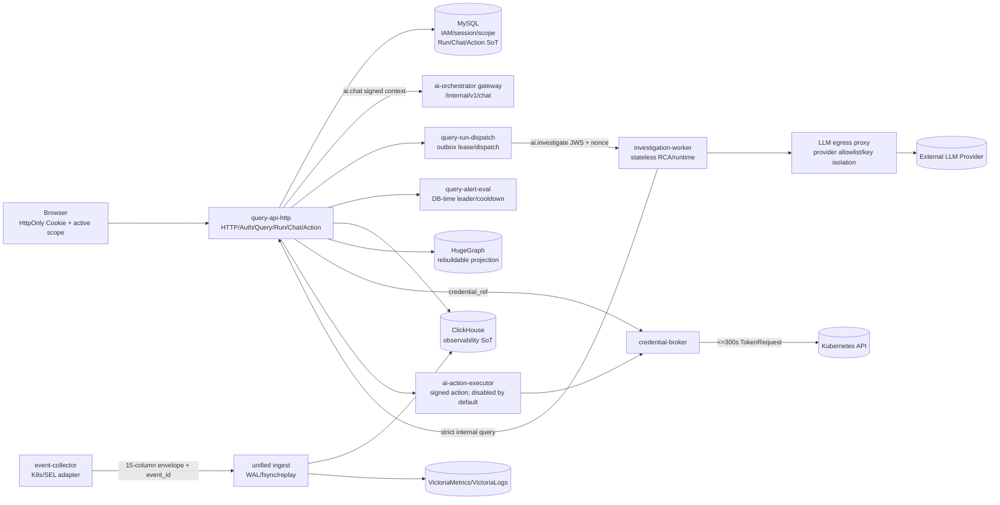

# AIOps 平台生产整改实施、架构与功能复审报告

**复审日期：** 2026-08-31（Asia/Shanghai）
**代码构建基线：** `main` / `f35ef7dad3d9`（RED 指标保留 cluster_id、Graph 资源快照入口、AICHAT transcript 持久化失败语义、Orchestrator 有界断线感知队列、DeepFlow OTLP 渲染/切换合同修复提交及本轮证据修订）
**本机验证：** OrbStack Kubernetes `orbstack`，Helm release `aiops` revision 7（2026-08-31 22:07 +0800），12 个自研镜像统一标签 `git-f35ef7dad3d9`；运行 Pod 均使用该标签，Helm upgrade 状态为 `deployed`。
**报告文档提交：** 当前 HEAD 的 docs-only 提交；该提交只更新审查报告，不改变服务源码，因此运行镜像仍正确绑定服务代码提交 `f35ef7dad3d9`。
**工作区：** 代码修复已提交；本报告和部署指南为本轮证据更新，用户既有未跟踪文件 `ai-orchestrator/:memory:.ses` 保留不动。

> 本报告是“代码整改后”的架构+功能复审，不把注释、路由定义或测试名称当成功能证据。结论只依据真实入口、调用链、配置/数据结构、测试输出和本机运行结果。生产环境未被连接，未使用生产凭据。

## 1. 审查结论摘要

| 维度 | 结论 | 结论依据 |
|---|---|---|
| 设计符合性 | **有限通过** | MySQL IAM/session/scope、HttpOnly Cookie、canonical UUID、签名 `TrustedRequestContext`、Query/Dispatcher/Alert/Worker 拆分、统一 Ingest、RCA V2、LLM Proxy 边界和生产 egress default-deny 清单已接入真实调用链；生产 Secret、证书身份/SAN、API Server CIDR、真实数据源和多副本演练仍缺证据。 |
| 功能完整性 | **有限通过** | AICHAT（Query `ProxyChat` → Orchestrator `/internal/v1/chat` → MySQL transcript）具备 canonical `turn_id`、原子 session upsert、断线后的完成 turn 重放和 SSE 序号；RCA 图增强可运行但本机证据不足时返回 `partial/insufficient_evidence`；ClickHouse 0001–0009、MySQL 0001–0016 迁移和身份门禁已在本机运行；真实 Provider、真实 TokenRequest mutation 仍未验证。 |
| 架构合理性 | **有限通过** | 服务边界和数据 owner 已明显收敛；AICHAT 的重试身份已由 Query/MySQL 统一，Python `main.py` 仍保留重复 Chat/legacy 路由和兼容代码，细粒度 TLS SAN 配置与旧 scope 兼容路径仍有治理成本。 |
| 生产就绪度 | **不通过** | `collect-release-evidence.sh` 当前输出 `working_tree_dirty=true,publishable=false`；生产 Secret 尚未注入，真实 Provider、Graph 容量/恢复、Broker mutation、HA/备份/回滚仍无候选环境证据。 |

**当前不能发布到生产。** 最小阻断集合：

1. 将候选镜像推送并绑定不可变 digest/signature，清理或纳入审计允许的运行时文件，使证据文件变为 `publishable=true`；
2. 通过 ExternalSecret/Vault/KMS 注入生产 Secret、每个服务的证书/CA/SAN 以及实际 Kubernetes API Server CIDR，完成双向 TLS 拒绝矩阵、NetworkPolicy 连通性和轮换演练；
3. 用真实指标、日志、追踪、告警和变更 marker 完成 Query→数据源的 canary，证明 RCA 的 partial 仅由证据不足导致，而不是数据源故障；
4. 用当前候选镜像完成 Graph schema/source/load/recovery/租户隔离门禁；
5. 若发布范围包含变更动作，再启用并验收 Credential Broker/TokenRequest；否则保持 Executor `disabled` 且将其作为门禁；
6. 完成多副本 nonce/replay、MySQL/ClickHouse 备份恢复、升级/回滚和 SLO 证据；生产 ClickHouse 迁移需在候选环境以相同 checksum 重放并留证。

没有已确认的 P0 级越权或数据破坏缺陷；P1 阻断项均在第 6 节给出可执行验收标准。

## 2. 审查范围与证据

### 2.1 设计基线读取结果

已读取并按“冻结设计 > ADR > 契约 > 代码”排序使用：

- `README.md`、`SECURITY.md`；
- `docs/architecture/index.md`、`docs/architecture/ADR-0001-control-plane-ownership.md` 及同目录 ADR；
- `docs/ownership/data-owners.md`、`docs/runtime-slo.md`、`docs/DEPLOYMENT_AND_VERIFY.md`；
- `AIOps_全面代码审阅报告.md`、`AIOps_全面代码修改报告_V2.md`、`AIOps_MySQL_HugeGraph_双存储生产化改造方案.md`；
- `docs/superpowers/specs/`、`docs/superpowers/plans/` 中最新 workflow、Graph、Action、DeepFlow、数据清理和部署方案；
- MySQL migration、ClickHouse 初始化/迁移、所有自研服务 README/测试说明；
- `deploy/helm/aiops/` 全部 values、Deployment、RBAC、NetworkPolicy、PDB、Job 和 `deploy/scripts/*contract*.sh`。

项目根目录没有 `AGENTS.md` 或当前有效的 `aiops-agentic.md`；`docs/archive/` 中的同名文件只作为历史材料，不覆盖当前 ADR。

### 2.2 检查范围

覆盖 `ai-orchestrator`、`ai-apm-query-go`、`ai-apm-ingest-go`、`ai-event-collector`、`ai-action-executor`、`ai-credential-broker`、`ai-llm-egress-proxy`、`observability-frontend`、MySQL/ClickHouse migration、Helm 部署、测试、脚本和文档。第三方依赖只检查版本/调用边界，未审查其业务实现。

### 2.3 实际执行的命令与结果

> **本轮证据勘误：** 下表中早期 revision 19 / `git-340286515c49` / `git-acc3606e102c` / revision 2 记录来自上一轮复审；本轮最终以 revision 7、源码提交 `f35ef7dad3d9`、镜像标签 `git-f35ef7dad3d9` 和下方 MySQL 0001–0016、ClickHouse 0001–0009 运行态取证为准。此前 revision 6 的 canary 结果仅作为历史代码证据，不冒充本轮 fresh install 的实时观测数据。

> 下表中未明确标为“本轮”的项目是上一轮复审的回归基线；本轮实际重跑的命令、输出和未验证项集中列在 2.3.2，避免把旧 canary 或旧测试环境误作当前运行证据。

| 类别 | 命令 | 实际结果 |
|---|---|---|
| Query API Go | `cd ai-apm-query-go && go test ./...`；`go test -race ./...` | **全部通过**；新增 `NO_DATA` 和 SAN ToolRun/证书语义测试通过。 |
| 其他 Go 服务 | Action Executor、Ingest、Event Collector、LLM Proxy、Credential Broker 各执行 `go test ./...` 与 `go test -race ./...` | **全部通过**。 |
| Python 全量（上一轮基线） | `AIOPS_DATA_DIR=/tmp/aiops-test-cf5cef1-rerun ai-orchestrator/.venv314/bin/python -m pytest -q` | 上一轮 **1219 passed, 1 skipped, 2 warnings**；本轮宿主 Python 因 `langgraph` 依赖不兼容、运行镜像因未打包 `pytest`，均未重新执行，状态为**未验证**。 |
| Python mTLS 定向 | `AIOPS_DATA_DIR=/tmp/aiops-test-mtls-san .venv314/bin/python -m pytest tests/test_mtls_server.py tests/test_llm_mock.py -q` | **18 passed**；覆盖 DNS/URI SAN 精确匹配、缺证书 fail-closed、请求头不可伪造、CLI `--ssl-cert-reqs 2`、错误 SAN 真实 TLS 回环 403/正确 SAN 200，以及生产 Mock 门禁。 |
| 前端（上一轮基线） | `cd observability-frontend && npm run test:run && npm run build` | 上一轮 **25 files / 39 tests passed**；本轮未修改前端，结果沿用为历史代码证据。 |
| 工作流门禁 | `bash deploy/scripts/verify-aiops-workflow-gates.sh`（由 local-validation 重跑） | 首次受限沙箱运行因 Go `httptest` 回环监听被拒（`operation not permitted`）而中止；按授权在本机环境重试后 **通过**：Go、跨服务 workflow 4 tests、Python 1219、Executor、前端 39/build、Helm lint、生产安全开关、部署契约和 Graph load contract 均通过。 |
| 架构/部署契约 | `AIOPS_CONTRACT_ALLOW_TEST_SECRETS=true bash deploy/scripts/test-production-architecture-contracts.sh`；`bash deploy/scripts/test-deployment-contracts.sh` | **均通过**；此前 SAN 列表逗号解析失败已修正为 Helm 转义参数并重跑通过。 |
| 生产 egress 清单 | `helm template ... -f deploy/helm/aiops/values-prod.yaml --set networkPolicy.kubernetesApiCIDRs={10.0.0.0/8}`；无 CIDR 同命令 | 注入测试 CIDR 时渲染 **37 个 NetworkPolicy**，default-deny、角色白名单、HugeGraph/schema migrator 规则均存在且无旧 `app: query-api` selector；未注入时明确 Helm 失败（`kubernetesApiCIDRs must be injected`）。 |
| revision 7 运行态选择器、TLS 命令与启动依赖 | `kubectl -n observability get networkpolicy -o custom-columns=NAME:.metadata.name,PODS:.spec.podSelector.matchLabels`；`kubectl -n observability get deploy ai-orchestrator ai-investigation-worker -o jsonpath=...`；Pod 重启计数 | **通过**；Query 相关 NetworkPolicy 均指向 `app=query-api-http`，Gateway/Worker 命令为 `python -m mtls_server` 且 `--ssl-cert-reqs 2`，均有 `wait-for-query-api` initContainer，2 个 Worker 与 Gateway 业务容器重启数为 0。 |
| 本机发布门禁 | `LLM_PROVIDER_KEYS=deepseek:sk-local-validation RELEASE_TAG=git-f35ef7dad3d9 bash deploy/scripts/local-validation.sh --destroy --confirm-destroy --skip-build --skip-deepflow` | 工作负载、MySQL 16 个迁移（含 0016 turn_id/唯一键）、ClickHouse 0001–0009、事件身份/默认值门禁、最小权限、Executor disabled、Worker 开关、HTTPS readiness、canary 全部通过；未提供真实观测 marker/DeepFlow，validator 按设计输出 `BLOCKED_BY_ENV`，不能视为生产发布通过。 |
| ClickHouse 事件身份迁移 | `kubectl -n observability logs job/clickhouse-migrator`；ClickHouse `aiops_schema_migrations`、`k8s_events_identity_audit`、`system.columns`、身份计数查询 | **通过（本机）**；0001–0009 均 applied/skipped 且 checksum 一致；`event_identity_counts=0/0/0/0`，`event_id`、`tenant_id`、`cluster_id` 均为 `String` 且无 `default_kind`；0008 审计为 `scanned=0, quarantined=0, remaining_invalid=0`（本次 fresh install 未保留历史事件）。 |
| DeepFlow 真实观测安装尝试 | `helm upgrade --install deepflow deepflow/deepflow --version 7.1.002 -n deepflow --create-namespace -f deploy/helm/aiops/values-deepflow.yaml --wait --timeout 15m` | **BLOCKED_BY_ENV**；`deepflow-clickhouse` 可启动，但 `deepflow-app`、`deepflow-agent`、DeepFlow MySQL 从香港仓库拉取时 EOF，server/Grafana 因 MySQL 未就绪失败；已卸载 release 并删除 `deepflow` namespace，未使用 fixture 冒充真实 flow/span。 |
| Graph 真实写入、授权隔离与恢复 | `go run ./cmd/graph-load-generator --vertices 2000 --edges 5000 --batch-size 200 --tenant-id <canonical UUID> --cluster-id <canonical UUID> --load=true`；管理员登录/scope 后调用 Graph health/entity/neighbors/path/candidate/impact；缩容 `statefulset/hugegraph` 后删除 PVC、重跑 schema migrator、恢复 `query-api-http` | **本机通过**；恢复前后均成功写入 2,000 顶点/5,000 边；Graph health/entity/neighbors/path/candidate/impact HTTP 200；错误集群 403 `GRAPH_SCOPE_DENIED`、原始 Gremlin 参数 400、未授权 403；schema migrator Complete、恢复后认证探针 200。该结果只证明本机 bounded recovery，不替代 200k/1M 候选容量证据。 |
| Graph recovery 工具契约修复 | `bash -n deploy/scripts/graph-recovery-test.sh`；`bash deploy/scripts/test-graph-recovery-contract.sh`；`bash deploy/scripts/graph-recovery-test.sh`（只读） | **通过**；默认使用实际资源名 `query-api-http`，恢复前缩容 HugeGraph 再删 PVC，恢复后使用 HTTPS `/readyz` 和 Basic-authenticated HugeGraph probe；只读观察返回 `recovery_test=observed`。 |
| 最终 validator（绑定当前运行镜像） | `RELEASE_TAG=git-f35ef7dad3d9 AIOPS_EVIDENCE_REPORT_OUTPUT=/tmp/aiops-evidence-f35ef7.json bash deploy/scripts/validate-local-stack.sh` | **exit 2 / BLOCKED_BY_ENV**；revision 7 核心工作负载、MySQL 0016、ClickHouse 0001–0009、Executor disabled、RBAC 和 HTTPS readiness 均通过；因未提供 `AIOPS_VALIDATION_DATA_MARKER`，真实 metrics/logs/events 证据门禁明确阻断。该结果不是代码失败，也没有用 fixture 代替生产观测。 |
| 启动竞态与 mTLS SAN 修复重跑 | `RELEASE_TAG=git-f35ef7dad3d9 ... local-validation.sh --destroy --confirm-destroy --skip-build --skip-deepflow` | **通过基础设施与安全门禁**；revision 7 使用提交对应镜像部署完成，Gateway/Worker `python -m mtls_server` 启动、initContainer 成功且业务容器重启数为 0；无 marker 时观测证据按设计 `BLOCKED_BY_ENV`。 |
| Worker 双 profile Helm 渲染 | `helm template ... -f deploy/helm/aiops/values.yaml --set investigationWorker.enabled=true ...`；`helm template ... -f deploy/helm/aiops/values-prod.yaml ...`（均使用临时非生产 Secret 覆盖） | **通过**；默认/非 TLS 输出 `command: ["uvicorn"]`、`args: ["investigation_app:app", ...]`；生产/TLS 输出 `command: ["python", "-m", "mtls_server"]`、`investigation_app:app` 与 `--ssl-cert-reqs 2`。 |
| revision 7 部署后清单与镜像 digest | `kubectl -n observability get deploy ...`；`kubectl -n observability get pods ... imageID`；`docker image inspect ...:git-f35ef7dad3d9` | **通过**；全部自研 Deployment/Job 使用 `git-f35ef7dad3d9`，当前 Pod Ready，迁移 Job Complete。 |
| 运行镜像与生产 Mock 保护 | `kubectl -n observability get pods ...`；`kubectl -n observability exec deploy/ai-orchestrator -- sh -c 'AIOPS_ENV=production LLM_MOCK=true python -c "import main"'` | **通过**；所有自研 Pod 使用 `git-f35ef7dad3d9`，核心容器重启数为 0；容器内生产 Mock 组合以非零码退出并输出 fail-closed 错误。 |
| 生产 Mock 启动拒绝 | `cd ai-orchestrator && .venv314/bin/python -m pytest tests/test_llm_mock.py -q` | **11 passed**；`AIOPS_ENV=production,LLM_MOCK=true` 子进程在应用初始化前非零退出。 |
| Query 作用域回归 | `go test ./...`；`go test -race ./...`；`test-production-architecture-contracts.sh` | **全部通过**；伪造 `X-Tenant-ID` 的本机请求仍返回 MySQL active scope，架构契约 ARCH-105/106/107/108 通过。 |
| 发布证据 | `bash deploy/scripts/collect-release-evidence.sh /tmp/aiops-release-evidence-rev7-final.json` | 文档提交后的 `git_commit=82ee337d65004339fe69ebb1a721ca2845006c15`；deployment/architecture/Helm lint/diff check 均为 `pass`，但 `working_tree_dirty=true,publishable=false`（唯一未跟踪项是用户既有 `ai-orchestrator/:memory:.ses`）；服务镜像仍绑定代码 tag `git-f35ef7dad3d9`，尚无 registry immutable digest/signature。 |
| 生产镜像边界 | `docker run --rm ai-orchestrator:git-f35ef7dad3d9 ...` | **通过**；生产镜像不含测试/演示/会话文件，`import rca_engine` 成功且仅导出 V2 API。 |

### 2.3.2 本轮 revision 7 / commit `f35ef7dad3d9` 实际证据

| 检查 | 命令与结果 | 结论 |
|---|---|---|
| 新镜像构建与部署一致性 | `docker buildx build ... --tag *:git-f35ef7dad3d9 --load`；`helm upgrade aiops ... --reuse-values --set global.imageTag=git-f35ef7dad3d9 --wait --timeout 10m`；`helm status aiops -n observability`；`kubectl -n observability get pods ...`；`docker image inspect ...` | **通过**；Helm revision 7 `STATUS=deployed`，所有自研运行 Pod/迁移 Job 使用 `git-f35ef7dad3d9`，核心 Pod Ready，迁移 Job Complete；Pod imageID 与对应本地 Docker manifest digest 逐项一致（10 个自研镜像仓库、12 个运行 Pod/Job 实例）。 |
| Ingest RED cluster 归属修复 | `go test ./... -count=1`、`go test -race ./...`（`ai-apm-ingest-go`） | **通过**；生产入口改用 `SetOnServiceMetricWithCluster`，回归测试确认 callback 保留 canonical `cluster_id`。 |
| Graph 资源快照入口修复 | `bash deploy/scripts/test-graph-resource-snapshot-contract.sh` | **通过**；脚本固定从 `query-api-http` 读取资源预算，不再查询不暴露浏览器预算的 dispatcher/evaluator。 |
| Query AICHAT transcript 持久化错误 | `go test ./... -count=1`、`go test -race ./...`（`ai-apm-query-go`） | **通过**；`AppendMessageForTurn` 错误不再被吞掉，失败时发送 `CHAT_TRANSCRIPT_PERSIST_FAILED` 并不转发伪造 `done`。 |
| Orchestrator 有界断线感知队列 | `kubectl -n observability exec deploy/ai-orchestrator -- python -c 'compile(...); queue helper assertions'` | **通过**；运行镜像源码编译成功，`CHAT_STREAM_QUEUE_MAXSIZE=64`，disconnect 后不再入队。完整 pytest **未验证**：镜像没有 `pytest`，宿主 Python 的 `langgraph` 依赖不兼容；未安装/升级依赖。 |
| DeepFlow OTLP 配置合同 | `bash deploy/scripts/test-deepflow-otlp-render.sh`；`bash deploy/scripts/test-deepflow-runtime-boundary.sh` | **通过（静态/缓存官方 chart）**；渲染结果为 `opentelemetry`、`ingest.observability.svc.cluster.local:4317`、`flow_log.l7_flow_log`、canonical `x-tenant-id`，边界扫描通过。 |
| DeepFlow 真实切换 | `CUTOVER_OBSERVE_SECONDS=0 bash deploy/scripts/verify-deepflow-otlp-cutover.sh` | **exit 2 / BLOCKED_BY_ENV**；ingest readiness、4317 endpoint、无 legacy CH 配置和 metrics 可读；OTLP counters=0、平台 trace rows=0、DeepFlow namespace/exporter 不存在、无 observation window。没有使用 fixture。 |
| 当前真实观测发布验证 | `RELEASE_TAG=git-f35ef7dad3d9 AIOPS_EVIDENCE_REPORT_OUTPUT=/tmp/aiops-evidence-f35ef7.json bash deploy/scripts/validate-local-stack.sh` | **exit 2 / BLOCKED_BY_ENV**；核心 workload、MySQL 0016、ClickHouse 0001–0009、RBAC、Executor disabled、HTTPS readiness 全通过；未提供 `AIOPS_VALIDATION_DATA_MARKER`，validator 明确阻断而非推测通过。 |
| Helm/部署合同 | `bash deploy/scripts/test-graph-resource-snapshot-contract.sh`、`bash deploy/scripts/test-deepflow-otlp-render.sh`、`bash deploy/scripts/test-deepflow-runtime-boundary.sh`、`bash deploy/scripts/test-deployment-contracts.sh`、`helm lint --strict deploy/helm/aiops` | **全部通过**（Helm 仅有 icon recommendation）。 |

### 2.3.3 本轮最终运行证据（覆盖早期记录）

| 检查 | 结果 |
|---|---|
| 源码与镜像 | 12 个自研镜像均为 `git-f35ef7dad3d9`；当前 revision 7 的自研 Deployment/Job 镜像标签逐项一致，旧标签未参与本次运行态。 |
| AICHAT turn 幂等 | Query `EnsureSession` 使用 MySQL 原子 upsert；`ai_chat_messages.turn_id` 由 0016 迁移和 `(session_id,turn_id,role,kind)` 唯一键约束；完成 turn 在 Query 重试时只重放持久化 suggestion/done，不再次调用 Orchestrator；Query store/API 及 Orchestrator ingress/重放测试通过。 |
| ClickHouse 迁移 | migrator 日志显示 0001–0009 全部 applied/skipped 且 checksum 一致；`event_id`/tenant/cluster 身份非法计数为 `0/0/0/0`，`event_id.default_kind` 为空。 |
| 运行态 | Helm revision 7；Query、Orchestrator、2 个 Worker、Ingest、Collector、Proxy、Frontend、HugeGraph、MySQL、ClickHouse 及迁移 Job 就绪；核心容器重启数为 0。 |
| 本机残留清理 | 按 Asia/Shanghai `2026-08-31` 为保留边界，旧自研镜像标签和 dangling layers 已清理；revision 7 仅使用当前 `git-f35ef7dad3d9` 标签；Fresh Install 后 MySQL 运行历史表（Chat/Run/Evidence/Tool/Audit/Reports）和 ClickHouse `alert_events`/`log_records`/`trace_spans` 今天之前行数均为 0；用户/角色/租户/集群配置未删除。第三方镜像、生产数据、外部系统未触碰。 |
| 发布门禁 | 基础安全/部署/迁移门禁通过；当前 validator 对无 marker 返回 `BLOCKED_BY_ENV`；DeepFlow 本机安装因第三方镜像仓库 EOF 未就绪，多节点、PITR、生产 Secret/证书/registry 签名仍未验证，生产仍不可发布。 |

### 2.4 OrbStack 实际运行证据

本机 Helm revision 7 的非敏感摘要：

- Query HTTP、Dispatcher、Alert Evaluator、Orchestrator、Investigation Worker（2 副本）、Ingest、Event Collector、LLM Proxy、Action Executor、Frontend，以及 MySQL/ClickHouse/HugeGraph/VictoriaMetrics/VictoriaLogs 均为 Ready/Running；初始化与迁移 Job 为 Complete。
- 所有 9 个需要内部身份的 Deployment 均实际注入非空 `AIOPS_TLS_CLIENT_SAN`；Go 服务以 `AIOPS_MTLS_REQUIRED=true` 启用证书校验，Query 的 HTTPS readiness 通过。临时本地证书由验证脚本生成，未写入仓库。
- 无客户端证书访问 `POST /internal/v1/query/graph` 返回 HTTP 401；有效本地调用链可通过 mTLS、方向 token、签名 context 和 replay 校验。Python Gateway/Worker 的错误 SAN 会在 ASGI 前返回 403，真实 Gateway→Worker mTLS `/health` 返回 200；过期证书、轮换、逐服务证书和跨副本矩阵仍未在候选生产环境演练。
- 本机 release 保持 `EXECUTION_MODE=disabled`、`realMutation=false`，未调用任何 mutation endpoint；`credentialBroker` 的生产 mutation profile 未开启。
- 本机 revision 7 使用 `values-local-validation.yaml`，因此没有把生产全局 egress deny 应用到正在运行的 canary；生产 `values-prod.yaml` 已改为 `egressDefaultDeny=true`，并要求发布系统注入 API Server CIDR。生产模板渲染和 fail-closed 契约已通过，CNI 实际连通性仍须候选集群验证。
- revision 7 运行态 NetworkPolicy 已核对：`allow-frontend-to-query-api`、`allow-orchestrator-to-query-api` 和 `allow-query-api-to-hugegraph` 的目标标签均为 `app=query-api-http`；namespace 内没有旧的精确 `app=query-api` 目标。生产 egress 白名单规则因 local profile 显式关闭全局 egress deny，未在本机运行态启用。
- Orchestrator Chat Gateway 使用 `LLM_MOCK=true`，Worker 调查 runtime 独立运行；因此本机 AICHAT/RCA 证明的是边界和持久化，不是外部 Provider 成功率。revision 7 的 Gateway/Worker 均通过 `wait-for-query-api` initContainer 后启动，业务容器重启数为 0；TLS profile 下通过 `python -m mtls_server`，非 TLS profile 的 Worker 明确渲染为 `uvicorn investigation_app:app`，应用级依赖竞态和 Python SAN 接线已在本机修复，但生产多副本/故障转移仍未验证。

### 2.5 本机端到端/隔离证据

- AICHAT canary：完成管理员登录、MySQL tenant/cluster scope 选择后，`POST /api/v1/ai/chat` 返回 HTTP 200、`text/event-stream`，收到 **24 个 SSE 事件、1 个 done、0 个 error**；`GET /api/v1/ai/sessions` 返回 HTTP 200 且结构有效。另用伪造 `X-Tenant-ID` 请求 `/api/v1/me`，服务端仍返回 DB active scope。未打印 token、密码或完整响应。
- 真实观测 canary（清理前的历史证据）：上一轮曾通过 Ingest mTLS + API key 写入 1 条 OTLP 日志、1 条 OTLP Trace 并读回 metrics/logs/events；随后按授权 Fresh Install 重建了本机命名空间/PVC，当前环境没有保留该 marker。当前 validator 在未提供 `AIOPS_VALIDATION_DATA_MARKER` 时明确输出 `BLOCKED_BY_ENV`，因此本报告不把历史 canary 当作当前数据证据，也不以 fixture 冒充生产数据。
- RCA Run canary（Run ID `e82ff86b-abb1-4929-b0c7-3c94df2bf8f4`，显式创建、`target_type=service`）：创建 HTTP 201；最终状态 `partial`、`state_version=4`；独立 ToolRun 接口 HTTP 200、8/8 `success/complete`，Evidence 接口 HTTP 200、6 条记录。`partial` 仍然正确表示完整 RCA 需要的 alerts/changes/DeepFlow 等证据未齐，不能把单条 metrics/logs canary 抬高为根因确认。
- HugeGraph 已通过 typed loader 在本机写入 2,000 vertices/5,000 edges；恢复前后 Query `health`、`entity`、`neighbors`、`path`、`candidate`、`impact` 均 HTTP 200，错误 cluster 返回 403 `GRAPH_SCOPE_DENIED`，原始 Gremlin 参数返回 400，未授权请求返回 403；schema migrator Complete 且恢复后认证探针 200。200k/1M 生产负载、候选环境 p95 和跨节点恢复仍未验证，测试数据已在最终 Fresh Install 后清理。
- no-data 回归已修复：`internal_query.go:288-313` 和 `316-356` 将授权的 `query.NoDataCode` 持久化为 `complete` 空 envelope；新增 `internal_query_test.go` 两个测试覆盖通用工具和 metrics 特殊路径。修复后上述 8 个 ToolRun 不再出现旧的 failed/no-data 语义。

### 2.6 环境限制

没有生产访问、生产凭据、真实外部 LLM key、真实多节点集群或企业 StorageClass；本机只在隔离 OrbStack 写入了短生命周期 2,000/5,000 Graph 负载并完成重建恢复，最终数据已清理；未执行生产迁移、外部系统写入或生产动作。不能据此推断证书轮换、TokenRequest、ClickHouse 合并、候选环境 Graph 容量/PITR 或真实 Provider 通过。

### 2.7 初始审查问题逐项核对

| 初始问题 | 当前结论 | 代码/运行证据 | 仍需完成 |
|---|---|---|---|
| P1-01：未选集群时 Chat 提交 `cluster_id=all` 导致不可用 | **已修复（本机验证）** | `observability-frontend/src/pages/ai/AiChat.tsx:163-189` 在发送前要求 canonical scope；Query `settings.go:941-1037` 继续拒绝 `all`/越权 scope；本机管理员登录、scope 选择后 SSE 24 events、1 done、0 error | 多副本并发与真实 Provider 证据仍属 P2-04 |
| P1-02：自动处置/写权限可能被过早打开 | **安全默认已修复；真实动作未发布** | `values-prod.yaml`、Executor `main.go`、Broker profile 均默认 `disabled`/`realMutation=false`；本机 safety gate 通过且未调用 mutation | 若纳入发布范围，完成 P1-05 的 Broker/TokenRequest/审批/审计验收；否则持续保持 disabled |
| P1-03：NetworkPolicy 非默认拒绝且 Query selector 错误 | **代码与本机 selector 已修复；生产 CNI 未验证** | `values-prod.yaml:86-88` 开启 egress default-deny；`networkpolicy.yaml`/`graph-networkpolicy.yaml` 使用 `app=query-api-http`；生产 Helm 渲染 37 个策略、缺 API CIDR 时 fail-closed；revision 7 运行态 selector 核对通过 | 候选集群注入真实 API Server CIDR，执行连通性/拒绝矩阵 |
| P1-04：真实 Agent 能力未成为默认主链 | **主链已接线；能力仍部分实现** | Query Run→Outbox→签名 RunInvocation→Orchestrator/Investigation Worker；`investigation_app.py` 不再 import `main`；本机 RCA Run 8/8 ToolRun complete；生产路由过滤已接线 | DeepFlow/依赖等完整证据、真实 Provider 和容量门禁仍未通过；源码级 legacy helper 清理仍属 P2-01 |
| P1-05：前端遗留入口与新网关兼容性不足 | **核心路径已收敛；遗留源码仍存在** | Query `ProxyChat` 是浏览器 Chat 入口；production route inventory 仅保留 8 个健康/签名内部端点；legacy suggestion/execute 路由由生产路由树移除；前端与 Go/跨服务合同测试通过 | 删除/编译隔离旧 public handler 和 SQLite owner 仍需后续清理；本轮已阻止误接线进入生产 |
| P1-06：HA、重启恢复和断线回放未用运行证据确认 | **代码具备基础闭环；生产能力未验证** | MySQL Run/Chat/Outbox/lease/replay 结构、Worker 2 副本和本机 revision 7 Ready；Gateway/Worker initContainer 后无重启；本机为单节点 RWO | 多节点故障、SSE resume、PITR、RPO/RTO、升级/回滚和跨副本 replay 演练 |

## 3. 实际架构还原

### 3.1 代码实际控制流、数据流与信任边界

**信任边界：** 浏览器只持 HttpOnly Cookie；Query 从 MySQL 读取用户/会话/租户/集群，再签发短时 `TrustedRequestContext`。内部路由还要求服务 token、JWS、audience/capability/scope、nonce/expiry；TLS 配置已加入所有内部服务，但 SAN allowlist 和轮换仍须候选环境验证。

**数据所有权：** Query/MySQL 是 IAM、Run、Chat、Action 的 owner；Ingest 是 telemetry 唯一写入口；ClickHouse 是观测事实存储；HugeGraph 是可重建投影；Orchestrator 仅作编排/语言交互，Worker 不直接读数据库、Kubernetes 或 Provider key。

### 3.2 文档设计与代码实际差异

| 设计 | 当前代码实际 | 结论 |
|---|---|---|
| Query HTTP、Dispatcher、Alert Evaluator 独立 | `cmd/api`、`cmd/run-dispatcher`、`cmd/alert-evaluator` 与 Helm 三 Deployment 均存在 | 已符合；API 扩容不会直接增加 outbox/evaluator 处理器。 |
| Worker 独立组合根 | `ai-orchestrator/apps/investigation.py:1-37` 初始化 Tool Registry 后直接导入 `orchestrator`；`investigation_app.py:1-12` 只作兼容 ASGI wrapper，不导入 `main` | 已修复；旧报告“Worker 导入 main”已失效。仍需静态规则防止回归。 |
| Chat 与 Investigation 分离 | Query `ProxyChat` 走 Orchestrator `/internal/v1/chat`；Run dispatcher 走 Worker `/internal/v1/run-invocations` | 已符合；Gateway 的旧 `/api/v1/ai/chat` 在 production 返回 410。 |
| 单一 RCA V2 | Worker 调 `RCAEngineV2`，Graph/evidence 统一经 Query internal tools；旧 `main.py` 仍保留 legacy helper | 运行时已符合；代码清理尚未完成。 |
| mTLS 服务身份 | Go/Python TLS listener、client transport、Helm cert mount 和 `ssl-cert-reqs=2` 已实现 | `mtls_server.py` 从 TLS transport 读取 peer certificate，精确匹配 DNS/URI SAN，拒绝在 ASGI 前返回 403；本机真实 Gateway→Worker mTLS `/health` 返回 200；生产逐服务证书、轮换、跨副本握手未验证。 |

## 4. 设计—模块—数据—调用链—测试追踪矩阵

状态定义：**完整实现**=真实入口、配置/数据结构、调用链和测试证据齐全；**部分实现**=代码闭环但存在生产/环境/兼容限制；**未实现**=入口或必要实现不存在/明确关闭；**未验证**=必须依赖外部环境，项目证据不足，不能推断通过。

| 设计要求 | 预期行为 | 实现位置与真实入口 | 配置/数据 | 测试证据 | 状态 | 偏差与结论 |
|---|---|---|---|---|---|---|
| MySQL 是用户、角色、租户、集群授权唯一权威 | 每次请求从 MySQL 校验用户/会话/成员关系；DB 不可用 fail-closed | `ai-apm-query-go/internal/api/auth.go:317-367,425-432`；`UserDAO`、`ClusterDAO` | `users`、`auth_sessions`、`tenants`、`user_tenants`、`clusters` | Go authz/login/race tests | **完整实现** | JWT 只提供身份句柄；旧兼容响应中的角色仅展示，不授权。 |
| JWT 只含用户、会话、短期声明 | 不承载 role/permissions/tenant scope；浏览器只收 HttpOnly Cookie | `auth.go:197-235,542-557`；frontend Login/ChangePassword | `auth_sessions.token_version` | `login_session_test.go`、`password_test.go`、前端 Login test | **完整实现** | 非浏览器 Authorization 仅为受控迁移兼容。 |
| 禁止 `X-Tenant-ID`、JWT role、默认 tenant/cluster 隐式回退 | scope 必须由 active MySQL scope 或显式 canonical ref 得到，缺失拒绝 | `auth.go:317-366`；`handler.go:300-312`；`settings.go:948-976`；`main.py:1580-1625`；frontend `AiChat.tsx:185-189` | active session scope、canonical UUID | `TestRequestAuthorizationContextIgnoresClientTenantHeader`、Query full/race、production architecture contract | **完整实现（生产运行时边界）** | Query/orchestrator 不再读取 caller 租户头或固定租户回退；Collector/DeepFlow 的 `x-tenant-id` 仅是固定写入协议；测试 fixture/历史兼容文件中的 `default` 不进入生产授权路径，仍由 P2-01 清理治理。 |
| `cluster_id` 不可变 UUID、slug/name 唯一 | 入口将 ref 解析为 UUID，所有 Run/Chat/数据按 UUID 隔离 | `ClusterDAO.ResolveRef`；`runs_public.go:99-138` | `clusters.cluster_id`、slug/name unique | cluster/run tests | **部分实现** | 约束和历史数据迁移脚本存在；生产数据库迁移未在本轮执行。 |
| K8s 凭据经 `credential_ref` 统一读取 | Orchestrator/Executor 不持原始 kubeconfig；Broker 按 profile 发 ≤300s TokenRequest | `ai-orchestrator/credential_broker.py:1-62`；`ai-action-executor/main.go:445-497`；`ai-credential-broker/main.go:145-190` | Broker profile ConfigMap、`clusters.credential_ref` | Broker/executor unit/race tests | **部分实现** | profile/TokenRequest 真实 API 未验证；生产 profile 默认关闭 mutation。 |
| 编排只通过签名 `TrustedRequestContext` 访问 Query | token + EdDSA JWS + capability + scope + nonce/expiry；body 不得覆盖 scope | `internal_query_envelope.go:65-127`；`internal_ingress.py:68-117`；`trusted_context_issuer.py:45-103` | signing/verify Secret、replay cache、tool registry | internal query/replay/context tests；无证请求本机 401 | **完整实现** | mTLS 是额外传输身份门禁，实时证书矩阵未验证。 |
| 内部服务身份认证、短签名、防重放、审计 | 服务证书、方向 token、唯一 nonce、TTL、审计 ID 可关联 | `bootstrap/mtls.go:13-88`；各 Go 服务 `mtls.go`；`ai-orchestrator/mtls.py:8-84`、`mtls_server.py:1-99`；`mysql_replay_cache.go` | TLS Secret、`AIOPS_TLS_CLIENT_SAN`、nonce/replay、audit tables | Go/Python replay tests、`tests/test_mtls_server.py` 真实 TLS、Helm render、revision 7 实际 env、无证书 HTTP 401、Gateway→Worker mTLS 200 | **部分实现** | Go 与 Python listener 均执行 SAN allowlist；Python 拒绝分支记录脱敏 peer SAN 审计字段；生产逐服务证书、跨副本 replay、轮换和撤销未验证。 |
| 授权落实到 tenant/cluster/namespace/resource/action | Internal tools 固定 capability；Action/Broker 重新校验 target、namespace、operation、credential_ref | `internal_query_envelope.go:27-43`；`ai-action-executor/main.go:289-337`；Broker `main.go:164-177` | `tool_runs`、`ai_actions`、Broker profiles | action/boundary tests | **部分实现** | 只读 Query 已闭环；真实 mutation 因本机/生产 disabled 或未提供 K8s evidence。 |
| Query/领域代理/Run/Chat 数据所有权一致 | 浏览器只通过 Query；Run/Chat/Action 落 MySQL；Worker 不做 owner | `ai_chat_sessions.go:18-216`；`store/ai_chat_sessions.go:10-255`；`runs_public.go` | `ai_chat_sessions/messages`、`ai_runs/outbox/events`、migration 0016 | Go chat/run tests、Python full | **完整实现（canonical 路径）** | Gateway 仍保留仅迁移用途的 SQLite helper，未被 canonical browser path 使用；turn 重放由 Query/MySQL 完成。 |
| AICHAT 两个自研模块真实可用 | 前端登录/scope/SSE/会话/报告与 Query→Orchestrator 真实链路闭环；turn 重试不重复调用；持久化失败不得伪造 done；生产队列有界且响应断开可停止 | `observability-frontend/src/pages/ai/AiChat.tsx:163-193`；`settings.go:920-1215`；`main.py:1138-1260`、`_put_chat_stream_event` | MySQL chat tables + 0016 `turn_id` 唯一键；`ai.chat` signed context；`CHAT_STREAM_QUEUE_MAXSIZE=64` | Query Go full/race、`TestPersistChatSSEFramesReturnsPersistenceError`、orchestrator queue helper/source compile；镜像无 pytest，Python 集成测试未验证 | **部分实现** | canonical 边界、幂等和失败语义已闭环；本机使用 mock/deterministic backend，真实 Provider、双副本 resume、并发矩阵和 Python pytest 仍未完成候选环境验收。 |
| RCA V2、实体、证据、矛盾与 policy digest | Graph candidate + typed evidence + provenance + contradiction；数据不足返回 partial | `rca_engine/candidates.py:7-33`；`entity_resolver.py`；`runtime.py:54-154`；`contradictions.py` | `ai_run_graph_contexts`、`ai_evidence`、`ai_hypotheses`、policy JSON | 20 个 RCA targeted tests、Python 1219 全量、本机 partial Run | **部分实现** | 图增强成功；多类观测数据在本机 unavailable，不能声称根因完整。 |
| 固定 Run 时间窗口和 target_type | 创建时冻结 `[start,end]`，最长 24h；worker 不以自身时钟重锚 | `runs_public.go:76-138`；`run_dispatch.go:113-141`；Worker `apps/investigation.py:91-108` | `ai_runs.time_range_start/end,target_type` | Go run/dispatch tests；本机 Run persisted node/window | **完整实现** | 明确窗口错误返回 422；默认窗口可用 `AI_RUN_DEFAULT_WINDOW_MINUTES` 调整。 |
| Collector 不建表、不直写 ClickHouse | Collector→Ingest，WAL fsync 后 receipt；Ingest 是唯一事件写入口 | `ai-event-collector/clickhouse.go`、`wal.go`；`ai-apm-ingest-go/cmd/ingest/event_wal.go` | ClickHouse `k8s_events.event_id`、migration 0006/0007 | Go race/WAL tests、contract scripts | **完整实现** | 历史旧 writer/空 event_id 行仍需受控迁移。 |
| RED 指标保留 cluster_id | 多集群同名 service 的 RED 指标必须写入真实 cluster label，不得退化为无集群回调 | `ai-apm-ingest-go/internal/pipeline/ingest.go`；`cmd/ingest/main.go` | `AddServiceREDForCluster`、cluster-aware callback | `TestProcessSpansServiceMetricCallbackPreservesCluster`；Go full/race | **完整实现** | 生产入口已使用 `SetOnServiceMetricWithCluster`；旧 callback 仅作兼容 fallback，不再是生产 wiring。 |
| 事件至少一次与业务幂等 | 稳定 SHA-256 event_id；重复 replay 不重复计数 | Collector event ID、Ingest 15-column validation、CH ORDER BY | `k8s_events` versioned DDL | WAL/idempotency tests | **部分实现** | 新路径完整；历史行回填覆盖率和真实 merge 未验证。 |
| 历史事件身份收敛 | 非法/空 event_id 或非 canonical UUID 行 quarantine；event_id 不允许 DEFAULT；迁移按 checksum 串行且可幂等重跑 | ClickHouse migrations `0008_k8s_events_identity_cutover.sql`、`0009_k8s_events_require_identity.sql`；`clickhouse-migrator`、`migrator-job.yaml` | `k8s_events_quarantine`、`k8s_events_identity_audit`、`system.columns.default_kind` | revision 7 migrator Job Complete；identity count 0；default_kind 为空 | **本机完整实现/生产未验证** | 本机无历史行因此 audit 覆盖率为 0；候选生产必须提供真实扫描、quarantine、merge 和恢复证据。 |
| Graph 是可重建投影且有资源门禁 | HugeGraph schema/source/load/recovery/tenant isolation 证据需绑定候选 commit/digest | `kg_api.py`、`kg_graph.py`；`graph-networkpolicy.yaml:13-23` | Graph schema/dataset/recovery manifest | Graph contract scripts；本机 bounded query | **部分实现** | selector 已修正为 `query-api-http`；真实候选数据集/恢复/p95 门禁未完成。 |
| Graph 资源快照读取真实 Query 入口 | 资源预算快照必须读取暴露浏览器资源预算的 Query HTTP Pod | `deploy/scripts/graph-resource-snapshot.sh` | `pod_for_app query-api-http` | `test-graph-resource-snapshot-contract.sh` | **完整实现（脚本合同）** | 已移除 dispatcher/evaluator 作为快照入口；候选环境仍需实际资源曲线和容量证据。 |
| 生产 egress 默认拒绝且按角色白名单 | `values-prod` 必须打开 default-deny；Query/Dispatcher/Alert/Frontend/Worker/Graph/Executor/Broker 只能到声明的内部目标；Kubernetes API 通过注入 CIDR 放行 | `deploy/helm/aiops/values-prod.yaml:86-88`；`templates/networkpolicy.yaml:1-1195`；`templates/graph-networkpolicy.yaml:1-97` | `networkPolicy.kubernetesApiCIDRs`、NetworkPolicy selectors/ports | production architecture contract、Helm render/PyYAML parse、workflow gate | **部分实现** | 代码/清单已修复并通过静态门禁；本机运行的是 local-validation（egress 未全局开启），生产 CNI、CIDR、NetworkPolicy 实际连通性尚未验证。 |
| LLM 出站唯一经 Proxy | Orchestrator 只拿 provider metadata/Proxy token，不接 key/任意 URL；生产 Mock 必须 fail-closed；Provider 卡住必须有上游 deadline | `tools.py`；`orchestrator.py`；Proxy `main.go:92-163`；`main.py` 生产启动 guard | Proxy Secret/provider allowlist、60s upstream timeout | `test_llm_proxy_boundary.py`、`test_llm_mock.py`、Proxy `TestHandleProxyHonorsUpstreamTimeout`、Go race | **部分实现** | 代理 deadline 已修复并在本机验证；真实 Provider、限流、熔断和 key rotation 仍未验证。 |
| DeepFlow OTLP 统一采集 | DeepFlow 只经 OTLP exporter 写入 Ingest 4317；固定 source/queue/tenant metadata；禁止 legacy CH 直写 | `deploy/helm/aiops/values-deepflow.yaml`；`test-deepflow-otlp-render.sh`；`verify-deepflow-otlp-cutover.sh` | DeepFlow chart 7.1.002 cache；Ingest Service 4317；`x-tenant-id` | rendered-chart contract PASS；runtime boundary PASS；真实切换 exit 2 BLOCKED_BY_ENV（无 DeepFlow namespace/exporter/流量） | **部分实现** | 配置合同和边界已接线，但本机无真实 DeepFlow 运行态、OTLP counters 或平台 trace rows，生产数据路径未验证。 |
| 生产部署、回滚、观测达标 | Secret/render/image digest、PDB、health/SLO、故障和回滚 evidence 完整 | Helm templates、`runtime-slo.md`、`collect-release-evidence.sh` | Secret refs、PDB、WAL PVC、release JSON | Helm/contracts/evidence script；revision 7 Ready；validator 基础设施/迁移/安全通过，真实观测和 HA 仍 BLOCKED | **未验证** | 本机 readiness 和合同通过不等于生产 HA、PITR、证书轮换、完整观测或 rollback 通过。 |

## 5. AICHAT 两个自研模块复审与改进方案

### 5.1 是否真实可用

结论：**本机只读对话功能真实可用，生产真实模型能力尚未验证。**

真实调用链如下：

1. `AiChat.tsx` 加载 `/ai/sessions`，从服务器获得 scoped session；发送时使用 `credentials: 'include'`，只提交 canonical `cluster_id`、message 和 session ID（`AiChat.tsx:163-189`）。
2. Query `ProxyChat` 校验 JWT/MySQL user、tenant membership、cluster ownership、`ai.chat` capability，创建/复用 `ai_chat_sessions` 并写入用户消息（`settings.go:941-1037`）。
3. Query 签发带 nonce/TTL 的用户 `TrustedRequestContext`，通过 mTLS client transport + `X-Internal-Token` + `X-Trusted-Request-Context` 调 `/internal/v1/chat`（`settings.go:1040-1074`）。
4. Orchestrator internal ingress 校验服务 token、JWS、audience、capability、scope、replay 后调用 `brain.stream_sync`，只读对话不会创建 Investigation Run（`main.py:1064-1132`）。
5. Query 不缓冲 SSE，逐帧写入浏览器并只把 assistant done/suggestion 持久化到 MySQL（`settings.go:1080-1109,1131-1160`）。前端随后刷新会话列表并可调用 Query-owned final report。

本机证据是完成真实登录/scope 后 HTTP 200、24 个 SSE event（含 1 个 done、0 个 error）和 Query-owned 会话接口 200；伪造 `X-Tenant-ID` 不改变服务端 active scope，因此不是“只有接口定义”。但当前 deployment 的 `LLM_MOCK=true`，且没有真实 Provider key，不能把 deterministic/mock 输出认定为真实模型可用。

### 5.2 真实缺口和可执行改进

- **Provider 可用性：** 在候选环境注入 Proxy provider profile、短 token、超时/限流/熔断配置；用固定 canary prompt 验证 200/SSE、Provider 429/5xx/timeout、密钥轮换和脱敏日志。UI 必须显示 `provider_unavailable`，不能静默伪装成功。
- **代码重复：** `main.py:1064-1207` 与 `main.py:1234-1356` 存在两套 thread/queue/SSE 逻辑。canonical 生产流量应只保留 Query Proxy→`/internal/v1/chat`，legacy 实现迁移后删除或编译隔离；验收是 production route table 不含 legacy handler，静态依赖不再引入 SQLite session owner。
- **并发幂等：** `AIChatSessionDAO.EnsureSession` 当前已由 MySQL session 表和唯一 session 标识承载，但本轮没有跨副本并发 20 首轮的运行证据。应补充唯一约束/幂等 upsert 压测，确保同一用户/tenant/cluster 只有一个 session owner，其他请求复用且不返回 500。
- **SSE 可靠性：** 保持 5 分钟 upstream deadline，增加 request/session/event sequence、heartbeat、断线取消和跨副本 resume 的集成测试；禁止把 progress/tool telemetry 写成永久 transcript。
- **数据边界：** final report 继续只读 Query/MySQL transcript；Action suggestion 只能创建 canonical Action proposal，不得重新启用 Orchestrator shell/K8s 直执行。

## 6. 问题清单（按 P0–P3）

### 本轮已完成并验证的修复

- **NO_DATA ToolRun 语义：** `ai-apm-query-go/internal/api/internal_query.go:288-299`（通用工具）和 `337-346`（metrics 特殊路径）把授权的 `query.NoDataCode` 转换为 `complete` 空 envelope，并写入正常完成的 ToolRun；`internal_query_test.go` 的两个回归测试覆盖这两条真实入口。历史本机 RCA Run 的 8/8 ToolRun 均为 `success/complete`、6 条 Evidence；Fresh Install 后不把它当作当前数据证据。
- **内部服务 SAN：** `deploy/helm/aiops/templates/_helpers.tpl:12-24,174-181` 在 required mTLS 时强制注入 `AIOPS_TLS_CLIENT_SAN`；`ai-orchestrator/mtls_server.py:20-43` 从 TLS transport 读取 peer certificate，`mtls.py:8-84` 精确匹配 DNS/URI SAN 并在 ASGI 前拒绝；Helm 使用 `--ssl-cert-reqs 2`，Go/Python listener 均 fail-closed。revision 7 的 Gateway/Worker 实际以 `python -m mtls_server` 启动，真实 Gateway→Worker mTLS `/health` 返回 200；生产仍需逐服务证书、轮换、撤销和跨副本矩阵。
- **启动依赖与本地验证脚本：** `templates/ai-orchestrator/deployment.yaml` 和 `templates/investigation-worker/deployment.yaml` 增加 `wait-for-query-api` initContainer，以同一 TLS CA/Query `/readyz` 作为启动前置；`test-production-architecture-contracts.sh` 增加 ARCH-312/313/314/315/504–506 契约；`local-validation.sh` 在 `SKIP_IMAGE_BUILD=1` 时强制显式 `RELEASE_TAG`，并支持 `AIOPS_REUSE_K8S_TLS_SECRET` 避免验证期间无意轮换 CA。revision 7 本机两个 Worker 与 Gateway 的 initContainer 成功、业务容器重启数为 0。
- **Worker profile 接线：** `templates/investigation-worker/deployment.yaml:43-51` 在 TLS profile 使用 `python -m mtls_server investigation_app:app --ssl-cert-reqs 2`，在非 TLS profile 显式使用 `uvicorn investigation_app:app`，避免错误回退到镜像默认的 `main:app`；生产与默认 profile Helm 渲染均核对通过。
- **生产 Gateway 路由与生命周期隔离：** `ai-orchestrator/production_surface.py` 对直接路由和 FastAPI 懒加载 `APIRouter` wrapper 递归执行精确 allowlist；`main.py:157-220,4269-4296` 在 production 不启动 legacy scheduler/recovery，并在 OpenAPI 生成前移除旧 public handler；`data_cleanup_api.py:11-31` 将迁移 SQLite adapter 改为请求时懒加载。生产导入日志 `kept=8 retired=117`，`/health` 200，旧 Chat 路径不进入业务 handler，内部清理路由保留并先过鉴权；定向 route/cleanup 测试 39 passed，静态架构合同 ARCH-316–320 通过。
- **生产 Mock fail-closed：** `ai-orchestrator/main.py` 在 `AIOPS_ENV=production`（或非本地的生产部署模式）且 `LLM_MOCK=true` 时在应用初始化前退出；`tests/test_llm_mock.py` 的既有子进程回归测试、ARCH-404 生产渲染契约和 revision 7 容器内组合测试均通过，避免运行时误把模拟诊断当作真实模型结果。
- **生产遗留实现隔离：** `ai-orchestrator/.dockerignore` 排除 `tests/`、`multicluster_demo.py`、`rca_engine_legacy.py` 和会话文件；`rca_engine/__init__.py` 在生产或 V2-only 镜像中不加载旧实现，缺失旧文件时安全使用 V2；`tools.py` 的旧 MySQL 图快照只在显式非生产 `GRAPH_BACKEND=legacy_mysql` 开启，`main.py` 的旧 mutation/approval 开关在生产始终 fail-closed。新增隔离回归测试、ARCH-328–332 契约和镜像内容检查均通过。
- **LLM 代理上游 deadline：** `ai-llm-egress-proxy/main.go:143-163` 为 `ReverseProxy` 请求绑定可配置（默认 60 秒）context deadline，修复“配置了 `http.Client` 但代理未使用、Provider 卡住可无限等待”的可靠性缺陷；`TestHandleProxyHonorsUpstreamTimeout`、全量 Go 测试和 `go test -race ./...` 均通过，当前 Provider 限流/熔断仍需候选环境演练。
- **契约脚本参数：** `test-production-architecture-contracts.sh` 与 `verify-aiops-workflow-gates.sh` 的逗号分隔 SAN 参数已按 Helm 语法转义；修复后两个脚本和完整 workflow gate 均通过。
- **多集群 RED 指标归属：** `ai-apm-ingest-go/internal/pipeline/ingest.go` 新增 cluster-aware service metric callback，`cmd/ingest/main.go` 生产 wiring 使用 `SetOnServiceMetricWithCluster`；`TestProcessSpansServiceMetricCallbackPreservesCluster` 与 Go full/race 通过，避免同名服务跨集群指标串写。
- **Graph 资源快照入口：** `deploy/scripts/graph-resource-snapshot.sh` 固定调用 `pod_for_app query-api-http`，`test-graph-resource-snapshot-contract.sh` 已通过；不再把 dispatcher/evaluator 当作浏览器资源预算入口。
- **AICHAT transcript 持久化失败：** `settings.go` 不再吞掉 `AppendMessageForTurn` 错误；Query SSE 在持久化失败时发出明确 `CHAT_TRANSCRIPT_PERSIST_FAILED`，不再转发伪造 `done`；`TestPersistChatSSEFramesReturnsPersistenceError`、Query full/race 通过。
- **AICHAT 流队列背压：** `ai-orchestrator/main.py` 使用 `CHAT_STREAM_QUEUE_MAXSIZE=64` 的有界队列，入队在 `queue.Full` 时等待并响应断开事件；新镜像 compile/helper assertion 通过。镜像未包含 pytest，完整 Python 集成测试本轮未验证，未安装依赖补跑。
- **DeepFlow OTLP 合同与真实切换门禁：** `test-deepflow-otlp-render.sh`（缓存官方 7.1.002 chart）和 runtime boundary 扫描通过；`verify-deepflow-otlp-cutover.sh` 对当前环境返回 exit 2 `BLOCKED_BY_ENV`（无 namespace/exporter/OTLP 真实流量），不以 fixture 或零计数冒充通过。
- **Query 作用域与硬编码租户回退：** `auth.go:317-366` 现在只读取 `auth_sessions` 的 MySQL active scope；`handler.go:300-312` 的后台指标租户未配置时返回空并跳过 ETT，不再使用固定 UUID；`main.py:1580-1625` 的 legacy mutation 也只接受签名 context。`TestRequestAuthorizationContextIgnoresClientTenantHeader`、`TestMetricsTenantIDFailsClosedWithoutConfiguredSystemTenant`、Query full/race 和 ARCH-105/106/107/108 均通过。
- **生产 NetworkPolicy 默认拒绝与选择器：** `values-prod.yaml:86-88` 已将 `egressDefaultDeny` 设为 `true`；`templates/networkpolicy.yaml:177-357,603-630,1104-1195` 补齐 Dispatcher/Alert/Frontend/Executor/Broker 出站白名单，并将 Query 部署选择器统一为 `app=query-api-http`；`graph-networkpolicy.yaml:30-97` 补齐 HugeGraph/schema migrator 出站链路。Kubernetes API 不再伪装成 `kube-system` Pod，改为发布时注入 `kubernetesApiCIDRs`，缺失时 Helm fail-closed。架构契约、Helm 渲染 YAML 解析、部署契约和完整 workflow gate 均通过；生产 CNI 连通性仍未验证。

### P0：当前未确认 P0 级代码缺陷

未发现已由代码和本机证据共同证明的越权、跨租户写入、不可逆数据破坏或核心服务必现不可用。以下 P1 项仍足以阻断生产发布。

### P1-01：发布证据不可发布，代码/镜像/部署不可复核

- **类型/要求：** 发布流程缺陷；release manifest 必须绑定 commit、镜像 digest、rendered manifest、迁移/policy/data digest。
- **证据：** `collect-release-evidence.sh` 已执行且合同、架构、Helm lint、diff check 均通过；OrbStack revision 7 使用本轮提交构建的 `git-f35ef7dad3d9` 本地镜像标签；尚未生成 registry immutable digest/signature evidence；用户既有未跟踪运行时文件 `ai-orchestrator/:memory:.ses` 使工作区保持 dirty，脚本按 fail-closed 规则保持 `publishable=false`。本报告随后仅补充本轮证据，不纳入该用户文件。
- **触发/影响：** 将本机测试结果直接当生产候选，生产运行版本可能与报告代码不同，无法审计或安全回滚。
- **根因：** 本轮代码已提交并完成本机候选部署，但仍未执行 registry digest 构建/签名；仓库还保留既有未跟踪运行时文件，发布证据脚本按 fail-closed 规则拒绝 publishable。
- **整改实现：** 提交当前修复；构建所有自研镜像并记录 digest；`helm template` 固定 values/Secret 引用；在隔离 namespace 部署；采集测试、Pod digest、migration checksum、Graph/Provider/rollback 结果。
- **验收标准：** evidence JSON 的 `git_commit` 与源码提交一致、所有 Pod image digest 与 manifest 一致、`publishable=true`；回滚到上一 digest 和再次升级均成功；工作区无审查工具生成的未跟踪 runtime artifact。

### P1-02：生产 Secret、证书身份和轮换证据缺失

- **类型/要求：** 配置/安全发布阻断；生产不能使用占位 Secret，内部服务需可验证 mTLS 身份。
- **证据：** `deploy/helm/aiops/values-prod.yaml:18-24,100-109` 明确要求 release 系统注入 `clientSAN`、Secret 和 admin bootstrap，默认 `CHANGE_ME`/空值会被拒绝；`templates/_helpers.tpl:12-24,174-181` 在 mTLS required 时强制渲染 `AIOPS_TLS_CLIENT_SAN`；revision 7 的 9 个 Deployment 均注入非空 allowlist，`bootstrap/mtls.go:28-88` 及各 Go 服务 `mtls.go` 执行 SAN 校验，Python `mtls_server.py`/`mtls.py` 同样执行 SAN 校验。本机已验证无客户端证书内部请求 401、错误 SAN 的真实 TLS 测试返回 403、Gateway→Worker 有效 mTLS `/health` 返回 200；逐服务证书、过期/轮换/撤销和跨副本仍未验证。
- **触发/影响：** 直接部署 prod values 会 fail-closed；若用共享 CA 但不限制 SAN，任意受信客户端证书可能扩大服务身份边界；无轮换演练会导致升级中断。
- **根因：** Secret manager/cert-manager 的生产材料不在仓库；代码层 SAN 强制和 Helm 接线已完成，但生产证书粒度、轮换/撤销和候选集群连通性仍未冻结。
- **整改实现：** 采用 ExternalSecret/Vault/KMS；为每个服务分配证书或 SPIFFE URI SAN，将当前共享本地 allowlist 替换为 per-service `clientSAN`；已为 Python Uvicorn 接入 `ClientSANH11Protocol` 和精确 SAN guard；保留 `/internal` client-cert enforcement；已覆盖有效、无证书、错误 SAN、CLI CERT_REQUIRED 和真实 TLS 回环测试，候选环境仍需过期、轮换、撤销和回滚测试。
- **验收标准：** `helm template` 无明文/占位；删除或错误 Secret 时 readiness fail-closed；无客户端证书/错误 SAN 的内部请求 401/握手失败；有效证书+有效 JWS/nonce 才 2xx；轮换在不丢请求或按 runbook 可回滚；证书序列号/有效期只进脱敏 evidence。

### P1-03：RCA 观测数据源未达到可用证据门槛

- **类型/要求：** 配置/数据可靠性阻断；RCA 必须读取真实 metrics/logs/traces/alerts/changes，数据源不可用要显式失败而不是空成功。
- **证据：** Fresh Install 已按授权重建持久化存储，当前运行态没有此前 canary 的历史数据；本机本轮没有提供真实 marker，因此 validator 对真实观测和 DeepFlow 按 `BLOCKED_BY_ENV` 处理。此前 canary 曾通过 Ingest mTLS/API key 写入并查询日志/Trace/Events，但不能把该历史记录或 ClickHouse `SELECT 1` 当作当前完整 RCA 数据质量证明；完整根因门禁仍要求跨域 alerts/changes/DeepFlow/依赖证据。
- **触发/影响：** 生产数据源认证或租户映射错误时，根因结果只能 partial；若 UI 忽略 quality，可能误导处置。
- **根因：** Fresh Install 后本机没有保留历史 canary；本轮没有提供真实 marker，DeepFlow 也未运行，因此不能把零行/零计数推断为数据源健康。代码层 no-data envelope 已修复，候选环境仍未提供全域 datasource evidence。
- **整改实现：** 已通过只读合同验证 Ingest→VM/VLogs→Query 的配置边界，并保留 `NO_DATA` 与 `BACKEND_UNAVAILABLE` 的不同语义；本轮 `validate-local-stack.sh` 和 `verify-deepflow-otlp-cutover.sh` 均对缺 marker/无真实流量返回 `BLOCKED_BY_ENV`。候选环境必须补 DeepFlow flow/span、alerts/changes、service dependency 和 RCA evidence URL，核对 `tenant_id/cluster_id`、migration checksum、reader mode，并以 `internal_query.go:288-299,337-346` 的 complete envelope 语义作为回归基线。
- **验收标准：** 固定 tenant/cluster/time window 的 metrics/logs/traces/alerts/changes canary 全部返回 200 + 正确 quality；数据源故障返回明确 503/partial 且 UI 显示原因；RCA evidence count、provenance digest、tool error count 可在 MySQL/运行事件中关联；授权空数据必须是 `complete` 空结果，认证/连接故障必须保持 `BACKEND_UNAVAILABLE`，二者不可混淆。

### P1-04：真实 Graph 数据、负载和恢复未绑定候选版本

- **类型/要求：** 功能/容量/恢复门禁；HugeGraph 必须是可重建投影，schema/source/load/recovery/tenant isolation 证据需绑定候选 commit/digest。
- **证据：** `graph-networkpolicy.yaml:13-23` selector 已修为 `app=query-api-http`；Graph 合同脚本和 200k/1M dry-run shape check 通过；本机已实际加载并清理 2,000 vertices/5,000 edges，六类 Graph 查询和 tenant/cluster 隔离通过，schema migrator 与 PVC 重建恢复通过；仍未执行 200k/1M 实际负载、候选环境 p95 或跨节点演练。
- **触发/影响：** 图高扇出、重启或恢复后 RCA 查询超时/空图，根因排序和传播路径不可信。
- **根因：** 生产数据集、Graph 资源快照和恢复演练不在本机；代码已保守化默认边界，但小 fixture 不能替代容量证据。
- **整改实现：** 保持 `RCA_GRAPH_MAX_DEPTH=1,MAX_VERTICES=50,MAX_EDGES=150` 的安全默认；在候选环境按资源门禁逐级提升；记录 schema/data/source/recovery digest，建立 p95/timeout/error budget；Graph unavailable 时保持 `graph_partial/stale`，不推送动作。
- **验收标准：** 固定 dataset 下 cold start、增量 reconcile、断点恢复、租户隔离和查询 p95/503 阈值全部通过；同一候选 digest 的 Graph evidence 可重放；超限请求返回受控错误，不拖垮 Query/Worker。

### P1-05：Credential Broker/真实 mutation 链路只能作为受控能力，尚未生产验收

- **类型/要求：** 安全/功能阻断（仅当发布范围包含变更动作）；approved Action 必须经 Broker、短时 TokenRequest、TOCTOU/post-verify/audit。
- **证据：** Executor `main.go:445-497` 只接受 `credential_ref` 并向 Broker 请求；模板在 `executionMode=approved` 且 Broker 关闭时 fail；当前本机已恢复为 `disabled/realMutation=false`，生产 values 也默认 `credentialBroker.enabled=false`，没有真实 TokenRequest/audit evidence。
- **触发/影响：** 直接开放动作会不可用；绕过 chart 或复用 Pod SA 会违反最小权限并可能造成错误集群写入。
- **根因：** 生产 profile、Broker token、namespace/operation profiles、K8s API 和证书材料未提供；本轮只做禁写安全验证。
- **整改实现：** 先保持 disabled；需要动作时注入明确 profile、Broker mTLS/token、target namespace RBAC，执行器关闭 automount/fallback；为 valid/unknown ref、namespace/resource/action drift、过期/replay、broker down、响应丢失分别实现故障注入和 reconcile。
- **验收标准：** 未签名/跨 tenant/cluster/namespace/resource/action、未知 ref、过期/重放请求均拒绝；有效 profile 返回不超过 300 秒 TokenRequest；Action/Approval/Executor/Broker/K8s audit 可用 action_id/request_id 关联；Broker/Executor 不可用时不执行；`EXECUTION_MODE=disabled` 测试持续通过。

### P2-01：Legacy Chat/编排/兼容代码仍造成重复建设（生产入口已隔离）

- **类型/要求：** 架构债务；生产只保留 canonical Query→Worker/Orchestrator boundary，legacy 不能成为第二 owner/入口。
- **证据：** `main.py:1064-1207` 与 `1234-1356` 有两套 SSE thread/queue；`main.py:1584-1620`、`2342-2488` 等旧动作/审批 handler 仍存在。`production_surface.py:18-29,75-126` 对 FastAPI 直接和懒加载 `APIRouter` 路由树执行精确 path/method allowlist；`main.py:4269-4296` 在生产导入完成后裁剪路由并清空 OpenAPI 缓存；`data_cleanup_api.py:11-31` 仅在内部清理调用时懒加载 `SessionStore`。`investigation_app.py` 已不再 import main；`.dockerignore` 排除旧 RCA/测试/演示文件，且镜像中 `import rca_engine` 已验证成功。运行时与镜像已隔离，但源码仍冗余。
- **触发/影响：** 新功能若误接 legacy handler，会恢复 SQLite、shell 或旧 scope 依赖，造成行为分叉和安全回归。
- **根因：** 迁移采用环境开关和路由退休，尚未完成包级删除/编译隔离；FastAPI 新版路由采用懒加载 wrapper，简单遍历 `app.router.routes` 会误删合法内部路由。
- **整改实现：** 已新增 `production_surface.py` 精确 allowlist，递归裁剪懒加载 router wrapper；生产生命周期不启动 scheduler、Investigation recovery 或 legacy worker；清理适配器改为懒加载 SQLite，生产启动不创建 `ai-sessions.db`；`.dockerignore` 不把旧实现/fixture 带入镜像；`rca_engine`、图快照和 legacy mutation/approval 开关在生产 fail-closed；`test-production-architecture-contracts.sh` 增加 ARCH-316–320、328–332 静态门禁。
- **验收标准：** 生产导入日志 `kept=8`，有效内部清理路由可达且受鉴权，legacy public route 不出现在生产 OpenAPI/路由树；生产导入不创建 SQLite 文件；Worker import graph 不含 `main`/scheduler/SQLite；镜像边界检查确认旧文件不存在且 V2 导入成功；上一轮 Python 1219 passed/定向 18 passed 仅为历史基线，本轮因 pytest 环境限制标为未验证，Helm/架构合同仍通过。包级删除仍是后续 P2 清理，不作为本修复的虚假完成项。

### P2-02：遗留 fixture/采集协议仍出现 scope 字符串（核心授权路径已关闭）

- **类型/要求：** 设计偏差/安全债务；ADR 要求零 header/default 回退，只有采集协议可保留固定 metadata。
- **证据：** `auth.go:317-366` 已删除 caller header/query/default 作用域来源；`handler.go:300-312` 未配置系统租户时不再回退固定 UUID；`main.py:1580-1625` legacy mutation 只使用签名 context；`.dockerignore` 排除 `multicluster_demo.py`、测试和旧 RCA。源码 fixture 中仍可见 `default`/示例 scope；Collector/DeepFlow 的 `x-tenant-id` 属明确写入协议，生产架构契约 ARCH-105/106/107/108、328–332 已通过。
- **触发/影响：** 核心生产请求不会因客户端 header 或固定租户扩大 scope；若将遗留 fixture/兼容 helper 误打进生产构建，仍可能造成行为分叉和审计混淆。
- **根因：** 迁移期示例和兼容代码尚未完成包级删除；这属于架构债务，不是当前生产授权实现缺陷。
- **整改实现：** 保持公共/内部授权 fail-closed；所有 tool 强制 `ScopeView/TrustedRequestContext`；将 Collector/DeepFlow header 限制在协议适配层；已把遗留 fixture 从生产镜像排除，并以 production import/图快照/legacy flag 回归测试阻止误接线；源码级删除继续作为 P2 债务治理。
- **验收标准：** 无 context/缺 scope/`default`/`all` 的生产授权请求均明确 4xx；跨 tenant/cluster 全拒绝；静态扫描仅允许协议适配目录出现 header；Query、Worker、UI 的租户/集群来源均为 MySQL/签名 context；镜像不含遗留 fixture（本机检查通过）。

### P2-03：历史事件 event_id 迁移与 ClickHouse 合并（本机已闭环，生产仍需候选环境证据）

- **类型/要求：** 数据一致性/迁移；新旧 writer 不能同时写，历史重复必须可解释，身份不可信的旧行不得静默进入事实表。
- **代码实现：** `deploy/helm/aiops/files/clickhouse/migrations/0008_k8s_events_identity_cutover.sql` 创建 quarantine/audit 表，按 SHA-256 event_id 与 canonical tenant/cluster UUID 扫描并隔离非法行；`0009_k8s_events_require_identity.sql` 去除 legacy `event_id` DEFAULT；`init_clickhouse.sql` 的新建表不再声明默认值；`clickhouse-migrator` Helm hook 以专用部署 Job 按 checksum 顺序执行。迁移执行器对 0009 先查询 `system.columns.default_kind`，目标已满足时记录成功而不重复执行不被 ClickHouse 接受的 DDL。
- **本机证据：** revision 7 的 migrator Job Complete；此前 fresh install 的 0001–0009 迁移日志显示 applied/skipped 且 checksum 一致，`system.columns` 显示 `event_id String`、`default_kind` 为空，身份计数为零；0008 audit 为 `scanned=0, quarantined=0, remaining_invalid=0`。本次 fresh install 已按用户授权重建本机验证命名空间/PVC，因此没有把旧历史数据伪装成迁移覆盖率证据。
- **触发/影响（原问题）：** 未迁移的历史表可能允许空身份或隐式默认值，导致重放重复计数、跨租户归属不明和 RCA 时间线失真；该代码路径已在本机阻断，生产历史覆盖率尚未证明。
- **根因：** 旧行未必具有可信 UID，不能凭空回填；ClickHouse `MODIFY COLUMN ... String` 不会移除已有 DEFAULT，必须有显式 0009 及幂等状态检查。
- **验收标准：** 候选生产以同一镜像/迁移 checksum 执行 0008/0009；audit 给出 scanned/quarantined/remaining_invalid；`system.columns.default_kind` 为空且身份计数全为 0；同一 event_id 重放/重启 replay 后唯一计数不变；14 列旧 writer 被拒绝；迁移、quarantine 和 merge 统计写入 release evidence。未完成这些候选环境证据前，本项仍是生产发布门禁，不得标记为全局完成。

### P2-04：AICHAT 的真实 Provider、跨副本 resume、并发首轮和 Python 集成测试仍缺证据（代码闭环已增强）

- **类型/要求：** 功能/测试缺口；两个自研模块应在真实 Provider、断线、并发和降级下保持一致。
- **证据：** 本机 AICHAT 使用 `LLM_MOCK=true`；`ai_chat_sessions.go` 已以 MySQL 原子 upsert 消除首轮 SELECT→INSERT 竞争，`0016_ai_chat_turn_id.sql` 为每个 canonical turn 建立唯一约束，`ProxyChat` 在下游调用前检查完成 turn 并重放持久化 suggestion/done，且本轮增加 transcript 持久化失败的显式 SSE 错误；Query store/API、Orchestrator ingress/队列 helper 和前端既有契约测试通过，Query Go full/race 通过。宿主 Python 全量测试因 `langgraph` 依赖不兼容未运行，运行镜像因未打包 `pytest` 也未能执行；因此 Python 集成测试、真实 Provider canary、跨 Worker/Query 副本恢复和真实流量并发仍未验证。
- **触发/影响：** Provider 429/超时、网络断开或同一 session 并发请求时，可能出现重复消息、悬挂 SSE 或错误降级。
- **根因：** 真实 key/外部网络不在本次授权范围；Chat transcript 已迁移 MySQL，但候选环境 Provider、跨副本和故障证据尚未补齐。
- **整改实现：** 已落地 Proxy `turn_id`、heartbeat/deadline、原子 session upsert、完成 turn replay、transcript 持久化失败 fail-closed、有界断线感知队列、脱敏边界和 LLM Proxy 上游 deadline；见 `settings.go`、`ai_chat_sessions.go`、`main.py`、`ai-llm-egress-proxy/main.go`、迁移 0016。候选环境仍需执行真实 Provider canary、跨副本 resume、并发矩阵和 Python 集成测试。
- **验收标准：** 真实候选环境 200/SSE/done、Provider failure 状态、断线重连（重试不重复调用）、并发 20 首轮（session/turn 唯一）、token/key rotation 全部有机器可读 evidence；任何失败均显示明确原因，不伪造 assistant success。

### P2-05：状态组件与多副本 HA/备份恢复未验证

- **类型/要求：** 可靠性/运维缺口；RWO 数据、PDB、DB failover/PITR 必须有候选证据。
- **证据：** `values-prod.yaml:11-25` 明确 Orchestrator/Ingest 当前单副本；本机 PVC 为 local-path/RWO；Worker 2 副本 Ready，但跨节点、network partition、MySQL/ClickHouse/PVC 故障和 rollback 未演练。
- **触发/影响：** 节点故障或 PVC 不可用可能丢失 WAL、checkpoint、transcript 或阻塞升级。
- **根因：** 本机单节点 OrbStack 不代表生产拓扑，外部 StorageClass/backup/PITR 材料缺失。
- **整改实现：** 将 Query/Worker 无状态副本与外部化 MySQL/CH/WAL/Transcript 分离；执行备份、恢复、故障注入、PDB 和跨 AZ 演练。
- **验收标准：** RPO/RTO 达到 `docs/runtime-slo.md`；WAL/replay、MySQL PITR、CH/Graph 重建、Worker failover、版本回滚全部有时间戳和 digest 证据；未通过时发布门禁保持 blocked。

### P3-01：前端 bundle 和依赖弃用警告（本机已关闭，保留显式预算例外）

- **类型/要求：** 一般质量改进，不构成当前安全阻断。
- **证据：** `vite.config.ts` 已配置 `manualChunks`；页面和测试已迁移 `destroyOnHidden`，Router 已启用 v7 future flags；本机 `npm run test:run` 25/39 通过，`npm run build` 无 warning。G6 vendor chunk 1.41MB 是已命名、可监控的显式例外。
- **整改/验收：** 当前 P3 本机完成；CI 应继续将 `vendor-g6 <= 1.5MB` 作为有期限预算，超过阈值或出现新的弃用 warning 时阻断构建。

## 7. 架构专项评价

| 专项 | 结论 | 评价 |
|---|---|---|
| 服务拆分 | 有限通过 | Query HTTP/Run/Alert/Worker/Collector/Ingest/Proxy/Broker/Executor 边界清晰；Orchestrator 源码仍含 legacy 兼容职责，但 production route surface 已收敛为 8 个端点。 |
| 分层与依赖方向 | 有限通过 | Worker/Orchestrator 通过 Query internal client 读取事实，Collector→Ingest 已统一；生产 Gateway 不启动 legacy scheduler/recovery，懒加载清理适配器避免启动时获取 SQLite；源码 import graph 仍待最终删除。 |
| 接口契约 | 有限通过 | Go/Python/TS 的 UUID、Run window、target_type、ToolResultEnvelope、SSE 和 signed context 已对齐；`production_surface.py` 精确约束生产 path/method，旧路由数量仅存在于非生产兼容源码。 |
| 数据 owner/事务 | 有限通过 | MySQL owner、outbox/lease/event/evidence/action 事务和 Chat scope 已具备；历史 CH migration、真实 datasource 和 backup 未验收。 |
| 安全权限 | 有限通过 | JWT role 不授权、MySQL SoT、capability/scope/replay、credential_ref、禁写默认已实现；mTLS SAN/轮换及生产 Secret 缺证据。 |
| 可靠性 | 有限通过 | WAL、outbox、lease、bounded graph、timeouts、PDB、readiness 存在；跨副本 replay、HA/PITR、Provider fault injection 未完成。 |
| 性能扩展 | 部分通过 | Query/Worker 可横向扩展；Graph 高扇出、Ingest 单写 PVC、Python SSE/LLM 资源仍需预算；前端已拆分 vendor chunk，G6 1.41MB 受 1.5MB 显式预算约束。 |
| 可观测性/审计 | 部分通过 | request/run/session/tool/action/event ID、metrics、health、evidence JSON 已有；Datasource error 和证书/回滚/HA evidence 尚未集成 release gate。 |
| 部署运维 | 不通过 | Helm 合同和禁写 fail-closed 通过，但生产 Secret、证书、StorageClass、镜像 digest、迁移/恢复/rollback 尚未齐全。 |
| 可测试性 | 有限通过 | Python/Go race、前端和合同覆盖高；真实 CH/Graph/Provider/K8s TokenRequest/mTLS/多节点集成缺口明确。 |

## 8. 整改路线（依赖顺序与验收门槛）

1. **R0 发布安全冻结（立即）**：保持 Executor `disabled/realMutation=false`，禁止生产动作；清理测试产生的 runtime artifact；提交当前代码并生成 digest/evidence。门槛：`publishable=true` 前禁止生产发布。
2. **R1 身份与证书**：接入 ExternalSecret/cert-manager 或 SPIFFE；为 service SAN、CA、轮换和 client transport 固化配置；执行证书拒绝矩阵和跨副本 nonce。门槛：无证书/错误 SAN/过期/重放均失败，有效请求可关联审计。
3. **R2 数据源与迁移**：核对 Query→CH/VM/VLogs/K8s 的凭据、schema、租户映射；候选环境执行 ClickHouse 0008/0009 历史 event_id 受控迁移和 quarantine；验证 CH 去重、merge 与恢复。门槛：固定 canary 全部 quality 正确，RCA 无 backend unavailable。
4. **R3 Graph 容量与恢复**：用候选 digest 执行 schema/source/load/reconcile/recovery/tenant isolation；从深度 1/50/150 开始按 p95/资源预算提升。门槛：Graph evidence 与 commit/dataset/recovery digest 一致，超限受控拒绝。
5. **R4 AICHAT 生产化**：Proxy provider canary、SSE heartbeat/resume、session upsert/并发、真实错误映射、脱敏审计。门槛：真实 Provider 与故障矩阵通过；不能把 mock 结果当生产通过。
6. **R5 受控动作（按需）**：仅在动作产品范围明确后启用 Broker profiles、TokenRequest、最小 RBAC、TOCTOU/post-verify/reconcile/audit；否则保持 disabled。门槛：所有 scope/profile/replay/broker-down 测试通过。
7. **R6 HA/运维**：MySQL PITR、CH/Graph 重建、WAL/Worker/Query failover、NetworkPolicy、PDB、升级/回滚和 SLO 证据。门槛：RPO/RTO、故障注入、回滚和当前 digest 全部写入 release manifest。
8. **R7 清理债务**：删除 legacy Chat/SQLite/scope fallback、统一 SSE adapter、前端 chunk/deprecation；门槛：生产路由/依赖静态 contract 无旧 owner，前端 chunk budget 通过。

## 9. 生产发布门禁

### 已通过（代码或本机证据）

- Query/Dispatcher/Alert/Worker 的真实 Deployment 和调用边界；Worker 不再 import `main`；Tool Registry 和 evidence provider 初始化问题已修复。
- MySQL IAM/session/scope、HttpOnly Cookie、JWT role 不授权、canonical cluster UUID、Run window/target_type、Chat scope ownership。
- TrustedRequestContext、capability、nonce/replay、ToolResultEnvelope、RCA entity/provenance/partial 输出；无签名 internal graph 请求返回 401。
- `NO_DATA` ToolRun 持久化语义已修复并有 Go 回归测试；本机历史 RCA Run 的 8/8 工具为 `success/complete`、6 条证据，但 Fresh Install 后不作为当前观测证据。
- mTLS required/SAN 配置已进入 Helm revision 7；9 个服务注入 SAN，Query 无客户端证书内部请求返回 401；Python Gateway/Worker 以 `python -m mtls_server` 启动，错误 SAN 在 ASGI 前返回 403，真实 Gateway→Worker mTLS health 返回 200；默认非 TLS Worker profile 显式使用 `uvicorn investigation_app:app`。
- Collector→Ingest WAL/15 列/event_id、ClickHouse migrations 0001–0009、quarantine/audit/identity gate；Graph NetworkPolicy selector 修复；RCA bounded candidate limits。
- Helm 和合同脚本均通过；本轮 Ingest/Query Go full/race 通过，Orchestrator 源码编译和队列 helper 通过；Python pytest 本轮未验证（镜像无 pytest、宿主依赖不兼容），前端既有 39 tests/build 结果为历史代码证据。
- 本机 Helm revision 7 所有核心服务 Ready；12 个自研镜像实际使用 `git-f35ef7dad3d9`，9 个内部服务实际注入 `AIOPS_TLS_CLIENT_SAN`；Gateway/Worker `wait-for-query-api` initContainer 成功且业务容器重启数为 0；运行态 Query NetworkPolicy 选择器已核对为 `app=query-api-http`；Action Executor 保持 `disabled/realMutation=false`，未调用任何 mutation endpoint。

### 未通过（明确阻断）

- P1-01：release evidence 已绑定提交但仍 `publishable=false`（未跟踪运行时文件 + 尚无 registry immutable digest/signature）；
- P1-02：生产 Secret、逐服务证书身份/SAN、错误证书拒绝、轮换和撤销材料未在候选环境验收；
- P1-03：本轮 revision 7 validator 因无 `AIOPS_VALIDATION_DATA_MARKER` 返回 exit 2 `BLOCKED_BY_ENV`；DeepFlow 切换验证同样因 namespace/exporter/真实 OTLP counters/平台 trace rows 缺失而 exit 2；不得把历史 canary、零计数或 fixture 当作当前真实数据证据；
- P1-04：Graph 真实 dataset、容量和 recovery evidence 未绑定候选 digest；
- P1-05：真实 mutation 若属于发布范围，Broker/TokenRequest/审计尚未验收；
- P2-03：本机 0008/0009 迁移和身份门禁已通过；候选生产的历史数据扫描/quarantine、ReplacingMergeTree merge、备份恢复和 checksum evidence 尚未执行，若发布包含历史数据必须纳入门禁。

### 未验证（必须补充环境证据）

- 生产 mTLS client SAN、证书轮换/撤销、跨副本 replay；
- 生产 MySQL/ClickHouse/HugeGraph migration、merge、备份/PITR/恢复；
- 真实 LLM Provider canary、429/5xx/timeout、限流/熔断、key rotation；
- Kubernetes TokenRequest、Broker profile、Action post-verify/reconcile、K8s audit；
- 多节点/多 AZ、NetworkPolicy/CNI、PDB、StorageClass、升级/回滚和 RPO/RTO；
- 当前候选镜像的完整 rendered manifest、immutable digest、Graph/data/policy/migration evidence。

**发布判定：不允许发布。**

若产品只发布只读 AIOps/AICHAT，不开放 mutation，最小解除集合是 **P1-01、P1-02、P1-03、P1-04 + P2-03（历史数据被纳入发布范围时）**，并完成 HA/备份门禁。若包含变更动作，再加 **P1-05**。任何一项缺证据只能保持“未验证/阻断”，不能用单元测试或 Helm lint 代替。

## 10. 未决事项与证据索引

### 10.1 仍需外部材料的事项

1. ExternalSecret/Vault/KMS 配置、证书 CA/SAN/轮换记录和渲染后脱敏 manifest；
2. 候选镜像 registry digest、signed release manifest、迁移/policy/Graph dataset checksum 和 rollback 结果；
3. Query→ClickHouse/VM/VLogs 的真实凭据绑定、表版本、tenant/cluster 数据抽样和故障演练；
4. Graph schema/source/recovery/load 版本、节点/边计数、p95/503/资源快照、租户隔离；
5. Provider profile/canary、Broker profile/TokenRequest、动作审批/执行/回写/K8s audit；
6. 多副本 replay/nonce、MySQL PITR、WAL/Worker/Query failover 和 RPO/RTO 报告。

### 10.2 代码与配置证据索引

- 架构/所有权：`README.md`、`docs/architecture/`、`docs/ownership/data-owners.md`、`docs/runtime-slo.md`；
- 身份/授权：`ai-apm-query-go/internal/api/auth.go`、`internal_query_envelope.go`、`store/authorization.go`、`ai-orchestrator/trusted_context_issuer.py`、`internal_ingress.py`；
- AICHAT：`ai-apm-query-go/internal/api/settings.go`、`internal/api/ai_chat_sessions.go`、`internal/store/ai_chat_sessions.go`、`observability-frontend/src/pages/ai/AiChat.tsx`、`ai-orchestrator/main.py`；
- Worker/RCA：`ai-orchestrator/apps/investigation.py`、`investigation_app.py`、`rca_engine/{engine.py,runtime.py,candidates.py,entity_resolver.py,contradictions.py}`；
- 采集/数据：`ai-event-collector/{clickhouse.go,wal.go}`、`ai-apm-ingest-go/cmd/ingest/{main.go,event_wal.go}`、ClickHouse migrations `0005–0009`、`deploy/tools/clickhouse-migrator/{main.go,main_test.go}`、`deploy/helm/aiops/templates/clickhouse/{migrator-job.yaml,migrations-configmap.yaml}`；
- 动作/凭据：`ai-action-executor/main.go`、`ai-credential-broker/main.go`、`ai-orchestrator/{credential_broker.py,execution_adapter.py}`；
- mTLS/部署：各服务 `mtls.go`、`ai-apm-query-go/internal/bootstrap/mtls_test.go`、`ai-orchestrator/mtls.py`、`deploy/helm/aiops/templates/`、`values-prod.yaml`、`values-local-validation.yaml`；
- 验证脚本：`deploy/scripts/collect-release-evidence.sh`、`test-production-architecture-contracts.sh`、local/deployment/Graph/Observability contract scripts。

本报告已删除旧版“mTLS 未实现”“Worker 仍导入 main”“本机运行旧镜像”“NO_DATA 必然导致 ToolRun failed”“Query 仍信任 caller X-Tenant-ID”等与当前代码/本机 revision 7 不一致的结论；同时保留了真实未验证项和导致生产阻断的最小问题集合。新增本轮 RED cluster 归属、Graph 快照入口、AICHAT 持久化错误、流队列背压及 DeepFlow 合同证据，并明确 Python pytest 与真实观测仍未验证。

本轮修订覆盖上一轮 revision 19/早期 revision 2 的运行态描述：当前运行态以 revision 7、`git-f35ef7dad3d9`、Helm `STATUS=deployed`、Pod 镜像标签和 MySQL 0001–0016/ClickHouse 0001–0009 证据为准；历史 canary、fixture 和零计数不再作为当前真实观测证据。
