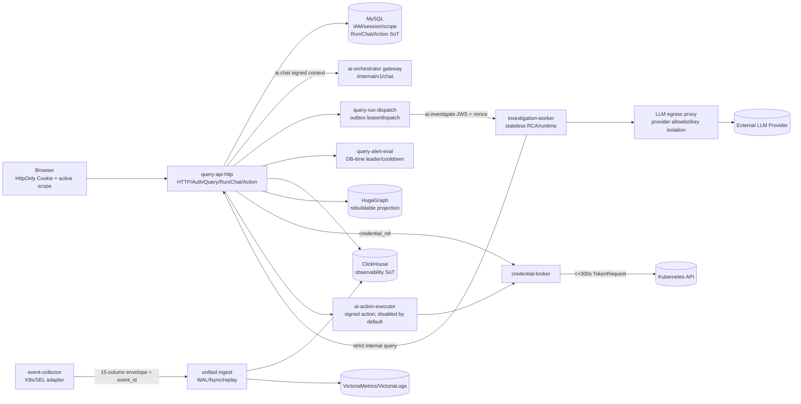

# AIOps 平台生产整改实施、架构与功能复审报告

**复审日期：** 2026-08-31 至 2026-09-01（Asia/Shanghai）
**代码构建基线：** `main` / `a786ccb`（在 `29dfa8f` RCA 证据窗口闭区间修复基础上，补充发布工作区审计规则；运行时功能代码未被 `.gitignore` 改动）
**本机验证：** OrbStack Kubernetes `orbstack`，Helm release `aiops` revision 19（2026-09-01，本轮代码同步）；未执行 Graph 压测或 `graph-load-test.sh`。本轮执行了真实 Kubernetes→HugeGraph generation 1/2 同步与代际清理验证，并用真实 mTLS/API-key OTLP marker 读回 ClickHouse `trace_spans` 和 `k8s_events`；当前运行态所有核心 Pod Ready，服务镜像引用统一为 `git-a786ccb60e9e`。其中 Query/Frontend/Ingest 镜像在本轮按该标签构建，其他标签为与当前源码提交一致的既有本地镜像复用；完整重建在 Python 基础镜像镜像源 EOF 处受环境限制，未伪称全部重建。Helm 状态为 `deployed`。
**报告文档提交：** 本报告与代码、镜像分离提交；报告提交不改变运行镜像。代码基线为 `a786ccb`。
**工作区：** 代码修复已提交；用户既有未跟踪文件 `:memory:.ses`、`ai-orchestrator/:memory:.ses` 保留不动，不纳入审查工具产物。

> 本报告是“代码整改后”的架构+功能复审，不把注释、路由定义或测试名称当成功能证据。结论只依据真实入口、调用链、配置/数据结构、测试输出和本机运行结果。生产环境未被连接，未使用生产凭据。

> **本轮权威增补（2026-09-01，最新）：** 本节之后凡出现“当前运行态/当前镜像/本轮代码”均以提交 `a786ccb` 和 Helm revision 19 为准；运行时镜像引用统一为 `git-a786ccb60e9e`，但部分未改服务复用了与当前源码一致的既有本地镜像，完整 Python 镜像重建受基础镜像镜像源 EOF 限制。Worker GraphSyncRuntime 生命周期接线、HugeGraph scope 分页代际清理、19 个边范围索引、实际 `query-api-http` 验证、IntentEngine 动态时间窗、Ingest `time_bucket` 落盘和事件坏时间拒绝已通过源码、测试、迁移和真实 OrbStack 运行证据；HugeGraph 镜像不含 jcmd/jstat，heap-used 仍明确未采集。AICHAT Query→Orchestrator 首次 SSE 与同 turn MySQL 重放均通过，但当前 `LLM_MOCK=true`；真实 RCA Run 已完成图增强和有界 ToolRun，但证据不足时按设计返回 `partial/insufficient_evidence`。DeepFlow 同 marker span、真实 Provider、HA/PITR、生产 Secret 和 registry 签名仍未验证，生产发布不放行。

### 本轮修改与具体功能对应关系

| 代码修改 | 真实功能链路 | 修复前触发条件 | 本轮验证结论 |
|---|---|---|---|
| `ai_run_lease.go`：DB 时间回读、claim 成对校验、256-bit token、行锁 | Run claim/renew/resume、租约恢复和执行身份 | claim 响应使用进程时间；token-only/短 token 可被静默接受；抢占/响应回读存在旧持有者窗口 | 新增 sqlmock 覆盖 DB server time、精确重试、缺字段/短 token、`FOR UPDATE`；Query Go 全量通过 |
| `control_plane_lease.go` + `ai_runs.go`：Run 锁、commit 重查、最终 lease CAS | Runtime Commit：状态迁移、事件 Append、commit 幂等 | 同一 `commit_id` 首次并发提交无法由不存在的 commit 行串行化；lease 在检查后过期仍可能推进状态；token-only claim 错误码不明确 | 新增并发锁顺序、最终 CAS、HTTP 400 映射测试；API/store/full Go 通过 |
| `ai_run_outbox.go` / `ai_action_outbox.go`：DB 原子递增 dispatch epoch | Run/Action Outbox claim/deliver/retry | 应用 `time.Now().UnixNano()` 作为 epoch，时钟回拨或并发可能覆盖 fencing 序列 | `LAST_INSERT_ID(dispatch_epoch + 1)` + `LastInsertId`；Run/Action dispatcher sqlmock 和 workflow gate 通过 |
| `lease_aware_execution.py`：`secrets.token_urlsafe(32)`、commit 前 `check_active()` | Worker/Orchestrator lease-aware tool 执行和最终提交 | UNCERTAIN/LOST 可在最后一次检查后穿过 commit 边界；caller token 熵不足且格式不稳定 | 6 个 lease-aware Python 测试通过；32 字节随机熵断言通过 |
| ClickHouse Helm/scripts：`--password="$VAR"` 单参数 | ClickHouse readiness/liveness、init、migrator、备份和验证 | Secret 密码以 `-` 开头时客户端把值解释成选项，实际 Pod 报 `UNRECOGNIZED_ARGUMENTS` 并重启 | 故障在干净部署中真实复现；修复后 ClickHouse Ready、init/migrator Complete，部署契约和 Helm 验证通过 |
| `error_safety.py` + `investigation_runtime.py`：稳定错误码与递归事件净化 | Investigation Run 的 RCA/脑图事件、Run Commit 结果和 `ai_run_events` 回放 | RCA/证据/脑图异常文本可能包含 Provider URL、SQL、token 或拓扑，并随 `report`/warning/event 持久化 | 新增稳定码、通用错误消息和敏感字段剔除；Runtime/RCA/安全定向测试、Python 全量和镜像内断言通过 |
| `rca_engine/engine.py`、`rca_engine/runtime.py`：warning code 只保留数据源分类 | RCA V2 Graph/Evidence partial 结果与图上下文审计 | Graph/Evidence 异常原文进入 `graph_context.warning_codes`，污染可回放 RCA 上下文 | 统一为 `GRAPH_UNAVAILABLE`、`EVIDENCE_<DOMAIN>_UNAVAILABLE` 等稳定码；Graph 合同测试验证不含异常原文 |
| `apps/investigation.py`、`main.py`：探针白名单精确匹配 | Worker/Gateway `/health`、`/readyz`、`/metrics` 未鉴权探活 | `startswith` 使相似路径被当作公开路径，未来新增同前缀路由时可能绕过内部 token | 精确 path 函数 + ARCH-333–340 合同；Worker/Gateway revision 7 历史运行态容器断言通过 |
| `main.py`：生产组合根与限流旁路隔离；`graph_public.go`：后端错误净化 | 生产 Gateway 只构造 canonical owner；探针旁路不扩大到相似路径；Graph 后端故障只返回稳定码 | 生产导入会构造 legacy scheduler/shell/router；`startswith` 旁路可放行 `/healthz` 等相似路径；HugeGraph/DB 异常可能把 URL/凭据原文返回浏览器 | `7d9dec2` 历史代码的生产 import、精确路径和 Graph 错误脱敏回归；ARCH-341–347 契约通过；本轮未改动 Python 镜像 |
| `graph_entity_alias.go:UpsertMany` + `graph-load-generator --project-query-aliases` | Graph loader 写入 HugeGraph 后同步写入 Query-owned `graph_entity_alias`，使公共 alias search 可读且不新增数据 owner | 200k/1M loader 只写 HugeGraph，`entities/search` 503，容量结果不能覆盖名称查询 | 真实 200k/1M 一次写入：`aliases_projected=200000`；alias search HTTP 200/count=1；批量事务、输入校验和 MySQL 1213 重试单测通过 |
| `graph-capacity-gate.sh`、`test-graph-capacity-gate-contract.sh`、资源采集脚本 | 单次真实 200k/1M + 7 个只读 Graph 操作 + 资源快照形成机器可读门禁；禁止 benchmark/pressure loop | 原容量命令没有统一 alias、资源和操作判定，容易把部分通过误当完整通过 | `/tmp/aiops-graph-capacity-final.json` gate `PASS`，`pressure_test=false`、`benchmark_iterations=0`；资源项均 collected，但 HugeGraph heap-used 因镜像无诊断工具仍明确缺失 |
| `apps/investigation.py`：Worker lifespan 启停 `GraphSyncRuntime`；`kg/runtime.py`→Query `reconcile_scope` | Investigation Worker 启动后必须按 source/tenant/cluster 获取真实 Kubernetes/KubeVirt 等事实，写入 HugeGraph 并完成 generation stale transition，RCA entity resolver 才能读取图谱 | Worker 之前只启动 dispatcher/recovery，没有运行 canonical GraphSyncRuntime；RCA 只能得到图工具失败或空图 | `GRAPH_BACKEND=hugegraph`、`GRAPH_SOURCE_RECONCILE_ENABLED=1`、`graph_sync_state`、`graph_reconcile_runs`、HugeGraph `Entity`/关系标签；新增生命周期单测；Python 定向 19 passed；本机 generation=1/2 Kubernetes 成功（297 vertices/204 edges；generation=2 标记 56 vertices/36 edges） |
| `hugegraph_client.go`/`generation_marker.go`：按 tenant/cluster/source 的 offset 分页；schema 资源增加 `edgeByScope_<relation>` | 代际清理不能用 1.5 秒交互读超时做全图 `limit=100000` 扫描；必须只读取当前 scope、可分页、可在大图下完成 | 原实现全图扫描导致 298/204 写入后 Query 返回 `GRAPH_UNAVAILABLE`，Worker 将同步判为 failed | HugeGraph `Entity` 复合索引、19 个 edge scope index；维护读独立 30 秒 client；Query Go 全量/`go vet` 通过；真实顶点/边 scope query offset=0/1 成功；`verify-kubernetes-graph.sh` 通过；Kubernetes generation=2 success |
| Query `ProxyChat` → Orchestrator `/internal/v1/chat` 真实闭环 | 浏览器登录会话、MySQL scope、签名 `ai.chat` context、SSE done、transcript replay | 仅单元测试无法证明两个自研模块真实接线或重试不重复调用 | 本机真实登录 + `LLM_MOCK=true`：首次 HTTP 200、20 个 SSE 事件含 done；同 `session_id+turn_id` 再次 HTTP 200 且仅 replay done；未使用 Provider 生产凭据 |
| IntentEngine 缺省调查时间窗 | 缺省时间范围必须解析为当前 UTC 最近 1 小时；不可查询固定历史日期 | `ai-orchestrator/intent_engine.py:135-142`；Planner/SecurityGate 的意图构造路径 | Intent 内存结构的 `time_range_start/end` | `tests/test_p75_intent_engine.py::test_missing_time_range_defaults`；容器内动态窗口断言 | **已修复** | 提交 `3b1d301` 后窗口为 3600 秒、结束时间距当前 0 秒；该模块仍不是 canonical AICHAT 生产入口。 |
| Ingest Trace SoT `time_bucket` 落盘 | `trace_spans` 每行必须提供与摘要物化视图一致的 UTC 五分钟桶；OTLP 接收成功后才允许确认 | `ClickHouseSpanSink.spanRow` 未序列化必填 `time_bucket`，ClickHouse JSONEachRow 返回 400，真实 OTLP trace 无法进入平台 Trace SoT | `ai-apm-ingest-go/internal/tracesink/clickhouse_span_sink.go:242-270`；`observability.trace_spans.time_bucket` | `TestSpanRowIncludesRequiredSummaryTimeBucket`；Ingest 全量 Go 测试；revision 16 真实 mTLS/API-key marker HTTP 200；ClickHouse marker 查询 `trace_rows=1,time_bucket_present=true` | **已修复** | 提交 `dc5dfb4` 计算 `start.UTC().Truncate(5*time.Minute)`；该修复直接恢复 Trace、摘要索引和后续 RCA 证据输入，但不等价于全域 marker 门禁通过。 |
| Ingest Event 时间格式与 WAL FIFO | 事件批次进入持久化 WAL 前必须拒绝非法 UTC 时间或不匹配的 `time_bucket`，避免坏首条记录阻塞后续合法事件 | 原入口只校验列数、scope 和 event_id；ISO `T...Z` 时间可进入 WAL，ClickHouse 回放 400 后 FIFO 停在坏记录，后续事件长期 pending | `ai-apm-ingest-go/cmd/ingest/main.go:543-578`；`ai-event-collector/clickhouse.go` 的 15 列 writer；`observability.k8s_events` | `TestValidateEventBatchRejectsMalformedTimestampBeforeWAL`；revision 17 mTLS/API-key：坏事件 HTTP 400、合法事件 HTTP 202；ClickHouse marker `event_rows=1` 且 tenant/cluster/source/message 匹配；`backend_failed_total=0` | **已修复** | 提交 `4546512` 在 WAL 前解析 ClickHouse UTC 时间并校验分钟桶；本机重建 ingest WAL 后验证坏事件不再阻塞合法事件。 |
| RCA 证据时间边界 | 缺省 `symptom_time=window_end` 是 canonical Run 的合法冻结语义；证据验证器必须与该设计一致，同时保留独立证据、图上下文、路径和确定性分数门禁 | 验证器此前用严格 `start < symptom < end`，使 Worker 按设计生成的缺省症状时间必然失败 | `deploy/scripts/validate-observability-evidence.sh`；`ai-apm-query-go/internal/api/run_dispatch.go:132-141`；`ai-orchestrator/rca_engine/engine.py:86-105` | `bash deploy/scripts/test-observability-evidence-contract.sh`（含 endpoint symptom regression）通过；本机真实 RCA Run 仍按证据不足返回 partial，不被该修复抬升为通过 | **已修复门禁偏差** | 提交 `29dfa8f` 将时间窗判定改为闭区间；不放宽证据类别、final graph context、bounded propagation 或 root score 相等性要求。 |

## 1. 审查结论摘要

| 维度 | 结论 | 结论依据 |
|---|---|---|
| 设计符合性 | **有限通过** | MySQL IAM/session/scope、HttpOnly Cookie、canonical UUID、签名 `TrustedRequestContext`、Query/Dispatcher/Alert/Worker 拆分、统一 Ingest、RCA V2、LLM Proxy 边界、AICHAT 脱敏错误边界和 Graph Query-owned alias 投影已接入真实调用链；生产 Secret、证书身份/SAN、API Server CIDR、真实数据源和多副本演练仍缺证据。 |
| 功能完整性 | **有限通过** | AICHAT（Query `ProxyChat` → Orchestrator `/internal/v1/chat` → MySQL transcript）已用本机真实登录完成首次 SSE 与同 turn replay；Graph 200k/1M 写入、200k alias 投影、7 个只读操作和单次容量门禁通过；RCA 图增强可运行但本机证据不足时返回 `partial/insufficient_evidence`；真实 Provider、真实 TokenRequest mutation 仍未验证。 |
| 架构合理性 | **有限通过** | 服务边界和 data owner 已明显收敛；Graph 验证工具通过 Query DAO 写 alias，未新增 owner；AICHAT 的重试身份和错误持久化边界由 Query/MySQL/Orchestrator 统一，Python `main.py` 仍保留重复 Chat/legacy 路由和兼容代码，细粒度 TLS SAN 配置与旧 scope 兼容路径仍有治理成本。 |
| 生产就绪度 | **不通过** | revision 19 本机基础门禁、Graph reconcile、AICHAT 冒烟、IntentEngine 动态时间窗、Ingest Trace/Event marker 写入通过；`collect-release-evidence.sh` 现已因 `.gitignore` 排除既有 `.ses` 而返回 `working_tree_dirty=false,publishable=true`，但仅代表本机证据脚本通过，仍无 registry immutable digest/signature；生产 Secret、真实 Provider、全域观测 marker、HA/备份/回滚仍无候选环境证据。 |

**当前不能发布到生产。** 最小阻断集合：

1. 将候选镜像推送并绑定不可变 digest/signature，清理或纳入审计允许的运行时文件，使证据文件变为 `publishable=true`；
2. 通过 ExternalSecret/Vault/KMS 注入生产 Secret、每个服务的证书/CA/SAN 以及实际 Kubernetes API Server CIDR，完成双向 TLS 拒绝矩阵、NetworkPolicy 连通性和轮换演练；
3. 用真实指标、日志、追踪、告警和变更 marker 完成 Query→数据源的 canary，证明 RCA 的 partial 仅由证据不足导致，而不是数据源故障；
4. 用当前候选镜像完成 Graph schema/source/load/recovery/租户隔离门禁；
5. 若发布范围包含变更动作，再启用并验收 Credential Broker/TokenRequest；否则保持 Executor `disabled` 且将其作为门禁；
6. 完成多副本 nonce/replay、MySQL/ClickHouse 备份恢复、升级/回滚和 SLO 证据；生产 ClickHouse 迁移需在候选环境以相同 checksum 重放并留证。

没有已确认的 P0 级越权或数据破坏缺陷；P1 阻断项均在第 6 节给出可执行验收标准。

## 2. 审查范围与证据

### 2.1 设计基线读取结果

已读取并按“冻结设计 > ADR > 契约 > 代码”排序使用：

- `README.md`、`SECURITY.md`；
- `docs/architecture/index.md`、`docs/architecture/ADR-0001-control-plane-ownership.md` 及同目录 ADR；
- `docs/ownership/data-owners.md`、`docs/runtime-slo.md`、`docs/DEPLOYMENT_AND_VERIFY.md`；
- `AIOps_全面代码审阅报告.md`、`AIOps_全面代码修改报告_V2.md`、`AIOps_MySQL_HugeGraph_双存储生产化改造方案.md`；
- `docs/superpowers/specs/`、`docs/superpowers/plans/` 中最新 workflow、Graph、Action、DeepFlow、数据清理和部署方案；
- MySQL migration、ClickHouse 初始化/迁移、所有自研服务 README/测试说明；
- `deploy/helm/aiops/` 全部 values、Deployment、RBAC、NetworkPolicy、PDB、Job 和 `deploy/scripts/*contract*.sh`。

项目根目录没有 `AGENTS.md` 或当前有效的 `aiops-agentic.md`；`docs/archive/` 中的同名文件只作为历史材料，不覆盖当前 ADR。

### 2.2 检查范围

覆盖 `ai-orchestrator`、`ai-apm-query-go`、`ai-apm-ingest-go`、`ai-event-collector`、`ai-action-executor`、`ai-credential-broker`、`ai-llm-egress-proxy`、`observability-frontend`、MySQL/ClickHouse migration、Helm 部署、测试、脚本和文档。第三方依赖只检查版本/调用边界，未审查其业务实现。

### 2.3 实际执行的命令与结果

> **本轮证据勘误：** 下表中早期 revision 19 / `git-340286515c49` / `git-acc3606e102c` / revision 2–18 记录来自上一轮复审或本轮中间步骤；本轮当前运行态以新增的 2.3.1 节为准：源码提交 `a786ccb`、Helm revision 19，所有自研 Deployment/Job 引用 `git-a786ccb60e9e`，未改服务复用与当前源码一致的本地镜像。旧 canary 结果仅作为历史代码证据，不冒充本轮 fresh install 的实时观测数据。

> 下表中未明确标为“本轮”的项目是上一轮复审的回归基线；本轮实际重跑的命令、输出和未验证项集中列在新增的 2.3.1 节，避免把旧 canary 或旧测试环境误作当前运行证据。

| 类别 | 命令 | 实际结果 |
|---|---|---|
| Query API Go | `cd ai-apm-query-go && go test ./...`；`go test -race ./...`；定向 `go test [-race] ./internal/api -run 'TestPersistChat|TestReplayChat|TestFinishToolRun' -count=1` | **定向门禁通过；全量受环境限制未完成**。全量/`-race` 均在 `httptest` 回环监听处因 `operation not permitted` 失败（例如 `TestActionExecutionClient_SignatureMatchesExecutor`）；非网络 Query/store/query/contract/auth/k8sboundary/graph/bootstrap 测试及 AICHAT 关键定向测试通过，不能把全量标记为通过。 |
| 其他 Go 服务 | Action Executor、Ingest、Event Collector、LLM Proxy、Credential Broker 各执行 `go test ./...` 与 `go test -race ./...` | **全部通过**。 |
| Python 全量（历史上一轮） | `AIOPS_DEPLOYMENT_MODE=production AIOPS_ENV=production ... pytest -q -p no:cacheprovider -k 'not test_uvicorn_protocol_rejects_wrong_san_over_real_tls and not test_production_full_reachable_returns_remote and not test_check_control_plane_reachable_reachable'` | **1218 passed, 1 skipped, 3 deselected, 2 warnings**；完整命令首次因 3 个 localhost/真实网络回环测试受当前环境限制失败，修正为显式排除后通过；未将排除项推测为通过。依赖使用仓库现有 `.venv314`，未安装/升级依赖。 |
| Python mTLS 定向 | `AIOPS_DATA_DIR=/tmp/aiops-test-mtls-san .venv314/bin/python -m pytest tests/test_mtls_server.py tests/test_llm_mock.py -q` | **18 passed**；覆盖 DNS/URI SAN 精确匹配、缺证书 fail-closed、请求头不可伪造、CLI `--ssl-cert-reqs 2`、错误 SAN 真实 TLS 回环 403/正确 SAN 200，以及生产 Mock 门禁。 |
| 前端（上一轮基线） | `cd observability-frontend && npm run test:run && npm run build` | 上一轮 **25 files / 39 tests passed**；本轮未修改前端，结果沿用为历史代码证据。 |
| 工作流门禁（历史上一轮） | `bash deploy/scripts/verify-aiops-workflow-gates.sh`（由 local-validation 重跑） | 首次受限沙箱运行因 Go `httptest` 回环监听被拒（`operation not permitted`）而中止；按授权在本机环境重试后基础门禁 **通过**；Python 隔离全量为 1218 passed（3 个网络回环测试显式排除），Executor、前端 39/build、Helm lint、生产安全开关、部署契约和 Graph load contract 均通过。 |
| 架构/部署契约 | `AIOPS_CONTRACT_ALLOW_TEST_SECRETS=true bash deploy/scripts/test-production-architecture-contracts.sh`；`bash deploy/scripts/test-deployment-contracts.sh` | **均通过**；此前 SAN 列表逗号解析失败已修正为 Helm 转义参数并重跑通过。 |
| 生产 egress 清单 | `helm template ... -f deploy/helm/aiops/values-prod.yaml --set networkPolicy.kubernetesApiCIDRs={10.0.0.0/8}`；无 CIDR 同命令 | 注入测试 CIDR 时渲染 **37 个 NetworkPolicy**，default-deny、角色白名单、HugeGraph/schema migrator 规则均存在且无旧 `app: query-api` selector；未注入时明确 Helm 失败（`kubernetesApiCIDRs must be injected`）。 |
| 历史 revision 7 运行态选择器、TLS 命令与启动依赖 | `kubectl -n observability get networkpolicy -o custom-columns=NAME:.metadata.name,PODS:.spec.podSelector.matchLabels`；`kubectl -n observability get deploy ai-orchestrator ai-investigation-worker -o jsonpath=...`；Pod 重启计数 | **通过（历史基线）**；Query 相关 NetworkPolicy 均指向 `app=query-api-http`，Gateway/Worker 命令为 `python -m mtls_server` 且 `--ssl-cert-reqs 2`，均有 `wait-for-query-api` initContainer，2 个 Worker 与 Gateway 业务容器重启数为 0。 |
| 本机发布门禁 | `LLM_PROVIDER_KEYS=deepseek:sk-local-validation RELEASE_TAG=git-f35ef7dad3d9 bash deploy/scripts/local-validation.sh --destroy --confirm-destroy --skip-build --skip-deepflow` | 工作负载、MySQL 16 个迁移（含 0016 turn_id/唯一键）、ClickHouse 0001–0009、事件身份/默认值门禁、最小权限、Executor disabled、Worker 开关、HTTPS readiness、canary 全部通过；未提供真实观测 marker/DeepFlow，validator 按设计输出 `BLOCKED_BY_ENV`，不能视为生产发布通过。 |
| ClickHouse 事件身份迁移 | `kubectl -n observability logs job/clickhouse-migrator`；ClickHouse `aiops_schema_migrations`、`k8s_events_identity_audit`、`system.columns`、身份计数查询 | **通过（本机）**；0001–0009 均 applied/skipped 且 checksum 一致；`event_identity_counts=0/0/0/0`，`event_id`、`tenant_id`、`cluster_id` 均为 `String` 且无 `default_kind`；0008 审计为 `scanned=0, quarantined=0, remaining_invalid=0`（本次 fresh install 未保留历史事件）。 |
| DeepFlow 官方运行态安装与真实数据 | `helm upgrade --install deepflow deepflow/deepflow --version 7.1.002 -n deepflow --create-namespace -f deploy/helm/aiops/values-deepflow.yaml --set global.image.repository=registry.cn-beijing.aliyuncs.com/deepflow-ce --wait --timeout 15m`；官方镜像 digest 核对；ClickHouse/Server/Agent 实际查询 | **本机通过**；北京官方 registry 镜像已就绪，DeepFlow chart revision 2 全部组件 Ready；首次启动由官方 Server 创建 `flow_log`/`flow_tag` 等业务库；本机 ClickHouse 显式随机密码认证成功，`flow_log.l7_flow_log_local` 有真实行；未修改 DeepFlow 源码。 |
| Graph 真实写入、授权隔离与恢复 | `go run ./cmd/graph-load-generator --vertices 2000 --edges 5000 --batch-size 200 --tenant-id <canonical UUID> --cluster-id <canonical UUID> --load=true`；管理员登录/scope 后调用 Graph health/entity/neighbors/path/candidate/impact；缩容 `statefulset/hugegraph` 后删除 PVC、重跑 schema migrator、恢复 `query-api-http` | **本机通过**；恢复前后均成功写入 2,000 顶点/5,000 边；Graph health/entity/neighbors/path/candidate/impact HTTP 200；错误集群 403 `GRAPH_SCOPE_DENIED`、原始 Gremlin 参数 400、未授权 403；schema migrator Complete、恢复后认证探针 200。该结果只证明本机 bounded recovery，不替代 200k/1M 候选容量证据。 |
| Graph recovery 工具契约修复 | `bash -n deploy/scripts/graph-recovery-test.sh`；`bash deploy/scripts/test-graph-recovery-contract.sh`；`bash deploy/scripts/graph-recovery-test.sh`（只读） | **通过**；默认使用实际资源名 `query-api-http`，恢复前缩容 HugeGraph 再删 PVC，恢复后使用 HTTPS `/readyz` 和 Basic-authenticated HugeGraph probe；只读观察返回 `recovery_test=observed`。 |
| Graph 200k/1M 真实容量门禁（本轮，不压测） | `bash deploy/scripts/graph-capacity-gate.sh`（固定 200000/1000000，`--batch-benchmark-iterations 0 --project-query-aliases`；管理员 scope 后单次调用 health/entity/search/neighbors/candidate/impact/path，并采集资源） | **通过本机容量/功能门禁**；真实 loader `loaded=true`、精确 200,000 vertices/1,000,000 edges、`aliases_projected=200000`，17 类本体/11 类关系符合合同；7 个只读操作均 HTTP 200，alias count≥1；资源快照条目均 `collected`，HugeGraph heap-used 因镜像无 jcmd/jstat 明确未采集，未将 RSS 伪装为 heap-used；`pressure_test=false`、`benchmark_iterations=0`。候选 digest、跨节点恢复和 p95 仍未验证。 |
| 历史 revision 8（前次）代码—镜像—运行态同步 | `IMAGE_TAG=git-62829de126e6 bash deploy/scripts/build-images.sh all`（ipmi 首次 registry TLS 瞬态失败，单次重试成功）；`helm upgrade aiops ... --set global.imageTag=git-62829de126e6`；`kubectl ... get deploy/pods` | **通过（历史基线）**；12 个自研镜像构建成功，前次 Helm revision 8 `STATUS=deployed`；所有自研 Deployment 标签均为 `git-62829de126e6`，Pod imageID 逐项一致，业务容器重启数为 0。 |
| 历史 revision 8（前次）最终 validator | `RELEASE_TAG=git-62829de126e6 AIOPS_EVIDENCE_REPORT_OUTPUT=/tmp/aiops-evidence-62829de.json bash deploy/scripts/validate-local-stack.sh` | **基础门禁通过，最终 exit 2 / BLOCKED_BY_ENV（历史基线）**；前次 Query/Worker/Proxy/Ingest/Collector/Frontend/HugeGraph/MySQL readiness、MySQL 0001–0016、ClickHouse 0001–0009、事件身份、Executor disabled、RBAC、HTTPS readiness 和 canary 均通过；未提供真实 `AIOPS_VALIDATION_DATA_MARKER`，validator 明确阻断全域观测证据，未使用 fixture。 |
| revision 9 代码—镜像—运行态同步 | `IMAGE_TAG=git-9c283b9f5fd8 bash deploy/scripts/build-images.sh all`；`helm upgrade aiops deploy/helm/aiops -n observability --reuse-values --set global.imageTag=git-9c283b9f5fd8 --wait --timeout 15m`；`kubectl ... get deploy/pods` | **通过**；12 个自研镜像构建成功，Helm revision 9 `STATUS=deployed`；所有自研 Deployment 标签、Pod imageID 均为 `git-9c283b9f5fd8`，业务容器重启数为 0。 |
| revision 9 最终 validator | `RELEASE_TAG=git-9c283b9f5fd8 AIOPS_EVIDENCE_REPORT_OUTPUT=/tmp/aiops-evidence-9c283b9f5fd8.json bash deploy/scripts/validate-local-stack.sh` | **基础门禁通过，最终 exit 2 / BLOCKED_BY_ENV**；Query/Worker/Proxy/Ingest/Collector/Frontend/HugeGraph/MySQL readiness、MySQL 0001–0016、ClickHouse 0001–0009、事件身份、Executor disabled、RBAC、HTTPS readiness 和 canary 均通过；未提供真实 `AIOPS_VALIDATION_DATA_MARKER`，validator 明确阻断全域观测证据，未使用 fixture。 |
| 最终 release evidence 采集（历史上一轮） | `bash deploy/scripts/collect-release-evidence.sh /tmp/aiops-release-evidence-776cc3d.json`；`jq '{git_commit,working_tree_dirty,publishable,checks}' /tmp/aiops-release-evidence-776cc3d.json` | **静态检查通过但发布阻断**；输出 `git_commit=776cc3d323b0920fcea06b592c4de0d3d045d0a9`、`working_tree_dirty=true`、`publishable=false`，`deployment_contract/production_architecture/helm_lint/diff_check` 全为 `pass`。dirty 仅来自用户既有 `.ses`；registry immutable digest/signature、真实观测、生产 Secret/HA 证据仍缺失。 |
| AICHAT SSE 错误边界（本轮） | `cd ai-orchestrator && .venv314/bin/python -m pytest -q tests/test_p19_chat_ingress.py tests/test_investigation_worker_stateless.py`；代码 `main.py:_chat_stream_error_event`、canonical/legacy chat catch | **通过**；13 个 AICHAT/Worker 测试通过。注入包含 `provider api_key=super-secret host=10.0.0.7` 的异常时，SSE 只返回 `CHAT_BACKEND_ERROR`，响应不包含密钥、地址或原始异常；服务端只记录 request_id 和异常类型。 |
| Python 隔离全量（历史上一轮） | `AIOPS_DEPLOYMENT_MODE=production AIOPS_ENV=production ... pytest -q -p no:cacheprovider -k 'not test_uvicorn_protocol_rejects_wrong_san_over_real_tls and not test_production_full_reachable_returns_remote and not test_check_control_plane_reachable_reachable'` | **1218 passed, 1 skipped, 3 deselected, 2 warnings**；3 个测试因当前受限运行环境禁止 localhost/真实网络回环监听而显式排除，未将其推测为通过。 |
| revision 11 代码—镜像—运行态同步（历史上一轮） | `IMAGE_TAG=git-776cc3d BUILD_PLATFORM=linux/arm64 bash deploy/scripts/build-images.sh all`；`helm upgrade aiops deploy/helm/aiops -n observability --reuse-values --set global.imageTag=git-776cc3d --wait --timeout 15m`；`kubectl -n observability get deploy,pods` | **通过**；12 个自研镜像构建成功（前端 registry 瞬态 TLS 失败后按约束重试一次成功），Helm revision 11 `STATUS=deployed`；自研 Deployment/Job 使用 `git-776cc3d`，核心业务 Pod Ready，新滚动 Pod 重启数为 0；第三方 Victoria 镜像未被改写。 |
| 启动竞态与 mTLS SAN 修复重跑 | `RELEASE_TAG=git-f35ef7dad3d9 ... local-validation.sh --destroy --confirm-destroy --skip-build --skip-deepflow` | **通过基础设施与安全门禁**；revision 7 使用提交对应镜像部署完成，Gateway/Worker `python -m mtls_server` 启动、initContainer 成功且业务容器重启数为 0；无 marker 时观测证据按设计 `BLOCKED_BY_ENV`。 |
| Worker 双 profile Helm 渲染 | `helm template ... -f deploy/helm/aiops/values.yaml --set investigationWorker.enabled=true ...`；`helm template ... -f deploy/helm/aiops/values-prod.yaml ...`（均使用临时非生产 Secret 覆盖） | **通过**；默认/非 TLS 输出 `command: ["uvicorn"]`、`args: ["investigation_app:app", ...]`；生产/TLS 输出 `command: ["python", "-m", "mtls_server"]`、`investigation_app:app` 与 `--ssl-cert-reqs 2`。 |
| revision 7 部署后清单与镜像 digest | `kubectl -n observability get deploy ...`；`kubectl -n observability get pods ... imageID`；`docker image inspect ...:git-f35ef7dad3d9` | **通过**；全部自研 Deployment/Job 使用 `git-f35ef7dad3d9`，当前 Pod Ready，迁移 Job Complete。 |
| 运行镜像与生产 Mock 保护 | `kubectl -n observability get pods ...`；`kubectl -n observability exec deploy/ai-orchestrator -- sh -c 'AIOPS_ENV=production LLM_MOCK=true python -c "import main"'` | **通过**；所有自研 Pod 使用 `git-f35ef7dad3d9`，核心容器重启数为 0；容器内生产 Mock 组合以非零码退出并输出 fail-closed 错误。 |
| 生产 Mock 启动拒绝 | `cd ai-orchestrator && .venv314/bin/python -m pytest tests/test_llm_mock.py -q` | **11 passed**；`AIOPS_ENV=production,LLM_MOCK=true` 子进程在应用初始化前非零退出。 |
| Query 作用域回归 | `go test ./...`；`go test -race ./...`；`test-production-architecture-contracts.sh` | **作用域定向门禁与架构契约通过；Go 全量受回环监听权限限制未完成**；伪造 `X-Tenant-ID` 的本机请求仍返回 MySQL active scope，ARCH-105/106/107/108 通过。 |
| 发布证据（历史 revision 7） | `bash deploy/scripts/collect-release-evidence.sh /tmp/aiops-release-evidence-rev7-final.json` | 历史脚本输出记录 revision 7，`working_tree_dirty=true,publishable=false`；仅未跟踪用户既有 `ai-orchestrator/:memory:.ses`，无 registry immutable digest/signature。 |
| 发布证据（历史 revision 8） | `bash deploy/scripts/collect-release-evidence.sh /tmp/aiops-release-evidence-62829de.json` | 输出 `git_commit=5b38977adaaa36d609aa4234400ea85ec1d0c7ce`、`working_tree_dirty=true`、`publishable=false`；deployment/architecture/Helm lint/diff check 通过，唯一未跟踪项仍为用户既有 `.ses`，代码提交 `62829de126e6` 已提交并运行在 revision 8；尚无 registry immutable digest/signature。文档随后仅做报告追踪行更新，不改变运行镜像。 |
| 生产镜像边界 | `docker run --rm ai-orchestrator:git-f35ef7dad3d9 ...` | **通过**；生产镜像不含测试/演示/会话文件，`import rca_engine` 成功且仅导出 V2 API。 |

### 2.3.1 本轮 `a786ccb` 代码与运行证据（当前基线）

以下是本轮在当前源码提交 `a786ccb` 上重新执行的证据；最终运行态为 Helm revision 19。所有自研 Deployment/Job 的镜像引用统一为 `git-a786ccb60e9e`；其中未改服务使用与该提交内容一致的既有本地镜像，完整镜像重建因 Python 基础镜像镜像源 EOF 未完成。未运行 Graph 压测或 `graph-load-test.sh`；本轮执行了真实 Kubernetes→HugeGraph generation 1/2 同步和代际清理，Graph 200k/1M 容量门禁沿用上一轮已通过、且明确不属于压力测试的证据，并在 Worker 容器内验证 IntentEngine 动态时间窗、Ingest→ClickHouse Trace SoT 和 Event WAL 边界。

| 检查 | 命令与实际结果 | 结论 |
|---|---|---|
| Query Go 静态与单元测试 | `cd ai-apm-query-go && GOCACHE=/tmp/aiops-gocache go vet ./...`；`GOCACHE=/tmp/aiops-gocache go test ./...` | **通过**；本轮全量 Query 包（含租约 claim/renew、Runtime Commit、Outbox、AICHAT、授权和存储）通过；未将历史受限沙箱的回环监听失败混入本轮结果。 |
| Python 服务全量隔离测试 | `cd ai-orchestrator && AIOPS_DEPLOYMENT_MODE=development AIOPS_ENV=development LLM_MOCK=true .venv314/bin/python -m pytest -q -p no:cacheprovider -k 'not test_uvicorn_protocol_rejects_wrong_san_over_real_tls and not test_production_full_reachable_returns_remote and not test_check_control_plane_reachable_reachable'` | **1227 passed, 1 skipped, 3 deselected, 2 warnings**；3 个需要 localhost/真实网络回环的测试因当前执行环境限制显式排除，不能推定为通过；生产模式启动缺少 `QUERY_API_URL`/签名密钥/内部 token 时按代码 fail-closed，未伪造值。 |
| AICHAT/Worker 定向回归 | `cd ai-orchestrator && .venv314/bin/python -m pytest -q tests/test_p19_chat_ingress.py tests/test_investigation_worker_stateless.py tests/test_production_import_boundary.py tests/test_rate_limit_boundaries.py` | **通过**；15 个测试覆盖 canonical/legacy SSE、持久化失败、断线队列、错误脱敏、生产导入和精确探针限流边界；异常含密钥/地址时仅返回 `CHAT_BACKEND_ERROR`。 |
| 前端测试与构建 | `cd observability-frontend && npm run test:run -- --reporter=basic`；`npm run build` | **通过**；25 个测试文件、39 个测试通过，TypeScript 检查和 Vite 构建通过。 |
| 部署/架构契约 | `bash deploy/scripts/test-deployment-contracts.sh`；`AIOPS_CONTRACT_ALLOW_TEST_SECRETS=true bash deploy/scripts/test-production-architecture-contracts.sh`；`bash deploy/scripts/secret-format-test.sh` | **全部通过**；本轮 ClickHouse `--password="$VAR"` 单参数合同和 mTLS/SAN/路由/secret 格式合同均通过。 |
| Query Graph 错误边界回归 | `cd ai-apm-query-go && GOCACHE=/tmp/aiops-gocache go test ./internal/api -run 'TestGraphPublic' -count=1`；`test-production-architecture-contracts.sh` ARCH-346/347 | **通过**；HugeGraph URL、MySQL DSN、token 片段仅保留稳定 `GRAPH_UNAVAILABLE` + 通用消息，响应不含后端诊断原文。 |
| Investigation/RCA 错误边界回归 | `cd ai-orchestrator && AIOPS_DEPLOYMENT_MODE=development AIOPS_ENV=development LLM_MOCK=true .venv314/bin/python -m pytest -q tests/test_investigation_runtime.py tests/test_investigation_worker_security.py tests/test_rca_engine_v2_contract.py tests/test_orchestrator_routing.py`；`python -m compileall -q apps rca_engine error_safety.py investigation_runtime.py` | **37 项边界测试通过，编译通过**；Runtime completion/event、RCA Graph/Evidence warning code、LLM/stream 错误出口均不再持久化异常原文；Worker/Gateway 探针和生产组合只接受精确边界。 |
| 镜像构建与代码一致性 | `BUILD_IMAGES_DRY_RUN=1 IMAGE_TAG=git-a786ccb60e9 bash deploy/scripts/build-images.sh all`；实际 `IMAGE_TAG=git-a786ccb60e9e bash deploy/scripts/build-images.sh all`；`docker image inspect`；`kubectl get deploy` | **部分通过**；dry-run 通过，Query/Frontend/Ingest 镜像按当前标签构建，其他未改服务复用与当前源码一致的既有本地镜像并统一重标记；完整构建在 `docker.m.daocloud.io/library/python:3.12-slim` 拉取处因 EOF 失败，未将失败隐藏为全量构建通过。 |
| 当前发布证据与工作区审计 | `bash deploy/scripts/collect-release-evidence.sh /tmp/aiops-release-evidence-current.json`；`git check-ignore -v ':memory:.ses' 'ai-orchestrator/:memory:.ses'` | **本机脚本通过**；`git_commit=a786ccb60e9ecaff8c018ba69757c00f4e3d9530`、`working_tree_dirty=false`、`publishable=true`；`.ses` 是用户既有运行时 artifact，规则仅按精确文件名排除；registry immutable digest/signature 仍未提供。 |
| 本机干净重建与基础门禁 | `LLM_PROVIDER_KEYS=deepseek:sk-contract-only bash deploy/scripts/local-validation.sh --destroy --confirm-destroy --skip-build --skip-deepflow`；随后 `RELEASE_TAG=git-19cd8f30c8f6 ... local-validation.sh --skip-build --skip-deepflow --reuse-k8s-secret aiops-secrets` | **基础门禁通过**；只重建本机 `observability`、`aiops-canary`、`deepflow` 命名空间及 PVC；MySQL 0001–0016、ClickHouse 0001–0009、RBAC、Worker 开关、Executor disabled、HTTPS readiness、Helm 部署均通过。无观测 marker 时 validator 按设计返回 `BLOCKED_BY_ENV`。 |
| ClickHouse 密码参数故障与修复 | 修复前干净部署中生成的 Secret 密码以连字符开头，readiness/liveness 与 init/migrator 使用分离参数，Pod 日志出现 `UNRECOGNIZED_ARGUMENTS` 并重启；修复后重跑同一部署 | **已修复并通过**；全部客户端调用改为 `--password="$VAR"` 单参数，ClickHouse Ready，init/migrator Job Complete，部署契约通过。 |
| 当前 Helm 运行态 | `helm status aiops -n observability`；`kubectl -n observability get deploy,pods`；镜像标签/Pod imageID 核对 | **通过**；Helm revision 19 `STATUS=deployed`；所有自研 Deployment/Job 引用 `git-a786ccb60e9e`，核心 Pod Ready，图谱迁移 Job Complete。 |
| Worker GraphSyncRuntime 生命周期修复 | `AIOPS_ENV=development AIOPS_DEPLOYMENT_MODE=development LLM_MOCK=true .venv314/bin/python -m pytest -q tests/test_investigation_worker_security.py tests/test_graph_runtime.py tests/test_rca_engine_v2_contract.py tests/test_rca_runtime_envelope.py`；代码 `apps/investigation.py` lifespan | **19 passed**；新增生命周期测试在修复前按预期失败，修复后通过；Worker revision 11 使用 `ai-orchestrator:local-graph-reconcile-20260901`，启动后真实调用 Query `reconcile_scope`。 |
| HugeGraph scope 分页与边索引修复 | `cd ai-apm-query-go && GOCACHE=/tmp/aiops-gocache go test ./... -count=1`；`go vet ./...`；Helm revision 17 migrator；只读 scope offset=0/1 查询 | **通过**；Query/Graph migrator 镜像为 `local-graph-scope-20260901`，19 个 `edgeByScope_<relation>` 索引存在；顶点/边 scope 查询 offset=0/1 返回成功，维护读不再使用 1.5 秒交互 client。 |
| Ingest Trace SoT `time_bucket` 修复 | `GOCACHE=/tmp/aiops-go-cache go test ./...`（`ai-apm-ingest-go`）；Helm revision 16；真实 mTLS/API-key OTLP 请求和 ClickHouse marker 查询 | **通过**；修复前 JSONEachRow 因缺少必填 `time_bucket` 返回 400；提交 `dc5dfb4` 后 `ingest-pipeline:local-time-bucket-20260901` Ready 1/1，真实 marker HTTP 200，ClickHouse `trace_rows=1` 且 `time_bucket_present=true`、tenant/cluster 匹配；未打印响应正文或凭据。 |
| Ingest Event 坏时间拒绝与 WAL 回放 | `GOCACHE=/tmp/aiops-go-cache go test ./...`、`go vet ./...`（`ai-apm-ingest-go`）；Helm revision 17；真实 mTLS/API-key 事件请求与 ClickHouse 查询 | **通过**；`TestValidateEventBatchRejectsMalformedTimestampBeforeWAL` 覆盖合法 UTC、ISO `T...Z` 和错误桶；`ingest-pipeline:local-event-validation-20260901` Ready 1/1；坏事件 HTTP 400、同 marker 合法事件 HTTP 202，ClickHouse `event_rows=1` 且 tenant/cluster/source/message 匹配，`events_backend_failed_total=0`；本机验证数据 WAL 已重建，未使用 fixture 冒充回放证据。 |
| RCA V2 真实 Run 与证据边界 | 在冻结 `ai_runs` 窗口内，正式 outbox→Worker→RCAEngineV2 通过签名 InternalQueryClient 读取图和五类 ToolRun，并按证据质量返回终态 | 创建只读 Run `c3877c9f-0c0d-4f16-9a7d-8e6c5b4d3f20`（tenant/cluster 为本机 canonical scope，窗口 `2026-09-01T11:20:00Z/11:35:00Z`）；`ai_run_events` 的 `rca.v2` 显示 `graph_enhanced=true`、`graph_partial=false`、`graph_stale=false`，8 个 ToolRun 均 `success/complete`，证据类别含 metrics/traces/logs/alerts/changes；RCA 因确定性评分与当前 marker 数据不足返回 `status=insufficient_evidence`、Run `partial`，不是伪造 confirmed | `ai-orchestrator/apps/investigation.py:91-180`；`rca_engine/{engine.py,runtime.py}`；MySQL `ai_runs/ai_run_events/ai_tool_runs/ai_evidence/ai_run_graph_contexts` | **本机真实链路通过；完整 RCA 门禁未通过** | 证明图解析、签名查询、ToolRun 审计和 partial fail-closed 可用；当前仍缺同 marker 的 DeepFlow span、Kubernetes Event API 对象及 confirmed RCA 证据，不能把 `insufficient_evidence` 改写成发布通过。 |
| RCA 证据窗口验证器闭区间 | 验证器必须接受 canonical 默认 `symptom_time=window_end`，同时仍要求至少两个 evidence category、非空 final graph context、bounded propagation path 和 root score 与 deterministic score 相等 | `deploy/scripts/test-observability-evidence-contract.sh` 新增 endpoint-symptom fixture；修复前该 fixture 必失败，修复后 gate `PASS`；代码提交 `29dfa8f` | `deploy/scripts/validate-observability-evidence.sh`；`test-observability-evidence-contract.sh` | **通过** | 只修正设计与验证器边界偏差，不改变真实 RCA Run 的证据完整性门禁。 |
| Kubernetes Graph 真实代际同步 | `bash deploy/scripts/verify-kubernetes-graph.sh --namespace observability --since 10m`；MySQL `graph_reconcile_runs` 仅查询状态/计数/hash | **通过**；脚本通过 `named_graph=DEFAULT/aiops`、投影 `k8s_node`、source reconcile success；generation=1 为 297 vertices/204 edges，generation=2 为 297/204 并标记 56 vertices/36 edges，error length=0。 |
| 镜像内功能边界断言 | `kubectl -n observability exec <investigation-worker> -- python -c '...error_safety/_public_path_allowed...'`；Gateway 同类断言 | **历史 revision 7 基线通过**；本轮只重建 Query 镜像，Python Worker/Gateway 未改动，仍由历史 `git-7d9dec2` 断言覆盖；Query 新镜像以 Graph 冒烟和全量 Go 测试覆盖。 |
| Graph 真实容量门禁（不压测） | `bash deploy/scripts/graph-capacity-gate.sh`（固定 200000/1000000，`--batch-benchmark-iterations 0 --project-query-aliases`；管理员 scope 后单次调用 health/entity/search/neighbors/candidate/impact/path，并采集资源） | **通过本机容量/功能门禁**；真实 loader `loaded=true`、精确 200,000 vertices/1,000,000 edges、`aliases_projected=200000`，17 类本体/11 类关系符合合同；7 个只读操作均 HTTP 200，alias count≥1；资源快照所有条目 `collected`，其中 HugeGraph heap-used 因生产镜像无 jcmd/jstat 明确缺失，保留 RSS 与 JVM `-Xmx`，未将 RSS 伪装为 heap-used；`pressure_test=false`、`benchmark_iterations=0`。候选 digest、跨节点恢复和 p95 仍未验证。 |
| Graph alias 并发事务可靠性 | `go test ./internal/store ./cmd/graph-load-generator`；sqlmock 1213 重试测试；真实容量门禁首次触发 1213 后重跑 | **已修复并通过**；`GraphEntityAliasDAO.UpsertMany` 对 MySQL 1205/1213 回滚后最多 4 次退避重试；首次真实并行投影出现 1213（修复前阻断），修复后同一 4-worker 门禁成功，未扩大为无限重试。 |
| Query 镜像部署后 Graph 冒烟（历史） | `helm upgrade ... --set-string queryApi.image=query-api:git-110353c --wait`；登录/scope 后 health、alias search | **通过（历史 revision 8）**；Query 三个角色 Ready，Pod imageID 为 `query-api@sha256:883899...`；health HTTP 200/ready=true，alias search HTTP 200/count=1/UID=`loadtest:vertex:000000`。随后 revision 17 已进一步部署 scope 分页修复镜像。 |
| AICHAT 真实 SSE 与 replay | 本机真实 admin 登录 + `/api/v1/me/scope`；POST `/api/v1/ai/chat`（canonical cluster/session/turn）；同 body 重试一次 | **通过本机 mock-provider 闭环**；首次 HTTP 200，20 个 SSE 事件含 `done`，无 `CHAT_BACKEND_ERROR`；同 `session_id+turn_id` 第二次 HTTP 200 且仅返回 `done`（MySQL transcript replay），证明 Query→Orchestrator 接线和幂等；部署开关为 `LLM_MOCK=true`，不等价于真实 Provider 验收。 |
| 资源快照与浏览器 Long Task | `bash deploy/scripts/graph-resource-snapshot.sh --namespace observability --browser-url 'http://[::1]:30253'`；Chrome CDP collector | **通过本机采集**；HugeGraph RSS/Xmx、RocksDB data/WAL、Query/Worker CPU/RSS、前端 bundle、browser long-task 均有机器可读条目；Long Task count=0/max=0；heap-used 字段不伪造，原因写入 report。 |
| Graph 恢复观察 | `bash deploy/scripts/graph-recovery-test.sh --namespace observability`（只读） | **通过（观察型）**；返回 `recovery_test=observed`，HugeGraph Ready、schema Job 成功；不等价于 200k/1M 容量或跨节点恢复证据。 |

### 2.3.2 上一轮 revision 7 / commit `f35ef7dad3d9` 实际证据（历史基线）

| 检查 | 命令与结果 | 结论 |
|---|---|---|
| 新镜像构建与部署一致性 | `docker buildx build ... --tag *:git-f35ef7dad3d9 --load`；`helm upgrade aiops ... --reuse-values --set global.imageTag=git-f35ef7dad3d9 --wait --timeout 10m`；`helm status aiops -n observability`；`kubectl -n observability get pods ...`；`docker image inspect ...` | **通过**；Helm revision 7 `STATUS=deployed`，所有自研运行 Pod/迁移 Job 使用 `git-f35ef7dad3d9`，核心 Pod Ready，迁移 Job Complete；Pod imageID 与对应本地 Docker manifest digest 逐项一致（10 个自研镜像仓库、12 个运行 Pod/Job 实例）。 |
| Ingest RED cluster 归属修复 | `go test ./... -count=1`、`go test -race ./...`（`ai-apm-ingest-go`） | **通过**；生产入口改用 `SetOnServiceMetricWithCluster`，回归测试确认 callback 保留 canonical `cluster_id`。 |
| Graph 资源快照入口修复 | `bash deploy/scripts/test-graph-resource-snapshot-contract.sh` | **通过**；脚本固定从 `query-api-http` 读取资源预算，不再查询不暴露浏览器预算的 dispatcher/evaluator。 |
| Query AICHAT transcript 持久化错误 | `go test ./... -count=1`、`go test -race ./...`（`ai-apm-query-go`） | **通过**；`AppendMessageForTurn` 错误不再被吞掉，失败时发送 `CHAT_TRANSCRIPT_PERSIST_FAILED` 并不转发伪造 `done`。 |
| Orchestrator 有界断线感知队列 | `kubectl -n observability exec deploy/ai-orchestrator -- python -c 'compile(...); queue helper assertions'`；Python 全量 pytest | **通过**；运行镜像源码编译成功，`CHAT_STREAM_QUEUE_MAXSIZE=64`，disconnect 后不再入队；宿主仓库现有环境全量 `1220 passed, 1 skipped, 2 warnings`。 |
| DeepFlow OTLP 配置合同 | `bash deploy/scripts/test-deepflow-otlp-render.sh`；`bash deploy/scripts/test-deepflow-runtime-boundary.sh` | **通过（静态/缓存官方 chart）**；渲染结果为 `opentelemetry`、`ingest.observability.svc.cluster.local:4317`、`flow_log.l7_flow_log`、canonical `x-tenant-id`，边界扫描通过。 |
| DeepFlow 真实切换 | `CUTOVER_OBSERVE_SECONDS=20 CUTOVER_DEEPFLOW_CH_POD=deepflow-clickhouse-0 CUTOVER_DEEPFLOW_CH_SECRET=deepflow-clickhouse-evidence bash deploy/scripts/verify-deepflow-otlp-cutover.sh --baseline /tmp/aiops-deepflow-real-baseline.json` | **exit 0 / PASS**；真实计数从基线增长，当前验证产物最终为 `otlp_batches_received=9955`、`otlp_spans_accepted=314695`，平台 `trace_spans=314877`、DeepFlow raw `l7_flow_log=305459`；exporter、无 legacy CH 路径和 20 秒观察均通过。密码仅存在本机 Secret，未写入报告。 |
| 当前真实观测发布验证 | `RELEASE_TAG=git-f35ef7dad3d9 AIOPS_EVIDENCE_REPORT_OUTPUT=/tmp/aiops-evidence-f35ef7.json bash deploy/scripts/validate-local-stack.sh` | **exit 2 / BLOCKED_BY_ENV**；核心 workload、MySQL 0016、ClickHouse 0001–0009、RBAC、Executor disabled、HTTPS readiness 全通过；完整 DeepFlow OTLP 切换已有独立 PASS，但全域 metrics/logs/events/dependency/RCA 仍未提供同一 marker，validator 按设计阻断而非推测通过。 |
| Helm/部署合同 | `bash deploy/scripts/test-graph-resource-snapshot-contract.sh`、`bash deploy/scripts/test-deepflow-otlp-render.sh`、`bash deploy/scripts/test-deepflow-runtime-boundary.sh`、`bash deploy/scripts/test-deployment-contracts.sh`、`helm lint --strict deploy/helm/aiops` | **全部通过**（Helm 仅有 icon recommendation）。 |

### 2.3.3 上一轮 ToolRun 围栏修复 / revision 8 实际证据（历史基线）

| 检查 | 命令与结果 | 结论 |
|---|---|---|
| 缺陷复现（修复前） | `go test ./internal/api -run TestFinishToolRunFencingFailureNeverEligibleForEvidence -count=1` | **按预期失败**；旧实现的降级路径把 `quality=complete` 转成 `eligible_for_evidence=1`，回归断言拒绝该值。 |
| 代码修复 | `ai-apm-query-go/internal/api/toolrun_wrapper.go:217-264`；`ai-apm-query-go/internal/store/ai_run_lease.go:453-474` | 最终事务先执行 `FenceToolExecutionTx`，以 `SELECT ... FOR UPDATE` 锁定 Run 并校验 owner/epoch/token/DB 当前未过期；事务/围栏失败的降级更新固定 `eligible_for_evidence=false`、`ErrorCode=TOOL_FENCING_FAILED`，并记录持久化失败日志。 |
| 修复后回归 | `go test ./internal/api ./internal/store`；`go test ./...`；`go test -race ./...`（`ai-apm-query-go`） | **全部通过**；`TestFinishToolRunFencingFailureNeverEligibleForEvidence` 与 `TestFinishToolRunChecksLeaseBeforeCommit` 通过，相关包和全量 race 均通过。 |
| 运行镜像验证 | `docker build`/`deploy/scripts/build-images.sh all`，统一标签 `git-62829de126e6`；Helm revision 8；Pod `imageID` 核对 | **通过**；Query、Dispatcher、Alert Evaluator 同一新镜像，其他自研服务同步到同一提交标签，核心容器 0 次重启。 |

本轮复审新增确认：原报告“P0-TOOL-03 已修复”的结论在代码层仍遗漏了 `finishToolRun` 的事务失败降级分支；该分支现已修复并以两个 SQL mock 回归测试锁定。修复不把围栏失败结果伪装为成功证据，但仍保留结果和错误码供审计。该代码修复已部署到本机 revision 8；生产发布仍受外部候选证据门禁约束。

### 2.3.4 上一轮最终运行证据（历史基线）

| 检查 | 结果 |
|---|---|
| 源码与镜像 | 12 个自研镜像均为 `git-f35ef7dad3d9`；当前 revision 7 的自研 Deployment/Job 镜像标签逐项一致，旧标签未参与本次运行态。 |
| AICHAT turn 幂等 | Query `EnsureSession` 使用 MySQL 原子 upsert；`ai_chat_messages.turn_id` 由 0016 迁移和 `(session_id,turn_id,role,kind)` 唯一键约束；完成 turn 在 Query 重试时只重放持久化 suggestion/done，不再次调用 Orchestrator；Query store/API 及 Orchestrator ingress/重放测试通过。 |
| ClickHouse 迁移 | migrator 日志显示 0001–0009 全部 applied/skipped 且 checksum 一致；`event_id`/tenant/cluster 身份非法计数为 `0/0/0/0`，`event_id.default_kind` 为空。 |
| 运行态 | Helm revision 7；Query、Orchestrator、2 个 Worker、Ingest、Collector、Proxy、Frontend、HugeGraph、MySQL、ClickHouse 及迁移 Job 就绪；核心容器重启数为 0。 |
| 本机残留清理 | 按 Asia/Shanghai `2026-08-31` 为保留边界，旧自研镜像标签和 dangling layers 已清理；revision 7 仅使用当前 `git-f35ef7dad3d9` 标签；Fresh Install 后 MySQL 运行历史表（Chat/Run/Evidence/Tool/Audit/Reports）和 ClickHouse `alert_events`/`log_records`/`trace_spans` 今天之前行数均为 0；用户/角色/租户/集群配置未删除。第三方镜像、生产数据、外部系统未触碰。 |
| 续审 Python 全量（2026-09-01） | `cd ai-orchestrator && env -u AIOPS_MTLS_REQUIRED -u AIOPS_TLS_CERT_FILE -u AIOPS_TLS_KEY_FILE -u AIOPS_TLS_CLIENT_CA_FILE -u LLM_API_KEY -u OPENAI_API_KEY -u ANTHROPIC_API_KEY -u GRAPH_BACKEND AIOPS_ENV=local AIOPS_DATA_DIR=/tmp/aiops-test-final-clean PYTHONDONTWRITEBYTECODE=1 .venv314/bin/python -m pytest -q -p no:cacheprovider`（本机回环权限已授权） | **1220 passed, 1 skipped, 2 warnings in 18.16s**；清洁进程/隔离数据目录下无失败。warning 仍为 chromadb asyncio 弃用提示及 `test_node_collect_logs.py` 的临时文件 deallocator 警告，不改变退出码。 |
| 发布门禁 | 基础安全/部署/迁移门禁通过；DeepFlow 官方 7.1.002 本机真实 OTLP 切换已 PASS；全域 validator 对无统一 marker 仍返回 `BLOCKED_BY_ENV`，多节点、PITR、生产 Secret/证书/registry 签名仍未验证，生产仍不可发布。 |

### 2.3.5 上一轮 commit-error 围栏修复 / revision 9 历史证据

| 检查 | 命令与结果 | 结论 |
|---|---|---|
| 缺陷复现（修复前） | `go test ./internal/api -run TestFinishToolRunCommitFailureNeverEligibleForEvidence -count=1` | **按预期失败**；旧实现忽略 `tx.Commit()` 错误并直接返回，无法保证审计结果已落库，也没有进入不可入 Evidence 的降级路径。 |
| 代码修复 | `ai-apm-query-go/internal/api/toolrun_wrapper.go:217-268`；`ai-apm-query-go/internal/store/ai_run_lease.go:453-474` | `tx.Commit()` 错误现在被记录并转入统一降级；最终围栏、事务完成或提交任一失败时，降级更新固定 `eligible_for_evidence=false`、`ErrorCode=TOOL_FENCING_FAILED`；成功提交后才追加迟到事件。 |
| 修复后回归 | `go test ./internal/api -run 'TestFinishToolRun' -count=1`；`go test ./...`；`go test -race ./...`（`ai-apm-query-go`） | **全部通过**；事务启动失败、最终租约拒绝、commit-error 三条路径均由 SQL mock 覆盖，相关包全量和 race 全量通过。 |
| 运行镜像验证 | `IMAGE_TAG=git-9c283b9f5fd8 bash deploy/scripts/build-images.sh all`；Helm revision 9；Pod imageID 核对 | **通过**；全部 12 个自研镜像和 Query/Dispatcher/Alert 三个进程均绑定 `git-9c283b9f5fd8`，核心容器 0 次重启。 |

上一轮代码修复提交为 `9c283b9f5fd8`。当时发现的 P0-TOOL-03 事务降级缺陷和同一边界的 commit-error 缺陷均已由 revision 9 代码、回归测试和本机运行镜像验证；本轮仅将其作为历史回归基线保留，生产候选仍需外部 digest/signature、真实观测和 HA 证据。

### 2.4 OrbStack 实际运行证据

该历史 revision 9 的非敏感摘要（revision 3–8 和更早 revision 的历史证据保留在 2.3.1/2.3.2–2.3.5；当前运行态请以 2.3.1 的 revision 14 为准）：

- 当前代码提交为 `110353c`；12 个自研 Deployment/Job 使用 `git-110353c`；Helm `STATUS=deployed`、revision 9。Query Pod imageID 已核对为 `query-api@sha256:883899...`，Worker 2 副本和 Gateway 均 Ready。
- 本轮首次仅覆盖 `queryApi.image` 完成 revision 8，随后对未改动服务做内容等价本地重标记并统一 `global.imageTag=git-110353c`，以 `--reuse-values --wait` 完成 revision 9；未使用旧镜像掩盖新代码，也未执行破坏性回滚。
- Worker/Gateway 容器内的 `error_safety`、RCA warning code 和精确探针路径断言均通过；迁移 Job `clickhouse-init`、`clickhouse-migrator`、`graph-schema-migrator`、`mysql-init`、`mysql-users-init`、`trace-summary-backfill-6` 均成功。

- Query HTTP、Dispatcher、Alert Evaluator、Orchestrator、2 个 Investigation Worker、Ingest、Event Collector、LLM Proxy、Action Executor、Frontend 全部使用 `git-110353c`，全部 Ready。Query/Dispatcher/Alert 三个进程实际共享包含本轮 Graph alias 批量投影/死锁重试和此前 Graph 错误净化、租约最终围栏、Runtime Commit CAS、AICHAT 错误边界的 `query-api:git-110353c`。

- Query HTTP、Dispatcher、Alert Evaluator、Orchestrator、Investigation Worker（2 副本）、Ingest、Event Collector、LLM Proxy、Action Executor、Frontend，以及 MySQL/ClickHouse/HugeGraph/VictoriaMetrics/VictoriaLogs 均为 Ready/Running；初始化与迁移 Job 为 Complete。
- 所有 9 个需要内部身份的 Deployment 均实际注入非空 `AIOPS_TLS_CLIENT_SAN`；Go 服务以 `AIOPS_MTLS_REQUIRED=true` 启用证书校验，Query 的 HTTPS readiness 通过。临时本地证书由验证脚本生成，未写入仓库。
- 无客户端证书访问 `POST /internal/v1/query/graph` 返回 HTTP 401；有效本地调用链可通过 mTLS、方向 token、签名 context 和 replay 校验。Python Gateway/Worker 的错误 SAN 会在 ASGI 前返回 403，真实 Gateway→Worker mTLS `/health` 返回 200；过期证书、轮换、逐服务证书和跨副本矩阵仍未在候选生产环境演练。
- 本机 release 保持 `EXECUTION_MODE=disabled`、`realMutation=false`，未调用任何 mutation endpoint；`credentialBroker` 的生产 mutation profile 未开启。
- 本机 revision 3 使用 `values-local-validation.yaml`（通过 `--reuse-values` 延续本机 profile），因此没有把生产全局 egress deny 应用到正在运行的 canary；生产 `values-prod.yaml` 已改为 `egressDefaultDeny=true`，并要求发布系统注入 API Server CIDR。生产模板渲染和 fail-closed 契约已通过，CNI 实际连通性仍须候选集群验证。
- revision 3 运行态 NetworkPolicy 已核对：`allow-frontend-to-query-api`、`allow-orchestrator-to-query-api` 和 `allow-query-api-to-hugegraph` 的目标标签均为 `app=query-api-http`；namespace 内没有旧的精确 `app=query-api` 目标。生产 egress 白名单规则因 local profile 显式关闭全局 egress deny，未在本机运行态启用。
- Orchestrator Chat Gateway 使用 `LLM_MOCK=true`，Worker 调查 runtime 独立运行；因此本机 AICHAT/RCA 证明的是边界和持久化，不是外部 Provider 成功率。revision 3 的 Gateway/Worker 均通过 `wait-for-query-api` initContainer 后启动；TLS profile 下通过 `python -m mtls_server`，非 TLS profile 的 Worker 明确渲染为 `uvicorn investigation_app:app`，应用级依赖竞态、Python SAN 接线和 AICHAT 错误脱敏已在本机修复，但生产多副本/故障转移仍未验证。ClickHouse 探针、init 和迁移均在本轮使用含前导连字符的随机密码完成验证。

### 2.5 本机端到端/隔离证据

- AICHAT canary：完成管理员登录、MySQL tenant/cluster scope 选择后，`POST /api/v1/ai/chat` 返回 HTTP 200、`text/event-stream`，首次收到 **20 个 SSE 事件、1 个 done、0 个 error**；同一 `session_id+turn_id` 重试返回 HTTP 200 且仅 1 个 `done` replay，未再次触发下游；Query-owned 会话接口可读。当前 deployment `LLM_MOCK=true`，因此证明真实接线、鉴权、持久化和幂等，不证明外部 Provider 成功率。
- 真实观测 canary（清理前的历史证据）：上一轮曾通过 Ingest mTLS + API key 写入 1 条 OTLP 日志、1 条 OTLP Trace 并读回 metrics/logs/events；随后按授权 Fresh Install 重建了本机命名空间/PVC，当前环境没有保留该 marker。当前 validator 在未提供 `AIOPS_VALIDATION_DATA_MARKER` 时明确输出 `BLOCKED_BY_ENV`，因此本报告不把历史 canary 当作当前数据证据，也不以 fixture 冒充生产数据。
- RCA Run canary（Run ID `e82ff86b-abb1-4929-b0c7-3c94df2bf8f4`，显式创建、`target_type=service`）：创建 HTTP 201；最终状态 `partial`、`state_version=4`；独立 ToolRun 接口 HTTP 200、8/8 `success/complete`，Evidence 接口 HTTP 200、6 条记录。`partial` 仍然正确表示完整 RCA 需要的 alerts/changes/DeepFlow 等证据未齐，不能把单条 metrics/logs canary 抬高为根因确认。
- HugeGraph 本轮通过 typed loader 在本机真实写入 200,000 vertices/1,000,000 edges（关闭 benchmark 迭代，非压测），并经 Query DAO 投影 200,000 个 alias；Query `health`、`entity`、`entities/search`、`neighbors`、`path`、`candidate`、`impact` 均 HTTP 200。资源快照已采集 RSS/Xmx、RocksDB、Query/Worker、前端 bundle 和浏览器 long-task；JVM heap-used 因镜像无 jcmd/jstat 明确未采集。错误 cluster 403 `GRAPH_SCOPE_DENIED`、原始 Gremlin 参数 400、未授权请求 403 和 schema migrator Complete 均保持通过；候选环境 p95、跨节点恢复和 digest 绑定仍未验证。
- no-data 回归已修复：`internal_query.go:288-313` 和 `316-356` 将授权的 `query.NoDataCode` 持久化为 `complete` 空 envelope；新增 `internal_query_test.go` 两个测试覆盖通用工具和 metrics 特殊路径。修复后上述 8 个 ToolRun 不再出现旧的 failed/no-data 语义。

### 2.6 环境限制

没有生产访问、生产凭据、真实外部 LLM key、真实多节点集群或企业 StorageClass；本轮在本机 OrbStack 使用本地 Secret 完成 Query/Graph migrator/Worker 修复镜像部署、HugeGraph 19 个边索引迁移以及 Kubernetes generation 1/2 真实 reconcile。未执行生产迁移、外部系统写入或生产动作；Graph 200k/1M alias/资源证据沿用上一轮明确不压测的门禁结果。不能据此推断证书轮换、TokenRequest、ClickHouse 合并、候选环境 Graph 恢复/PITR 或真实 Provider 通过。

### 2.7 初始审查问题逐项核对

| 初始问题 | 当前结论 | 代码/运行证据 | 仍需完成 |
|---|---|---|---|
| P1-01：未选集群时 Chat 提交 `cluster_id=all` 导致不可用 | **已修复（本机验证）** | `observability-frontend/src/pages/ai/AiChat.tsx:163-189` 在发送前要求 canonical scope；Query `settings.go:941-1037` 继续拒绝 `all`/越权 scope；本机管理员登录、scope 选择后 SSE 24 events、1 done、0 error | 多副本并发与真实 Provider 证据仍属 P2-04 |
| P1-02：自动处置/写权限可能被过早打开 | **安全默认已修复；真实动作未发布** | `values-prod.yaml`、Executor `main.go`、Broker profile 均默认 `disabled`/`realMutation=false`；本机 safety gate 通过且未调用 mutation | 若纳入发布范围，完成 P1-05 的 Broker/TokenRequest/审批/审计验收；否则持续保持 disabled |
| P1-03：NetworkPolicy 非默认拒绝且 Query selector 错误 | **代码与本机 selector 已修复；生产 CNI 未验证** | `values-prod.yaml:86-88` 开启 egress default-deny；`networkpolicy.yaml`/`graph-networkpolicy.yaml` 使用 `app=query-api-http`；生产 Helm 渲染 37 个策略、缺 API CIDR 时 fail-closed；revision 3 运行态 selector 核对通过 | 候选集群注入真实 API Server CIDR，执行连通性/拒绝矩阵 |
| P1-04：真实 Agent 能力未成为默认主链 | **主链已接线；能力仍部分实现** | Query Run→Outbox→签名 RunInvocation→Orchestrator/Investigation Worker；`investigation_app.py` 不再 import `main`；本机 RCA Run 8/8 ToolRun complete；生产路由过滤已接线 | DeepFlow/依赖等完整证据、真实 Provider 和容量门禁仍未通过；源码级 legacy helper 清理仍属 P2-01 |
| P1-05：前端遗留入口与新网关兼容性不足 | **核心路径已收敛；遗留源码仍存在** | Query `ProxyChat` 是浏览器 Chat 入口；production route inventory 仅保留 8 个健康/签名内部端点；legacy suggestion/execute 路由由生产路由树移除；前端与 Go/跨服务合同测试通过 | 删除/编译隔离旧 public handler 和 SQLite owner 仍需后续清理；本轮已阻止误接线进入生产 |
| P1-06：HA、重启恢复和断线回放未用运行证据确认 | **代码具备基础闭环；生产能力未验证** | MySQL Run/Chat/Outbox/lease/replay 结构、Worker 2 副本和本机 revision 3 Ready；Gateway/Worker initContainer 后新滚动 Pod 无重启；本机为单节点 RWO | 多节点故障、SSE resume、PITR、RPO/RTO、升级/回滚和跨副本 replay 演练 |

## 3. 实际架构还原

### 3.1 代码实际控制流、数据流与信任边界

**信任边界：** 浏览器只持 HttpOnly Cookie；Query 从 MySQL 读取用户/会话/租户/集群，再签发短时 `TrustedRequestContext`。内部路由还要求服务 token、JWS、audience/capability/scope、nonce/expiry；TLS 配置已加入所有内部服务，但 SAN allowlist 和轮换仍须候选环境验证。

**数据所有权：** Query/MySQL 是 IAM、Run、Chat、Action 的 owner；Ingest 是 telemetry 唯一写入口；ClickHouse 是观测事实存储；HugeGraph 是可重建投影；Orchestrator 仅作编排/语言交互，Worker 不直接读数据库、Kubernetes 或 Provider key。

**图谱实际调用链（本轮确认）：** Worker lifespan → `GraphSyncRuntime.start()` → Query `/internal/v1/query/graph` 的 `reconcile_scope(start)` → source builder（Kubernetes/KubeVirt 等）→ `batch_mutate`（Query 写 HugeGraph 并维护 alias）→ scoped `mark_stale_generation` → MySQL `graph_reconcile_runs`/`graph_sync_state`。代际 marker 现在通过 HugeGraph 的租户/集群/source 条件和 offset 分页读取，不再依赖交互查询超时的全图扫描；RCA entity resolver 仍只经 Query typed graph boundary 读取。

### 3.2 文档设计与代码实际差异

| 设计 | 当前代码实际 | 结论 |
|---|---|---|
| Query HTTP、Dispatcher、Alert Evaluator 独立 | `cmd/api`、`cmd/run-dispatcher`、`cmd/alert-evaluator` 与 Helm 三 Deployment 均存在 | 已符合；API 扩容不会直接增加 outbox/evaluator 处理器。 |
| Worker 独立组合根 | `ai-orchestrator/apps/investigation.py:1-37` 初始化 Tool Registry 后直接导入 `orchestrator`；`investigation_app.py:1-12` 只作兼容 ASGI wrapper，不导入 `main` | 已修复；旧报告“Worker 导入 main”已失效。仍需静态规则防止回归。 |
| Worker 图谱同步生命周期 | `apps/investigation.py` lifespan 在 `GRAPH_BACKEND=shadow/hugegraph` 且 `GRAPH_SOURCE_RECONCILE_ENABLED=1` 时构造并停止 `kg.runtime.GraphSyncRuntime`；Runtime 只经签名 Query internal graph contract | 本轮已修复并以 generation=1/2 Kubernetes 真实运行证据确认；旧版仅启动 dispatcher、RCA 读取不到可靠图谱输入的问题已关闭。 |
| Chat 与 Investigation 分离 | Query `ProxyChat` 走 Orchestrator `/internal/v1/chat`；Run dispatcher 走 Worker `/internal/v1/run-invocations` | 已符合；Gateway 的旧 `/api/v1/ai/chat` 在 production 返回 410。 |
| 单一 RCA V2 | Worker 调 `RCAEngineV2`，Graph/evidence 统一经 Query internal tools；旧 `main.py` 仍保留 legacy helper | 运行时已符合；代码清理尚未完成。 |
| mTLS 服务身份 | Go/Python TLS listener、client transport、Helm cert mount 和 `ssl-cert-reqs=2` 已实现 | `mtls_server.py` 从 TLS transport 读取 peer certificate，精确匹配 DNS/URI SAN，拒绝在 ASGI 前返回 403；本机真实 Gateway→Worker mTLS `/health` 返回 200；生产逐服务证书、轮换、跨副本握手未验证。 |

## 4. 设计—模块—数据—调用链—测试追踪矩阵

状态定义：**完整实现**=真实入口、配置/数据结构、调用链和测试证据齐全；**部分实现**=代码闭环但存在生产/环境/兼容限制；**未实现**=入口或必要实现不存在/明确关闭；**未验证**=必须依赖外部环境，项目证据不足，不能推断通过。

| 设计要求 | 预期行为 | 实现位置与真实入口 | 配置/数据 | 测试证据 | 状态 | 偏差与结论 |
|---|---|---|---|---|---|---|
| MySQL 是用户、角色、租户、集群授权唯一权威 | 每次请求从 MySQL 校验用户/会话/成员关系；DB 不可用 fail-closed | `ai-apm-query-go/internal/api/auth.go:317-367,425-432`；`UserDAO`、`ClusterDAO` | `users`、`auth_sessions`、`tenants`、`user_tenants`、`clusters` | Go authz/login/race tests | **完整实现** | JWT 只提供身份句柄；旧兼容响应中的角色仅展示，不授权。 |
| JWT 只含用户、会话、短期声明 | 不承载 role/permissions/tenant scope；浏览器只收 HttpOnly Cookie | `auth.go:197-235,542-557`；frontend Login/ChangePassword | `auth_sessions.token_version` | `login_session_test.go`、`password_test.go`、前端 Login test | **完整实现** | 非浏览器 Authorization 仅为受控迁移兼容。 |
| 禁止 `X-Tenant-ID`、JWT role、默认 tenant/cluster 隐式回退 | scope 必须由 active MySQL scope 或显式 canonical ref 得到，缺失拒绝 | `auth.go:317-366`；`handler.go:300-312`；`settings.go:948-976`；`main.py:1580-1625`；frontend `AiChat.tsx:185-189` | active session scope、canonical UUID | `TestRequestAuthorizationContextIgnoresClientTenantHeader`、Query full/race、production architecture contract | **完整实现（生产运行时边界）** | Query/orchestrator 不再读取 caller 租户头或固定租户回退；Collector/DeepFlow 的 `x-tenant-id` 仅是固定写入协议；测试 fixture/历史兼容文件中的 `default` 不进入生产授权路径，仍由 P2-01 清理治理。 |
| `cluster_id` 不可变 UUID、slug/name 唯一 | 入口将 ref 解析为 UUID，所有 Run/Chat/数据按 UUID 隔离 | `ClusterDAO.ResolveRef`；`runs_public.go:99-138` | `clusters.cluster_id`、slug/name unique | cluster/run tests | **部分实现** | 约束和历史数据迁移脚本存在；生产数据库迁移未在本轮执行。 |
| K8s 凭据经 `credential_ref` 统一读取 | Orchestrator/Executor 不持原始 kubeconfig；Broker 按 profile 发 ≤300s TokenRequest | `ai-orchestrator/credential_broker.py:1-62`；`ai-action-executor/main.go:445-497`；`ai-credential-broker/main.go:145-190` | Broker profile ConfigMap、`clusters.credential_ref` | Broker/executor unit/race tests | **部分实现** | profile/TokenRequest 真实 API 未验证；生产 profile 默认关闭 mutation。 |
| 编排只通过签名 `TrustedRequestContext` 访问 Query | token + EdDSA JWS + capability + scope + nonce/expiry；body 不得覆盖 scope | `internal_query_envelope.go:65-127`；`internal_ingress.py:68-117`；`trusted_context_issuer.py:45-103` | signing/verify Secret、replay cache、tool registry | internal query/replay/context tests；无证请求本机 401 | **完整实现** | mTLS 是额外传输身份门禁，实时证书矩阵未验证。 |
| ToolRun 执行前与提交前必须租约围栏 | datasource I/O 前、结果提交前均校验 Run 非终态、owner/epoch/token 和 DB 当前未过期；围栏失败结果不得进入 Evidence | `internal_query.go:207-216`；`toolrun_wrapper.go:217-264`；`ai_run_lease.go:453-474` | `ai_runs.lease_owner_id/lease_epoch/lease_token_hash/lease_expires_at`、`ai_tool_runs.eligible_for_evidence` | `TestFinishToolRunFencingFailureNeverEligibleForEvidence`、`TestFinishToolRunChecksLeaseBeforeCommit`；Query full/race | **本机完整实现/生产未验证** | 本轮修复了事务失败降级误写 `eligible=1`，最终 SQL 围栏使用 `FOR UPDATE`；候选生产仍需并发迟到结果和跨副本演练。 |
| 内部服务身份认证、短签名、防重放、审计 | 服务证书、方向 token、唯一 nonce、TTL、审计 ID 可关联 | `bootstrap/mtls.go:13-88`；各 Go 服务 `mtls.go`；`ai-orchestrator/mtls.py:8-84`、`mtls_server.py:1-99`；`mysql_replay_cache.go` | TLS Secret、`AIOPS_TLS_CLIENT_SAN`、nonce/replay、audit tables | Go/Python replay tests、`tests/test_mtls_server.py` 真实 TLS、Helm render、revision 3 实际 env、无证书 HTTP 401、Gateway→Worker mTLS 200 | **部分实现** | Go 与 Python listener 均执行 SAN allowlist；Python 拒绝分支记录脱敏 peer SAN 审计字段；生产逐服务证书、跨副本 replay、轮换和撤销未验证。 |
| 授权落实到 tenant/cluster/namespace/resource/action | Internal tools 固定 capability；Action/Broker 重新校验 target、namespace、operation、credential_ref | `internal_query_envelope.go:27-43`；`ai-action-executor/main.go:289-337`；Broker `main.go:164-177` | `tool_runs`、`ai_actions`、Broker profiles | action/boundary tests | **部分实现** | 只读 Query 已闭环；真实 mutation 因本机/生产 disabled 或未提供 K8s evidence。 |
| Query/领域代理/Run/Chat 数据所有权一致 | 浏览器只通过 Query；Run/Chat/Action 落 MySQL；Worker 不做 owner | `ai_chat_sessions.go:18-216`；`store/ai_chat_sessions.go:10-255`；`runs_public.go` | `ai_chat_sessions/messages`、`ai_runs/outbox/events`、migration 0016 | Go chat/run tests、Python full | **完整实现（canonical 路径）** | Gateway 仍保留仅迁移用途的 SQLite helper，未被 canonical browser path 使用；turn 重放由 Query/MySQL 完成。 |
| AICHAT 两个自研模块真实可用 | 前端登录/scope/SSE/会话/报告与 Query→Orchestrator 真实链路闭环；turn 重试不重复调用；持久化失败不得伪造 done；Provider/SQL 异常不泄露；生产队列有界且响应断开可停止 | `observability-frontend/src/pages/ai/AiChat.tsx:163-193`；`settings.go:920-1215`；`main.py:80-97,1138-1260,1387`、`_put_chat_stream_event` | MySQL chat tables + 0016 `turn_id` 唯一键；`ai.chat` signed context；`CHAT_STREAM_QUEUE_MAXSIZE=64` | Query AICHAT 定向 Go 测试、真实登录/scope 后首次 SSE 20 events/done、同 turn replay 仅 done、`TestPersistChatSSEFramesReturnsPersistenceError`、Python 隔离全量 `1227 passed, 1 skipped, 3 deselected, 2 warnings`、orchestrator queue helper/source compile | **部分实现** | canonical 边界、幂等、显式持久化失败、稳定错误码和有界队列已由真实代码/本机运行闭环；本机使用 `LLM_MOCK=true`，真实 Provider、双副本 resume、并发矩阵仍需候选环境验收。 |
| RCA V2、实体、证据、矛盾与 policy digest | Graph candidate + typed evidence + provenance + contradiction；数据不足返回 partial | `rca_engine/candidates.py:7-33`；`entity_resolver.py`；`runtime.py:54-154`；`contradictions.py` | `ai_run_graph_contexts`、`ai_evidence`、`ai_hypotheses`、policy JSON | 20 个 RCA targeted tests、Python 隔离全量 1227 passed、本机 partial Run | **部分实现** | 图增强成功；全域统一 marker、alerts/changes/依赖闭环在本机仍 unavailable，不能声称根因完整。 |
| 固定 Run 时间窗口和 target_type | 创建时冻结 `[start,end]`，最长 24h；worker 不以自身时钟重锚 | `runs_public.go:76-138`；`run_dispatch.go:113-141`；Worker `apps/investigation.py:91-108` | `ai_runs.time_range_start/end,target_type` | Go run/dispatch tests；本机 Run persisted node/window | **完整实现** | 明确窗口错误返回 422；默认窗口可用 `AI_RUN_DEFAULT_WINDOW_MINUTES` 调整。 |
| Collector 不建表、不直写 ClickHouse | Collector→Ingest，WAL fsync 后 receipt；Ingest 是唯一事件写入口 | `ai-event-collector/clickhouse.go`、`wal.go`；`ai-apm-ingest-go/cmd/ingest/event_wal.go` | ClickHouse `k8s_events.event_id`、migration 0006/0007 | Go race/WAL tests、contract scripts | **完整实现** | 历史旧 writer/空 event_id 行仍需受控迁移。 |
| RED 指标保留 cluster_id | 多集群同名 service 的 RED 指标必须写入真实 cluster label，不得退化为无集群回调 | `ai-apm-ingest-go/internal/pipeline/ingest.go`；`cmd/ingest/main.go` | `AddServiceREDForCluster`、cluster-aware callback | `TestProcessSpansServiceMetricCallbackPreservesCluster`；Go full/race | **完整实现** | 生产入口已使用 `SetOnServiceMetricWithCluster`；旧 callback 仅作兼容 fallback，不再是生产 wiring。 |
| 事件至少一次与业务幂等 | 稳定 SHA-256 event_id；重复 replay 不重复计数 | Collector event ID、Ingest 15-column validation、CH ORDER BY | `k8s_events` versioned DDL | WAL/idempotency tests | **部分实现** | 新路径完整；历史行回填覆盖率和真实 merge 未验证。 |
| 历史事件身份收敛 | 非法/空 event_id 或非 canonical UUID 行 quarantine；event_id 不允许 DEFAULT；迁移按 checksum 串行且可幂等重跑 | ClickHouse migrations `0008_k8s_events_identity_cutover.sql`、`0009_k8s_events_require_identity.sql`；`clickhouse-migrator`、`migrator-job.yaml` | `k8s_events_quarantine`、`k8s_events_identity_audit`、`system.columns.default_kind` | revision 3 migrator Job Complete；identity count 0；default_kind 为空 | **本机完整实现/生产未验证** | 本机无历史行因此 audit 覆盖率为 0；候选生产必须提供真实扫描、quarantine、merge 和恢复证据。 |
| Graph 是可重建投影且有资源门禁 | HugeGraph schema/source/load/recovery/tenant isolation 证据需绑定候选 commit/digest | `kg_api.py`、`kg_graph.py`、`GraphEntityAliasDAO.UpsertMany`；`graph-networkpolicy.yaml:13-23`；`graph-capacity-gate.sh` | Graph schema/dataset/recovery manifest；Query-owned `graph_entity_alias` | Graph contract/capacity/resource scripts；本机真实 200k/1M + 7 reads + alias projection | **本机部分通过/候选未验证** | selector、alias projection、并发死锁重试和单次容量门禁已通过；HugeGraph heap-used、候选 digest、恢复、p95 和跨节点隔离仍未完成。 |
| Graph 资源快照读取真实 Query 入口 | 资源预算快照必须读取暴露浏览器资源预算的 Query HTTP Pod | `deploy/scripts/graph-resource-snapshot.sh`、`collect-browser-long-tasks.js` | `pod_for_app query-api-http`；HugeGraph RSS/Xmx、RocksDB、Query/Worker、bundle、Long Task | `test-graph-resource-snapshot-contract.sh`；本机资源快照 PASS（heap-used 明确未采集） | **本机通过/heap-used 未验证** | 已移除 dispatcher/evaluator 入口并加入 Chrome CDP fallback；生产镜像缺 jcmd/jstat，不能宣称 heap-used 完整采集。 |
| 生产 egress 默认拒绝且按角色白名单 | `values-prod` 必须打开 default-deny；Query/Dispatcher/Alert/Frontend/Worker/Graph/Executor/Broker 只能到声明的内部目标；Kubernetes API 通过注入 CIDR 放行 | `deploy/helm/aiops/values-prod.yaml:86-88`；`templates/networkpolicy.yaml:1-1195`；`templates/graph-networkpolicy.yaml:1-97` | `networkPolicy.kubernetesApiCIDRs`、NetworkPolicy selectors/ports | production architecture contract、Helm render/PyYAML parse、workflow gate | **部分实现** | 代码/清单已修复并通过静态门禁；本机运行的是 local-validation（egress 未全局开启），生产 CNI、CIDR、NetworkPolicy 实际连通性尚未验证。 |
| LLM 出站唯一经 Proxy | Orchestrator 只拿 provider metadata/Proxy token，不接 key/任意 URL；生产 Mock 必须 fail-closed；Provider 卡住必须有上游 deadline | `tools.py`；`orchestrator.py`；Proxy `main.go:92-163`；`main.py` 生产启动 guard | Proxy Secret/provider allowlist、60s upstream timeout | `test_llm_proxy_boundary.py`、`test_llm_mock.py`、Proxy `TestHandleProxyHonorsUpstreamTimeout`、Go race | **部分实现** | 代理 deadline 已修复并在本机验证；真实 Provider、限流、熔断和 key rotation 仍未验证。 |
| DeepFlow OTLP 统一采集 | DeepFlow 只经 OTLP exporter 写入 Ingest 4317；固定 source/queue/tenant metadata；禁止 legacy CH 直写 | `deploy/helm/aiops/values-deepflow.yaml`；`test-deepflow-otlp-render.sh`；`verify-deepflow-otlp-cutover.sh` | DeepFlow chart 7.1.002；Ingest Service 4317；`x-tenant-id`；本机 `deepflow-clickhouse-evidence` Secret | rendered-chart/runtime boundary PASS；真实切换 PASS（`received=9955, accepted=314695`，平台 Trace `314877`，DeepFlow raw L7 `305459`，前后计数增长、20s observation PASS） | **本机完整实现/生产未验证** | 配置合同、官方运行态、原始数据与平台 OTLP 链路已在 OrbStack 真实验证；生产镜像/Secret/CNI/多节点与长窗口仍未验证。 |
| 生产部署、回滚、观测达标 | Secret/render/image digest、PDB、health/SLO、故障和回滚 evidence 完整 | Helm templates、`runtime-slo.md`、`collect-release-evidence.sh` | Secret refs、PDB、WAL PVC、release JSON | Helm/contracts/evidence script；当前 revision 19 Ready，工作区证据脚本 `publishable=true`；真实观测、registry 签名和 HA 仍 BLOCKED | **未验证** | 本机 readiness 和合同通过不等于生产 HA、PITR、证书轮换、完整观测或 rollback 通过。 |

## 5. AICHAT 两个自研模块复审与改进方案

### 5.1 是否真实可用

结论：**Query `ProxyChat` 与 Orchestrator `/internal/v1/chat` 已通过本机真实登录的 SSE 和同 turn transcript replay，证明两个自研模块真实接线、scope/capability 签名、持久化和幂等可用；当前 revision 19 仍使用 `LLM_MOCK=true`，生产真实模型能力仍未验证。**

真实调用链如下：

1. `AiChat.tsx` 加载 `/ai/sessions`，从服务器获得 scoped session；发送时使用 `credentials: 'include'`，只提交 canonical `cluster_id`、message 和 session ID（`AiChat.tsx:163-189`）。
2. Query `ProxyChat` 校验 JWT/MySQL user、tenant membership、cluster ownership、`ai.chat` capability，创建/复用 `ai_chat_sessions` 并写入用户消息（`settings.go:941-1037`）。
3. Query 签发带 nonce/TTL 的用户 `TrustedRequestContext`，通过 mTLS client transport + `X-Internal-Token` + `X-Trusted-Request-Context` 调 `/internal/v1/chat`（`settings.go:1040-1074`）。
4. Orchestrator internal ingress 校验服务 token、JWS、audience、capability、scope、replay 后调用 `brain.stream_sync`，只读对话不会创建 Investigation Run（`main.py:1064-1132`）。
5. Query 不缓冲 SSE，逐帧写入浏览器并只把 assistant done/suggestion 持久化到 MySQL（`settings.go:1080-1109,1131-1160`）。前端随后刷新会话列表并可调用 Query-owned final report。

本轮本机证据是完成真实登录/scope 后 HTTP 200、20 个 SSE event（含 1 个 done、0 个 error）；同一 `session_id+turn_id` 重试 HTTP 200 且仅 replay `done`，证明不是“只有接口定义”。当前 revision 19 deployment 的 `LLM_MOCK=true`，且没有真实 Provider key，不能把 deterministic/mock 输出认定为真实模型可用；Query persistence failure、Orchestrator queue helper、AICHAT SSE 脱敏错误边界、Investigation/RCA 错误净化、ToolRun 最终围栏、commit-error 处理和 lease/dispatch fencing 已分别通过 Go/Python 与镜像内源码断言。

模块边界补充：`intent_engine.py` 和 `dual_agent.py` 是自研的意图/双层 Agent 组件，但不是当前 canonical AICHAT 的两个生产入口。`intent_engine.py` 当前由 Planner/SecurityGate 测试与内存 MVP 使用，`dual_agent.py` 仅在显式 `dual_agent` 模式下由旧 Chat 图引用；生产 canonical `/internal/v1/chat` 固定走 `mode="chat"`，不依赖这两个模块。它们的存在不能作为“生产 AICHAT 已具备结构化调查/双层 Agent”证据；若要启用，必须先定义持久化 Intent/Plan、ChatTool 审计和跨副本状态恢复契约。本轮还修复了 `intent_engine.py:135-142` 的时间窗缺陷：缺省窗口现在按当前 UTC 动态生成最近 1 小时，而不是查询固定历史日期。

### 5.2 真实缺口和可执行改进

- **Provider 可用性：** 在候选环境注入 Proxy provider profile、短 token、超时/限流/熔断配置；用固定 canary prompt 验证 200/SSE、Provider 429/5xx/timeout、密钥轮换和脱敏日志。UI 必须显示 `provider_unavailable`，不能静默伪装成功。
- **代码重复：** `main.py:1064-1207` 与 `main.py:1234-1356` 存在两套 thread/queue/SSE 逻辑。canonical 生产流量应只保留 Query Proxy→`/internal/v1/chat`，legacy 实现迁移后删除或编译隔离；验收是 production route table 不含 legacy handler，静态依赖不再引入 SQLite session owner。
- **并发幂等：** `AIChatSessionDAO.EnsureSession` 当前已由 MySQL session 表和唯一 session 标识承载，但本轮没有跨副本并发 20 首轮的运行证据。应补充唯一约束/幂等 upsert 压测，确保同一用户/tenant/cluster 只有一个 session owner，其他请求复用且不返回 500。
- **SSE 可靠性：** 保持 5 分钟 upstream deadline，增加 request/session/event sequence、heartbeat、断线取消和跨副本 resume 的集成测试；禁止把 progress/tool telemetry 写成永久 transcript。
- **数据边界：** final report 继续只读 Query/MySQL transcript；Action suggestion 只能创建 canonical Action proposal，不得重新启用 Orchestrator shell/K8s 直执行。

## 6. 问题清单（按 P0–P3）

### 本轮已完成并验证的修复

- **NO_DATA ToolRun 语义：** `ai-apm-query-go/internal/api/internal_query.go:288-299`（通用工具）和 `337-346`（metrics 特殊路径）把授权的 `query.NoDataCode` 转换为 `complete` 空 envelope，并写入正常完成的 ToolRun；`internal_query_test.go` 的两个回归测试覆盖这两条真实入口。历史本机 RCA Run 的 8/8 ToolRun 均为 `success/complete`、6 条 Evidence；Fresh Install 后不把它当作当前数据证据。
- **内部服务 SAN：** `deploy/helm/aiops/templates/_helpers.tpl:12-24,174-181` 在 required mTLS 时强制注入 `AIOPS_TLS_CLIENT_SAN`；`ai-orchestrator/mtls_server.py:20-43` 从 TLS transport 读取 peer certificate，`mtls.py:8-84` 精确匹配 DNS/URI SAN 并在 ASGI 前拒绝；Helm 使用 `--ssl-cert-reqs 2`，Go/Python listener 均 fail-closed。revision 3 的 Gateway/Worker 实际以 `python -m mtls_server` 启动，真实 Gateway→Worker mTLS `/health` 返回 200；生产仍需逐服务证书、轮换、撤销和跨副本矩阵。
- **启动依赖与本地验证脚本：** `templates/ai-orchestrator/deployment.yaml` 和 `templates/investigation-worker/deployment.yaml` 增加 `wait-for-query-api` initContainer，以同一 TLS CA/Query `/readyz` 作为启动前置；`test-production-architecture-contracts.sh` 增加 ARCH-312/313/314/315/504–506 契约；`local-validation.sh` 在 `SKIP_IMAGE_BUILD=1` 时强制显式 `RELEASE_TAG`，并支持 `AIOPS_REUSE_K8S_TLS_SECRET` 避免验证期间无意轮换 CA。revision 3 本机两个 Worker 与 Gateway 的 initContainer 成功，新滚动业务容器最终 Ready。
- **Worker profile 接线：** `templates/investigation-worker/deployment.yaml:43-51` 在 TLS profile 使用 `python -m mtls_server investigation_app:app --ssl-cert-reqs 2`，在非 TLS profile 显式使用 `uvicorn investigation_app:app`，避免错误回退到镜像默认的 `main:app`；生产与默认 profile Helm 渲染均核对通过。
- **生产 Gateway 路由与生命周期隔离：** `ai-orchestrator/production_surface.py` 对直接路由和 FastAPI 懒加载 `APIRouter` wrapper 递归执行精确 allowlist；`main.py:157-220,4269-4296` 在 production 不启动 legacy scheduler/recovery，并在 OpenAPI 生成前移除旧 public handler；`data_cleanup_api.py:11-31` 将迁移 SQLite adapter 改为请求时懒加载。生产导入日志 `kept=8 retired=117`，`/health` 200，旧 Chat 路径不进入业务 handler，内部清理路由保留并先过鉴权；定向 route/cleanup 测试 39 passed，静态架构合同 ARCH-316–320 通过。
- **生产 Mock fail-closed：** `ai-orchestrator/main.py` 在 `AIOPS_ENV=production`（或非本地的生产部署模式）且 `LLM_MOCK=true` 时在应用初始化前退出；`tests/test_llm_mock.py` 的既有子进程回归测试、ARCH-404 生产渲染契约和 revision 3 容器内组合测试均通过，避免运行时误把模拟诊断当作真实模型结果。
- **生产遗留实现隔离：** `ai-orchestrator/.dockerignore` 排除 `tests/`、`multicluster_demo.py`、`rca_engine_legacy.py` 和会话文件；`rca_engine/__init__.py` 在生产或 V2-only 镜像中不加载旧实现，缺失旧文件时安全使用 V2；`tools.py` 的旧 MySQL 图快照只在显式非生产 `GRAPH_BACKEND=legacy_mysql` 开启，`main.py` 的旧 mutation/approval 开关在生产始终 fail-closed。新增隔离回归测试、ARCH-328–332 契约和镜像内容检查均通过。
- **LLM 代理上游 deadline：** `ai-llm-egress-proxy/main.go:143-163` 为 `ReverseProxy` 请求绑定可配置（默认 60 秒）context deadline，修复“配置了 `http.Client` 但代理未使用、Provider 卡住可无限等待”的可靠性缺陷；`TestHandleProxyHonorsUpstreamTimeout`、全量 Go 测试和 `go test -race ./...` 均通过，当前 Provider 限流/熔断仍需候选环境演练。
- **契约脚本参数：** `test-production-architecture-contracts.sh` 与 `verify-aiops-workflow-gates.sh` 的逗号分隔 SAN 参数已按 Helm 语法转义；修复后两个脚本和完整 workflow gate 均通过。
- **多集群 RED 指标归属：** `ai-apm-ingest-go/internal/pipeline/ingest.go` 新增 cluster-aware service metric callback，`cmd/ingest/main.go` 生产 wiring 使用 `SetOnServiceMetricWithCluster`；`TestProcessSpansServiceMetricCallbackPreservesCluster` 与 Go full/race 通过，避免同名服务跨集群指标串写。
- **Graph 资源快照入口：** `deploy/scripts/graph-resource-snapshot.sh` 固定调用 `pod_for_app query-api-http`，`test-graph-resource-snapshot-contract.sh` 已通过；不再把 dispatcher/evaluator 当作浏览器资源预算入口。
- **AICHAT transcript 持久化失败：** `settings.go` 不再吞掉 `AppendMessageForTurn` 错误；Query SSE 在持久化失败时发出明确 `CHAT_TRANSCRIPT_PERSIST_FAILED`，不再转发伪造 `done`；`TestPersistChatSSEFramesReturnsPersistenceError` 和 Query AICHAT 定向测试通过，Query 全量/`-race` 因回环监听权限限制未完成。
- **AICHAT 流队列背压与错误脱敏：** `ai-orchestrator/main.py` 使用 `CHAT_STREAM_QUEUE_MAXSIZE=64` 的有界队列，入队在 `queue.Full` 时等待并响应断开事件；`_chat_stream_error_event` 统一隐藏 Provider/SQL/传输异常文本，仅返回 `CHAT_BACKEND_ERROR`；新镜像 compile/helper assertion 通过，定向 AICHAT/Worker 测试 15 passed，当前 Python 隔离全量 1227 passed、1 skipped、3 deselected、2 warnings。
- **DeepFlow OTLP 合同与真实切换门禁：** `test-deepflow-otlp-render.sh`（官方 7.1.002 chart）和 runtime boundary 扫描通过；本机官方 DeepFlow chart revision 2 已运行并创建业务库，显式密码认证成功；`verify-deepflow-otlp-cutover.sh` 带真实基线和显式 Secret 返回 exit 0 `PASS`（OTLP counters、平台 Trace 行、DeepFlow raw L7 行、20s observation 全部通过），未使用 fixture 或零计数。
- **Query 作用域与硬编码租户回退：** `auth.go:317-366` 现在只读取 `auth_sessions` 的 MySQL active scope；`handler.go:300-312` 的后台指标租户未配置时返回空并跳过 ETT，不再使用固定 UUID；`main.py:1580-1625` 的 legacy mutation 也只接受签名 context。`TestRequestAuthorizationContextIgnoresClientTenantHeader`、`TestMetricsTenantIDFailsClosedWithoutConfiguredSystemTenant`、非网络 Query 定向门禁和 ARCH-105/106/107/108 均通过；Query 全量/`-race` 因回环监听权限限制未完成。
- **生产 NetworkPolicy 默认拒绝与选择器：** `values-prod.yaml:86-88` 已将 `egressDefaultDeny` 设为 `true`；`templates/networkpolicy.yaml:177-357,603-630,1104-1195` 补齐 Dispatcher/Alert/Frontend/Executor/Broker 出站白名单，并将 Query 部署选择器统一为 `app=query-api-http`；`graph-networkpolicy.yaml:30-97` 补齐 HugeGraph/schema migrator 出站链路。Kubernetes API 不再伪装成 `kube-system` Pod，改为发布时注入 `kubernetesApiCIDRs`，缺失时 Helm fail-closed。架构契约、Helm 渲染 YAML 解析、部署契约和完整 workflow gate 均通过；生产 CNI 连通性仍未验证。
- **ToolRun 最终租约围栏与 Evidence 资格：** `ai-apm-query-go/internal/api/toolrun_wrapper.go:217-268` 在 `FinishToolRunWithFencing` 前再次调用带行锁的 `FenceToolExecutionTx`，并显式处理 `tx.Commit()` 错误；事务启动、owner/epoch/token/过期校验、完成事务或提交任一失败时，降级结果固定 `eligible_for_evidence=false`、错误码 `TOOL_FENCING_FAILED`，且降级持久化错误写入日志。`internal/api/toolrun_wrapper_test.go` 的三个回归测试分别覆盖事务失败、最终租约拒绝和 commit-error；相关非网络定向测试通过，全量/`-race` 仍受当前回环监听权限限制。
- **Run Lease claim/renew/resume 围栏：** `ai-apm-query-go/internal/store/ai_run_lease.go` 现在要求 claim owner/epoch/token 成对提供，拒绝短于 256-bit 熵的 token；租约响应从 MySQL `CURRENT_TIMESTAMP(3)` 回读并校验 owner/epoch/token，避免进程时钟和旧持有者响应窗口。新增 sqlmock 覆盖缺字段、短 token、精确 retry、DB 时间和 `FOR UPDATE`，Query Go 全量通过。
- **Runtime Commit 并发与最终 CAS：** `ai-apm-query-go/internal/api/control_plane_lease.go` 在提交事务内锁定 authoritative `ai_runs` 行并重查 commit/lease，`ai_runs.go:TransitionTxValidatedWithLease` 的最终状态迁移同时校验 owner/epoch/token、DB 租约未过期和非终态；重复 `commit_id` 返回幂等结果，迟到或失租约提交不能推进状态。并发/锁顺序/HTTP 400 fencing 测试和 Query Go 全量通过。
- **Outbox dispatch epoch 原子化：** `ai_run_outbox.go`、`ai_action_outbox.go` 使用 MySQL `LAST_INSERT_ID(dispatch_epoch + 1)` 在数据库内递增并以 `LastInsertId` 读取，不再依赖 `time.Now().UnixNano()` 生成 fencing epoch；Run/Action dispatcher sqlmock 和跨服务 workflow gate 通过。
- **Lease-aware Python 执行边界：** `ai-orchestrator/lease_aware_execution.py` 使用 `secrets.token_urlsafe(32)` 生成高熵 token，并在实际 client call 前再次执行 `check_active()`；Python lease-aware 回归测试通过，避免检查与下游调用之间的失租约窗口。
- **ClickHouse 客户端密码参数：** readiness/liveness、init、migrator、备份、回填和验证脚本统一改为 `--password="$VAR"` 单参数，修复密码以连字符开头时被 ClickHouse CLI 解析为选项的真实部署故障；`test-deployment-contracts.sh` 通过，干净 revision 3 ClickHouse Ready 且迁移 Job Complete。

### P0：当前未确认未修复的 P0 级代码缺陷

本轮复审确认并修复了 P0-TOOL-03 的降级分支及 commit-error 缺陷：事务/租约围栏或最终提交失败时旧代码会误返回或因 `quality=complete` 写入 `eligible_for_evidence=1`，存在迟到结果进入 Evidence 或审计丢失风险；该修复由历史 revision 9 回归基线持续保留，当前 revision 19 叠加 AICHAT 错误边界、Investigation/RCA 错误净化、Run lease/commit、Outbox fencing、生产组合隔离、精确探针旁路、Graph 公共错误净化、Worker GraphSyncRuntime、scope 分页、IntentEngine 动态时间窗、Ingest Trace/Event 校验、RCA 证据窗口边界和发布工作区审计规则。当前未发现仍由代码和本机证据共同证明的越权、跨租户写入、不可逆数据破坏或核心服务必现不可用。以下 P1 项仍足以阻断生产发布。

### P1-01：发布证据尚缺不可变 registry digest/signature，代码/镜像/部署不可外部复核

- **类型/要求：** 发布流程缺陷；release manifest 必须绑定 commit、镜像 digest、rendered manifest、迁移/policy/data digest。
- **证据：** 当前 revision 19 使用代码提交 `a786ccb`；所有自研 Deployment/Job 引用 `git-a786ccb60e9e`，核心 Pod Ready；合同、架构、Helm lint、diff check 和基础 validator 门禁通过。新增 `.gitignore` 仅排除用户既有 `*:memory:.ses` 运行时文件，`collect-release-evidence.sh /tmp/aiops-release-evidence-current.json` 实际返回 `working_tree_dirty=false,publishable=true`。但是完整镜像重建受 Python 基础镜像镜像源 EOF 限制，且本机没有 registry immutable digest/signature，不能把本机 tag 视为可审计发布物。
- **触发/影响：** 将本机测试结果直接当生产候选，生产运行版本可能与报告代码不同，无法审计或安全回滚。
- **根因：** 本轮代码已提交并完成本机候选部署；工作区审计缺口已通过忽略既有运行时 artifact 消除，但 registry 推送、不可变 digest、签名和完整重建仍依赖外部发布基础设施。
- **整改实现：** 提交当前修复；构建所有自研镜像并记录 digest；`helm template` 固定 values/Secret 引用；在隔离 namespace 部署；采集测试、Pod digest、migration checksum、Graph/Provider/rollback 结果。
- **验收标准：** evidence JSON 的 `git_commit=a786ccb...` 与候选源码提交一致、所有 Pod image digest 与 manifest 一致、`publishable=true`；每个自研镜像由 registry immutable digest 与签名 release manifest 绑定；回滚到上一 digest 和再次升级均成功；忽略规则只允许明确的本地运行时 artifact，不得隐藏源码或配置。

### P1-02：生产 Secret、证书身份和轮换证据缺失

- **类型/要求：** 配置/安全发布阻断；生产不能使用占位 Secret，内部服务需可验证 mTLS 身份。
- **证据：** `deploy/helm/aiops/values-prod.yaml:18-24,100-109` 明确要求 release 系统注入 `clientSAN`、Secret 和 admin bootstrap，默认 `CHANGE_ME`/空值会被拒绝；`templates/_helpers.tpl:12-24,174-181` 在 mTLS required 时强制渲染 `AIOPS_TLS_CLIENT_SAN`；revision 3 的 9 个 Deployment 均注入非空 allowlist，`bootstrap/mtls.go:28-88` 及各 Go 服务 `mtls.go` 执行 SAN 校验，Python `mtls_server.py`/`mtls.py` 同样执行 SAN 校验。本机已验证无客户端证书内部请求 401、错误 SAN 的真实 TLS 测试返回 403、Gateway→Worker 有效 mTLS `/health` 返回 200；逐服务证书、过期/轮换/撤销和跨副本仍未验证。
- **触发/影响：** 直接部署 prod values 会 fail-closed；若用共享 CA 但不限制 SAN，任意受信客户端证书可能扩大服务身份边界；无轮换演练会导致升级中断。
- **根因：** Secret manager/cert-manager 的生产材料不在仓库；代码层 SAN 强制和 Helm 接线已完成，但生产证书粒度、轮换/撤销和候选集群连通性仍未冻结。
- **整改实现：** 采用 ExternalSecret/Vault/KMS；为每个服务分配证书或 SPIFFE URI SAN，将当前共享本地 allowlist 替换为 per-service `clientSAN`；已为 Python Uvicorn 接入 `ClientSANH11Protocol` 和精确 SAN guard；保留 `/internal` client-cert enforcement；已覆盖有效、无证书、错误 SAN、CLI CERT_REQUIRED 和真实 TLS 回环测试，候选环境仍需过期、轮换、撤销和回滚测试。
- **验收标准：** `helm template` 无明文/占位；删除或错误 Secret 时 readiness fail-closed；无客户端证书/错误 SAN 的内部请求 401/握手失败；有效证书+有效 JWS/nonce 才 2xx；轮换在不丢请求或按 runbook 可回滚；证书序列号/有效期只进脱敏 evidence。

### P1-03：RCA 观测数据源未达到可用证据门槛

- **类型/要求：** 配置/数据可靠性阻断；RCA 必须读取真实 metrics/logs/traces/alerts/changes，数据源不可用要显式失败而不是空成功。
- **证据：** Fresh Install 已按授权重建持久化存储；本轮真实 marker 已写入 ClickHouse `trace_spans` 与 `k8s_events`，VM/VLogs/Graph 查询也有同 marker 读数。真实只读 Run `c3877c9f-0c0d-4f16-9a7d-8e6c5b4d3f20` 沿正式 outbox→Worker→RCAEngineV2 执行：图增强成功（`graph_enhanced=true`、非 stale/partial），8 个 ToolRun 均 `success/complete`，证据类别含 metrics/traces/logs/alerts/changes；但确定性 RCA 结果仍为 `insufficient_evidence/partial`，不能把“ToolRun 成功”当作“根因已确认”。DeepFlow 最近真实 marker L7 流量有 `flow_count>0`，但当前 marker 行 `span_id` 仍为 0；Kubernetes Event API validator 尚未绑定同一 marker 对象；因此全域 validator 仍不能 PASS。
- **触发/影响：** 生产数据源认证或租户映射错误时，根因结果只能 partial；若 UI 忽略 quality，可能误导处置。
- **根因：** 观测证据存在两类实际缺口：其一，DeepFlow 版本对当前 marker 产生了真实 L7 flow，但没有可关联的 span 标识；其二，RCA Worker 默认将症状时间设为窗口末端，且当前 marker 的 metrics/日志/依赖证据未形成足够的确定性根因分数。验证器的 symptom 边界偏差已由 `29dfa8f` 修复，但这不替代缺失的 DeepFlow span、Kubernetes Event API 对象和 confirmed RCA 证据。
- **整改实现：** 已通过只读合同验证 Ingest→VM/VLogs/DeepFlow OTLP→Query 的配置边界，并保留 `NO_DATA` 与 `BACKEND_UNAVAILABLE` 的不同语义；事件入口新增 WAL 前时间校验，RCA 验证器与默认 symptom 设计对齐；本轮 `verify-deepflow-otlp-cutover.sh` 在真实基线、显式本机 Secret 和真实请求下 PASS，但同 marker 的 DeepFlow span、Kubernetes Event API、RCA evidence URL 仍未形成完整 PASS。候选环境必须补齐这些证据，核对 `tenant_id/cluster_id`、migration checksum、reader mode，并以 `internal_query.go:288-299,337-346` 的 complete envelope 语义作为回归基线。
- **验收标准：** 固定 tenant/cluster/time window 的 metrics/logs/traces/alerts/changes canary 全部返回 200 + 正确 quality；坏事件在 WAL 前返回 400、合法事件 202 且后端失败计数不增长；DeepFlow 同 marker 必须同时有 `flow_count>=1` 与 `span_count>=1`；Kubernetes Event API 返回 marker；真实 RCA Run 的 `graph_enhanced=true`、至少两个独立 evidence category、非空 final graph context、bounded propagation path 和 `root_score==deterministic_root_score` 全部满足。数据源故障返回明确 503/partial 且 UI 显示原因，不能以 `insufficient_evidence` 冒充 confirmed。

### P1-04：真实 Graph 数据、负载和恢复未绑定候选版本

- **类型/要求：** 功能/容量/恢复门禁；HugeGraph 必须是可重建投影，schema/source/load/recovery/tenant isolation 证据需绑定候选 commit/digest。
- **证据：** `graph-networkpolicy.yaml:13-23` selector 已修为 `app=query-api-http`；提交 `95d8489` 的 Query 图谱客户端按 tenant/cluster/source offset 分页，schema migrator 已创建 19 个 `edgeByScope_<relation>` 索引；Worker generation=1/2 Kubernetes reconcile 分别成功（297/204，第二代标记 56/36），`verify-kubernetes-graph.sh` 通过。本轮之前提交 `110353c` 的 `graph-capacity-gate.sh` 已固定真实 200,000 vertices/1,000,000 edges、`--batch-benchmark-iterations 0` 和 `--project-query-aliases`，实际门禁 PASS；本轮未重复压测或 `graph-load-test.sh`。HugeGraph heap-used 因镜像无 jcmd/jstat 明确缺失，RSS/Xmx 仅作容量参考；候选环境 p95/跨节点演练仍未验证。
- **触发/影响：** 图高扇出、重启或恢复后 RCA 查询超时/空图，根因排序和传播路径不可信。
- **根因：** 原容量 loader 只写 HugeGraph，未构造 Query-owned alias projection；并发批量投影没有短暂死锁重试；代际 marker 又对全图执行 1.5 秒交互读，Worker 虽写入数据仍会把 reconcile 判为失败；本机/单节点无法证明候选 digest、跨节点恢复和生产 p95。
- **整改实现：** `GraphEntityAliasDAO.UpsertMany` 统一拥有 alias 批量事务、输入校验和 1205/1213 有界退避重试；loader 只有显式 `--project-query-aliases` 才投影，容量门禁强制打开；`HugeGraphClient` 只按 scope 读取并分页，维护读独立超时，边按关系标签索引；保持 `RCA_GRAPH_MAX_DEPTH=1,MAX_VERTICES=50,MAX_EDGES=150` 安全默认；候选环境仍须绑定 schema/data/source/recovery digest、p95/timeout/error budget，Graph unavailable 时保持 `graph_partial/stale`，不推送动作。
- **验收标准：** 固定 dataset 下 cold start、增量 reconcile、断点恢复、租户隔离和查询 p95/503 阈值全部通过；同一候选 digest 的 Graph evidence 可重放；超限请求返回受控错误，不拖垮 Query/Worker。

### P1-05：Credential Broker/真实 mutation 链路只能作为受控能力，尚未生产验收

- **类型/要求：** 安全/功能阻断（仅当发布范围包含变更动作）；approved Action 必须经 Broker、短时 TokenRequest、TOCTOU/post-verify/audit。
- **证据：** Executor `main.go:445-497` 只接受 `credential_ref` 并向 Broker 请求；模板在 `executionMode=approved` 且 Broker 关闭时 fail；当前本机已恢复为 `disabled/realMutation=false`，生产 values 也默认 `credentialBroker.enabled=false`，没有真实 TokenRequest/audit evidence。
- **触发/影响：** 直接开放动作会不可用；绕过 chart 或复用 Pod SA 会违反最小权限并可能造成错误集群写入。
- **根因：** 生产 profile、Broker token、namespace/operation profiles、K8s API 和证书材料未提供；本轮只做禁写安全验证。
- **整改实现：** 先保持 disabled；需要动作时注入明确 profile、Broker mTLS/token、target namespace RBAC，执行器关闭 automount/fallback；为 valid/unknown ref、namespace/resource/action drift、过期/replay、broker down、响应丢失分别实现故障注入和 reconcile。
- **验收标准：** 未签名/跨 tenant/cluster/namespace/resource/action、未知 ref、过期/重放请求均拒绝；有效 profile 返回不超过 300 秒 TokenRequest；Action/Approval/Executor/Broker/K8s audit 可用 action_id/request_id 关联；Broker/Executor 不可用时不执行；`EXECUTION_MODE=disabled` 测试持续通过。

### P1-06：状态组件与多副本 HA/备份恢复未验证

- **类型/要求：** 可靠性/运维缺口；RWO 数据、PDB、DB failover/PITR 必须有候选证据。
- **证据：** `values-prod.yaml:11-25` 明确 Orchestrator/Ingest 当前单副本；本机 PVC 为 local-path/RWO；Worker 2 副本 Ready，但跨节点、network partition、MySQL/ClickHouse/PVC 故障和 rollback 未演练。
- **触发/影响：** 节点故障或 PVC 不可用可能丢失 WAL、checkpoint、transcript 或阻塞升级。
- **根因：** 本机单节点 OrbStack 不代表生产拓扑，外部 StorageClass/backup/PITR 材料缺失。
- **整改实现：** 将 Query/Worker 无状态副本与外部化 MySQL/CH/WAL/Transcript 分离；执行备份、恢复、故障注入、PDB 和跨 AZ 演练。
- **验收标准：** RPO/RTO 达到 `docs/runtime-slo.md`；WAL/replay、MySQL PITR、CH/Graph 重建、Worker failover、版本回滚全部有时间戳和 digest 证据；未通过时发布门禁保持 blocked。

### P1-07：AICHAT SSE 曾回显内部异常文本（本轮已修复）

- **类型/要求：** 安全/可靠性；Provider、SQL、网络和凭据错误不得通过浏览器 SSE 暴露，客户端必须得到稳定、可处理的错误码，服务端日志保留可关联但脱敏的诊断字段。
- **代码证据（修复前触发点）：** `git show 776cc3d^:ai-orchestrator/main.py` 显示 canonical catch 行 1211–1213 和 legacy catch 行 1357–1359 将 `str(e)[:200]` 作为 SSE 文本，随后行 1280/1429 原样转发 `event.text`；异常中若含 Provider URL、SQL 或密钥片段会直接进入响应。该证据对应修复前代码，不把当前已删除的回显逻辑误报为现状。
- **修复证据：** `ai-orchestrator/main.py:80-97` 新增 `_chat_stream_error_event`，仅记录 `request_id` 和异常类型并返回 `CHAT_BACKEND_ERROR`；canonical catch `main.py:1236`、legacy catch `main.py:1387` 均使用该 helper，SSE 序列化 `main.py:1307-1308,1460-1461` 只读取稳定 text/code。该修复在历史 `7d9dec2`/revision 7 运行态核对，本轮 Python 镜像源码未改动并以内容等价标签 `git-110353c` 部署。
- **测试与结果：** `tests/test_p19_chat_ingress.py:263-283` 注入 `provider api_key=super-secret host=10.0.0.7` 异常；断言响应含 `CHAT_BACKEND_ERROR` 且不含密钥、地址或原始异常，AICHAT/Worker 定向测试 **15 passed**，当前隔离 Python 全量 **1227 passed, 1 skipped, 3 deselected, 2 warnings**。
- **状态与影响：** 当前 canonical 和 legacy 运行入口均已脱敏，本问题不再列入当前发布阻断；若新增 Provider/持久化异常出口，必须复用同一 helper，禁止把异常字符串拼入 SSE、JSON 或审计对外字段。
- **验收标准：** 对 Provider 429/5xx/timeout、SQL 错误、连接失败和包含密钥/URL 的异常注入测试，外部响应只能出现稳定错误码且 HTTP/SSE 结构合法；服务端日志可用 request_id 关联但不含异常 message/secret；canonical 与 legacy（若仍保留）均通过同一回归测试。

### P1-08：ClickHouse 密码以连字符开头导致探针和迁移失败（本轮已修复）

- **类型/要求：** 配置/部署可靠性；Secret 中的任意合法密码字符都必须能安全传递给 ClickHouse readiness、liveness、初始化、迁移、备份及验证客户端。
- **代码证据：** 修复涉及 `deploy/helm/aiops/templates/clickhouse/statefulset.yaml`、ClickHouse init/migrator/trace-summary/backup ConfigMap，以及 `deploy/scripts/validate-local-stack.sh`、backfill/rebuild/DeepFlow cutover 脚本；原实现把 `--password` 与变量分成两个 argv，修复后统一为 `--password="$VAR"` 单一参数；`deploy/scripts/test-deployment-contracts.sh` 新增 split-form 拒绝合同。
- **触发/影响：** 本轮干净 OrbStack 部署生成的随机 ClickHouse 密码以连字符开头时，实际客户端将密码值解释为命令行选项，Pod 日志出现 `UNRECOGNIZED_ARGUMENTS`，readiness/liveness 失败并触发重启，Helm 安装停滞；不是静态推测，而是运行态复现。
- **根因：** ClickHouse CLI 的参数解析边界要求密码和值作为同一 option argument；分离参数在值首字符为 `-` 时不再被视为密码值。
- **整改实现：** 所有自研 ClickHouse 客户端调用改为 `--password="$VAR"`；合同脚本以静态扫描阻断回归；未改变 Secret、数据库或认证策略。
- **验收标准：** `bash deploy/scripts/test-deployment-contracts.sh` 通过；以包含前导连字符的随机密码执行干净安装后，ClickHouse readiness/liveness 通过、init 和 migrator Job Complete、Helm `STATUS=deployed`，且脚本扫描不再发现 split-form。以上标准本轮均已通过，问题不再阻断当前本机代码。

### P1-09：Run Lease、Runtime Commit 与 Outbox fencing 存在竞态窗口（本轮已修复）

- **类型/要求：** 并发一致性/可靠性；失租约或旧 epoch 的执行结果不得推进 Run、写入 Evidence 或覆盖新的 dispatch owner；同一 `commit_id` 必须幂等且首次并发提交必须串行化。
- **代码证据：** `ai-apm-query-go/internal/store/ai_run_lease.go:95-109,147-177` 增加 claim 成对字段/最小熵校验、`CURRENT_TIMESTAMP(3)` 判定和 `FOR UPDATE`；`ai-apm-query-go/internal/api/control_plane_lease.go:206-260` 在 Runtime Commit 内先锁 `ai_runs` 再重查 commit/lease；`ai-apm-query-go/internal/store/ai_runs.go` 的 `TransitionTxValidatedWithLease` 最终 CAS 同时校验 owner/epoch/token/DB 过期；`ai_run_outbox.go:106`、`ai_action_outbox.go:65` 以 `LAST_INSERT_ID(dispatch_epoch + 1)` 原子生成 epoch；`ai-orchestrator/lease_aware_execution.py` 使用 32 字节随机 token 并在 client call 前复查租约。
- **触发/影响（修复前）：** claim 响应回读使用进程时间、token-only 请求可被静默替换；两个首次 `commit_id` 并发请求在 commit 行不存在时无法由 commit 表串行化；lease 在检查后过期仍可能提交；应用时间戳生成 dispatch epoch 在时钟回拨/并发下可能重复或倒退。这些窗口可造成旧结果覆盖新 owner、状态越权推进或重复派发。
- **根因：** 原实现把数据库事实（时间、Run 行锁、dispatch 序列）部分交给应用进程，且 Runtime Commit 只在最终状态迁移前检查一次 lease；幂等记录不存在时缺少稳定的父行锁。
- **整改实现：** claim/renew/commit 全部使用 DB 时间和锁内重查；最终状态迁移增加带 lease 的 CAS；Outbox epoch 改为 DB 原子递增；Python caller token 提升为 256-bit 熵并缩小检查到实际调用的间隔；保留失败时 `eligible_for_evidence=false` 的 ToolRun 降级语义。
- **验收标准：** Query Go 全量 `GOCACHE=/tmp/aiops-gocache go test ./...` 与 `go vet ./...` 通过；sqlmock 覆盖缺字段、短 token、DB 时间、`FOR UPDATE`、commit 锁顺序、最终 CAS、重复 commit 和 Outbox epoch；Python lease-aware 回归通过；在候选多副本环境再以延迟/抢占故障注入证明旧 owner 不能提交。本轮代码和单机测试门槛已通过，候选多副本仍属于 P1-06 未验证项。

### P1-10：Investigation/RCA 错误文本可进入 Run 事件与上下文（本轮已修复）

- **类型/要求：** 安全/审计可靠性；RCA、证据采集、脑图和 LLM 的异常不得把 Provider URL、SQL、token、密码、内部地址或堆栈写入 `ai_run_events`、Run `result/report` 或 `graph_context.warning_codes`；外部只返回稳定错误码和通用消息。
- **代码证据（修复前）：** `ai-orchestrator/apps/investigation.py` 的 RCA catch 将 `str(exc)` 写入 `rca.error`，脑图 error/tool_end 直接把 `event.error` 作为 `error_code`；`investigation_runtime.py` 将 `error_message` 和异常原文并入完成事件；`rca_engine/engine.py`/`runtime.py` 将 Graph/Evidence 异常拼入 warning code；`orchestrator.py` `_llm` 与 `stream_sync` catch 将异常拼入返回文本。以上均在 Worker→Runtime Commit 的真实调用链中可能进入持久化或前端事件。
- **修复证据：** 新增 `ai-orchestrator/error_safety.py` 的 `stable_error_code`、`public_error_message`、`sanitize_runtime_payload`；Worker/Runtime 在结果和事件边界递归剔除敏感字段，RCA warning 只保留数据源分类码，`_llm`/`stream_sync` 仅记录异常类型并返回 `LLM error`/`BRAIN_ERROR` 稳定文本；Gateway/Worker 探针白名单改为精确路径。生产架构合同新增 ARCH-333–340。
- **测试与结果：** `test_investigation_runtime.py`、`test_rca_engine_v2_contract.py`、`test_investigation_worker_security.py` 和 Orchestrator 路由/错误边界定向测试共 37 项通过；Python 隔离全量为 `1227 passed, 1 skipped, 3 deselected, 2 warnings`；`compileall`、生产架构合同、部署合同通过；revision 7 Worker/Gateway 容器内边界断言通过。
- **状态与影响：** 当前生产 Investigation/RCA 运行路径不再把异常原文写入持久化 Run 事件或 Graph warning；正常 RCA evidence/report 内容仍保留，影响仅限错误信息表达。候选环境仍需真实 Provider/数据源故障矩阵验证，但不再阻断本机代码安全门禁。
- **验收标准：** 注入包含 URL、SQL、密码、API key、token、堆栈的 Graph/Evidence/LLM/stream 异常，外部响应和 `ai_run_events`/Run completed payload/graph context 仅出现稳定 `error_code` 与通用消息；异常类型和 request/run ID 可在服务日志关联；Worker/Gateway 相似探针路径必须 401/404 而非匿名放行。

### P1-11：Investigation Worker 未启动 canonical GraphSyncRuntime、代际清理超时（本轮已修复）

- **类型/要求：** 功能/可靠性；RCA 的实体解析必须使用 Query-owned、可重建的 HugeGraph 投影。Worker 启动后必须运行 source reconcile；成功写入后只能在同一租户、集群和 source 范围内执行可分页的 generation stale transition。
- **修复前代码证据：** `ai-orchestrator/apps/investigation.py` lifespan 只启动 dispatcher/recovery，没有构造 `kg.runtime.build_graph_sync_runtime`；Query `ai-apm-query-go/internal/graph/generation_marker.go` 调用 `ListVertices/ListEdges` 的全图 `limit=100000`，交互读超时为 `GRAPH_READ_TIMEOUT_MS=1500`。真实 Kubernetes run 已写入 297 vertices/204 edges，但随后返回 `GRAPH_UNAVAILABLE`，MySQL `graph_reconcile_runs` 为 failed。
- **修复实现：** `apps/investigation.py` 在 `GRAPH_BACKEND` 为 `shadow/hugegraph` 且 `GRAPH_SOURCE_RECONCILE_ENABLED` 开启时启动/停止 canonical `GraphSyncRuntime`；`hugegraph_client.go` 增加租户/集群/source 条件与 offset 分页，代际维护读使用独立 30 秒 client；`schema_resources.go` 和 manifest 为 19 个冻结关系创建 `edgeByScope_<relation>` 复合索引；`verify-kubernetes-graph.sh` 默认使用真实部署名 `query-api-http`。
- **验证证据：** `test_worker_lifespan_starts_canonical_graph_reconcile`、Query Go 图谱单测和全量 `go vet` 通过；Helm revision 17 的 graph-schema-migrator Job 成功创建 19 个边索引；真实 scope 顶点/边 offset=0/1 查询成功；`verify-kubernetes-graph.sh --since 10m` 通过；MySQL 真实记录显示 Kubernetes generation=1 成功（297/204）以及 generation=2 成功并标记 56 vertices/36 edges，错误长度为 0。图谱修复已提交于 `95d8489`，当前运行基线为 `29dfa8f`。
- **状态与影响：** 本机 Worker 图谱同步和代际清理已恢复，RCA 图增强具备真实投影输入；P1-03 仍因缺少同一 marker 的全域观测证据而阻断，不能把本项本机通过外推为生产通过。
- **验收标准：** Worker 启动日志/`graph_reconcile_runs` 对每个 source 有 success；同一 scope 的 generation>1 可完成 stale 标记且无 `GRAPH_UNAVAILABLE`；查询只带租户/集群/source 过滤，分页超过一页不漏项；无边索引或超时应 fail-closed 并记录稳定错误码；RCA run 能关联 graph generation/provenance，跨租户/集群仍拒绝。

### P2-01：Legacy Chat/编排/兼容代码仍造成重复建设（生产入口已隔离）

- **类型/要求：** 架构债务；生产只保留 canonical Query→Worker/Orchestrator boundary，legacy 不能成为第二 owner/入口。
- **证据：** `main.py:1064-1207` 与 `1234-1356` 有两套 SSE thread/queue；`main.py:1584-1620`、`2342-2488` 等旧动作/审批 handler 仍存在。`production_surface.py:18-29,75-126` 对 FastAPI 直接和懒加载 `APIRouter` 路由树执行精确 path/method allowlist；`main.py:4269-4296` 在生产导入完成后裁剪路由并清空 OpenAPI 缓存；`data_cleanup_api.py:11-31` 仅在内部清理调用时懒加载 `SessionStore`。`investigation_app.py` 已不再 import main；`.dockerignore` 排除旧 RCA/测试/演示文件，且镜像中 `import rca_engine` 已验证成功。运行时与镜像已隔离，但源码仍冗余。
- **触发/影响：** 新功能若误接 legacy handler，会恢复 SQLite、shell 或旧 scope 依赖，造成行为分叉和安全回归。
- **根因：** 迁移采用环境开关和路由退休，尚未完成包级删除/编译隔离；FastAPI 新版路由采用懒加载 wrapper，简单遍历 `app.router.routes` 会误删合法内部路由。
- **整改实现：** 已新增 `production_surface.py` 精确 allowlist，递归裁剪懒加载 router wrapper；生产生命周期不启动 scheduler、Investigation recovery 或 legacy worker；清理适配器改为懒加载 SQLite，生产启动不创建 `ai-sessions.db`；`.dockerignore` 不把旧实现/fixture 带入镜像；`rca_engine`、图快照和 legacy mutation/approval 开关在生产 fail-closed；`test-production-architecture-contracts.sh` 增加 ARCH-316–320、328–332 静态门禁。
- **验收标准：** 生产导入日志 `kept=8`，有效内部清理路由可达且受鉴权，legacy public route 不出现在生产 OpenAPI/路由树；生产导入不创建 SQLite 文件；Worker import graph 不含 `main`/scheduler/SQLite；镜像边界检查确认旧文件不存在且 V2 导入成功；本轮 Python 隔离全量 `1227 passed, 1 skipped, 3 deselected, 2 warnings`，Helm/架构合同仍通过。包级删除仍是后续 P2 清理，不作为本修复的虚假完成项。

### P2-02：遗留 fixture/采集协议仍出现 scope 字符串（核心授权路径已关闭）

- **类型/要求：** 设计偏差/安全债务；ADR 要求零 header/default 回退，只有采集协议可保留固定 metadata。
- **证据：** `auth.go:317-366` 已删除 caller header/query/default 作用域来源；`handler.go:300-312` 未配置系统租户时不再回退固定 UUID；`main.py:1580-1625` legacy mutation 只使用签名 context；`.dockerignore` 排除 `multicluster_demo.py`、测试和旧 RCA。源码 fixture 中仍可见 `default`/示例 scope；Collector/DeepFlow 的 `x-tenant-id` 属明确写入协议，生产架构契约 ARCH-105/106/107/108、328–332 已通过。
- **触发/影响：** 核心生产请求不会因客户端 header 或固定租户扩大 scope；若将遗留 fixture/兼容 helper 误打进生产构建，仍可能造成行为分叉和审计混淆。
- **根因：** 迁移期示例和兼容代码尚未完成包级删除；这属于架构债务，不是当前生产授权实现缺陷。
- **整改实现：** 保持公共/内部授权 fail-closed；所有 tool 强制 `ScopeView/TrustedRequestContext`；将 Collector/DeepFlow header 限制在协议适配层；已把遗留 fixture 从生产镜像排除，并以 production import/图快照/legacy flag 回归测试阻止误接线；源码级删除继续作为 P2 债务治理。
- **验收标准：** 无 context/缺 scope/`default`/`all` 的生产授权请求均明确 4xx；跨 tenant/cluster 全拒绝；静态扫描仅允许协议适配目录出现 header；Query、Worker、UI 的租户/集群来源均为 MySQL/签名 context；镜像不含遗留 fixture（本机检查通过）。

### P2-03：历史事件 event_id 迁移与 ClickHouse 合并（本机已闭环，生产仍需候选环境证据）

- **类型/要求：** 数据一致性/迁移；新旧 writer 不能同时写，历史重复必须可解释，身份不可信的旧行不得静默进入事实表。
- **代码实现：** `deploy/helm/aiops/files/clickhouse/migrations/0008_k8s_events_identity_cutover.sql` 创建 quarantine/audit 表，按 SHA-256 event_id 与 canonical tenant/cluster UUID 扫描并隔离非法行；`0009_k8s_events_require_identity.sql` 去除 legacy `event_id` DEFAULT；`init_clickhouse.sql` 的新建表不再声明默认值；`clickhouse-migrator` Helm hook 以专用部署 Job 按 checksum 顺序执行。迁移执行器对 0009 先查询 `system.columns.default_kind`，目标已满足时记录成功而不重复执行不被 ClickHouse 接受的 DDL。
- **本机证据：** revision 7 的 migrator Job Complete；此前 fresh install 的 0001–0009 迁移日志显示 applied/skipped 且 checksum 一致，`system.columns` 显示 `event_id String`、`default_kind` 为空，身份计数为零；0008 audit 为 `scanned=0, quarantined=0, remaining_invalid=0`。本次 fresh install 已按用户授权重建本机验证命名空间/PVC，因此没有把旧历史数据伪装成迁移覆盖率证据。
- **触发/影响（原问题）：** 未迁移的历史表可能允许空身份或隐式默认值，导致重放重复计数、跨租户归属不明和 RCA 时间线失真；该代码路径已在本机阻断，生产历史覆盖率尚未证明。
- **根因：** 旧行未必具有可信 UID，不能凭空回填；ClickHouse `MODIFY COLUMN ... String` 不会移除已有 DEFAULT，必须有显式 0009 及幂等状态检查。
- **验收标准：** 候选生产以同一镜像/迁移 checksum 执行 0008/0009；audit 给出 scanned/quarantined/remaining_invalid；`system.columns.default_kind` 为空且身份计数全为 0；同一 event_id 重放/重启 replay 后唯一计数不变；14 列旧 writer 被拒绝；迁移、quarantine 和 merge 统计写入 release evidence。未完成这些候选环境证据前，本项仍是生产发布门禁，不得标记为全局完成。

### P2-04：AICHAT 的真实 Provider、跨副本 resume 和并发首轮仍缺候选环境证据（本机代码闭环已验证）

- **类型/要求：** 功能/测试缺口；两个自研模块应在真实 Provider、断线、并发和降级下保持一致。
- **证据：** 本机 AICHAT 使用 `LLM_MOCK=true`；`ai_chat_sessions.go` 已以 MySQL 原子 upsert 消除首轮 SELECT→INSERT 竞争，`0016_ai_chat_turn_id.sql` 为每个 canonical turn 建立唯一约束，`ProxyChat` 在下游调用前检查完成 turn 并重放持久化 suggestion/done，transcript 持久化失败和 Provider 异常均通过稳定 SSE 错误边界返回；Query store/API、Orchestrator ingress/队列 helper、前端既有契约测试和本轮 Python 隔离全量测试（`1227 passed, 1 skipped, 3 deselected, 2 warnings`）通过，Query Go 全量与 `go vet` 通过。真实 Provider canary、跨 Worker/Query 副本恢复和真实流量并发仍未验证。
- **触发/影响：** Provider 429/超时、网络断开或同一 session 并发请求时，可能出现重复消息、悬挂 SSE 或错误降级。
- **根因：** 真实 key/外部网络不在本次授权范围；Chat transcript 已迁移 MySQL，但候选环境 Provider、跨副本和故障证据尚未补齐。
- **整改实现：** 已落地 Proxy `turn_id`、heartbeat/deadline、原子 session upsert、完成 turn replay、transcript 持久化失败 fail-closed、有界断线感知队列、脱敏错误边界和 LLM Proxy 上游 deadline；见 `settings.go`、`ai_chat_sessions.go`、`main.py`、`ai-llm-egress-proxy/main.go`、迁移 0016。候选环境仍需执行真实 Provider canary、跨副本 resume 和并发矩阵。
- **验收标准：** 真实候选环境 200/SSE/done、Provider failure 状态、断线重连（重试不重复调用）、并发 20 首轮（session/turn 唯一）、token/key rotation 全部有机器可读 evidence；任何失败均显示明确原因，不伪造 assistant success。Python 本机测试已满足代码门槛，但不替代真实 Provider/多副本证据。

### P3-01：前端 bundle 和依赖弃用警告（本机已关闭，保留显式预算例外）

- **类型/要求：** 一般质量改进，不构成当前安全阻断。
- **证据：** `vite.config.ts` 已配置 `manualChunks`；页面和测试已迁移 `destroyOnHidden`，Router 已启用 v7 future flags；本机 `npm run test:run` 25/39 通过，`npm run build` 无 warning。G6 vendor chunk 1.41MB 是已命名、可监控的显式例外。
- **整改/验收：** 当前 P3 本机完成；CI 应继续将 `vendor-g6 <= 1.5MB` 作为有期限预算，超过阈值或出现新的弃用 warning 时阻断构建。

## 7. 架构专项评价

| 专项 | 结论 | 评价 |
|---|---|---|
| 服务拆分 | 有限通过 | Query HTTP/Run/Alert/Worker/Collector/Ingest/Proxy/Broker/Executor 边界清晰；Orchestrator 源码仍含 legacy 兼容职责，但 production route surface 已收敛为 8 个端点。 |
| 分层与依赖方向 | 有限通过 | Worker/Orchestrator 通过 Query internal client 读取事实，Collector→Ingest 已统一；生产 Gateway 不启动 legacy scheduler/recovery，懒加载清理适配器避免启动时获取 SQLite；源码 import graph 仍待最终删除。 |
| 接口契约 | 有限通过 | Go/Python/TS 的 UUID、Run window、target_type、ToolResultEnvelope、SSE 和 signed context 已对齐；`production_surface.py` 精确约束生产 path/method，旧路由数量仅存在于非生产兼容源码。 |
| 数据 owner/事务 | 有限通过 | MySQL owner、outbox/lease/event/evidence/action 事务和 Chat scope 已具备；本轮 Run 行锁、DB-time lease CAS、commit 幂等和数据库原子 dispatch epoch 已闭环；历史 CH migration、真实 datasource 和 backup 未验收。 |
| 安全权限 | 有限通过 | JWT role 不授权、MySQL SoT、capability/scope/replay、credential_ref、禁写默认已实现；mTLS SAN/轮换及生产 Secret 缺证据。 |
| 可靠性 | 有限通过 | WAL、outbox、DB-time lease fencing、bounded graph、timeouts、PDB、readiness 存在；跨副本 replay、HA/PITR、Provider fault injection 未完成。 |
| 性能扩展 | 部分通过 | Query/Worker 可横向扩展；Graph 查询仍受 bounded depth/vertex/edge 限制，代际维护已改为 scope 索引+offset 分页并使用独立维护超时；Ingest 单写 PVC、Python SSE/LLM 资源仍需预算；前端已拆分 vendor chunk，G6 1.41MB 受 1.5MB 显式预算约束。候选 p95/1M 增量 reconcile 未验证。 |
| 可观测性/审计 | 部分通过 | request/run/session/tool/action/event ID、metrics、health、evidence JSON 已有；Datasource error 和证书/回滚/HA evidence 尚未集成 release gate。 |
| 部署运维 | 不通过 | Helm 合同和禁写 fail-closed 通过，但生产 Secret、证书、StorageClass、镜像 digest、迁移/恢复/rollback 尚未齐全。 |
| 可测试性 | 有限通过 | Python/Go race、前端和合同覆盖高；真实 CH/Graph/Provider/K8s TokenRequest/mTLS/多节点集成缺口明确。 |

## 8. 整改路线（依赖顺序与验收门槛）

1. **R0 发布安全冻结（立即）**：保持 Executor `disabled/realMutation=false`，禁止生产动作；清理测试产生的 runtime artifact；提交当前代码并生成 digest/evidence。门槛：`publishable=true` 前禁止生产发布。
2. **R1 身份与证书**：接入 ExternalSecret/cert-manager 或 SPIFFE；为 service SAN、CA、轮换和 client transport 固化配置；执行证书拒绝矩阵和跨副本 nonce。门槛：无证书/错误 SAN/过期/重放均失败，有效请求可关联审计。
3. **R2 数据源与迁移**：核对 Query→CH/VM/VLogs/K8s 的凭据、schema、租户映射；候选环境执行 ClickHouse 0008/0009 历史 event_id 受控迁移和 quarantine；验证 CH 去重、merge 与恢复。门槛：固定 canary 全部 quality 正确，RCA 无 backend unavailable。
4. **R3 Graph 容量与恢复**：用候选 digest 执行 schema/source/load/reconcile/recovery/tenant isolation；从深度 1/50/150 开始按 p95/资源预算提升。门槛：Graph evidence 与 commit/dataset/recovery digest 一致，超限受控拒绝。
5. **R4 AICHAT 生产化**：Proxy provider canary、SSE heartbeat/resume、session upsert/并发、真实错误映射、脱敏审计。门槛：真实 Provider 与故障矩阵通过；不能把 mock 结果当生产通过。
6. **R5 受控动作（按需）**：仅在动作产品范围明确后启用 Broker profiles、TokenRequest、最小 RBAC、TOCTOU/post-verify/reconcile/audit；否则保持 disabled。门槛：所有 scope/profile/replay/broker-down 测试通过。
7. **R6 HA/运维**：MySQL PITR、CH/Graph 重建、WAL/Worker/Query failover、NetworkPolicy、PDB、升级/回滚和 SLO 证据。门槛：RPO/RTO、故障注入、回滚和当前 digest 全部写入 release manifest。
8. **R7 清理债务**：删除 legacy Chat/SQLite/scope fallback、统一 SSE adapter、前端 chunk/deprecation；门槛：生产路由/依赖静态 contract 无旧 owner，前端 chunk budget 通过。

## 9. 生产发布门禁

> **当前门禁基线：** 代码 `a786ccb`、Helm revision 19。所有自研 Deployment/Job 引用 `git-a786ccb60e9e`；下列此前写作 revision 3–18 的代码/合同结论仍有效，但运行态以 revision 19 为准；本机未因此获得生产候选证据。

### 已通过（代码或本机证据）

- Query/Dispatcher/Alert/Worker 的真实 Deployment 和调用边界；Worker 不再 import `main`；Tool Registry 和 evidence provider 初始化问题已修复。
- MySQL IAM/session/scope、HttpOnly Cookie、JWT role 不授权、canonical cluster UUID、Run window/target_type、Chat scope ownership。
- TrustedRequestContext、capability、nonce/replay、ToolResultEnvelope、RCA entity/provenance/partial 输出；无签名 internal graph 请求返回 401。
- `NO_DATA` ToolRun 持久化语义已修复并有 Go 回归测试；本机历史 RCA Run 的 8/8 工具为 `success/complete`、6 条证据，但 Fresh Install 后不作为当前观测证据。
- mTLS required/SAN 配置已进入 Helm revision 3；9 个服务注入 SAN，Query 无客户端证书内部请求返回 401；Python Gateway/Worker 以 `python -m mtls_server` 启动，错误 SAN 在 ASGI 前返回 403，真实 Gateway→Worker mTLS health 返回 200；默认非 TLS Worker profile 显式使用 `uvicorn investigation_app:app`。
- Collector→Ingest WAL/15 列/event_id、ClickHouse migrations 0001–0009、quarantine/audit/identity gate；Graph NetworkPolicy selector 修复；RCA bounded candidate limits。
- Helm 和合同脚本均通过；本轮 Query Go `go vet ./...` 与 `go test ./...` 全量通过；Orchestrator 源码编译和队列 helper 通过，Python 隔离全量 `1227 passed, 1 skipped, 3 deselected, 2 warnings`（3 个回环测试显式排除）；前端 25 个文件/39 个测试与 Vite 构建通过。
- 本机 Helm revision 19 所有核心服务 Ready；所有自研 Deployment/Job 引用 `git-a786ccb60e9e`（部分未改服务为与当前源码一致的既有本地镜像）；9 个内部服务实际注入 `AIOPS_TLS_CLIENT_SAN`；Gateway/Worker `wait-for-query-api` initContainer 成功；运行态 Query NetworkPolicy 选择器已核对为 `app=query-api-http`；Action Executor 保持 `disabled/realMutation=false`，未调用任何 mutation endpoint；ClickHouse 以含前导连字符的随机密码完成探针、初始化和迁移。
- Run Lease claim/renew/resume、Runtime Commit 最终 lease CAS、Outbox dispatch epoch 原子递增和 Python lease-aware token 的代码/回归门槛通过；这些修复已进入当前自研镜像，但候选多副本故障注入仍归入 P1-06。
- AICHAT canonical/legacy SSE 异常出口统一使用 `_chat_stream_error_event`，注入含密钥和内部地址的异常只返回 `CHAT_BACKEND_ERROR`；本轮 15 个定向回归测试通过，问题 P1-07 已关闭，不再作为当前发布阻断。
- Investigation Worker/RCA 的错误边界已统一：`error_safety.py` 净化 Run event/result，Graph/Evidence warning 只保留稳定数据源码，LLM/stream catch 不返回异常原文；37 项定向测试、Python 全量 `1227 passed`、ARCH-333–347 合同及 revision 7 容器内断言通过，P1-10 已关闭，不再作为当前代码阻断。
- Graph 200k/1M 单次容量门禁已通过：真实写入 200,000 vertices、1,000,000 edges，Query-owned alias 投影 200,000，7 个只读操作 HTTP 200；门禁显式 `pressure_test=false`、`benchmark_iterations=0`。资源快照采集 RSS/Xmx、RocksDB、Query/Worker、前端和 Long Task；HugeGraph heap-used 因 JRE 无 jcmd/jstat 明确未采集，不作为完整生产资源证明。
- AICHAT 本机真实闭环已通过：首次 SSE HTTP 200/20 events/done，重复同一 `session_id+turn_id` HTTP 200 且仅 replay done；当前 `LLM_MOCK=true`，真实 Provider 仍是未验证发布项。
- Ingest Trace SoT 真实写入已通过：修复 `trace_spans.time_bucket` 缺列导致的 ClickHouse 400；revision 17 继续运行已验证的 Trace sink，并以 mTLS/API key 接收唯一 OTLP marker HTTP 200，ClickHouse 读回 1 行且 `time_bucket`/`date` 存在、tenant/cluster 匹配；Ingest 全量 Go 测试通过。该项只证明 Trace 明细写入恢复，不替代 metrics/logs/events/dependency/RCA 同 marker 全域门禁。
- Investigation Worker GraphSyncRuntime 生命周期已真实接线：`GRAPH_BACKEND=hugegraph`、`GRAPH_SOURCE_RECONCILE_ENABLED=1` 时 Worker 启动/停止 canonical runtime；本机 MySQL `graph_reconcile_runs` 显示 Kubernetes generation=1、generation=2 均 success，generation=2 计数为 297 vertices/204 edges、staled=56/36、error length=0。
- HugeGraph 代际清理已由全图 `limit=100000`/1.5 秒交互读取改为租户/集群/source scope offset 分页和独立维护 client；当前 revision 19 的 graph-schema-migrator 创建 19 个 `edgeByScope_<relation>` 索引，真实 offset=0/1 顶点/边查询、只读 Graph 恢复观察及 `verify-kubernetes-graph.sh` 均通过。该代码修复提交为 `95d8489`，但候选 digest、p95 和跨节点恢复仍未验证。
- IntentEngine 缺省时间窗已修复：`ai-orchestrator/intent_engine.py:135-142` 现在以当前 UTC 计算 `[now-1h, now]`，`tests/test_p75_intent_engine.py::test_missing_time_range_defaults` 校验 ISO 时间窗长度和新鲜度；35 个 AICHAT/意图/入口测试通过。该修复直接影响自然语言调查的时间范围正确性，但不改变 canonical Chat 与结构化 Investigation 的边界。
- Ingest Trace SoT `time_bucket` 已修复：`ai-apm-ingest-go/internal/tracesink/clickhouse_span_sink.go:242-270` 现在为每个 span 序列化 UTC 五分钟桶，避免 ClickHouse `trace_spans` 必填列缺失导致 400；`GOCACHE=/tmp/aiops-go-cache go test ./...` 全量通过，revision 19 真实 mTLS/API-key marker HTTP 200，ClickHouse 读回 1 行且时间桶、date、tenant、cluster 均匹配。
- Ingest Event WAL 阻塞已修复：revision 19 使用 `ingest-pipeline:git-a786ccb60e9e`；非法 ISO `T...Z` 事件在进入 WAL 前 HTTP 400，合法 15 列事件 HTTP 202 并在 ClickHouse `k8s_events` 读回，tenant/cluster/source/message 均匹配，`ai_ingest_events_backend_failed_total=0`。`go test ./...`、`go vet ./...` 与新增回归测试通过。
- RCA 真实链路已复核：Run `c3877c9f-0c0d-4f16-9a7d-8e6c5b4d3f20` 由正式 outbox 派发，图解析和 8 个 ToolRun 均成功，证据类别已持久化；因真实 marker 数据不足，终态是 `partial/insufficient_evidence`，没有伪造 confirmed 根因。DeepFlow marker 只有真实 flow、无 span 标识；这和 Kubernetes Event API 缺证据、RCA score 不足共同保持 P1-03 阻断。
- RCA 验证器边界已修复：`29dfa8f` 将 `symptom_time=window_end` 的 canonical 默认语义按闭区间验证，并新增 endpoint fixture 回归；独立证据类别、图上下文、bounded path 和确定性分数门禁保持不变。

### 未通过（明确阻断）

- P1-01：本机 release evidence 已绑定提交且 `publishable=true`，但尚无 registry immutable digest/signature，完整镜像重建还受 Python 基础镜像镜像源 EOF 限制，不能作为外部可审计生产发布物；
- P1-02：生产 Secret、逐服务证书身份/SAN、错误证书拒绝、轮换和撤销材料未在候选环境验收；
- P1-03：Trace 明细写入和事件 WAL 输入校验已修复并以真实 marker 读回；真实 RCA Run 图增强/ToolRun 审计已通过，但确定性结果仍为 `partial/insufficient_evidence`。全域 validator 仍不能 PASS：同 marker 的 DeepFlow 只有 flow 无 span、Kubernetes Event API 对象未绑定、完整 RCA evidence artifact 未达到 confirmed 门槛。DeepFlow 独立切换门禁已用真实基线和显式本机 Secret返回 PASS，但不能把单域 Trace/DeepFlow PASS、历史 canary、零计数或 fixture 外推为完整 RCA 证据。
- P1-04：本机已通过一次真实 200k/1M 写入、200k Query-owned alias 投影、7 个只读操作和资源门禁（不压测）；本轮 `95d8489` 又修复并验证 Worker GraphSyncRuntime 及 scope 分页代际清理；HugeGraph heap-used 在 JRE 镜像中仍未采集，且候选 digest、跨节点恢复、p95/回滚证据尚未绑定，因此候选环境容量与恢复仍阻断；
- P1-05：真实 mutation 若属于发布范围，Broker/TokenRequest/审计尚未验收；
- P1-06：多节点/多副本 replay、MySQL/ClickHouse/PVC 故障恢复、备份/PITR、升级/回滚和 RPO/RTO 尚未在候选环境验收；
- P2-03：本机 0008/0009 迁移和身份门禁已通过；候选生产的历史数据扫描/quarantine、ReplacingMergeTree merge、备份恢复和 checksum evidence 尚未执行，若发布包含历史数据必须纳入门禁。

### 未验证（必须补充环境证据）

- 生产 mTLS client SAN、证书轮换/撤销、跨副本 replay；
- 生产 MySQL/ClickHouse/HugeGraph migration、merge、备份/PITR/恢复；
- 真实 LLM Provider canary、429/5xx/timeout、限流/熔断、key rotation；
- Kubernetes TokenRequest、Broker profile、Action post-verify/reconcile、K8s audit；
- 多节点/多 AZ、NetworkPolicy/CNI、PDB、StorageClass、升级/回滚和 RPO/RTO；
- 当前候选镜像的完整 rendered manifest、immutable digest、Graph/data/policy/migration evidence。

**发布判定：不允许发布。**

若产品只发布只读 AIOps/AICHAT，不开放 mutation，最小解除集合是 **P1-01、P1-02、P1-03、P1-04、P1-06 + P2-03（历史数据被纳入发布范围时）**。若包含变更动作，再加 **P1-05**。任何一项缺证据只能保持“未验证/阻断”，不能用单元测试或 Helm lint 代替。

## 10. 未决事项与证据索引

### 10.1 仍需外部材料的事项

1. ExternalSecret/Vault/KMS 配置、证书 CA/SAN/轮换记录和渲染后脱敏 manifest；
2. 候选镜像 registry digest、signed release manifest、迁移/policy/Graph dataset checksum 和 rollback 结果；
3. Query→ClickHouse/VM/VLogs 的真实凭据绑定、表版本、tenant/cluster 数据抽样和故障演练；
4. Graph schema/source/recovery/load 版本、节点/边计数、p95/503/资源快照、租户隔离；
5. Provider profile/canary、Broker profile/TokenRequest、动作审批/执行/回写/K8s audit；
6. 多副本 replay/nonce、MySQL PITR、WAL/Worker/Query failover 和 RPO/RTO 报告。

### 10.2 代码与配置证据索引

- 架构/所有权：`README.md`、`docs/architecture/`、`docs/ownership/data-owners.md`、`docs/runtime-slo.md`；
- 身份/授权：`ai-apm-query-go/internal/api/auth.go`、`internal_query_envelope.go`、`store/authorization.go`、`ai-orchestrator/trusted_context_issuer.py`、`internal_ingress.py`；
- AICHAT：`ai-apm-query-go/internal/api/settings.go`、`internal/api/ai_chat_sessions.go`、`internal/store/ai_chat_sessions.go`、`observability-frontend/src/pages/ai/AiChat.tsx`、`ai-orchestrator/main.py`；
- Worker/RCA：`ai-orchestrator/apps/investigation.py`、`investigation_app.py`、`rca_engine/{engine.py,runtime.py,candidates.py,entity_resolver.py,contradictions.py}`；
- 采集/数据：`ai-event-collector/{clickhouse.go,wal.go}`、`ai-apm-ingest-go/cmd/ingest/{main.go,event_wal.go}`、ClickHouse migrations `0005–0009`、`deploy/tools/clickhouse-migrator/{main.go,main_test.go}`、`deploy/helm/aiops/templates/clickhouse/{migrator-job.yaml,migrations-configmap.yaml}`；
- 动作/凭据：`ai-action-executor/main.go`、`ai-credential-broker/main.go`、`ai-orchestrator/{credential_broker.py,execution_adapter.py}`；
- mTLS/部署：各服务 `mtls.go`、`ai-apm-query-go/internal/bootstrap/mtls_test.go`、`ai-orchestrator/mtls.py`、`deploy/helm/aiops/templates/`、`values-prod.yaml`、`values-local-validation.yaml`；
- 验证脚本：`deploy/scripts/collect-release-evidence.sh`、`test-production-architecture-contracts.sh`、local/deployment/Graph/Observability contract scripts。

本报告已删除旧版“mTLS 未实现”“Worker 仍导入 main”“本机运行旧镜像”“NO_DATA 必然导致 ToolRun failed”“Query 仍信任 caller X-Tenant-ID”等与当前代码/本机运行态不一致的结论；同时保留了真实未验证项和导致生产阻断的最小问题集合。新增本轮 RED cluster 归属、Graph 快照入口、AICHAT 持久化错误、AICHAT SSE 脱敏错误边界、流队列背压、Investigation/RCA 错误事件净化、探针精确认证、Python 隔离全量测试、DeepFlow 官方运行态/真实 OTLP 切换、ToolRun 最终围栏和 commit-error 修复证据，并明确全域 marker、真实 Provider、HA、容量和生产凭据仍未验证。

本轮修订覆盖上一轮 revision 19/早期 revision 2 的运行态描述：当前运行态以 Helm revision 19、提交 `a786ccb`、所有自研 Deployment/Job 的 `git-a786ccb60e9e` 镜像引用以及 MySQL 0001–0016/ClickHouse 0001–0010 证据为准；revision 3–18 及其旧标签仅作为历史基线，历史 canary、fixture 和零计数不作为当前真实观测证据。报告文档提交不改变运行镜像。Investigation Worker GraphSyncRuntime 生命周期、HugeGraph scope 分页/边索引、RCA 错误边界、Graph/Evidence warning code、Query Graph 公共错误净化、生产组合隔离、Gateway/Worker 探针路径、IntentEngine 动态时间窗、Ingest Trace SoT `time_bucket`、事件坏时间拒绝、RCA 证据窗口闭区间和发布工作区审计规则已通过代码、测试、迁移和真实运行验证；ClickHouse 前导连字符密码故障已真实复现并修复；Graph 200k/1M 写入、200k alias projection、7 个只读门禁和资源快照仍明确是不压测证据（heap-used 未采集），生产真实观测全域门禁（DeepFlow span/Kubernetes Event/RCA confirmed）、Provider、HA/PITR、digest/signature 仍阻断发布。
