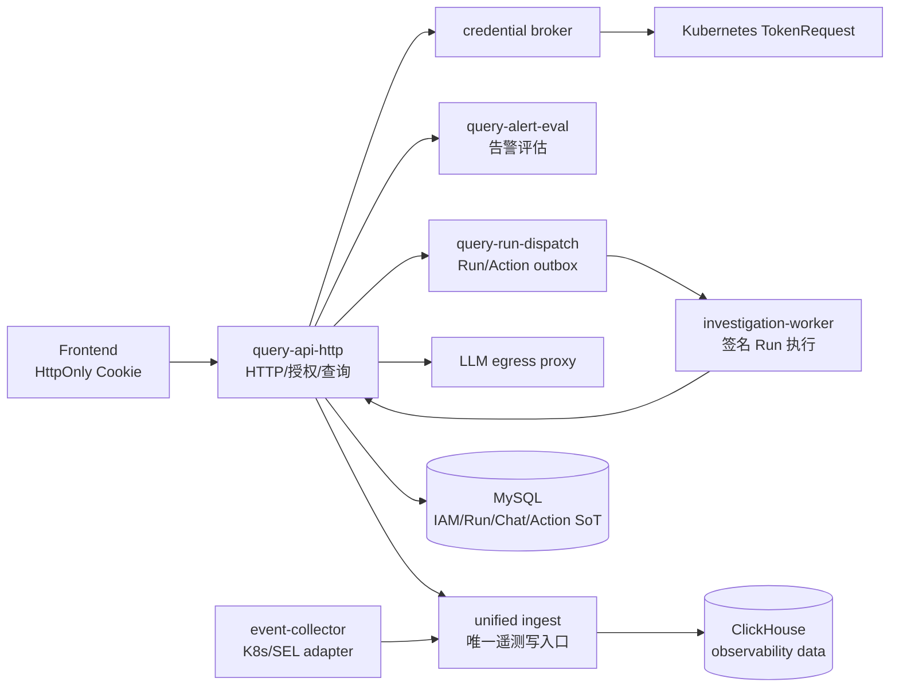

# AIOps 平台

本仓库是 AIOps 平台的当前实现入口。生产架构以 `docs/architecture/index.md`、
`SECURITY.md` 和部署 Chart 为准；历史方案仅用于迁移背景，不得作为运行时契约。

## 服务边界



## 本地验证

只读合同、Helm 和测试命令见 `docs/runtime-slo.md` 及 `deploy/scripts/`。生产密钥、
证书、图谱 gate manifest 和候选环境证据必须在发布流水线注入，禁止提交到 Git。

### UI v3 发布验收

Task 14 的发布必须在 `main` 上完成以下顺序：

```bash
cd ai-apm-query-go && GOCACHE=/tmp/aiops-go-build go test ./... -count=1
cd ../observability-frontend && npm test -- --run && npm run build
cd ..
docker build -t observability-frontend:v3-20260910 observability-frontend
docker build -t query-api:v3-20260910 ai-apm-query-go
docker build -t schema-migrator:v3-20260910 -f ai-apm-query-go/Dockerfile.schema-migrator ai-apm-query-go
docker build -t event-collector:v3-20260910 ai-event-collector
helm template aiops deploy/helm/aiops -f deploy/helm/aiops/values-prod.yaml \
  --set-string internalTLS.clientSAN="query-api.observability.svc.cluster.local\,query-run-dispatch.observability.svc.cluster.local\,query-alert-eval.observability.svc.cluster.local\,ai-orchestrator.observability.svc.cluster.local\,ai-investigation-worker.observability.svc.cluster.local\,ai-llm-egress-proxy.observability.svc.cluster.local\,ingest.observability.svc.cluster.local\,event-collector.observability.svc.cluster.local" \
  --set networkPolicy.kubernetesApiCIDRs='{10.0.0.0/8}' \
  --set-string secrets.existingSecretName=aiops-secrets
```

生产自研镜像必须使用 `global.imageDigests` 的不可变 `sha256` 引用；入口
`index.html` 不缓存，内容哈希资源长期 immutable。RAG 正文和审核状态以 MySQL
为准，Chroma 仅是可重建投影；索引不可用时正文仍可浏览，回答必须明确降级。

## 关键入口

- 架构与数据所有权：`docs/architecture/index.md`、`docs/ownership/data-owners.md`
- 安全边界：`SECURITY.md`
- 运行时预算：`docs/runtime-slo.md`
- 部署：`deploy/helm/aiops/`
- 发布证据：`deploy/scripts/collect-release-evidence.sh`
