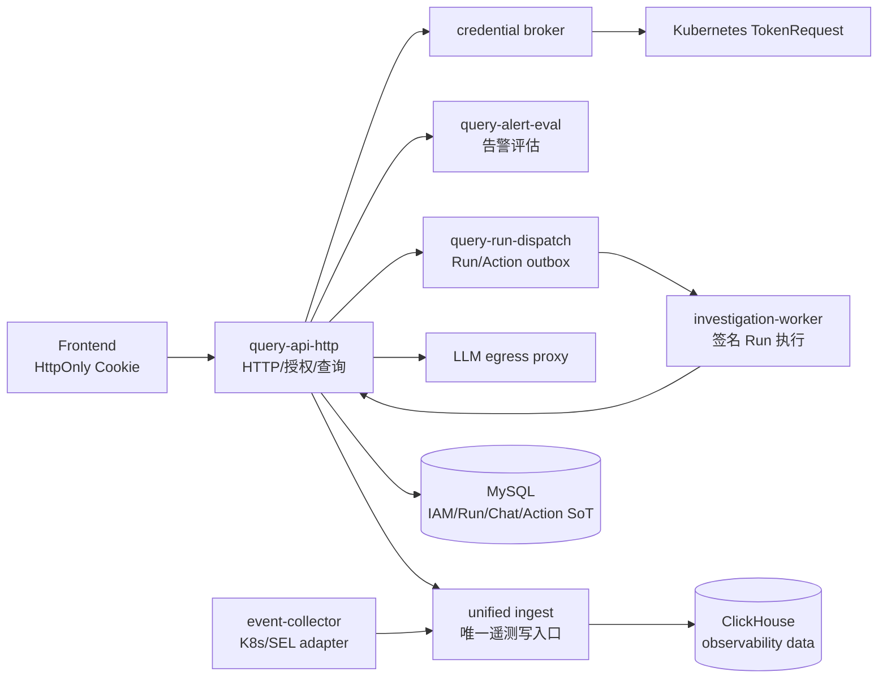

# AIOps 平台

本仓库是 AIOps 平台的当前实现入口。生产架构以 `docs/architecture/index.md`、
`SECURITY.md` 和部署 Chart 为准；历史方案仅用于迁移背景，不得作为运行时契约。

## 服务边界

## 本地验证

只读合同、Helm 和测试命令见 `docs/runtime-slo.md` 及 `deploy/scripts/`。生产密钥、
证书、图谱 gate manifest 和候选环境证据必须在发布流水线注入，禁止提交到 Git。

## 关键入口

- 架构与数据所有权：`docs/architecture/index.md`、`docs/ownership/data-owners.md`
- 安全边界：`SECURITY.md`
- 运行时预算：`docs/runtime-slo.md`
- 部署：`deploy/helm/aiops/`
- 发布证据：`deploy/scripts/collect-release-evidence.sh`
