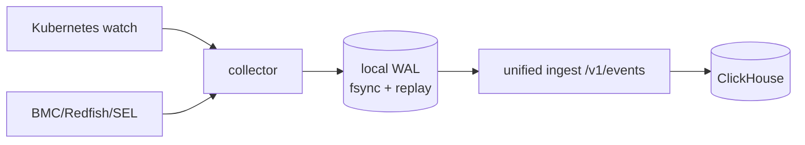

# ai-event-collector

事件适配器，负责 K8s Event 和可选的 out-of-band BMC/Redfish/IPMI SEL 采集。
它不拥有 ClickHouse schema/凭据，也不直接访问 Orchestrator；所有批次都发送到
unified ingest `/v1/events`，只有收到 durable receipt 才会推进本地 checkpoint。

## 运行边界

生产环境要求 `TENANT_ID`/`CLUSTER_ID` 为 canonical UUID、`INGEST_URL` 和
`INGEST_API_KEY` 非空、`WAL_DIR` 指向可持久化目录。默认拒绝 `/dev/ipmi0` 和
特权模式；没有 out-of-band 凭据时硬件采集标记为 unavailable，不回退到特权设备。

## 环境变量

| 变量 | 说明 |
|---|---|
| `TENANT_ID` / `CLUSTER_ID` | 注册后的 canonical UUID，缺失或 default 拒绝启动 |
| `INGEST_URL` | unified ingest 地址（默认 `http://ingest:8080`） |
| `INGEST_API_KEY` | Ingest 服务身份 |
| `WAL_DIR` | 本地 durable retry WAL；生产必填 |
| `K8S_WATCH_ENABLED` | 是否监听 K8s Event，默认 true |
| `SEL_COLLECT_ENABLED` | 是否启用 SEL，生产默认 false |
| `SEL_LOCAL_ONLY` / `SEL_NODES` | out-of-band 采集目标范围 |
| `IPMI_USER` / `IPMI_PASS` | 仅用于显式配置的 BMC 访问，不写入日志 |
| `BATCH_SIZE` / `FLUSH_INTERVAL_SECONDS` | 批量与刷新预算 |

## 可靠性和观测

批次先写本地 WAL 并 `fsync`，Ingest 不可用时保持 pending，恢复后按序重放；重试队列
有界并形成背压，禁止 drop-and-ack。`/health` 反映 Ingest 连通性和队列水位，
`/metrics` 暴露 flushed、retry、WAL records/bytes/oldest age。

ClickHouse 表和迁移由部署 Job 管理，代码中不执行 DDL；事件租户/集群作用域由受信
注册配置和 Ingest 校验共同保证。事件批次为 15 列 TabSeparated，末列是采集端按完整
事件事实计算的 SHA-256 `event_id`；Ingest 只接受 64 位小写十六进制 ID，ClickHouse
以 `(tenant_id, cluster_id, event_id)` 作为 ReplacingMergeTree 去重键，覆盖网络重试和
WAL 重放。
