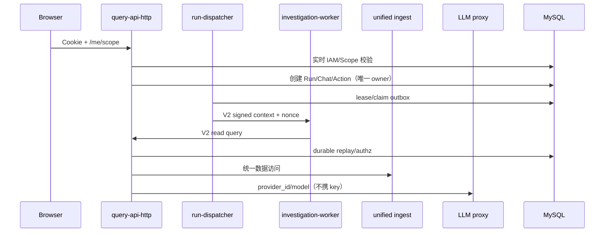

# 当前架构索引（V2）

## 控制流和信任边界

## 角色

| 进程 | 允许职责 | 禁止职责 |
|---|---|---|
| `query-api-http` | HTTP、认证授权、查询代理、Run/Chat/Action API | 后台 dispatcher/evaluator |
| `query-run-dispatch` | Run/Action outbox lease、投递、reconcile | 公共 HTTP |
| `query-alert-eval` | schedule、评估、租户告警落库 | 用户认证、动作执行 |
| `investigation-worker` | 仅签名 Run invocation、Query API 事实读取 | DB/K8s/Provider/本地权威状态 |
| `ai-event-collector` | K8s/SEL → Ingest Envelope | ClickHouse/Orchestrator 直写 |
| `credential-broker` | credential_ref → ≤300s TokenRequest | 任意 SA/namespace/action |

## 不可逆决策

- MySQL IAM/session/scope、Run、Chat、Action 为唯一权威。
- RCA 使用 V2 engine、版本化 policy 和 evidence provenance；旧 RCA 只读迁移工具。
- ClickHouse 只保存统一 ingest 接受的数据；Graph 是可重建投影，不是第二套 RCA 语义。
- 所有内部调用必须可追踪到 request/run/session/tool/action/event ID。

## 发布证据

生产切换需要与当前 commit、镜像 digest、迁移 checksum、policy/dataset digest 绑定的
release manifest。没有候选环境的迁移、恢复、证书轮换、图谱 gate 和故障注入证据时，
发布状态保持“未验证”。
