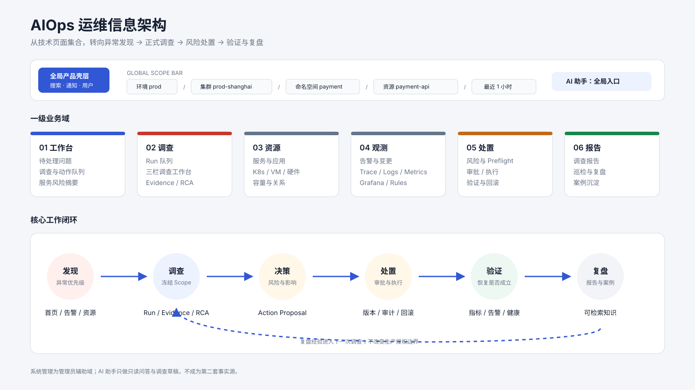
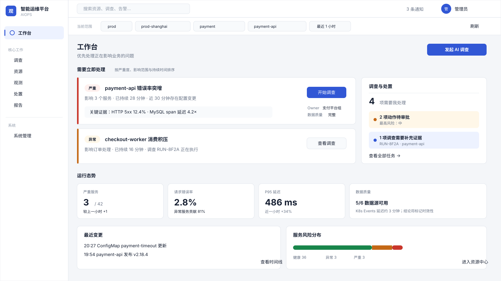
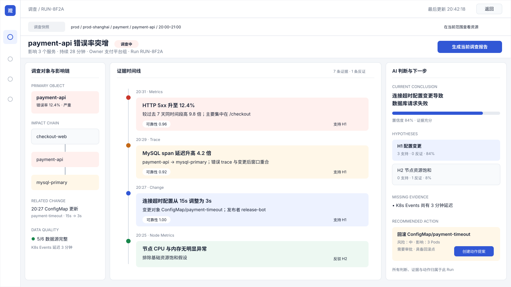
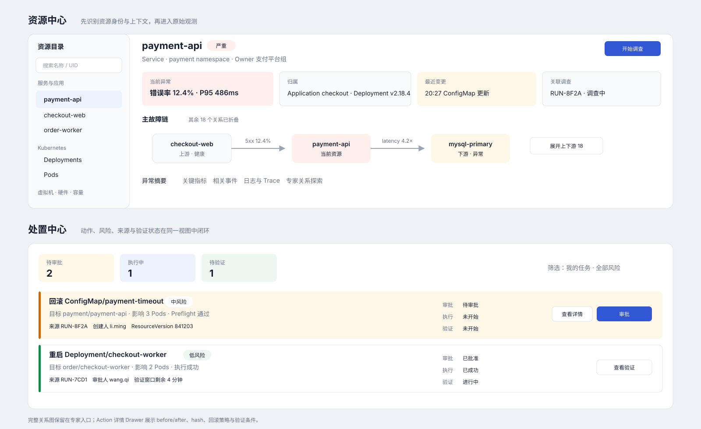
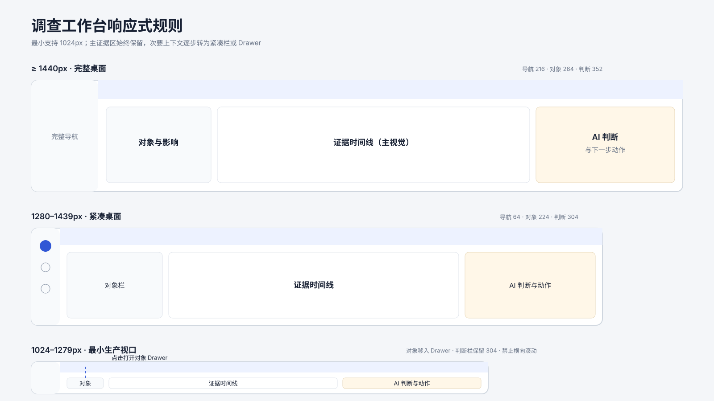

# AIOps 运维信息架构重构设计方案

**日期：** 2026-09-08

**状态：** 已收敛，可进入实施计划

**范围：** `observability-frontend` 的产品信息架构、全局上下文、核心页面编排、视觉语义与响应式规则

**不在本轮范围：** 重写 Query API、改变 Investigation/Action 持久化语义、替换图数据库、引入新的 UI 框架

## 1. 结论

新版产品从“按技术模块陈列页面”改为“按运维闭环组织工作”。一级导航收敛为：

1. 工作台
2. 调查
3. 资源
4. 观测
5. 处置
6. 报告
7. 系统管理（仅管理员）

AI 助手不再与调查页争夺一级导航。它是全局自然语言入口，只做问答、受审计的只读查询和调查草稿；需要跨源关联、根因结论、动作提案或审计闭环时，必须通过“转为正式调查”进入持久化 Investigation Run。

全局 Scope Bar 成为壳层中的核心状态，统一呈现环境、集群、命名空间、资源和时间范围。普通观测页面继承该上下文；Investigation 打开后展示创建时冻结的 Scope 快照，不被之后的全局切换改写；Action 永远继承其来源 Run 的 Scope。



## 2. 设计目标与成功标准

### 2.1 目标

- 用户进入系统后 10 秒内知道“现在最应该处理什么”。
- 从异常发现到正式调查不超过 2 次点击。
- Investigation 页面在一个视口内同时回答“影响谁、证据是什么、AI 怎么判断、下一步做什么”。
- 任一处置动作都能回溯到来源 Run、冻结 Scope、风险、审批、执行和验证状态。
- 资源页首先回答资源身份、归属、依赖与近期变化，再展示原始指标。
- 1280×720 下保留完整主任务路径，不依赖横向滚动。

### 2.2 可验收指标

- 首页首屏中，“待处理问题”面积不小于普通 KPI 总面积。
- 全站只存在一个可写的活动 Scope 来源；页面不得自行从 `localStorage` 解析 Scope。
- Chat 中的复杂诊断 CTA 能预填并创建 Investigation，但页面加载、告警到达、资源切换均不得隐式创建 Run。
- Investigation 的 Evidence、Hypothesis、Root Cause、Action 均来自持久化 Run 数据，不使用演示数据或视觉推断冒充真实记录。
- 处置中心的每个列表项首屏可见：动作、目标、来源 Run、风险、审批状态、执行状态和验证状态。
- 1440×900、1280×720、1024×768 三档视口通过布局测试；最小支持宽度为 1024px。

## 3. 设计原则

### 3.1 异常优先

首页的主视觉是按影响和紧迫度排序的问题队列，不是资源总数。普通 KPI 只承担背景说明。

### 3.2 Run 是正式调查的唯一容器

跨源证据、假设、根因、动作、审批、执行和报告都归属于 Run。Chat 会话不能成为第二套调查事实源。

### 3.3 Scope 显式、可见、可冻结

用户必须随时看见当前操作范围。活动 Scope 与 Run Scope 在视觉和状态上明确区分：前者可切换，后者是只读快照。

### 3.4 先摘要、后原始数据

指标、日志、Trace 和图谱不是默认首页内容。先展示可判断的证据摘要，点击后再展开原始观测数据。

### 3.5 颜色只表达语义

红色表示严重，橙色表示异常，黄色表示风险，绿色表示恢复，蓝色表示信息和可执行交互。导航、卡片和大面积背景以中性灰白为主。

## 4. 信息架构

### 4.1 一级导航

**工作台 `/overview`**

- 待处理问题
- 正在进行的调查
- 待审批/待验证动作
- 服务风险摘要
- 最近变更与数据质量

**调查 `/investigation`**

- 调查队列
- 新建调查
- 调查工作台
- Evidence 详情
- Run 报告

**资源 `/resources`**

- 服务与应用
- Kubernetes 资源
- 虚拟机
- 物理机与硬件
- 容量
- 资源关系（专家入口）

**观测 `/observe`**

- 告警事件
- 链路
- 日志与指标
- 变更时间线
- Grafana
- 告警规则

**处置 `/actions`**

- 待审批
- 待执行
- 执行中
- 待验证
- 已完成/失败

**报告 `/reports`**

- 调查报告
- 巡检报告
- 故障复盘

**系统管理 `/admin/*`**

- 用户与角色
- 集群接入与设置
- 图谱运维

### 4.2 现有路由迁移

- `/observability/service` → `/resources?kind=service`
- `/observability/relationships` → `/resources?view=relationships`
- `/observability/vms` → `/resources?kind=vm`
- `/infra/k8s` → `/resources?kind=kubernetes`
- `/hardware` → `/resources?kind=hardware`
- `/capacity` → `/resources?view=capacity`
- `/alerts/events` → `/observe?view=alerts`
- `/alerts/rules` → `/observe?view=rules`
- `/observability/trace` → `/observe?view=traces`
- `/observability/log` → `/observe?view=telemetry`
- `/changes` → `/observe?view=changes`
- `/observability/grafana` → `/observe?view=grafana`
- `/admin/approvals` → `/actions`
- `/report` → `/reports`
- `/ai/chat` 保留为深链与历史会话页，但从一级导航移除

迁移期保留旧路由并使用 React Router `Navigate` 转发，至少保留两个小版本，避免书签和测试深链失效。

## 5. 全局壳层与 Scope Bar

### 5.1 壳层

左侧导航默认宽 216px；1280px 及以下自动收敛为 64px 图标栏，用户仍可手动展开。顶部第一行放全局搜索、通知和用户；第二行固定 Scope Bar，不随页面滚动消失。

Scope Bar 顺序固定为：

`环境 prod / 集群 prod-shanghai / 命名空间 payment / 资源 payment-api / 最近 1 小时`

### 5.2 Scope 数据模型

```ts
type TimeRange =
  | { mode: 'relative'; minutes: 15 | 60 | 360 | 1440 }
  | { mode: 'absolute'; start: string; end: string }

interface ActiveScope {
  tenantId: string
  environment: 'prod' | 'staging' | 'test' | 'dev'
  clusterId: string
  namespace: string
  resource?: { type: string; id: string; label: string }
  timeRange: TimeRange
}
```

Cluster 仍通过 `/me/scope` 写入服务端会话，成为授权边界；namespace、resource、timeRange 是查询上下文。切换父级 Scope 时必须清空不再有效的子级值。Scope 变化后查询库重新拉取数据，不允许页面直接刷新浏览器。

### 5.3 Run Scope

创建 Run 时将当前 Scope 展开为绝对 `query_window_start/end`。打开 Run 后，Scope Bar 切换成灰色只读“调查快照”样式，并提供“在当前全局范围查看资源”链接。Run 页面不得调用 `setActiveScope` 改变全局上下文。

## 6. 核心页面

### 6.1 工作台首页

首屏采用两列结构：左侧约 68% 是“当前最重要的问题”，右侧约 32% 是“调查与处置队列”。普通 KPI 放到第二屏的紧凑摘要行。

问题项的排序键为：严重度、影响服务数、持续时间、是否有近期变更、是否已有调查。每项展示：异常标题、影响对象、开始时间、关键证据、可信度/数据质量、负责人和主动作。

主动作遵循状态：

- 未调查：`开始调查`
- 调查中：`查看调查`
- 待审批：`查看处置`
- 已恢复：`查看验证`



### 6.2 调查中心

调查中心默认不是通用表格，而是按状态分组的队列。顶部显示“需要我处理”“正在调查”“待验证”“已结束”四个视图，列表项突出目标、症状、影响、持续时间、当前阶段和负责人。Run ID 降级为辅助信息。

新建调查采用单页轻表单，默认继承全局 Scope，只让用户补充资源、症状/目标和动作模式。若来自 Chat、告警或资源页，来源上下文与初始问题自动预填，但最终仍需用户显式点击“发起调查”。

### 6.3 调查工作台

桌面端稳定三栏：

- 左栏 240–264px：调查对象、影响链、Scope 快照、相关变更。
- 中栏弹性宽度：证据时间线和原始详情，是页面主视觉。
- 右栏 320–352px：AI 判断、假设、置信度、缺失证据、下一步动作。

Evidence 以事件卡而不是 Metrics/Logs/Traces Tab 为第一层。卡片标题使用“时间 + 可判断事实”，例如“20:31 HTTP 5xx 升至 12.4%”。卡片标记来源、可靠性、数据质量和支持/反驳的 Hypothesis；点击后在中栏内展开原始数据或进入 Evidence 深链。

右栏把 AI 输出拆成可审计结构：当前结论、候选假设、反证、缺失证据、建议动作。根因达到发布条件时显示结论；数据不足时必须显示 `insufficient_evidence`，不使用确定性措辞。



### 6.4 AI 助手

AI 助手通过顶部入口或右下角 Dock 打开，默认携带当前 Scope。它负责：

- 产品导航和解释
- 受审计的只读单源查询
- 生成调查问题草稿
- 将当前对话转换成 Investigation 草稿

当用户要求根因、跨服务关联、变更关联、K8sGPT 或环境处置时，AI 助手展示结构化 CTA：说明为何需要正式调查、将冻结的 Scope、预期证据源和“转为正式调查”按钮。Chat 不直接创建 Action，也不在聊天消息中执行环境变更。

### 6.5 资源中心

资源中心使用“目录 + 详情 + 上下文”布局。顶部资源身份区优先展示：类型、名称、健康、Owner、所属应用、Namespace、Deployment/Node、最近变更、当前告警。

中间内容顺序为：异常摘要、关键指标、相关事件、日志/Trace；右侧上下文区展示上游、下游、影响面和关联调查。默认关系图只渲染一条主故障链，其余节点按类型折叠。完整图放到“专家关系探索”。



### 6.6 处置中心

处置中心是普通用户可查看、审批人可操作的业务页面，不再藏在系统管理中。每个动作必须显示：

- 操作与目标
- 来源 Investigation
- 风险等级与影响范围
- Preflight 与资源版本
- 审批、执行、验证状态
- 创建人、审批人和时间

高风险操作在 Drawer 中展示 before/after、规范化参数、动作 hash、审批意见、回滚策略和验证条件。批准/驳回保持显式二次确认与幂等键。没有审批权限的用户可查看状态，但看不到可执行按钮。

## 7. 数据流与状态边界

1. 用户在 Scope Bar 选择集群。
2. 前端调用 `POST /me/scope`；成功后才更新 Zustand 活动 Scope。
3. 首页、资源和观测页面依据活动 Scope 拉取数据。
4. 用户从问题、告警、资源或 Chat 点击“开始/转为正式调查”。
5. 新建页预填上下文，用户显式提交 `POST /ai/runs`。
6. Run 创建时冻结 tenant、cluster、resource 和绝对时间窗。
7. Investigation Worker 产出 ToolRun、Evidence、Hypothesis、RCA 与 Action Proposal。
8. 调查工作台通过详情 API 加载快照，通过 SSE 增量更新事件。
9. Action 在处置中心审批、执行并验证，状态回投到 Run。
10. Run 结束后生成报告，可沉淀为案例。

读取失败必须显式呈现来源错误、重试入口和最后更新时间；不得降级为伪造健康数据。SSE 断线按现有 sequence 重连，详情 API 仍是权威快照。

## 8. 视觉系统

### 8.1 色彩

- 背景：`#F5F7FA`
- 主表面：`#FFFFFF`
- 次表面：`#F8FAFC`
- 主文本：`#172033`
- 次文本：`#5B667A`
- 边框：`#DDE3EA`
- 交互蓝：`#3157D5`
- 严重红：`#C9362B`
- 异常橙：`#C46816`
- 风险黄：`#A46F0A`
- 恢复绿：`#18864B`

大面积蓝色品牌块改为中性表面，只在当前导航、链接和主按钮使用蓝色。状态色不能单独传达意义，必须同时有文字或图形标记。

### 8.2 密度与尺寸

- 页面主间距：20px；紧凑态 16px。
- 卡片圆角：8px；不使用大面积阴影。
- 基础字号：13px；标题 20px；关键数值 24px。
- 表格行高：44px；证据卡最小高 72px。
- 所有主要点击目标最小 36×36px。

## 9. 响应式行为

### 9.1 1440px 及以上

完整侧栏 + 两行顶部壳层。调查工作台保持 264px / 弹性 / 352px 三栏。

### 9.2 1280–1439px

侧栏自动折叠为 64px。调查工作台使用 224px / 弹性 / 304px；隐藏辅助字段但保留对象、证据、结论和动作。首页仍为 2:1 两列。

### 9.3 1024–1279px

左侧对象栏变成可唤起 Drawer，右侧判断栏变成固定宽侧栏；首页队列纵向堆叠。资源上下文移入 Tab。低于 1024px 显示“不支持生产操作”的只读提示，本轮不承诺移动端处置。



## 10. 权限、审计与安全

- 一级导航按“可见信息”开放，危险动作按 capability 控制；不能把导航隐藏当授权。
- Run/Evidence 延续 tenant + cluster + run 三元授权。
- Action 读取和决策分权；只有 approver/admin 显示批准与驳回。
- UI 不显示 provider URL、SQL、token、内部拓扑地址或原始异常栈。
- 所有 Action 决策带 `action_version` 与 idempotency key；资源版本不匹配时阻止执行并要求重新评估。
- Chat、Investigation 和 Action 的审计身份保持分离，不互相伪装。

## 11. 可访问性与文案

- 键盘可遍历全局 Scope、队列和三栏工作台。
- 状态变化使用 `aria-live="polite"`，危险失败使用 `role="alert"`。
- 图谱节点和颜色均提供文本替代；主故障链可用列表读取。
- 用户文案使用中文业务词，Run ID、Evidence ID、hash 等仅作为辅助技术字段。
- 禁止“AI 已确认根因”这类超出证据的措辞；使用“当前结论”“置信度”“仍缺少”。

## 12. 测试与验收

组件测试覆盖：Scope 级联清理、旧路由重定向、Chat 转调查草稿、Run Scope 冻结、Evidence 真实来源、Action 权限和状态映射。

Playwright 覆盖三条主链：

1. 首页异常 → 新建调查 → Run 工作台
2. Chat 复杂问题 → 转为正式调查 → Scope/问题预填
3. Run Action → 处置中心审批 → 执行/验证状态回显

视觉回归至少采集 1440×900、1280×720、1024×768 的首页、调查工作台、资源中心和处置中心。验收时同时检查无横向溢出、主动作可见、文字不截断关键语义。

## 13. 迁移策略

实施分四个可独立发布的阶段：

1. 壳层与 Scope：新增上下文模型、Scope Bar 和兼容路由，不改业务页数据源。
2. 工作台与调查：先完成首页问题队列、调查中心和三栏工作台，建立主闭环。
3. 资源与观测：聚合现有页面到新入口，默认主链视图，保留专家模式。
4. 处置与收尾：迁移审批中心、补齐验证态、清理旧导航并完成视觉回归。

任一阶段出现问题时可通过 feature flag 回退旧壳层；Run、Evidence、Action API 与数据库不做破坏性迁移。

## 14. 非目标

- 不在本轮引入移动端完整操作能力。
- 不重写 ECharts/G6 渲染引擎。
- 不新增自动执行策略或提升 AI 权限。
- 不将所有底层观测页强行合并成一个巨型组件。
- 不为了设计稿填充任何生产中不存在的字段；缺少字段时显示明确未知或待接入状态。
