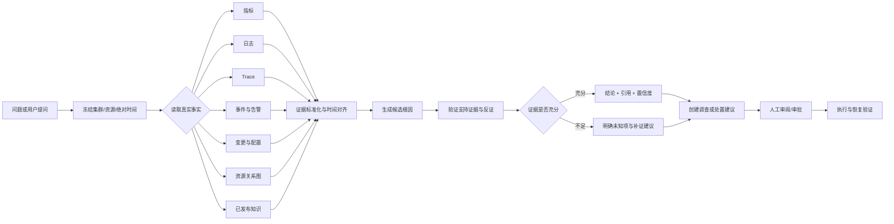

# AIOps 任务流 UI 重设计规范

**日期：** 2026-09-12  
**状态：** 已确认  
**被测入口：** `http://localhost:30253/`  
**适用范围：** `observability-frontend` 的应用壳层、总览、问题、资源、调查、处置、AI 助手、知识/报告入口与系统管理  
**高保真交互稿：** `/Users/mssc/.codex/visualizations/2026/09/11/01a08ff2-2967-7ea2-aa51-5545a6a1bd3d/aiops-ui-redesign.html`

## 1. 文档效力

本文是 2026-09-12 确认的全新 UI 表达基线，后续实现和验收智能体必须完整阅读。

- 本文替代旧设计中与一级导航、页面职责、首屏信息层级、AI 入口和视觉表达冲突的部分。
- 本文不改变后端事实合同、租户/集群授权、资源 canonical 身份、调查持久化、处置审批与审计要求。
- 旧页面和旧原型只能用于确认已有能力是否被迁移，不得作为新版布局依据。
- 高保真交互稿用于理解空间关系与交互方向；其中示例文字不属于生产数据。正式产品只能展示当前环境真实接口返回的数据。
- 实现后必须按 `docs/superpowers/plans/2026-09-11-aiops-full-acceptance-agent-plan.md` 重新执行真实环境完整验收，历史 PASS 不得复用。

## 2. 现场页面问题

2026-09-12 对可运行环境进行了只读巡检，覆盖平台总览、集群总览、助手、调查、处置、资源、观测、图谱和系统管理。

### 2.1 全局问题

1. **作用域表达矛盾。** 平台总览声明不受当前集群影响，但顶栏和页面仍出现“请选择作用域”或集群选择提示；系统管理页也保留不必要的集群语境。
2. **一级导航按功能模块而非任务组织。** “助手、知识、报告”与“调查、处置”并列，操作者需要先理解系统模块，再判断下一步去哪。
3. **当前路由与导航高亮不一致。** 资源、观测和图谱等页面可能回落高亮“平台”，用户无法确认所在位置。
4. **首屏重复表达同一风险。** 数据不完整、数据陈旧、warning code 和状态卡多次出现，重要问题反而被向下挤压。
5. **内部技术值过度暴露。** UUID、原始 ISO 时间、规则表达式、内部 error code 和英文 operation 名称占据首屏。
6. **卡片、页签和状态过多。** 相同层级元素大面积平铺，缺少唯一主任务和视觉焦点。
7. **真实数据可信度没有形成统一表达。** 局部页面分别显示 partial、stale、未知或未提供，但用户不能快速判断哪些结论仍可信、哪些功能受影响。

### 2.2 页面问题

- **平台总览：** 预警条重复；资源载体说明占据运营首屏；最高优先级问题仍显示内部规则或资源 UID。
- **集群总览：** 名称、完整 UUID、版本、同步时间和多种状态挤在同一标题区域；问题与资源事实竞争注意力。
- **观测中心：** 问题、告警、指标、日志、Trace、事件、变更七个同级页签，把“待处理对象”和“诊断证据”混为一层；问题表格列数过多且重复显示当前集群。
- **资源中心：** 名称、类型、namespace、UID、时间和状态以自由文本堆叠，无法快速横向比较；关系图入口层级重复。
- **调查中心：** “需要我处理、正在调查、待验证、已结束”与处置状态交叉；部分记录的症状实为动作或审批描述。
- **处置中心：** 顶层类型页签和生命周期页签叠加；未审批动作同时出现“未知执行、待验证”等未来状态，造成错误心智模型。
- **AI 助手：** 三栏布局固定占宽；历史会话以 UUID 或弱标题为主；Scope 面板重复技术字段；“清空”与“新建”并列，破坏性动作权重过高。
- **图谱：** 标题和说明重复；筛选、图例和操作容易挤压画布；失败时直接暴露英文错误 `graph operation is unavailable`。
- **系统管理：** 首屏只有摘要卡和大量空白，没有以“需要处理的问题”作为入口；全局管理仍显示集群作用域。

## 3. 设计目标

平台首先服务值班运维人员，其次服务平台管理员。每个工作区必须在 5 秒内回答四个问题：

1. 发生了什么？
2. 影响什么？
3. 证据是否可信，原因是什么？
4. 现在应该做什么？

核心操作闭环固定为：

```text
发现问题 → 定位原因 → 形成调查结论 → 提出受控处置 → 审批与执行 → 验证恢复
```

设计不追求把后端对象全部平铺到一级页面，而是保证任何能力都能从对应任务上下文到达。

## 4. 新信息架构

### 4.1 一级导航

一级工作区固定为五项：

1. **总览**：根据作用域显示全平台或当前集群态势。
2. **问题**：聚合活动问题，并承载告警与观测证据入口。
3. **资源**：资源目录、详情、依赖关系和图谱。
4. **调查**：从事实到根因结论的工作区。
5. **处置**：风险评估、预检、审批、执行和验证。

辅助入口：

- **知识与报告**置于导航底部或“更多”菜单，不与值班主链路争夺注意力。
- **系统管理**仅对管理员显示，固定在导航底部。
- **AI 运维助手**不再占用一级导航；它是所有页面的上下文抽屉，并保留完整会话深链。

### 4.2 能力归属

| 现有能力 | 新归属 | 进入方式 |
|---|---|---|
| 告警 | 问题 | 问题列表或问题详情中的“原始告警” |
| 指标、日志、Trace、事件、变更 | 问题证据 / 数据探索 | 问题详情证据页签或“数据探索” |
| 资源关系、图谱 | 资源 | 资源详情或资源页“关系图” |
| AI Chat | 全局上下文能力 | 页面主动作“询问 AI”或右侧抽屉 |
| 运维知识 | 知识与报告 | 助手引用、调查引用或辅助入口 |
| 报告 | 知识与报告 | 已结束调查、处置记录或辅助入口 |
| 审批 | 处置 | 当前阶段为“待审批”的动作 |

### 4.3 路由合同

| 目标 | Canonical 路由 | 兼容规则 |
|---|---|---|
| 全平台总览 | `/overview` | `/` 重定向到 `/overview` |
| 集群总览 | `/clusters/:clusterId` | 从平台集群行或集群选择器进入 |
| 问题中心 | `/clusters/:clusterId/problems` | 旧 `/observe?view=problems` 重定向并保留查询条件 |
| 数据探索 | `/clusters/:clusterId/problems/explore?signal=metrics` | 旧 metrics/logs/traces/events/changes 入口重定向 |
| 资源中心 | `/clusters/:clusterId/resources` | 保留现有资源详情深链 |
| 资源关系图 | `/clusters/:clusterId/resources?view=graph` | 旧 `/graph` 重定向 |
| 调查中心 | `/clusters/:clusterId/investigations` | 旧 `/investigation` 路由重定向 |
| 处置中心 | `/clusters/:clusterId/actions` | 旧 `/actions` 路由重定向 |
| 完整 AI 会话 | `/clusters/:clusterId/assistant` | 从抽屉“展开会话”进入，不进入一级导航 |
| 系统管理 | `/admin` | 页面作用域固定为“系统范围” |

## 5. 作用域模型

### 5.1 全平台作用域

- `/overview` 顶栏显示“全平台”，不得出现“请选择集群”警告。
- 平台数据聚合当前用户全部授权集群，不读取或暗示活动集群。
- `/admin` 显示“系统范围”，不显示集群选择器；具体接入配置可以在页面内部选择目标集群。

### 5.2 集群作用域

- 问题、资源、调查、处置、完整 AI 会话必须绑定一个服务端授权的真实集群。
- 顶栏显示集群可读名称；完整 UUID 仅在详情、复制动作或审计信息中出现。
- 切换集群时尽量保持当前工作区，例如从 A 集群问题页切到 B 集群问题页。
- 当前资源与时间窗口作为二级上下文显示为可移除标签，不得伪装成一级 Scope。

### 5.3 时间表达

- 首屏使用“6 分钟前”等相对时间。
- 悬停、聚焦或打开详情时提供带时区的绝对时间。
- 调查、AI 会话和审计记录继续冻结绝对时间窗口，不因页面刷新漂移。

## 6. 页面规格

### 6.1 总览

页面主问题：**现在最需要处理什么？**

全平台总览按以下顺序组成：

1. 页面标题与唯一刷新动作。
2. 至多一条数据可信度提示，格式为“受影响来源 + 影响能力 + 最近成功时间 + 查看影响”。
3. 三个事实指标：活动严重问题、受影响集群、采集覆盖。
4. 主区域“优先处理”，按严重度、影响、持续时间和数据可信度排序。
5. 次区域“集群状态”，按严重、降级、未知、健康排序。

禁止项：

- 不显示资源类型说明卡。
- 不重复 warning code。
- 不显示原始规则表达式、完整 UUID 或无业务含义的内部状态。
- 不使用 0–100 健康分数。

集群总览复用相同骨架，但指标改为活动问题、受影响资源和采集覆盖；主区域显示当前集群问题，次区域显示资源与基础能力异常。

### 6.2 问题中心

问题中心吸收原观测中心的首层职责。默认只显示待处理问题。

首屏表格最多六列：

1. 问题：人类可读标题与严重度。
2. 影响对象：资源可读名称或受影响数量。
3. 状态：待调查、调查中、待决策、观察中。
4. 最近变化：相对时间与趋势。
5. 下一步：每行唯一主动作。
6. 可选负责人，仅在真实接口提供时显示。

问题标题必须由展示层生成，例如：

```text
服务错误率升至 31.04%
```

而不是：

```text
regression-threshold-upd: error_rate 31.04 > threshold 5.00
```

选中问题后打开右侧详情抽屉，内容顺序为：问题摘要、影响、时间线、AI/人工结论、证据、关联变更、调查与处置。指标、日志、Trace、事件和变更只在“证据”内成为二级页签；页签超过四项时使用“更多证据”菜单。

### 6.3 资源中心

首屏使用对齐表格，不使用多行自由文本卡片。最多六列：名称、类型/namespace、健康、活动信号、最近变化、操作。

- UID、标签、原始 JSON、完整时间和 owner references 放入详情抽屉。
- 容器资源、KubeVirt 虚拟机和关系图是资源页的局部视图，不是一级导航。
- 选择资源后，详情优先显示当前状态、关联问题和关键依赖，再显示规格字段。
- 图谱默认让画布占据主体；未选择节点时不打开检查器，图例默认折叠。
- 图谱错误使用中文类别、影响、重试和“查看技术详情”，不得把英文底层错误直接作为主文案。

### 6.4 调查中心

调查只保留三个队列：需要我处理、进行中、已结束。“待验证”属于处置生命周期，不再成为调查一级队列。

每条调查显示：

- 目标资源或集群范围。
- 当前结论或当前缺口。
- 当前调查阶段。
- 已获得证据数 / 预期证据数；预期数未知时只显示已获得数量。
- 最近更新时间。
- 一个主动作：审阅结论、补充证据、继续调查或查看结果。

Run ID、集群 ID、冻结时间、发起人、预算、终止原因和审计信息进入详情。

### 6.5 处置中心

处置只使用一个列表和一个统一生命周期：

```text
风险评估 → 预检 → 审批 → 执行 → 验证
```

- 当前阶段以前的步骤显示完成，当前步骤显示进行中，以后的步骤不显示“未知”“待验证”等伪状态。
- 首屏最多五列：动作/目标、当前阶段、风险、更新时间、操作。
- 只有到达审批阶段且用户具备权限时显示批准/拒绝。
- 只有执行完成后才出现验证结果。
- 高风险动作必须在详情中显示影响范围、ResourceVersion、回滚方案与审计写入说明。

### 6.6 AI 运维助手

默认形态为右侧上下文抽屉，宽度 400–440px；复杂会话可展开为完整页面。

抽屉顶部显示可读上下文标签：集群、资源、时间窗口、问题。不得默认显示 UUID 和完整 ISO 字符串。

回答固定结构：

1. 结论。
2. 关键证据及来源。
3. 反证或尚未验证项。
4. 置信度及理由。
5. 下一步。
6. “创建调查”或“提出处置建议”；不得直接执行动作。

历史会话要求：

- 使用用户首问或服务端摘要生成可识别标题。
- 按今天、昨天、更早分组并支持搜索。
- UUID 仅用于详情复制。
- “清空全部”移入更多菜单并二次确认，不与“新对话”并列。

### 6.7 系统管理

- 首屏先显示“需要处理”，列出不可用组件、接入失败、索引任务失败和图谱运维异常。
- 摘要数字位于问题列表之后，不使用大面积空卡。
- 每个问题直接提供相应配置或运维入口。
- 页面作用域固定为系统范围；集群目标由具体配置表单选择。

## 7. 智能故障定位能力设计



该能力链是合理的，前提是以下约束全部成立：

- 根因不是语言模型自由生成，而是对真实证据的可追溯解释。
- 证据缺失、陈旧或冲突时必须降低置信度，不得输出“已确认”。
- 知识只能辅助解释，不能替代当前环境事实。
- AI 只能创建调查草稿或动作建议，实际处置继续经过能力校验、预检、审批和审计。
- 恢复验证必须使用动作后的真实指标、日志、事件或资源状态，不能只依据动作 API 返回成功。

## 8. 数据可信度与真实数据规则

### 8.1 生产数据约束

- 生产构建禁止回退到 demo、fixture、随机数、静态数组或硬编码成功状态。
- 接口失败显示 error；部分来源失败显示 partial；时间超过来源 SLA 显示 stale；没有对象显示 empty；无权限显示 forbidden。
- `0`、`空数组`、`未提供`、`未知`和`接口失败`必须是不同状态。
- 页面每个数字都必须能追溯到 API 字段和权威源查询。
- 原始数据仅可在有大小限制、折叠、格式化和复制能力的技术详情区展示。

### 8.2 统一可信度提示

页面至多显示一条顶层可信度提示，包含：

```text
状态 + 受影响来源 + 受影响能力 + 最近成功时间 + 查看影响/重试
```

warning code 只写入技术详情和验收证据，不直接作为普通用户文案。

## 9. 视觉系统

### 9.1 布局

- 1440px 及以上：168px 可读文字侧栏、56px 顶栏、24–28px 内容边距。
- 1024–1279px：侧栏收敛到 64px 图标模式，保留可访问名称；页面表格隐藏非关键列。
- 小于 1024px：允许只读浏览；审批、执行和高风险编辑继续显示宽度门禁。
- 页面只有一个主要动作；其他动作使用次级按钮或行内链接。
- 汇总事实最多三个，不把每个数据块都做成卡片。
- 开放列表和表格使用分隔线，不使用“卡片套卡片”。

### 9.2 字体与间距

- 页面标题 24px / 500。
- 分区标题 16px / 500。
- 正文 14px / 400。
- 辅助信息 12px / 400，最低不得小于 11px。
- 只使用 400 和 500 两种主要字重。
- 使用 8px 间距基准；常用间距为 8、12、16、24、32px。

### 9.3 色彩

| 语义 | 色值 | 用途 |
|---|---|---|
| 页面背景 | `#F5F7FA` | 主画布 |
| 表面 | `#FFFFFF` | 顶栏、侧栏、必要卡片 |
| 主文字 | `#172033` | 标题和关键事实 |
| 次文字 | `#5B667A` | 说明和时间 |
| 分隔线 | `#DDE3EA` | 结构边界 |
| 交互 | `#3157D5` | 链接、选中与单一主动作 |
| 严重 | `#C9362B` | 严重故障 |
| 降级 | `#C46816` | 警告与部分数据 |
| 健康 | `#18864B` | 明确成功或恢复 |

状态不得只依赖颜色，必须同时提供文字或图标。禁止渐变、装饰阴影、彩虹式卡片和大面积彩色背景。

## 10. 文案规则

- 用户可读名称优先，技术标识后置。
- “失败”必须说明失败对象和可执行下一步，例如“关系图暂时不可用，资源列表不受影响。重试”。
- 不使用“数据异常”这类无法判断影响的泛化描述。
- 不把英文枚举直接展示给用户；保留复制技术详情。
- 同一概念只使用一个中文名称：问题、调查、处置、证据、作用域。
- 操作按钮使用动词和对象，例如“开始调查”“审阅并审批”“修复接入”。

## 11. 组件合同

建议固化以下展示合同：

```ts
export type Workspace = 'overview' | 'problems' | 'resources' | 'investigations' | 'actions'

export interface DataTrustSummary {
  state: 'ready' | 'partial' | 'stale' | 'error'
  sourceLabels: string[]
  affectedCapabilities: string[]
  lastSuccessAt?: string
  technicalCodes: string[]
}

export interface ProblemRowView {
  id: string
  title: string
  severity: 'critical' | 'warning' | 'info'
  impactLabel: string
  workflowState: 'needs_investigation' | 'investigating' | 'needs_decision' | 'watching'
  changedAt: string
  nextAction: 'start_investigation' | 'open_investigation' | 'review_decision' | 'open_problem'
}

export interface AssistantPageContext {
  clusterId: string
  clusterName: string
  resourceUid?: string
  resourceLabel?: string
  problemId?: string
  problemLabel?: string
  from: string
  to: string
}
```

展示映射必须是纯函数并有单元测试；页面不得在 JSX 内重复拼接状态、规则表达式和技术错误。

## 12. 验收门槛

### 12.1 结构门槛

- 一级任务导航恰好五项，管理员辅助入口不计入。
- 任一页面一级页签不超过四项。
- 任一首屏表格可见列不超过六列。
- 任一页面只有一个视觉主动作。
- 当前路由必须准确高亮当前工作区。
- 全平台总览不显示集群必选警告；系统管理不显示全局集群选择器。

### 12.2 可理解性门槛

- 首屏不显示完整 UUID、原始 ISO 时间、warning code 或未本地化错误。
- 5 名目标用户中至少 4 人能在 5 秒内指出最高优先级问题、影响对象和下一步。
- 从平台总览到开始调查不超过 3 次主要操作。
- 从调查结论到审阅处置不超过 2 次主要操作。

### 12.3 可访问性与响应式门槛

- 正文和交互文字对比度至少 4.5:1。
- 所有导航、页签、抽屉、表格主动作和关闭动作可仅用键盘完成。
- 焦点顺序与视觉顺序一致；打开抽屉后焦点进入抽屉，关闭后返回触发点。
- 1440×900、1280×720、1024×768 和 1024×900 无不可控横向溢出、遮挡或文字截断。

### 12.4 数据与安全门槛

- 正式浏览器检查证明页面值与同一时间窗口的真实 API 一致。
- API 与真实权威源抽样对账通过；不能使用 fixture 作为通过证据。
- AI 回答有事实引用、未知项和置信度；数据不完整时不得输出确定根因。
- AI、调查和处置均不能绕过服务端 Scope、capability、审批、ResourceVersion 与审计门禁。

## 13. 后续智能体执行提示词

```text
你负责实现 AIOps 任务流 UI 重设计。

开始前必须完整阅读：
1. docs/superpowers/specs/2026-09-12-aiops-task-flow-ui-redesign.md
2. docs/superpowers/plans/2026-09-12-aiops-task-flow-ui-redesign.md
3. docs/superpowers/plans/2026-09-11-aiops-full-acceptance-agent-plan.md

严格按实施计划逐任务执行并保留每个检查点。不得沿用旧页面布局作为设计依据；旧实现只能用于迁移后端能力和路由兼容。

硬约束：
- 不修改或伪造真实环境数据，不加入 demo、fixture、随机数或接口失败时的模拟回退。
- 保留 tenant/cluster Scope、canonical resource identity、调查持久化、处置审批、ResourceVersion、回滚和审计安全边界。
- 全平台总览与集群工作区严格分离。
- 一级任务导航固定为总览、问题、资源、调查、处置；AI 使用上下文抽屉。
- 指标、日志、Trace、事件、告警和变更是问题证据，不做七个同级一级页签。
- 每完成一个任务先运行定向测试、完整前端测试和构建，再记录结果；失败时先定位原因，不跳过测试。
- 实现完成不等于验收通过。最后启动真实环境，按完整验收计划产生全新 RUN_ID 和证据，不复用历史 PASS。

只在明确授权后执行真实环境写操作、故障注入、审批、处置、删除或清理。发现规格冲突时停止冲突部分，记录涉及章节与影响，并请求用户决策；不得自行扩大权限或削弱门禁。
```

