# AIOps UI V3 实际渲染与编码对照

> **已确认基线（2026-09-10）：** 本指南、同目录可运行原型和实际 Chromium 截图共同构成 A 方案的视觉合同。任何页面实现若与[正式设计方案](../../2026-09-08-aiops-information-architecture-design.md)冲突，以正式方案为准；不得退回 V2 的综合平台状态、Workload 合并统计、Pod/Container 合并、Service/Ingress 合并或 PVC/虚拟机磁盘双计数。

所有截图均由同一份 [aiops-ui-prototype.html](./aiops-ui-prototype.html) 实际渲染。示例中的集群、资源、指标和问题只用于设计表达，禁止进入生产代码、测试之外的默认数据或接口失败回退。

原型路由：`login`、`platform`、`cluster`、`resources`、`resource-detail`、`vm-detail`、`observe`、`assistant`、`investigation`、`actions`、`graph`、`knowledge`、`knowledge-new`、`reports`、`admin`。以 `?view=<route>` 切换页面。

## 1. 已确认的信息架构

- 一级导航：平台、集群、助手、调查、处置、知识、报告；系统管理固定在底部。
- 顶栏只选择真实 Kubernetes 集群。平台总览不受当前选择影响；其余工作区必须绑定一个实际集群。
- 平台页不制造综合健康结论，直接展示活动严重问题、受影响集群、未知/陈旧范围、采集覆盖、数据时效和最高优先级问题。
- 当前集群内，容器资源与 KubeVirt 虚拟机同级。容器直接按 Deployment、StatefulSet、DaemonSet、Job、CronJob、Pod、Kubernetes Service、Ingress 展示。
- PVC 是共享存储依赖的 canonical 资源；虚拟机磁盘是设备视图。二者通过真实引用链关联，不分别计入两个资源总数。
- NAD 是被 VMI 或 Pod 实际引用的 Multus 辅助网络定义，不是网卡、物理网络或首页主指标。
- 运维知识是一级工作区，覆盖故障案例、运维文档、内置 Playbook、人工新增、审核发布、范围、版本和索引状态。
- 智能助手是集群级一级工作区。每个会话冻结集群、可选资源、绝对时间和知识范围；回答必须同时呈现事实、已发布知识、不确定性、下一步和受控动作边界。

## 2. 桌面实际渲染

### 登录

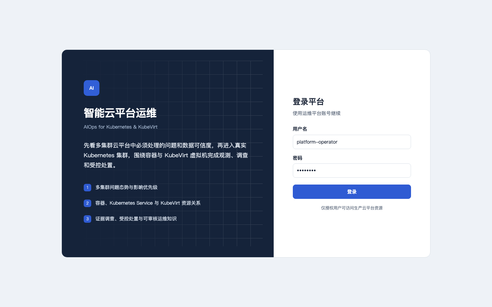

单一登录任务；左侧只表达真实产品能力，不展示虚构客户数、告警数或健康结论。

### 云平台运营态势

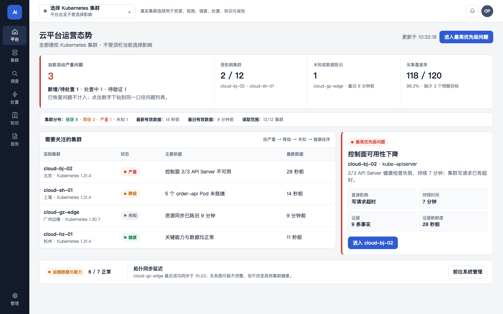

首屏从“当前活动严重问题”开始，同时给出受影响集群、未知/陈旧范围、采集分子/分母、四态集群分布、最新/最旧有效数据和最高优先级问题。AIOps 自身只保留异常优先的“运维数据与能力”带，完整组件状态进入系统管理。

### 集群详细总览

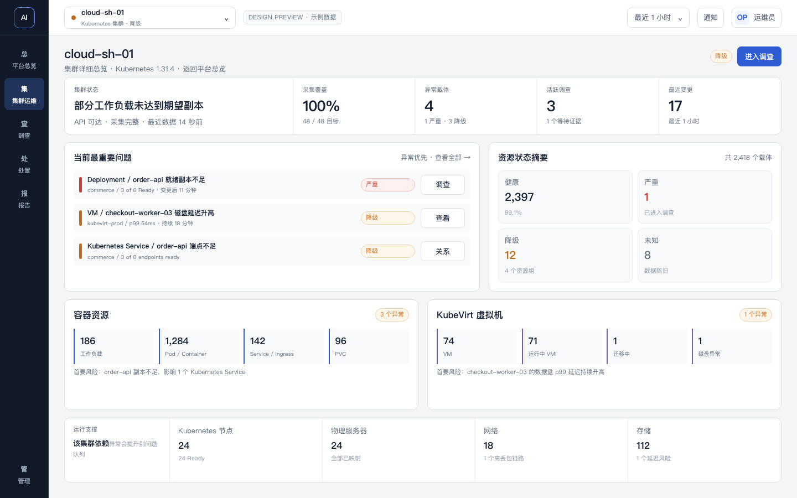

先显示集群状态依据和问题队列；容器资源以八个明确 Kind 呈现，KubeVirt 与其同级且不显示磁盘/NAD 裸数量。控制面、节点与物理宿主、网络面、存储面和 KubeVirt 能力作为集群基础依赖状态带。

### 资源目录

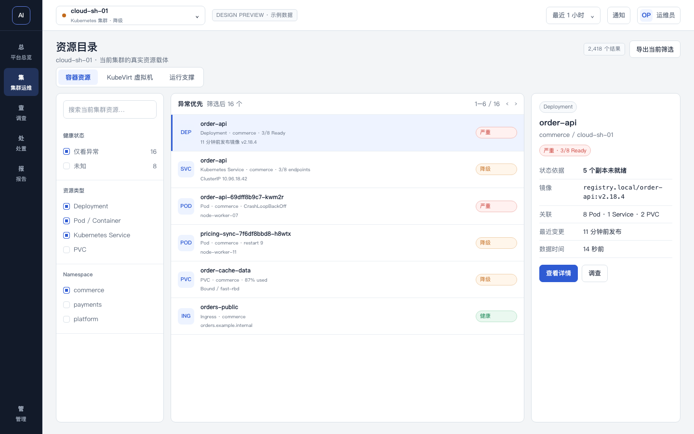

容器资源与 KubeVirt 是两个主工作组；Kind、Namespace、状态和名称搜索均为当前页面的局部筛选。PVC、PV、StorageClass 和被实际引用的 NAD 从依赖或详情进入，不作为第三个资源产品线。

### Pod 资源详情

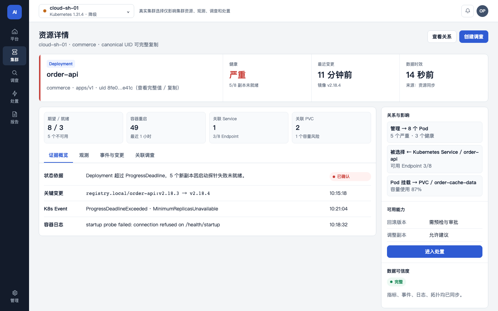

身份、健康依据和时效位于顶部；证据占主工作区；关系、影响和可用能力位于右侧。Container 仅在 Pod 内展开，长 UID、镜像和标签须有完整查看与复制入口。

### KubeVirt 虚拟机详情

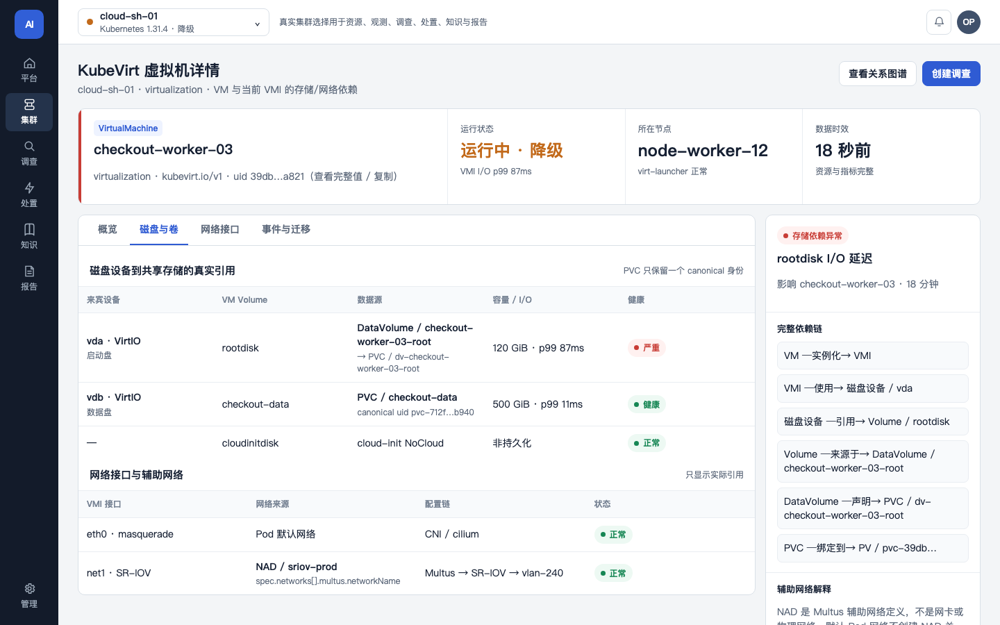

“磁盘与卷”用 `VM → VMI → 磁盘设备 → Volume → DataVolume → PVC → PV` 表达共享存储引用；同一个 PVC 只保留一个 canonical UID。“网络接口”区分 Pod 默认网络与实际引用的 `NAD → Multus/CNI → 实际网络`。

### 观测工作区

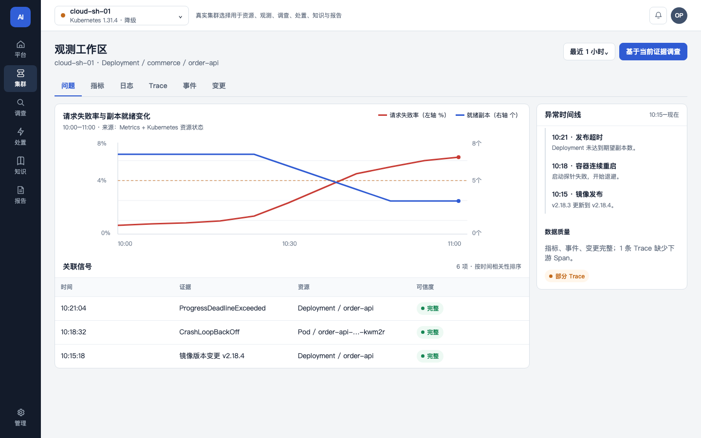

以问题和证据模式组织，不以数据源产品名组织。图表必须显示时间范围、单位、来源和图例；标题若声明两类指标，画面必须同时绘制对应序列。

### 智能运维助手与应答框

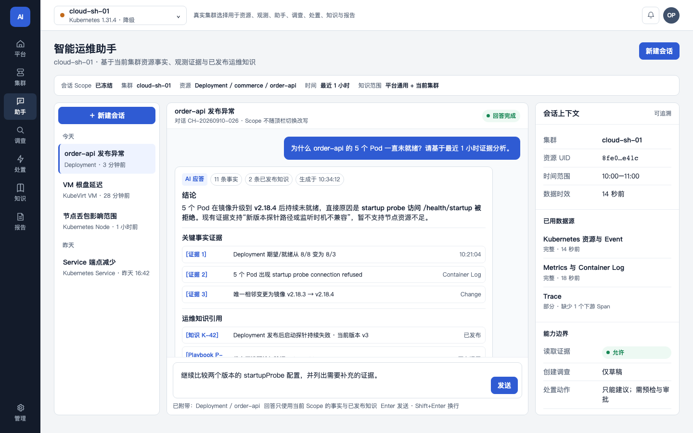

桌面采用会话列表、回答工作区、可追溯上下文三栏。Scope 带固定显示集群、资源、时间和知识范围，并明确“已冻结”；顶栏切换集群不能静默改写当前会话。中间回答区独立滚动，输入框固定在工作区底部，因此长回答完整可访问且不会撑破页面。

AI 应答不是一段无结构 Markdown，必须固定显示：

1. 结论；
2. 带来源与时间的关键事实证据；
3. 带范围、版本和发布状态的运维知识引用；
4. 不确定性与缺失证据；
5. 可验证的建议下一步；
6. 查看证据、打开知识、创建调查草稿等受控动作。

右侧上下文持续显示 canonical resource UID、数据时效、已用数据源及完整性。AI 不能直接执行命令；处置只能形成建议，并继续经过预检、审批、执行、验证和审计。

### 调查工作区

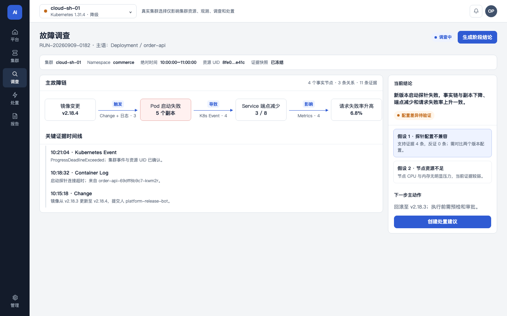

Scope 冻结带、证据与主故障链占主要宽度；结论、候选假设、反证、缺失证据和动作建议集中在右侧。事实关系使用实线，推断关系使用虚线并直接标注“疑似导致”。

### 处置工作区

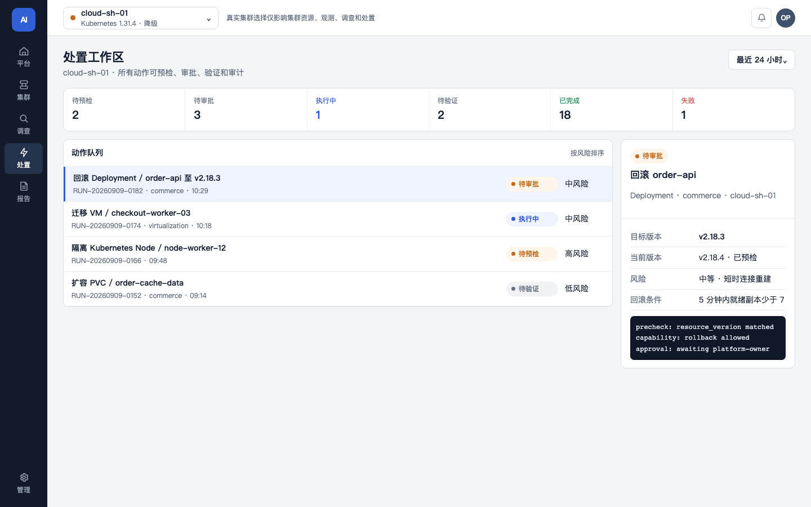

预检、审批、执行、验证、回滚条件和审计连续可追溯。“执行中”使用流程蓝，绿色只表示执行成功或验证通过。

### 资源关系图谱

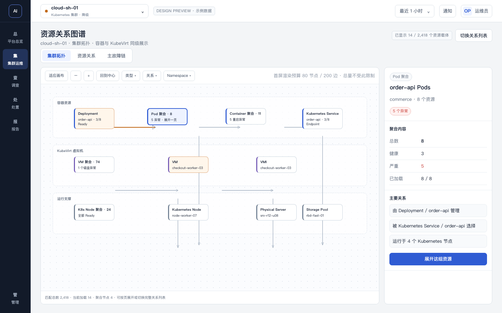

画布按访问/流量、控制器、运行实例、集群依赖分层，容器与 KubeVirt 平行。每条可见边直接显示中文关系和方向；聚合边显示数量。存储链明确区分 DataVolume 与 PVC，辅助网络链明确显示虚拟接口、NAD、Multus/CNI 和实际网络。右侧检查器给出源、关系、目标、事实/推断状态、权威字段和同步时间。

### 运维知识

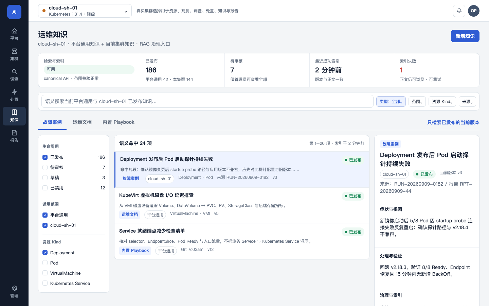

页头显示检索/索引可用性、已发布、待审核、最近索引和索引失败。页面内语义搜索仅检索当前租户的平台通用知识与当前集群知识；列表与详情同时显示类型、范围、来源、版本、审核和索引状态。

### 新增运维知识

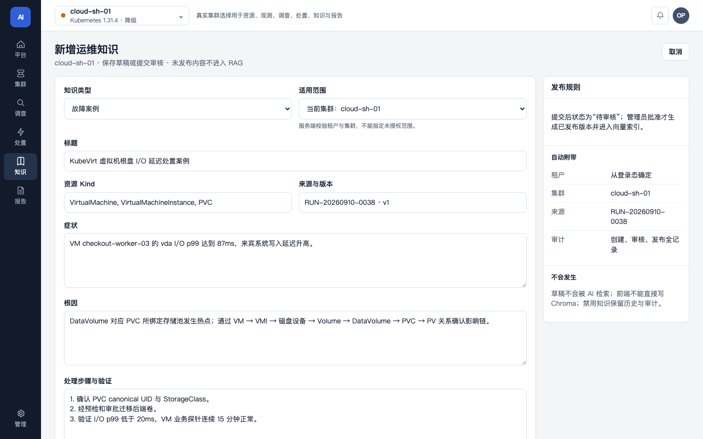

人工新增支持故障案例或运维文档、当前集群或有权限的平台通用范围、资源 Kind、来源、症状、根因、处理与验证。保存草稿不入 RAG；提交后待审核；发布后才进入当前版本索引。前端不得直接写 Chroma。

### 报告

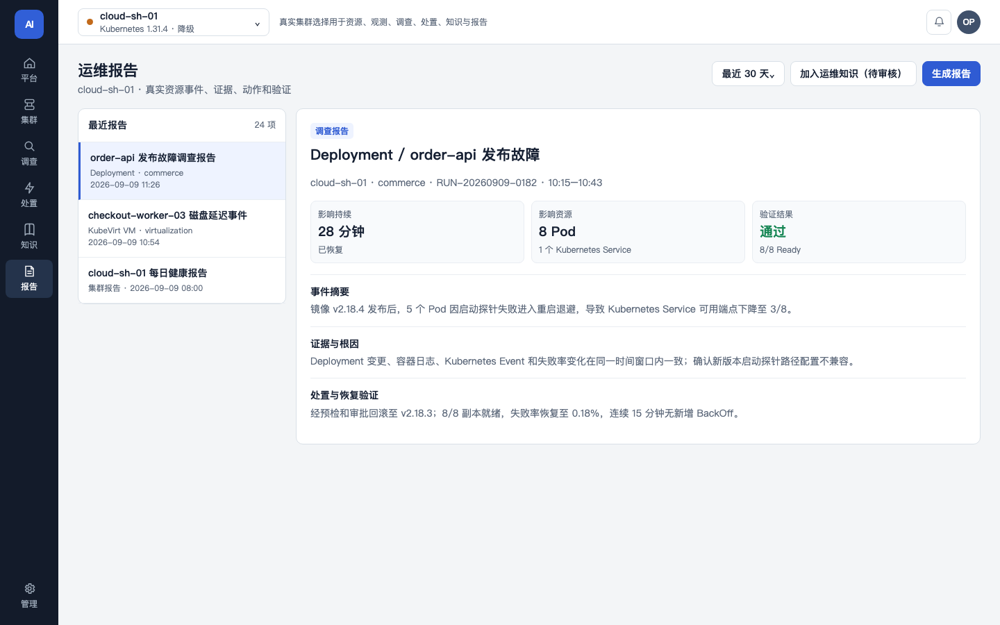

报告以真实资源事件为主语，明确显示影响、证据、处置和验证；历史业务语义仅作为标签。内容使用自然高度，禁止固定大卡制造空白。

### 系统管理

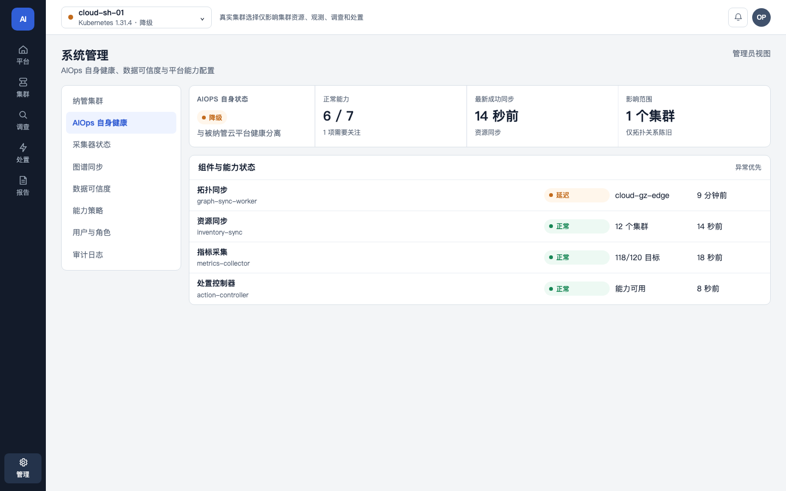

系统管理承载接入配置、AIOps 自身健康、采集器、拓扑同步、知识索引任务、数据可信度、能力策略、用户和审计。集群接入状态、集群资源健康与 AIOps 自身健康必须分开表达。

## 3. 响应式实际渲染

### 1280×720 云平台运营态势

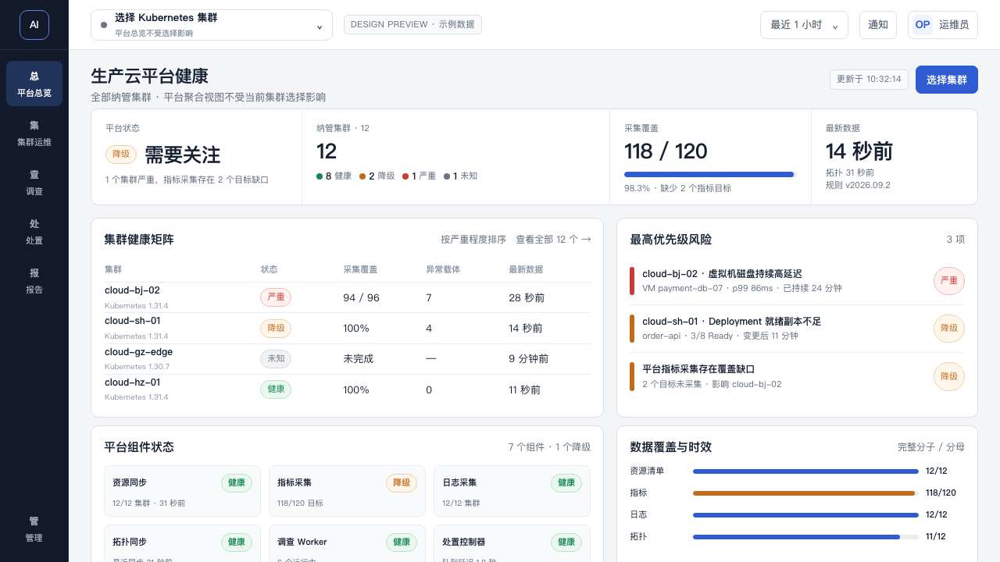

允许页面纵向滚动访问完整内容，禁止页面级横向溢出。

### 1024×768 资源目录

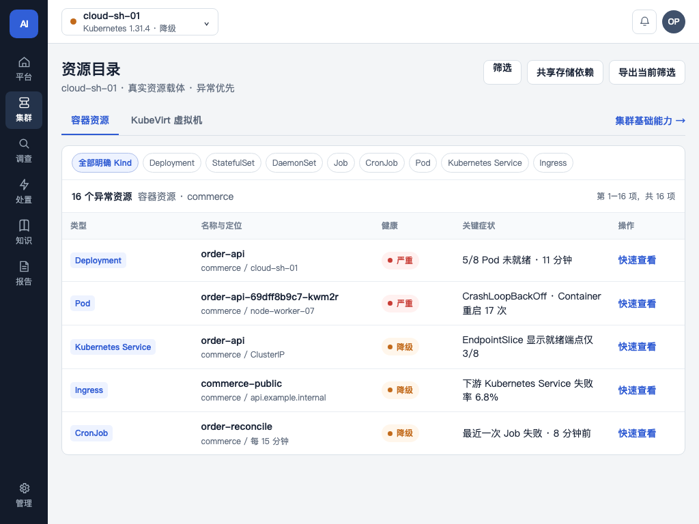

筛选栏收敛为“筛选”按钮，详情进入独立页面或 Drawer，结果区获得完整宽度。

### 1024×768 资源关系图谱

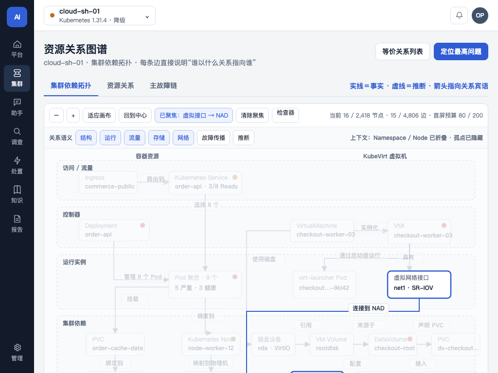

检查器收敛为按钮/Drawer；画布完整保留；总匹配量、当前加载量和 80/200 首屏预算必须持续可见。

### 1024×900 运维知识

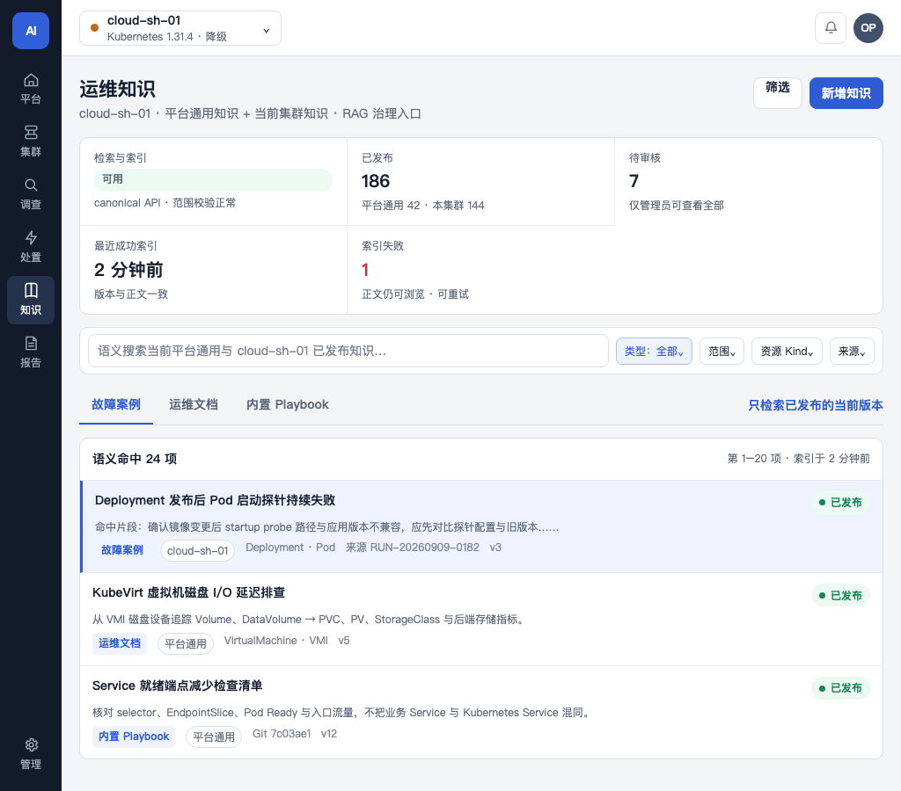

筛选收敛为按钮，详情转入 Drawer 或独立页，列表保留标题、命中片段、类型、范围、资源 Kind、来源和版本。

### 1024×900 智能运维助手

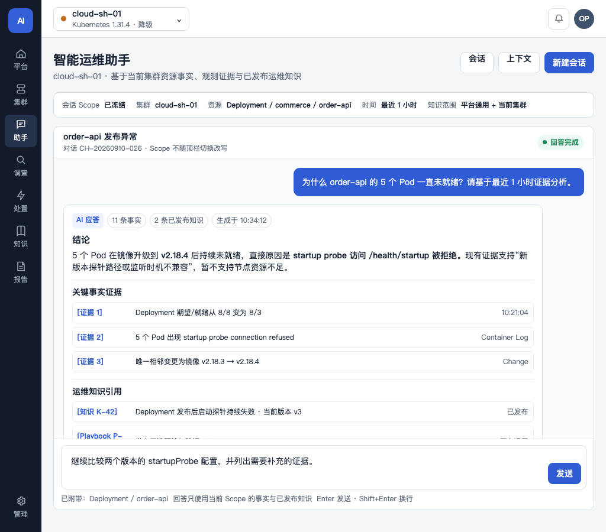

会话列表和上下文收敛为两个独立 Drawer 入口，不能挤压回答。Scope、结论、事实引用和输入区保留在首要单栏；Drawer 必须有可访问标题、关闭入口并限制在视口内。

## 4. 编码视觉合同

### 页面框架

- 1440px 导航轨 84–88px；1280px 及以下 70–72px。
- 顶栏 64px，只放真实集群选择、上下文说明、通知和用户入口。
- 页面采用 12 栏逻辑网格；1440px 外边距 28px，1280px 及以下 20px。
- 不存在全局搜索。局部名称搜索只在资源目录，语义搜索只在运维知识。
- 页头最多两个主动作；页面身份、Scope 和更新时间不能被次要筛选挤压。

### 尺寸与视觉语言

- 页面标题 22px，区域标题 15–16px，正文 14px，辅助文字不小于 12px。
- 卡片圆角 10px，控件圆角 7–8px，点击高度不低于 36px。
- 页面主间距 24px，区域间距 14–20px，卡片内间距 12–16px。
- 用边框、留白和背景层级建立结构；不使用装饰性阴影、大面积渐变或无业务含义的颜色。
- 健康色只表达健康，类别和流程状态使用中性色或交互蓝。

### 组件边界

- 壳层：`AppFrame`、`PrimaryNavigation`、`ClusterNavigator`、`ScopeRequired`。
- 平台与集群：`PlatformOperationsSummary`、`PriorityIssueQueue`、`OperationsTrustStrip`、`ClusterHealthMatrix`、`DirectResourceKindPanel`、`ClusterFoundationBand`。
- 资源：`ResourceCatalogFilters`、`ResourceResultList`、`ResourceIdentityBand`、`EvidenceWorkspace`、`StorageDependencyPanel`、`VmDiskVolumeTable`、`MultusNetworkRelationPanel`。
- 调查与处置：`InvestigationScopeStrip`、`EvidenceTimeline`、`HypothesisPanel`、`ActionPipeline`、`ActionQueue`、`ActionInspector`。
- 智能助手：`AiAssistantWorkspace`、`ConversationList`、`AssistantScopeStrip`、`AssistantAnswerCard`、`SourceCitation`、`AssistantContextPanel`、`AssistantComposer`。
- 图谱：`KnowledgeGraphWorkspace`、`GraphToolbar`、`GraphInspector`、`EquivalentRelationList`。
- 知识：`OperationsKnowledgeWorkspace`、`KnowledgeFilters`、`KnowledgeList`、`KnowledgeInspector`、`KnowledgeEditor`、`KnowledgeIndexStatus`。
- 统一数据边界：`BoundedDataRegion`，覆盖 loading、empty、error、partial、stale、forbidden。

### 完整显示与不超限

- 标题、资源名、状态依据、风险、错误和动作结果必须有完整查看路径；Tooltip 不能是唯一入口。
- 短文本自然换行；长描述提供“展开全部”；UID、镜像和长标签在自身容器内断词并支持复制。
- 页面不得横向滚动。宽表只能在有明确边界的容器内滚动，或把辅助字段移入详情。
- 大列表服务端分页或虚拟滚动，并显示总匹配数与当前范围。
- 图谱 `80 节点 / 200 边` 是首屏渲染预算，不是查询或聚合上限；超量内容用聚合、分页展开和等价关系列表承载，绝不静默截断。
- 图谱可见边必须有方向和中文关系，边不得穿过节点；箭头不小于 8px；选中关系能读取事实状态、来源、同步时间和证据。
- Drawer、Dialog、Popover 必须限制在视口内，内部滚动且关闭入口始终可见。
- AI 长回答在有边界的回答区内滚动，结论优先于引用和建议；输入框不覆盖内容。引用标题可换行，完整的 evidence/knowledge 标识与版本在详情中可复制。

### 数据与状态

- 顶级健康只使用健康、降级、严重、未知，并同时使用颜色、图标和文字。
- 不计算或展示 0–100 综合健康分数。
- 平台聚合、集群概览、资源详情、知识正文和索引状态使用独立 query key 与缓存边界。
- 每个数据区实现正常、加载、空、错误、部分、陈旧、无权限七种呈现。
- 助手额外实现“收集事实、检索知识、组织回答”三段流式状态，以及断流后的不完整回答和同一 turn 幂等重试。没有可引用事实时只能说明缺口，不生成确定性结论。
- 原型数据只用于设计。生产实现不得硬编码，也不得在真实接口失败时回退为示例数据。

## 5. 五秒判读与实现验收

关键页面必须让用户在五秒内判断：当前必须处理什么、影响哪些集群或资源、依据是否可信、下一步主动作是什么。图谱必须能直接读出任一可见边的源资源、关系、目标资源、方向、事实/推断状态与来源；运维知识必须能看出适用范围、审核状态、版本和来源；智能助手必须能看出结论引用了哪些事实和已发布知识、缺少什么证据、建议动作是否仍需调查/预检/审批。依赖猜颜色、猜几何方向、隐藏引用或强制悬停才可理解，均判定失败。

实施时对 `1440×900`、`1280×720`、`1024×768/900` 做真实浏览器截图比较，并检查结构层级、换行、局部滚动、浮层边界、键盘焦点、状态语义和完整内容入口。视觉差异必须回到本指南和正式方案判断，不得用旧页面布局解释偏差。
