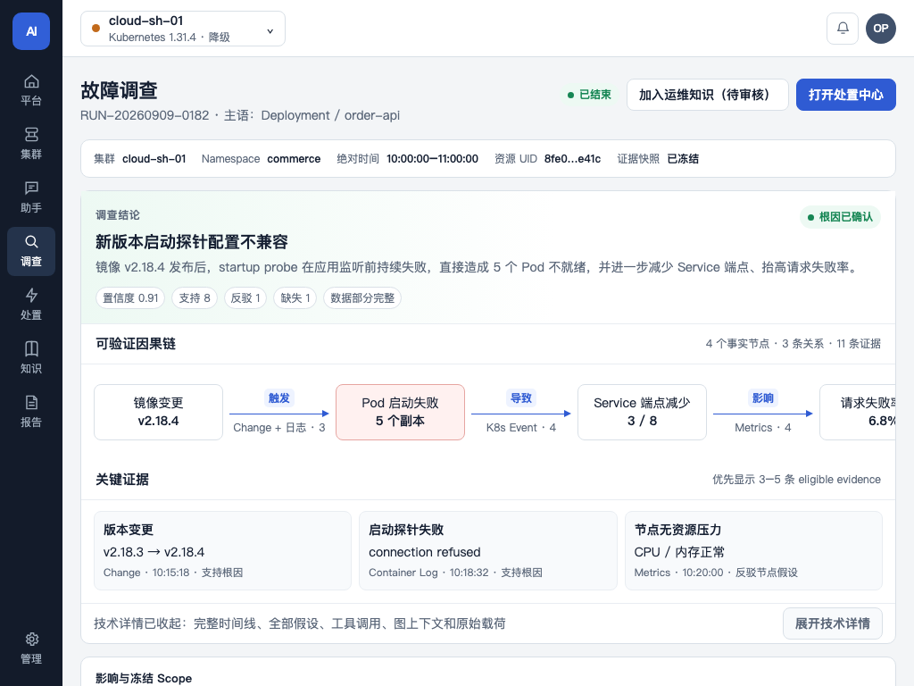

# AIOps UI V3 完整设计、实际渲染与编码对照

> **已确认基线（2026-09-11）：** 本指南、同目录可运行原型和实际 Chromium 截图共同构成 A 方案的视觉合同，并已合并 OnGrid 对照审核中适用于本产品的图谱聚焦、调查摘要和告警调查入口。任何页面实现若与[正式设计方案](../../2026-09-08-aiops-information-architecture-design.md)冲突，以正式方案为准；验收按[完整验收说明](../../../verification/2026-09-11-aiops-v3-complete-acceptance.md)执行。不得退回 V2 的综合平台状态、Workload 合并统计、Pod/Container 合并、Service/Ingress 合并或 PVC/虚拟机磁盘双计数。

所有截图均由同一份 [aiops-ui-prototype.html](./aiops-ui-prototype.html) 实际渲染。示例中的集群、资源、指标和问题只用于设计表达，禁止进入生产代码、测试之外的默认数据或接口失败回退。

原型路由：`login`、`platform`、`cluster`、`resources`、`resource-detail`、`vm-detail`、`observe`、`assistant`、`investigation`、`actions`、`graph`、`knowledge`、`knowledge-new`、`reports`、`admin`。以 `?view=<route>` 切换页面。

## 1. 已确认的信息架构

- 一级导航：平台、集群、助手、调查、处置、知识、报告；系统管理固定在底部。
- 顶栏只选择真实 Kubernetes 集群。平台总览不受当前选择影响；其余工作区必须绑定一个实际集群。
- 平台页显示服务端事实规则产生的健康/降级/严重/未知状态及原因，同时展示活动严重问题、受影响集群、未知/陈旧范围、采集覆盖、数据时效和最高优先级问题；不制造 0–100 综合分数。
- 当前集群内，容器资源与 KubeVirt 虚拟机同级。容器直接按 Deployment、StatefulSet、DaemonSet、Job、CronJob、Pod、Kubernetes Service、Ingress 展示。
- PVC 是共享存储依赖的 canonical 资源；虚拟机磁盘是设备视图。二者通过真实引用链关联，不分别计入两个资源总数。
- NAD 是被 VMI 或 Pod 实际引用的 Multus 辅助网络定义，不是网卡、物理网络或首页主指标。
- 运维知识是一级工作区，覆盖故障案例、运维文档、内置 Playbook、人工新增、审核发布、范围、版本和索引状态。
- 智能助手是集群级一级工作区。每个会话冻结集群、可选资源、绝对时间和知识范围；回答必须同时呈现事实、已发布知识、不确定性、下一步和受控动作边界。

## 2. 桌面实际渲染

### 登录


单一登录任务；左侧只表达真实产品能力，不展示虚构客户数、告警数或健康结论。

### 云平台运营态势


首屏从“当前活动严重问题”开始，同时给出受影响集群、未知/陈旧范围、采集分子/分母、四态集群分布、最新/最旧有效数据和最高优先级问题。AIOps 自身只保留异常优先的“运维数据与能力”带，完整组件状态进入系统管理。

### 集群详细总览


先显示集群状态依据和问题队列；容器资源以八个明确 Kind 呈现，KubeVirt 与其同级且不显示磁盘/NAD 裸数量。控制面、节点与物理宿主、网络面、存储面和 KubeVirt 能力作为集群基础依赖状态带。

### 资源目录


容器资源与 KubeVirt 是两个主工作组；Kind、Namespace、状态和名称搜索均为当前页面的局部筛选。PVC、PV、StorageClass 和被实际引用的 NAD 从依赖或详情进入，不作为第三个资源产品线。

### Pod 资源详情


身份、健康依据和时效位于顶部；证据占主工作区；关系、影响和可用能力位于右侧。Container 仅在 Pod 内展开，长 UID、镜像和标签须有完整查看与复制入口。

### KubeVirt 虚拟机详情


“磁盘与卷”用 `VM → VMI → 磁盘设备 → Volume → DataVolume → PVC → PV` 表达共享存储引用；同一个 PVC 只保留一个 canonical UID。“网络接口”区分 Pod 默认网络与实际引用的 `NAD → Multus/CNI → 实际网络`。

### 观测工作区


以问题和证据模式组织，不以数据源产品名组织。图表必须显示时间范围、单位、来源和图例；标题若声明两类指标，画面必须同时绘制对应序列。

右侧“告警调查”必须显示告警 ID、策略模式和当前状态。`draft` 使用“调查草稿/开始调查”，`auto_readonly` 使用“系统只读调查/查看调查”，`manual` 只显示人工发起入口；不得将自动调查描述成自动处置。

### 智能运维助手与应答框


桌面采用会话列表、回答工作区、可追溯上下文三栏。Scope 带固定显示集群、资源、时间和知识范围，并明确“已冻结”；顶栏切换集群不能静默改写当前会话。中间回答区独立滚动，输入框固定在工作区底部，因此长回答完整可访问且不会撑破页面。

AI 应答不是一段无结构 Markdown，必须固定显示：

1. 结论；
2. 带来源与时间的关键事实证据；
3. 带范围、版本和发布状态的运维知识引用；
4. 不确定性与缺失证据；
5. 可验证的建议下一步；
6. 查看证据、打开知识、创建调查草稿等受控动作。

右侧上下文持续显示 canonical resource UID、数据时效、已用数据源及完整性。AI 不能直接执行命令；处置只能形成建议，并继续经过预检、审批、执行、验证和审计。

### 调查工作区


Scope 冻结带明确集群、资源、绝对时间、UID 和快照。结论必须位于左主栏最上方，先显示“根因已确认/尚未确认”、结论、置信度与支持/反驳/缺失数量，再显示可验证因果链和 3–5 条关键证据。右侧只承载影响与冻结 Scope、证据完整性、终止原因、预算和下一步；技术详情默认收起。事实关系使用实线，推断关系使用虚线并直接标注“疑似导致”。

### 处置工作区


预检、审批、执行、验证、回滚条件和审计连续可追溯。“执行中”使用流程蓝，绿色只表示执行成功或验证通过。

### 资源关系图谱


画布按访问/流量、控制器、运行实例、集群依赖分层，容器与 KubeVirt 平行。每条可见边直接显示中文关系和方向；聚合边显示数量。存储链明确区分 DataVolume 与 PVC，辅助网络链明确显示虚拟接口、NAD、Multus/CNI 和实际网络。语义筛选固定包含结构、运行、流量、存储、网络、故障传播和推断；选中节点或边后，一/二跳保留强调，无关元素降低强调。右侧检查器给出源、关系、目标、方向、事实/推断状态、权威字段和同步时间。

### 运维知识


页头显示检索/索引可用性、已发布、待审核、最近索引和索引失败。页面内语义搜索仅检索当前租户的平台通用知识与当前集群知识；列表与详情同时显示类型、范围、来源、版本、审核和索引状态。

### 新增运维知识


人工新增支持故障案例或运维文档、当前集群或有权限的平台通用范围、资源 Kind、来源、症状、根因、处理与验证。保存草稿不入 RAG；提交后待审核；发布后才进入当前版本索引。前端不得直接写 Chroma。

### 报告


报告以真实资源事件为主语，明确显示影响、证据、处置和验证；历史业务语义仅作为标签。内容使用自然高度，禁止固定大卡制造空白。

### 系统管理


系统管理承载接入配置、AIOps 自身健康、采集器、拓扑同步、知识索引任务、数据可信度、告警调查策略、能力策略、用户和审计。集群接入状态、集群资源健康与 AIOps 自身健康必须分开表达。告警调查策略按实际集群配置，并完整显示模式、最小严重度、最大并发、每小时上限及“自动调查仅只读，不会执行处置”。

## 3. 响应式实际渲染

### 1280×720 云平台运营态势


允许页面纵向滚动访问完整内容，禁止页面级横向溢出。

### 1024×768 资源目录


筛选栏收敛为“筛选”按钮，详情进入独立页面或 Drawer，结果区获得完整宽度。

### 1024×768 资源关系图谱


检查器收敛为按钮/Drawer；画布完整保留；总匹配量、当前加载量和 80/200 首屏预算必须持续可见。

### 1024×768 调查详情



双栏改为单列但不隐藏右侧信息；结论、因果链、关键证据、技术详情、影响与冻结 Scope、证据完整性、终止原因/预算和下一步按既定顺序纵向排列。因果链可以在自身区域横向滚动，页面本身不得横向溢出。

### 1024×900 运维知识


筛选收敛为按钮，详情转入 Drawer 或独立页，列表保留标题、命中片段、类型、范围、资源 Kind、来源和版本。

### 1024×900 智能运维助手


会话列表和上下文收敛为两个独立 Drawer 入口，不能挤压回答。Scope、结论、事实引用和输入区保留在首要单栏；Drawer 必须有可访问标题、关闭入口并限制在视口内。

## 4. 编码视觉合同

### 页面框架

- 1440px 导航轨 84–88px；1280px 及以下 70–72px。
- 顶栏 64px，只放真实集群选择、上下文说明、通知和用户入口。
- 页面采用 12 栏逻辑网格；1440px 外边距 28px，1280px 及以下 20px。
- 不存在全局搜索。局部名称搜索只在资源目录，语义搜索只在运维知识。
- 页头最多两个主动作；页面身份、Scope 和更新时间不能被次要筛选挤压。

### 尺寸与视觉语言

- 页面标题 22px，区域标题 15–16px，正文 14px，辅助文字不小于 12px。
- 卡片圆角 10px，控件圆角 7–8px，点击高度不低于 36px。
- 页面主间距 24px，区域间距 14–20px，卡片内间距 12–16px。
- 用边框、留白和背景层级建立结构；不使用装饰性阴影、大面积渐变或无业务含义的颜色。
- 健康色只表达健康，类别和流程状态使用中性色或交互蓝。

### 组件边界

- 壳层：`AppFrame`、`PrimaryNavigation`、`ClusterNavigator`、`ScopeRequired`。
- 平台与集群：`PlatformOperationsSummary`、`PriorityIssueQueue`、`OperationsTrustStrip`、`ClusterHealthMatrix`、`DirectResourceKindPanel`、`ClusterFoundationBand`。
- 资源：`ResourceCatalogFilters`、`ResourceResultList`、`ResourceIdentityBand`、`EvidenceWorkspace`、`StorageDependencyPanel`、`VmDiskVolumeTable`、`MultusNetworkRelationPanel`。
- 调查与处置：`InvestigationScopeStrip`、`EvidenceTimeline`、`HypothesisPanel`、`ActionPipeline`、`ActionQueue`、`ActionInspector`。
- 智能助手：`AiAssistantWorkspace`、`ConversationList`、`AssistantScopeStrip`、`AssistantAnswerCard`、`SourceCitation`、`AssistantContextPanel`、`AssistantComposer`。
- 图谱：`KnowledgeGraphWorkspace`、`GraphToolbar`、`GraphInspector`、`EquivalentRelationList`。
- 知识：`OperationsKnowledgeWorkspace`、`KnowledgeFilters`、`KnowledgeList`、`KnowledgeInspector`、`KnowledgeEditor`、`KnowledgeIndexStatus`。
- 统一数据边界：`BoundedDataRegion`，覆盖 loading、empty、error、partial、stale、forbidden。

### 完整显示与不超限

- 标题、资源名、状态依据、风险、错误和动作结果必须有完整查看路径；Tooltip 不能是唯一入口。
- 短文本自然换行；长描述提供“展开全部”；UID、镜像和长标签在自身容器内断词并支持复制。
- 页面不得横向滚动。宽表只能在有明确边界的容器内滚动，或把辅助字段移入详情。
- 大列表服务端分页或虚拟滚动，并显示总匹配数与当前范围。
- 图谱 `80 节点 / 200 边` 是首屏渲染预算，不是查询或聚合上限；超量内容用聚合、分页展开和等价关系列表承载，绝不静默截断。
- 图谱可见边必须有方向和中文关系，边不得穿过节点；箭头不小于 8px；选中关系能读取事实状态、来源、同步时间和证据。
- Drawer、Dialog、Popover 必须限制在视口内，内部滚动且关闭入口始终可见。
- AI 长回答在有边界的回答区内滚动，结论优先于引用和建议；输入框不覆盖内容。引用标题可换行，完整的 evidence/knowledge 标识与版本在详情中可复制。

### 数据与状态

- 顶级健康只使用健康、降级、严重、未知，并同时使用颜色、图标和文字。
- 不计算或展示 0–100 综合健康分数。
- 平台聚合、集群概览、资源详情、知识正文和索引状态使用独立 query key 与缓存边界。
- 每个数据区实现正常、加载、空、错误、部分、陈旧、无权限七种呈现。
- 助手额外实现“收集事实、检索知识、组织回答”三段流式状态，以及断流后的不完整回答和同一 turn 幂等重试。没有可引用事实时只能说明缺口，不生成确定性结论。
- 原型数据只用于设计。生产实现不得硬编码，也不得在真实接口失败时回退为示例数据。

## 5. 五秒判读与实现验收

关键页面必须让用户在五秒内判断：当前必须处理什么、影响哪些集群或资源、依据是否可信、下一步主动作是什么。图谱必须能直接读出任一可见边的源资源、关系、目标资源、方向、事实/推断状态与来源；运维知识必须能看出适用范围、审核状态、版本和来源；智能助手必须能看出结论引用了哪些事实和已发布知识、缺少什么证据、建议动作是否仍需调查/预检/审批。依赖猜颜色、猜几何方向、隐藏引用或强制悬停才可理解，均判定失败。

实施时对 `1440×900`、`1280×720`、`1024×768/900` 做真实浏览器截图比较，并检查结构层级、换行、局部滚动、浮层边界、键盘焦点、状态语义和完整内容入口。视觉差异必须回到本指南和正式方案判断，不得用旧页面布局解释偏差。

## 6. 全局壳层最终规格

### 6.1 路由与 Scope

- `/overview`：云平台整体健康，不受顶栏活动集群影响。
- `/clusters/:clusterId`：当前实际集群详细总览。
- `/clusters/:clusterId/resources`：容器、Service/Ingress、KubeVirt VM/VMI 资源目录。
- `/clusters/:clusterId/observe`：问题与证据。
- `/clusters/:clusterId/graph`：资源关系与故障传播。
- `/clusters/:clusterId/assistant`：集群级智能助手。
- `/clusters/:clusterId/investigations`：调查中心。
- `/clusters/:clusterId/actions`：处置中心。
- `/clusters/:clusterId/knowledge`：当前集群可用运维知识。
- `/clusters/:clusterId/reports`：当前集群报告。
- `/admin`：平台组件、接入、策略、权限和审计。

旧路由只能做确定性重定向；没有已确认活动集群时进入明确的集群选择态，不能自动猜测第一个集群或 kubectl current context。

顶栏集群选择器显示真实集群名称，次级文本可显示地域/提供方，但不得显示“生产平台”“生产集群”或环境标签。选择器提交后必须由服务端回读 `/me` 确认 Scope，再导航到目标集群的同类工作区；失败时保留旧 Scope 和页面，并显示原因。

### 6.2 桌面布局

- 1440px：左侧导航 84–88px；顶栏 64px；内容外边距 28px；最大内容宽度由页面决定，不强制居中窄栏。
- 1280px：左侧导航 70–72px；内容外边距 20px；次要描述可缩短，但主标题、状态和动作不能隐藏。
- 1024px：保留文字导航；筛选、检查器和辅助栏进入 Drawer；主工作区单列，不把桌面三栏等比压缩。
- 页面背景只建立一层；卡片、表格、图谱和 Drawer 使用统一 token。禁止渐变、装饰性阴影和无业务意义插画。

### 6.3 页头和状态带

页头从左到右固定为：页面身份、当前 Scope/用途说明、更新时间/数据状态、最多两个主动作。筛选条件属于页内工具栏，不与页头竞争。

状态带使用同一顺序：健康文字与图标 → 事实原因 → 覆盖/时效 → 查看证据。颜色不能是唯一信息；unknown 使用中性灰和“未知”，stale 使用警示色和“数据陈旧”。

## 7. 页面级完整布局

### 7.1 云平台总览

首屏 1440×900 的纵向顺序固定：

1. 平台身份和最新聚合时间；
2. 平台状态、纳管集群数、健康/降级/严重/未知集群数；
3. 当前最高优先级风险与受影响集群；
4. 集群健康矩阵；
5. 采集覆盖率、最新/最旧有效数据；
6. AIOps 平台组件异常摘要；
7. 最近需要处理的问题。

平台状态不显示综合分数。集群矩阵每项同时显示集群名、四态状态、主要原因、数据时效和进入集群按钮。切换顶栏集群后平台页数字不变化；点击矩阵项才进入对应 `/clusters/:clusterId`。

### 7.2 集群详细总览

首屏使用 `8/4` 主辅布局：左侧问题与资源事实，右侧集群状态依据。1024px 改为单列，状态依据紧跟页头。

主内容顺序：

1. 当前集群状态、原因、覆盖、最新数据；
2. 需要处理的问题队列；
3. 容器八个 Kind 与 Kubernetes Service/Ingress；
4. KubeVirt VM/VMI；
5. 控制面、节点/物理宿主、网络、存储、KubeVirt 能力依赖带；
6. 进入资源、观测、调查和处置的上下文动作。

基础依赖带不显示独立网络/存储资源产品线。节点和 Namespace 只作为集群上下文；点击后可进入资源详情或图谱，不占据首页主指标。

### 7.3 资源目录

页面由资源组切换、局部筛选、结果摘要、资源列表组成：

- 主资源组：容器与服务、KubeVirt；不增加“应用”“中间件”“基础设施”第三组。
- 容器与服务 Kind：Deployment、StatefulSet、DaemonSet、Job、CronJob、Pod、Kubernetes Service、Ingress。
- KubeVirt Kind：VM、VMI；迁移、virt-launcher Pod、磁盘、PVC、NAD 进入详情关系。
- 筛选：名称、Kind、Namespace、健康；只作用当前实际集群。
- 摘要：总匹配量、当前页范围、数据时间、partial/stale。

列表列优先级为名称/Kind/Namespace/健康/关键状态/更新时间/操作。1024px 隐藏更新时间和辅助状态，详情保留全部字段。任何资源行都通过 canonical UID 导航，不以名称作为唯一身份。

### 7.4 观测工作区

顶部是当前问题队列，而非指标大屏。每条问题行包含严重度、对象、症状、开始/最后时间、证据覆盖和调查状态。

选择问题后下方显示：时间窗、指标、日志、Trace、Kubernetes 事件、变更。各证据区独立呈现状态；一个来源失败只把整体标记 partial，不清空其他证据。

调查操作按状态显示：

- 未创建调查：`发起调查`；
- 调查草稿：`开始调查`；
- 调查中：`打开调查`；
- 已完成：`查看结论`；
- 已跳过：显示原因和 `人工发起调查`。

页面不显示“自动修复”。处置入口只能在调查产生动作建议且用户有权限时出现。

### 7.5 调查中心

页头主动作只有“发起 AI 调查”。列表视图为：需要我处理、正在调查、待验证、已结束。每行首屏固定显示资源、症状、状态、证据、发起时间、操作，并用标签区分“人工发起”“系统建议”“系统自动”。

完整 Run ID、cluster ID、冻结窗口、根因、置信度、预算、发起人、快照和审计放在 Drawer；UUID 使用等宽字体、单词内断行和复制按钮，不能逐字竖排。

### 7.6 调查详情

1440px 使用 `minmax(0,1fr) 360px` 两栏，不再使用三个等宽卡片：

- 左主栏：结论状态 → 根因/尚未确认 → 因果链 → 3–5 条关键证据 → 技术详情。
- 右辅栏：影响资源和冻结 Scope → 证据完整性 → 反证/缺失 → 终止原因/预算 → 下一步验证/受控动作。

1024px 改为单列，顺序保持不变。技术详情默认收起，包含完整证据时间线、所有假设、工具调用、图上下文和原始载荷。

### 7.7 处置中心

列表列固定为操作/目标、风险、审批、执行、验证、操作。详情用连续时间轴展示预检、审批、执行、验证、回滚条件和审计。

状态颜色：待处理/审批用警示色，执行中用流程蓝，成功/验证通过用绿色，partial 用警示色，failed/regressed 用红色，取消用中性灰。动作建议必须显示来源调查和目标 UID/resourceVersion；执行前变化时显示“目标已变化，需要重新预检”。

### 7.8 智能助手、知识、报告和系统管理

沿用第 2、3、4 节既有合同。系统管理新增“告警调查策略”，位于当前实际集群配置区，字段为：模式、最小严重度、最大并发、每小时上限。缺省显示“人工发起”，保存后回读真实配置。旁边固定提示“自动调查仅只读，不会执行处置”。

## 8. 资源关系图谱完整设计

### 8.1 默认层级

图谱主干按真实关系布局，不按产品菜单拼接：

```text
访问入口 / Service / Ingress
        ↓ 路由或选择
Workload / Pod              VM / VMI
        ↓ 运行于              ↓ 运行于
      Node（默认上下文折叠，可展开）
        ↓
Storage / Network / Physical host dependencies
```

Namespace 是归属上下文，默认不作为大节点打断关系链；Cluster 只作为画布 Scope/根节点提示。Node/Namespace 在中心资源、告警目标、关键故障传播节点或用户主动展开时显示。

### 8.2 关系语义注册表

后端保留原始 `relation_type`，前端另投影稳定语义：

- 结构：包含、拥有、声明；中性实线。
- 运行：控制、调度、运行于、宿主；蓝灰实线。
- 流量：路由到、选择、访问；交互蓝实线。
- 存储：使用卷、引用卷、来源于、绑定、挂载；紫灰实线。
- 网络：连接 NAD、使用 CNI、连接实际网络；青灰实线。
- 故障传播：仅 failure-chain 且事实边 `propagates_failure=true`；红色加粗实线。
- 推断：任何 candidate/inferred；警示色虚线并显示“推断”。

颜色只增强语义。每条边始终显示中文关系，箭头表示 `source → target`；检查器重复显示完整句子“源资源 —关系→ 目标资源”。未知 relation type 显示原值并归入结构语义，不能隐藏。

### 8.3 节点设计

节点最小 `196×64`，包含资源 Kind、最多两行名称、健康文字/图标。健康通过左侧状态标记、边框和文字共同表达；填充保持低饱和，不能用不同彩虹色区分每种 Kind。

中心节点使用加粗边框；选中节点使用可见焦点环；聚合节点显示“还有 N 个 Kind”。聚合节点不是事实资源，不能显示健康或作为根因。

### 8.4 聚焦、筛选和检查器

- 单击节点：突出一跳直接关系和二跳上下游，其他元素降至辅助透明度。
- 单击边：突出该边及两端，检查器同步。
- 单击空白：清除聚焦。
- 语义筛选：结构、运行、流量、存储、网络、故障传播、推断。
- 上下文开关：展开/折叠 Namespace 与 Node。
- 孤点开关：默认隐藏与中心和当前过滤结果无关系的节点。
- 关系列表：始终提供与画布等价的键盘可达入口，并显示分页/总量。

检查器字段固定为源资源、关系、目标资源、方向说明、事实/推断、是否传播故障、权威字段、同步时间、关联 evidence。1024px 进入宽度 `min(420px,100vw)` 的 Drawer。

### 8.5 80/200 首屏预算

画布始终显示：匹配资源总数、关系总数、当前渲染节点/边数、聚合数量。达到 80/200 时继续保留中心资源和关键事实路径，其他对象按 Kind 聚合；用户从聚合节点或关系列表分页展开。禁止把 80/200 当后端数据上限，也禁止没有说明地 `.slice()` 后只显示局部结果。

## 9. 调查结果完整设计

### 9.1 结论头

结论头只允许两种主状态：

- `根因已确认`：存在根因、置信度不低于 0.8、有 eligible evidence、非 partial/stale。
- `根因尚未确认`：其他全部情况。

置信度放在辅助位置，并同时显示“支持 N、反驳 N、缺失 N、数据完整/部分/陈旧”。不得用圆环分数或单一百分比制造确定性。

### 9.2 因果链

每跳一行：资源图标与名称、中文关系箭头、目标资源、事实/推断标签、证据数量。事实使用实线，推断使用虚线。点击一跳打开关系检查器和对应 evidence。最多首屏显示 6 跳，超过后用“展开完整因果链（共 N 跳）”；后端最多持久化 12 跳。

无有效因果链时显示“尚未形成可验证因果链”，不把候选节点顺序串成假链。

### 9.3 关键证据

首屏选择 3–5 条 eligible evidence，按对结论贡献和时间排序。每条显示事实摘要、来源、观察时间、质量、支持/反驳对象和“查看原始数据”。来源失败不删除其他证据，整体标记 partial。

### 9.4 终止原因与预算

稳定中文映射：

- root_confirmed：已取得足够证据并确认根因；
- evidence_exhausted：可用证据已查询完，仍不足以确认；
- budget_exhausted：达到本次调查预算，保留已取得证据；
- source_unavailable：必要数据源不可用；
- cancelled：调查已取消；
- runtime_failed：调查运行失败。

预算显示实际 `已用步骤/上限`、`已用工具调用/上限`。不得显示“partial”作为停止原因，也不得把预算耗尽显示为系统故障。

### 9.5 下一步与动作

下一步先列可验证的只读查询，再列动作建议。动作建议只提供“创建处置建议/打开处置中心”，必须经过预检、人工审批、执行、验证和审计。系统自动调查永远不显示“立即执行”。

## 10. 告警调查 UI 状态机

本设计不增加 Incident 页面或第二套业务状态机；告警仍是问题事实，Run 仍是调查主对象。

```text
告警事件
  ├─ manual        → 未创建调查 → 用户发起 → Run
  ├─ draft         → 调查草稿   → 用户开始 → Run
  └─ auto_readonly → 策略校验   → 系统只读 Run
                                  └─ 动作建议仍需人工预检/审批
```

告警列表的调查状态和主要动作必须一致，不能同时出现“未创建调查”和“打开调查”。skipped 显示具体原因：严重度不足、并发受限、频率受限、Scope 无效或持久化不可用。并发/频率受限可提供人工发起入口，但不能静默自动重试成多个 Run。

系统管理策略使用单列或两列表单；模式变更需要二次确认和回读。`auto_readonly` 确认框说明会消耗调查资源、不会执行处置、只对当前实际集群生效。

## 11. KubeVirt 完整显示合同

### 11.1 能力与空态

- KubeVirt 未安装：能力状态“未安装”，提供接入说明入口，不显示 0 台。
- KubeVirt 已安装且无 VM/VMI：资源空态“当前集群暂无 KubeVirt 虚拟机”。
- VM/VMI 数据存在但事件或依赖查询失败：显示已有资源、partial 警示和不可用来源。
- Scope/身份校验失败：显示无权限或集群连接错误，不回退其他集群。

### 11.2 列表和详情

列表以 VM 为主行，并显示 VMI 运行态；只有孤立 VMI 时单独显示并标记“未关联 VM”。主要列为名称、Namespace、状态、vCPU/内存、IP、宿主节点、更新时间、操作。

详情顶部固定显示实际集群、Namespace、VM UID、VMI UID、resourceVersion、状态依据和时效。主体使用三段：运行与 Guest Agent、磁盘与卷、网络接口；右侧或下方显示事件、关系和调查入口。

物理宿主、节点、PVC/PV、NAD 和网络必须通过真实关系跳转；名称相同但 cluster UID 不同的对象永远不能互链。

## 12. 统一组件、文案和状态

### 12.1 新增/调整组件责任

- `GraphSemanticFilters`：七类关系筛选和上下文/孤点开关。
- `GraphFocusController`：节点/边选择、dimmed 投影、恢复全图。
- `InvestigationConclusionHeader`：确认/未确认和证据因子。
- `CausalChain`：真实关系 + evidence 的因果链。
- `InvestigationTermination`：终止原因和预算。
- `AlertInvestigationBadge`：告警关联状态与原因。
- `AlertInvestigationPolicyForm`：当前集群策略编辑与回读。
- `KubeVirtCapabilityState`：未安装、空、partial、error 的互斥呈现。

这些组件只负责显示和交互，不能在前端推导授权、根因、cluster identity 或自动调查资格。

### 12.2 禁止文案

生产 UI 不得出现：`生产平台`、`生产集群`、`prod/dev/staging/test`、`综合健康分`、`应用健康`、`中间件健康`、`自动修复`、`立即执行 AI 建议`。内部 status code 不能裸显示给用户，必须通过稳定中文映射。

### 12.3 推荐固定文案

- 平台：`云平台运营态势`；
- 集群：`集群详细总览`；
- 未确认：`根因尚未确认`；
- partial：`部分数据可用，以下结论基于现有证据`；
- stale：`数据已陈旧，不能代表当前状态`；
- 自动调查：`自动调查仅只读，不会执行处置`；
- 图方向：`箭头表示源资源指向目标资源`；
- 图预算：`当前显示 N 个节点 / M 条关系；更多结果已聚合，可从关系列表展开`。

## 13. UI 实现与验收映射

- 壳层、平台、集群、资源：整改计划 Task 0、1、3、8。
- 观测与告警调查：Task 2、10。
- 图谱完整语法与交互：Task 4、5。
- 调查/处置摘要与完整详情：Task 6、11。
- 助手、知识、报告：Task 7、8。
- 真实浏览器、截图、版本和镜像：Task 9、13。
- 持久化库存投影：Task 12 只形成 ADR，不改变本轮 UI 数据来源。

开发完成后必须逐项执行[完整验收说明](../../../verification/2026-09-11-aiops-v3-complete-acceptance.md)。原型截图用于比较结构和视觉，不是数据正确性的证据；真实 API、双集群 UID 隔离和版本绑定证据优先。

## 14. OnGrid 借鉴与许可证边界

本方案只吸收 [OnGrid](https://github.com/ongridio/ongrid) 的四类思想：事件驱动调查的幂等/限流、摘要优先的调查报告、图谱点击聚焦/关系过滤、全量快照与增量库存的架构评估。以下设计保持 AIOps 自有：云平台健康总览、实际集群 Scope、容器/Service/KubeVirt 主资源模型、证据不足不确认、确定性预检与人工审批。

OnGrid 使用 AGPL-3.0。开发人员只能按本指南重新实现产品和数据合同，不得复制 OnGrid 源文件、React 组件、样式或提示词；如确需代码级复用，必须先完成单独许可证兼容审批，不属于本整改计划。
